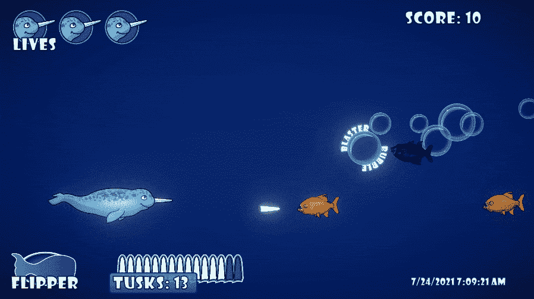

# 创建气泡爆破器第 2 部分:启动

> 原文：<https://medium.com/nerd-for-tech/creating-the-bubble-blaster-part-2-the-powerup-a8e88b582e5d?source=collection_archive---------11----------------------->

我的玩家在我的上一篇文章中获得了一些新的火力来平衡竞技场。既然泡泡爆能枪这种特殊武器已经有了生命，我的**目标**是创造一种**能量**来激活它。

首先，我打开我的艺术场景 Corel 绘制文件，并制作一个**拷贝**我的泡泡图像。我使用曲线工具上的**类型在气泡周围制作一些**字体**。**