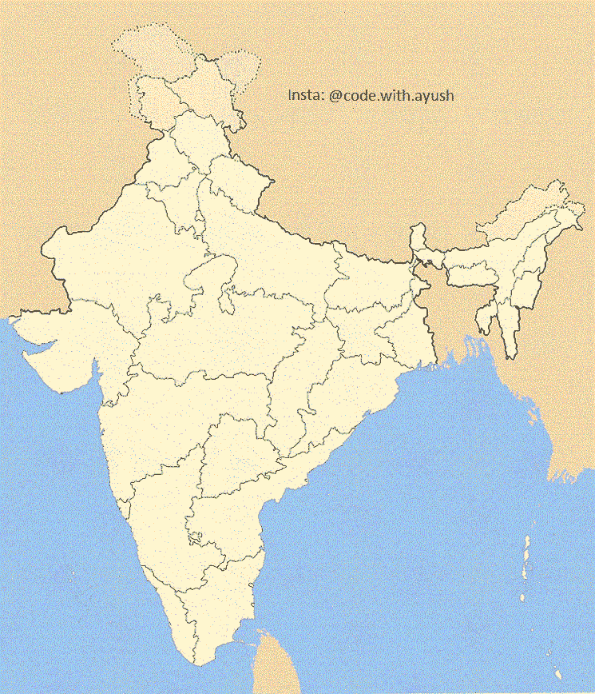
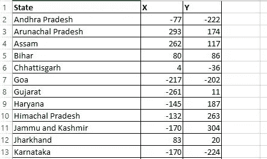

# 用熊猫通过 5 个简单的步骤创造“印度国家游戏”

> 原文：<https://medium.com/nerd-for-tech/creating-the-indian-state-game-using-pandas-in-5-easy-steps-6c6878fb6597?source=collection_archive---------1----------------------->

我创造的“猜印度邦”游戏。YT 频道:用 Ayush 编码

用 python 的“海龟”和“熊猫”库可以做的事情令人惊叹。这个项目在实现上是独一无二的，因为它还没有在网上的其他地方实现过，即使海龟坐标数据集是我创建的。它的灵感来自美国地图问答游戏，我想用 Python 为我热爱的国家印度实现同样的功能。因为，反正印度和蛇总是走在一起:)。

事不宜迟。让我们直接开始吧。

# 游戏的目标

玩家必须猜测印度所有的邦以及联邦领地。如果猜测是正确的，这个州的名字就会出现在该州地理位置所在的印度地图上。游戏的目标是用所有的州/UT 填充印度地图。

用户也可以在任何时候退出。退出时，游戏输出一个. csv 文件，其中包含用户未猜到的州列表，有助于用户学习整个地图。

# 构建印度国家游戏的步骤

1.  **导入乌龟和熊猫图书馆。**
2.  **用印度地图图像创建乌龟。**
3.  **创建一个包含印度每个邦和联邦领地在 X 轴和 Y 轴上的坐标的数据集。**
4.  **用用户答案填充地图并在地图上书写的逻辑构建。**
5.  **维护一个. csv 文件，其中包含用户未猜到的印度州，并构建退出逻辑。**

**步骤 1:导入乌龟和熊猫库**

```
import turtle
import pandas as pd
```

如果还没有安装 pandas 包，您需要安装它。

**第二步:** **用印度地图图像创建乌龟。**

```
screen = turtle.Screen()
screen.title("India States Game") # Sets the title of the window
image = "India-locator-map-blank.gif" # Shown below 
screen.addshape(image)
turtle.shape(image)
```

“screen”是 turtle 的 Screen()类的对象。



“印度-定位器-地图-空白. gif”由我创建，当然有一些编辑:)。

你可以下载上面的印度地图，这是我为我们的用例制作的。别忘了给我学分。我打赌你不会。；)

```
screen.addshape(image)
```

在早期的项目中，我们看到了如何用正方形或圆形来修改海龟的形状。Turtle 模块很神奇，因为它还可以添加一个图片作为海龟的形状。这可以通过上面的代码行来完成。

这里的图像是我们的“印度定位器地图空白。gif ”,它与 gif 配合得很好，因此我必须首先将图像转换成 gif。

**步骤 3:创建一个数据集，其中包含每个印度邦和联邦领地在 X 和 Y 轴上的坐标。**

```
import turtle
import pandas as pd
screen = turtle.Screen()
screen.title("India States Game")
image = "India-locator-map-blank.gif"
screen.addshape(image)
turtle.shape(image)
def mouse_click_coords(x ,y):
    print(x, y)

# onscreenclick is an event listener
turtle.onscreenclick(mouse_click_coords)
# wkwk
turtle.mainloop()
```

在我的帮助下，在地图上每次点击鼠标都会得到鼠标坐标。screen 类的 onscreenclick 方法。这是在另一个文件中完成的。

创建包含州、X 轴坐标和 Y 轴坐标的数据集后，我们就可以设计用用户输入填充地图的逻辑了。



创建了印度国家游戏数据集

**步骤 4:用用户答案填充地图并在地图上书写的逻辑构建。**

```
guessed_states = []
states_not_guessed = []

while len(guessed_states) < 38:
    all_states = india_dataset.State.to_list()
    answer_state = screen.textinput(title=f"{len(guessed_states)}/38 States Correct", prompt="What's the state's name?").title()
```

我们定义了两个空列表“猜测状态”和“状态未猜测”。当用户猜中所有 38 个印度州/UT 时，while 循环退出。

```
all_states = india_dataset.State.to_list()
```

将 india_dataset 的“State”列转换为列表。

```
answer_state = screen.textinput(title=f"{len(guessed_states)}/38 States Correct", prompt="What's the state's name?").title()
```

从对话框中获取用户输入。我已经给了”。title()”来解释用户的任何拼写错误。

```
if answer_state in all_states:
    guessed_states.append(answer_state)
    writing_turle = turtle.Turtle()
    writing_turle.hideturtle() #hides the turtle
    writing_turle.penup()# hides the lines made by turtle when drawing
    answered_state_Date_row = india_dataset[india_dataset.State == answer_state]
    writing_turle.goto(int(answered_state_Date_row.X ), int(answered_state_Date_row.Y))
    writing_turle.write(answer_state)
    # writing_turle.write(answered_state_Date_row.State.item())
    #Returns the first element of the underlying data as a python scalarr
```

如果用户回答的状态正确，则在“所有状态”列表中。然后我们将答案添加到猜测状态列表中。

我们制作了另一个 turtle 对象，名为“wriring_turtle ”,用于在地图上书写。

```
answered_state_Date_row = india_dataset[india_dataset.State == answer_state]
    writing_turle.goto(int(answered_state_Date_row.X ), int(answered_state_Date_row.Y))
    writing_turle.write(answer_state)
```

我们首先提取用户回答状态的行，并将其存储在 answered_state_Date_row 中。

```
answered_state_Date_row = india_dataset[india_dataset.State == answer_state]
```

印度 _ 数据集。State == answer_state →将 india_dataset 中的每个州与 answer_state 进行比较。

```
writing_turle.goto(int(answered_state_Date_row.X ), int(answered_state_Date_row.Y))
    writing_turle.write(answer_state)
```

现在我们需要确保 writing_turtle 移动到 x 和 y 坐标，这可以通过 goto 方法来完成。坐标需要从“str”类型转换为“int”。

**步骤 5:维护一个. csv 文件，其中包含用户没有猜到的印度各州，并构建退出逻辑。**

```
if answer_state == "Exit":
    states_not_guessed = list(set(all_states) - set(guessed_states))
    states_to_learn_dataframe = pd.DataFrame(states_not_guessed, columns=['States to learn'])
    states_to_learn_dataframe.to_csv('States not guessed need to learn-2.csv')
    break
```

While 循环应该在用户输入“exit”标题时退出，大小写还记得吗？

为了列出用户没有猜到的状态数，我们简单地将这两个列表相减，首先将它们转换成集合。

```
states_not_guessed = list(set(all_states) - set(guessed_states))
```

我们现在将我们的 states _ not _ guessed 列表转换成一个数据帧。这可以通过”。熊猫的数据框架方法。

```
states_to_learn_dataframe = pd.DataFrame(states_not_guessed, columns=['States to learn'])
```

最后，我们导出。包含用户未猜到的状态的 csv 文件。

```
states_to_learn_dataframe.to_csv('States not guessed need to learn.csv')\
break
```

为了打破这个循环，我们最后给出了 break。:)

我希望代码足够简单易懂。你可以在这里找到完整的代码。

**总结**

我们成功开发了**印度各邦—地图问答游戏**，在此过程中，我们学习了熊猫模块、数据帧、将乌龟形状转换为图像、将数据帧转换为列表、集合的实际实现以及将数据帧导出为”。csv”文件。

这个游戏可能是一个很好的学习经历，不仅对程序员，而且对任何想了解印度各州的人(尤其是孩子)都是如此。

你喜欢我的努力吗？如果是的话，请跟我来获取我的最新帖子和更新，或者更好的是，请我喝杯咖啡！☕

[](https://www.buymeacoffee.com/ayushdixit)[](https://www.buymeacoffee.com/ayushdixit) [## ayushdixit 正在编码、部署项目和写博客

### 嘿👋我刚刚在这里创建了一个页面。你现在可以给我买杯咖啡了！

www.buymeacoffee.com](https://www.buymeacoffee.com/ayushdixit)