# 在 Unity 中创建主菜单

> 原文：<https://medium.com/nerd-for-tech/creating-the-main-menu-in-unity-6876e0cc65cc?source=collection_archive---------13----------------------->

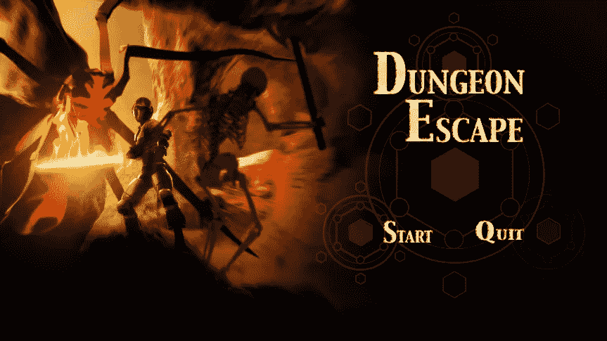

在这篇文章中，我将讲述我是如何为我的游戏创建主菜单的。

首先，我创造了一个新的场景。

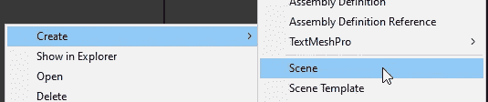

在新场景中，我创建了一个新的画布来保存主菜单。

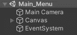

确保将 UI 缩放模式设置为**与屏幕尺寸**一起缩放，并将分辨率设置为 1920 x 1080。

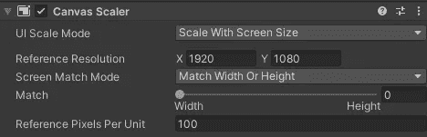

我已经有了我需要的图像和菜单的按钮图像，所以我添加了 UI 图像和按钮，并把它们放在正确的位置。

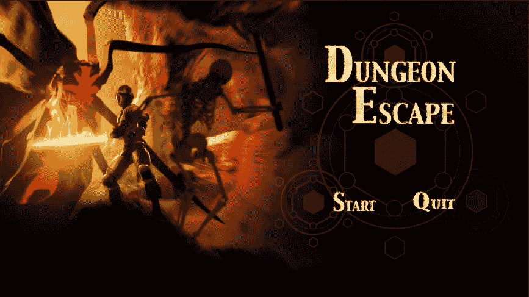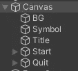

现在创建一个名为 MainMenu 的新 C#脚本，并将其附加到画布上。

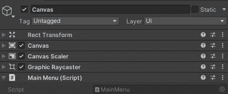

在新的脚本中使用了 **UnityEngine。SceneManagement** 命名空间，为你的开始按钮和退出按钮创建两个方法。

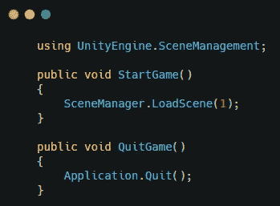

省省吧，去 unity。在点击事件的按钮上，将画布添加到事件中，并选择每个按钮的方法。

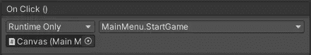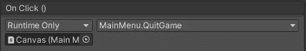

这将给你一个功能性的主菜单。

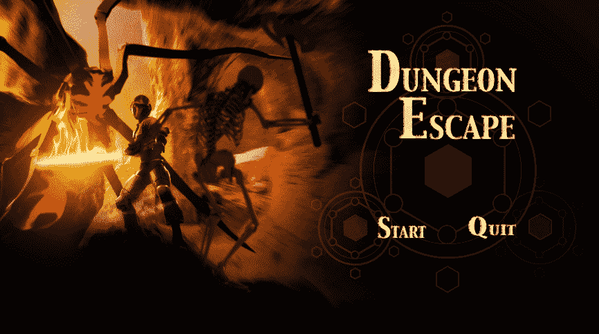