# 在 Unity 中创建暂停菜单

> 原文：<https://medium.com/nerd-for-tech/creating-the-pause-menu-in-unity-e48277abdf8e?source=collection_archive---------0----------------------->

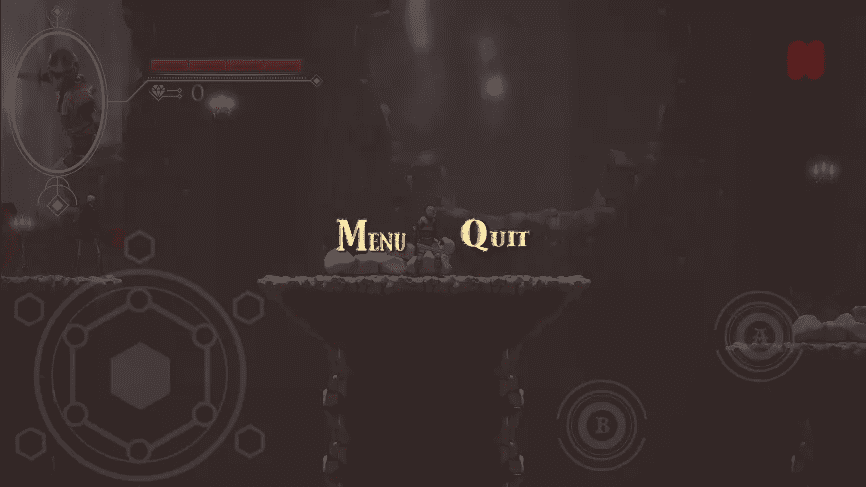

是时候为我的游戏创建暂停菜单了。

首先，为 HUD 面板创建一个新按钮。您可以禁用此按钮的文本。对于图片，我在 unity asset store 免费找到了一个漂亮的暂停图标。把这个按钮放在屏幕的右上角。

暂停图标链接:[https://asset store . unity . com/packages/2d/GUI/icons/basic-icons-139575](https://assetstore.unity.com/packages/2d/gui/icons/basic-icons-139575)

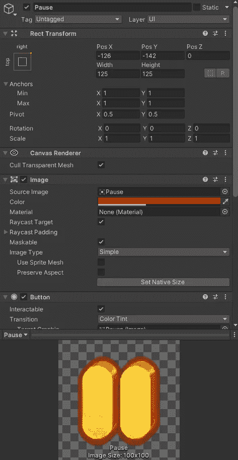

在现有画布上创建一个新面板，并将其命名为暂停菜单。可以复制暂停按钮，放在暂停菜单里。将名称更改为 resume 按钮。然后添加菜单和退出游戏两个按钮。

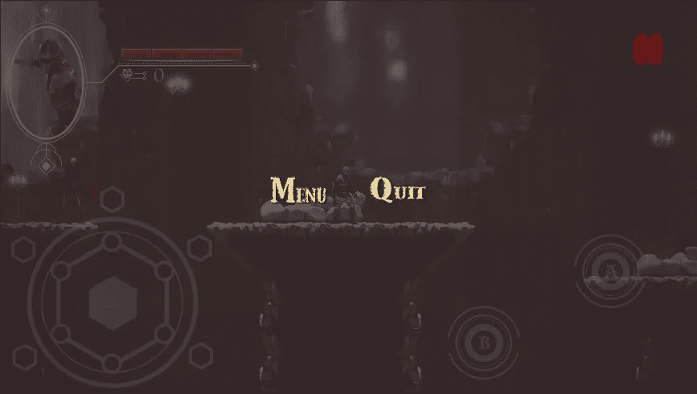

将主菜单脚本添加到画布。您可以对“退出”按钮使用 quit 方法。

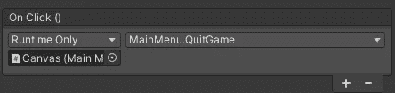

在脚本中，获得暂停菜单和暂停按钮的两个引用。然后为暂停按钮、继续按钮和菜单按钮创建新方法。

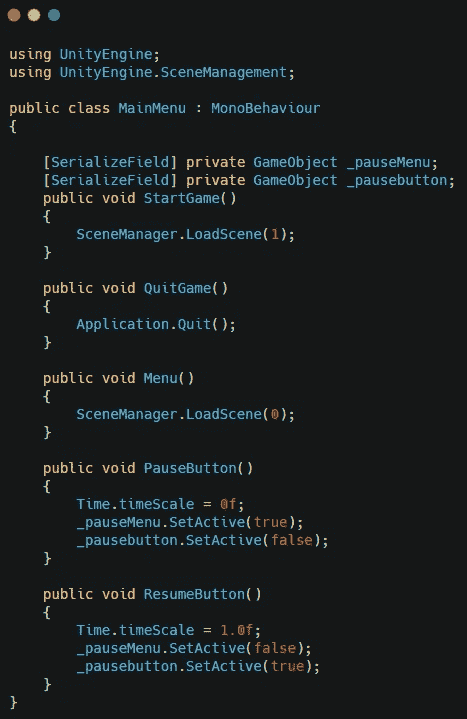

将引用添加到脚本中。

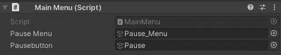

对于主菜单中的引用，您可以将暂停图标拖到层次结构中并禁用它。然后将它添加到引用中。

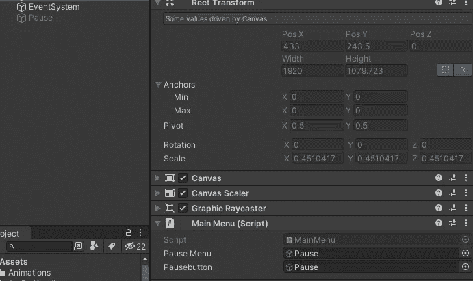

现在将这些方法添加到正确的按钮上。

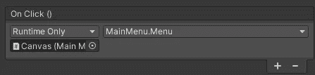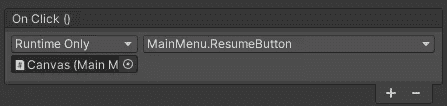

默认情况下禁用暂停菜单。

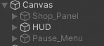

现在你应该有一个工作暂停菜单。

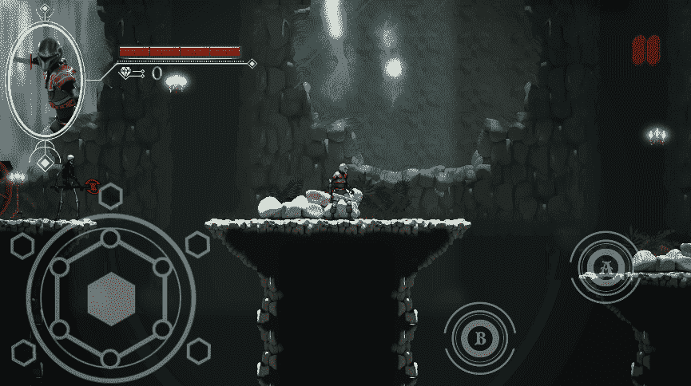