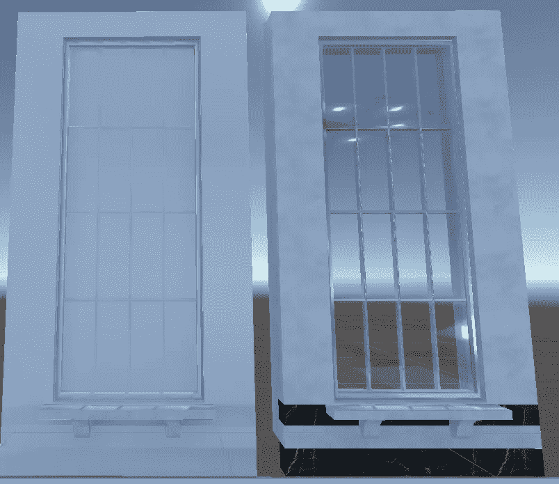
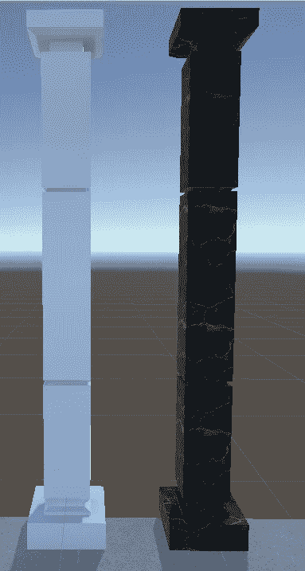
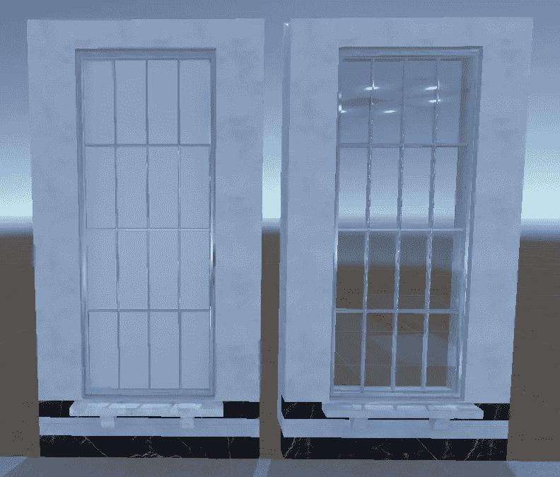
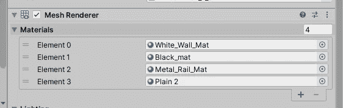
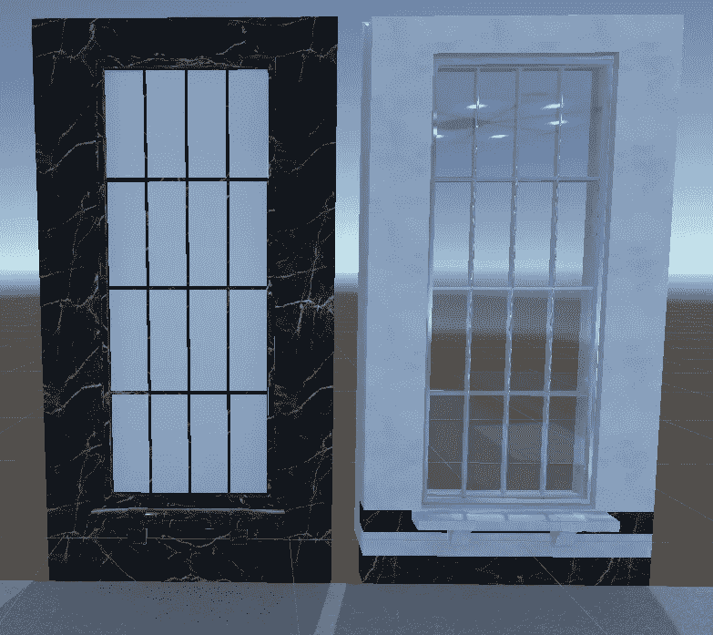
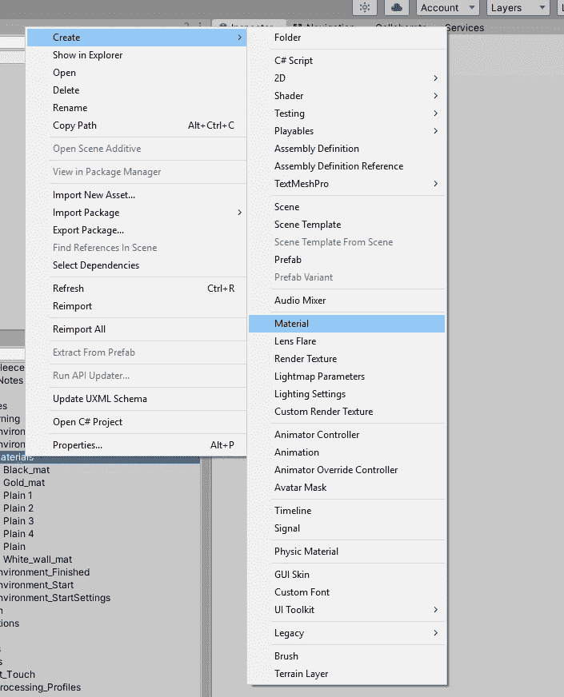
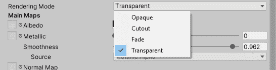
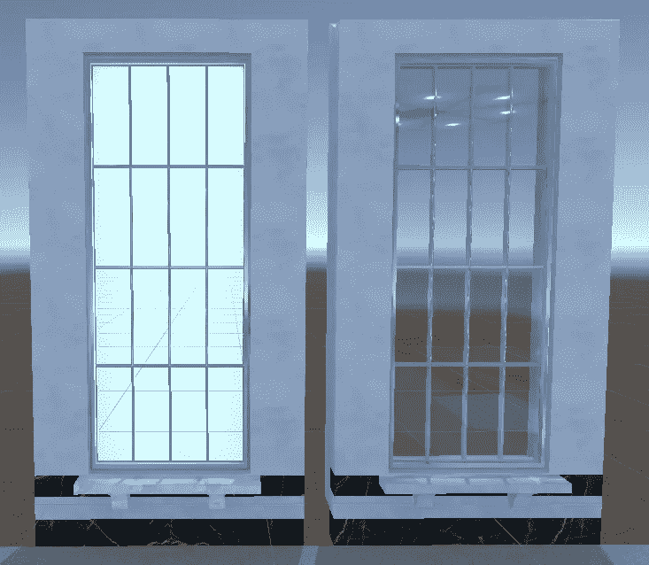
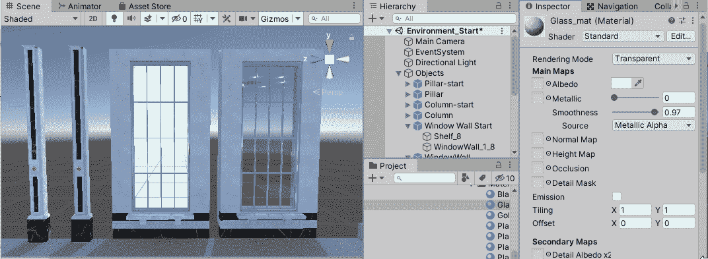
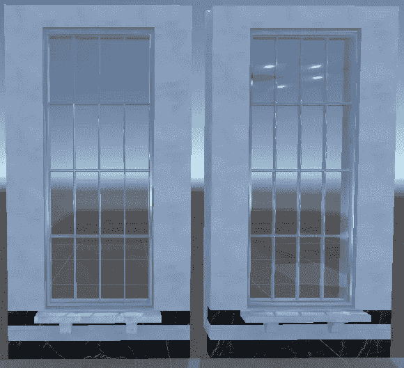

# 在 Unity 中创建透明窗口效果

> 原文：<https://medium.com/nerd-for-tech/creating-transparent-window-effect-in-unity-9bbe241d5f00?source=collection_archive---------21----------------------->

## 目的:使窗户能被看穿。

a 前后。

进入 3d 世界，没有人想看到一个简单的被遮挡的物体。这就是纹理发挥作用的地方，在材质的反照率通道中添加简单的纹理可以将简单的柱子变成大理石杰作。

给柱子加上纹理后，它就有了白天和黑夜的区别。即使添加一些小的变化，也可以让这个支柱适应许多不同的地方，但这可以留到下次再用。让我们在这扇窗户上工作。首先，我们可以做所有简单的部分，为其他部分加入所有的纹理。

剩下要做的就是窗户了！

当 3D 资产制作完成后，你可以给它添加映射到不同区域的多个纹理的能力，这就是制作窗口的方式。以不同的顺序添加材料会产生一些意想不到的结果。

这是它应该有的顺序，元素 3 是我们即将制作的窗口。

这只是使用黑色大理石材料。看起来不太糟。

现在到窗户上。首先，我们想制造一种新的材料来存放玻璃。右键单击然后创建并单击材质，并将其命名为 Glass_Mat。

接下来，我们可以将渲染模式更改为透明

如果您还没有，我们可以将材料放到窗口上，这样我们就可以在做最后的调整时看到它们。

这应该会使它看起来像这样。

是的，我们现在可以看穿它，但它看起来真的关闭…

接下来，我们可以点击反照率通道旁边的颜色，改变阿尔法通道(命名只有一个“A”)，并将其设置为 50 左右

这样，我们就有了一个透明的窗户！将颜色改为稍暗的颜色后，窗户看起来是一样的。

就这样，窗户完成了！现在向前和向上更多的 3D 体验。下一集再见！