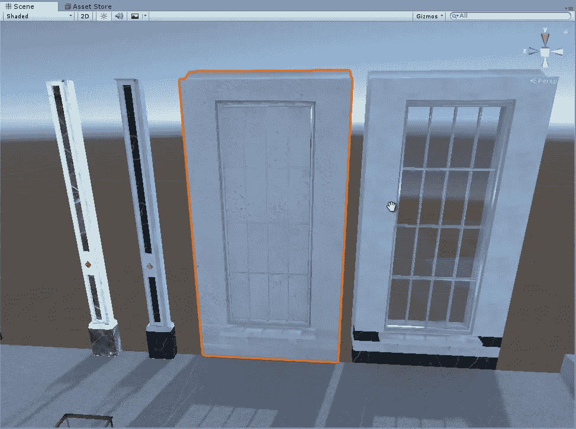
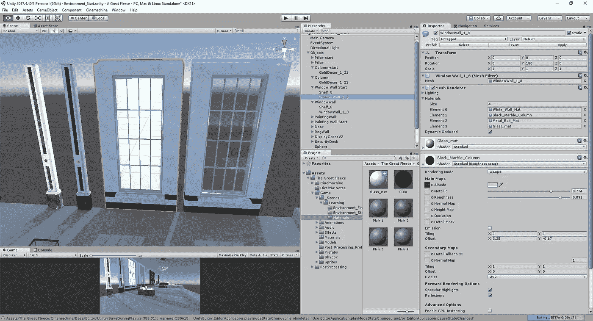
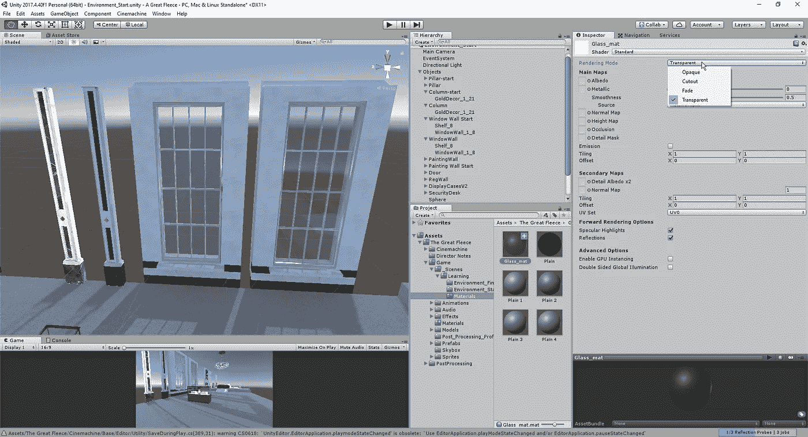
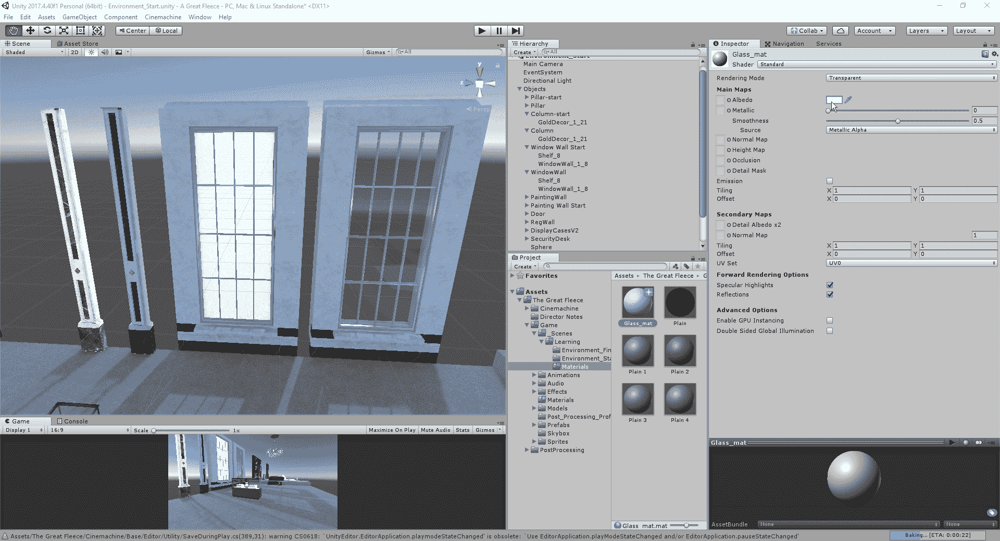
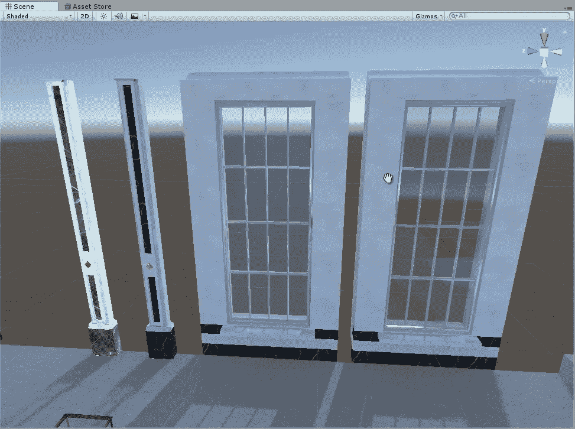

# 在 Unity 中创建透明窗口效果

> 原文：<https://medium.com/nerd-for-tech/creating-transparent-window-effect-in-unity-a6c7c508d055?source=collection_archive---------20----------------------->

现在我们知道了如何改变反照率和子网格，让我们看看如何在我们的编辑器中创建玻璃:

我们的目标是让左边的窗口看起来和右边的一样。首先，我们可以添加窗框、大理石底座和窗户金属条的材料，让那部分看起来一样:

一旦我们设置好不同的网格渲染，我们就可以为窗户的玻璃创建新的材质了:

一旦我们创建了材质，我们将想要改变渲染模式为透明的，这样它会给物体一种透视的特性。从这里开始，我们只需将颜色选择比例的 alpha 值更改为 0:

我们可以看到，当我们慢慢向下滑动滚动条时，我们的窗口看起来就越透明。现在我们已经改变了它，让我们看看两个不同的窗口，看看如何匹配:

现在我们有了匹配的窗口，我们可以看看在 unity 编辑器中调整环境的其他方法。