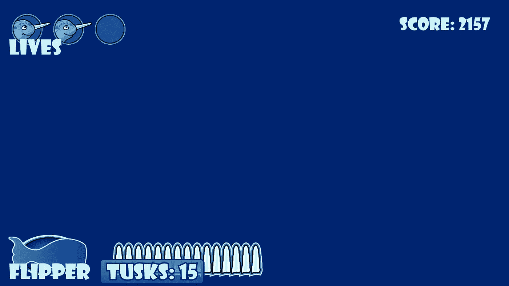

# 为弹药系统创建用户界面第 1 部分:艺术

> 原文：<https://medium.com/nerd-for-tech/creating-ui-for-an-ammo-system-part-1-art-e466711c1b68?source=collection_archive---------21----------------------->

在我的上一篇文章中，我为我的 Unity 游戏中的玩家制作了一个弹药系统，并对无限火力说了一声悲伤的再见。我今天的**目标**是创造一些艺术作为弹药系统的用户界面，在某种程度上，它可以随着玩家发射武器而实时更新。

我打开 Corel Draw，展示我为这个游戏收集的越来越多的艺术资产，而我在这里才刚刚开始！我…