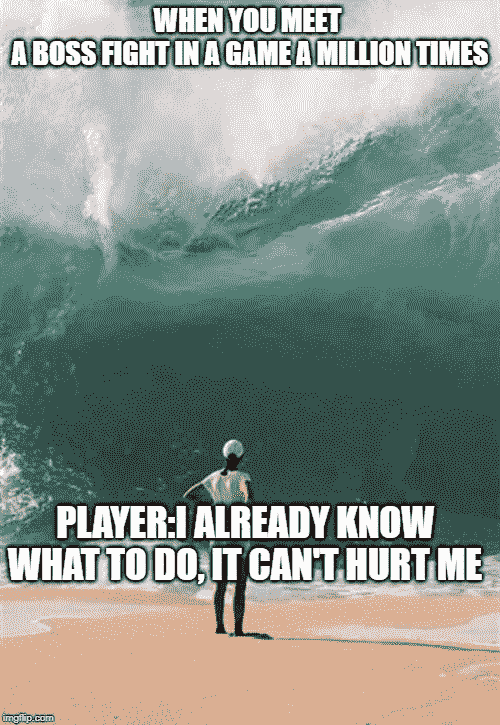
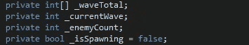
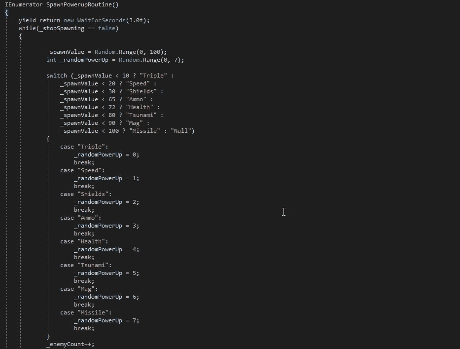
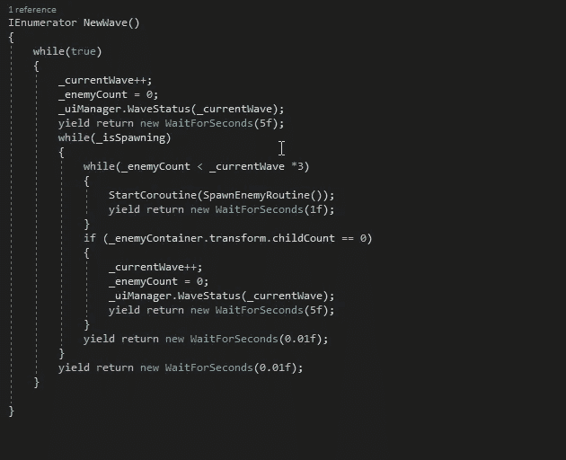
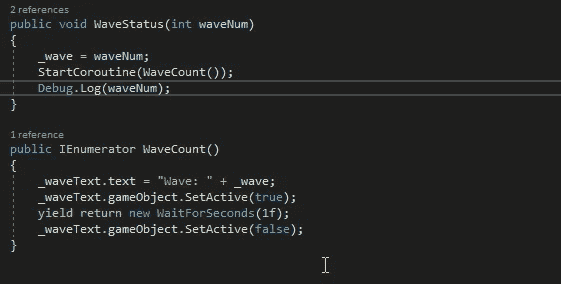
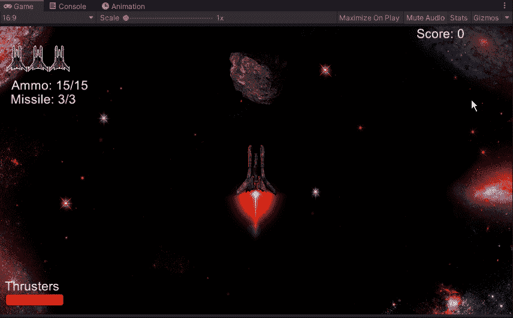

# 制造一波又一波的敌人

> 原文：<https://medium.com/nerd-for-tech/creating-waves-of-enemies-8a3c0882329?source=collection_archive---------26----------------------->

现在我们已经接近游戏的尾声了，让我们来看看如何建立一个波动系统，这样我们就可以把它带到我们的 boss 敌人那里。首先，我们需要在画布上创建一些新的文本，让玩家知道新的一波何时开始。从那里，我们可以进入我们的 SpawnManager 脚本，并开始添加一些新的变量:

从这里开始，我们将 wave 设置为 0，并连接到我们的 UiManager，这样我们就可以链接到画布上的新文本:

在 SpawnEnemyRoutine 中，我们将添加一行快捷文本，让我们知道敌人的数量何时会增加:

从这里，我们可以创造一个新的虚空来工作，它将控制我们产卵的数量以及新的波浪何时开始:

有了这个空白，我们要做的就是增加我们的波数，这将增加我们 UI 脚本中的波数。对于 SpawnManager 脚本更改的最后一部分，我们将把这个新例程添加到 spawn void 中，并删除我们的 SpawnEnemyRoutine:

最后，我们将转移到我们的 UI 脚本，并添加方法，让我们的玩家知道它已经前进到一个新的浪潮:

现在我们已经把这些都准备好了，我们可以在编辑器中看看我们的游戏，看看它是什么样子的:

现在我们已经有了一个波浪系统，我们可以看看游戏的最终 boss 了。