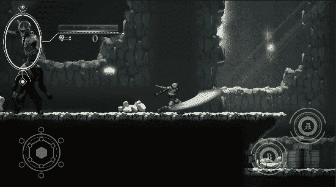

# 创建游戏中的 HUD

> 原文：<https://medium.com/nerd-for-tech/creating-your-in-game-hud-10ae1f0331c1?source=collection_archive---------6----------------------->

## 在 Unity 中启动移动游戏开发

## //为移动冒险创建一个基本的 HUD

平视显示器

不管你叫它用户界面还是 HUD(抬头显示器),每个游戏都需要在不同的时间向玩家提供某种形式的屏幕反馈。有时它可能小到一张迷你地图，而你却在一个…