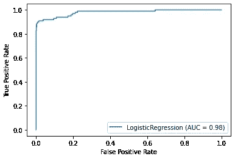

# 欺诈交易的检测-信用卡

> 原文：<https://medium.com/nerd-for-tech/credit-card-detection-of-fraudulent-transaction-d833b8a49926?source=collection_archive---------6----------------------->

在本文中，我们将建立一个有监督的机器学习模型来检测信用卡欺诈。这里使用的数据可以在 Kaggles 网站上公开获得。该数据集具有适当定义的要素和标注。首先设置环境——我们需要在 Google Colab 中打开一个 Jupyter 笔记本。下一步是安装/导入基本库(包)，如 **pandas** 、 **numpy** 、 **matplotlib** ，分别用于操纵数据帧、进行数学运算和绘制图形。为此要执行的代码如下所示

***导入熊猫为 pd***

***导入 numpy 为 np***

***导入 matplotlib.pyplot 为 plt***

***% matplotlib inline***

下一步是加载数据集并使用该数据集创建数据框。在 python 中，将数据集加载到 Jupyter Notebook 的方法不止一种。我们将使用 pandas 从 **url** 路径加载数据集。一旦数据被导入到我们的 Jupyter 笔记本中，下一步将是分析数据集，并使用由此获得的洞察力来解决问题。这将通过可视化表中的数据集( **df.head()** )来实现，也通过确定关于数据集的信息( **df.info()和 df.shape** )来实现，该信息将给出列索引名称以及列的属性以及数据集中存在多少空值。将确定作为标签的最后一列(类)的数据类型是整数，如果交易是欺诈性的，则具有值“1 ”,如果是合法的，则具有值“0”。最后一列被转换为“类别”类型。为所有这些执行的命令如下:-

***URL = ' https://raw . githubusercontent . com/nsethi 31/ka ggle-Data-Credit-Card-Fraud-Detection/master/Credit Card . CSV '***

***df = PD . read _ CSV(URL)***

***df.head(2)***

***df . shape***

***df.info()***

***df。class . value _ counts()****#数据不平衡 Nonfraud= 284315，fraud= 492*

***df['类']= df['类']。astype('category')***

“数量”列的值与其他列的值相差很大，如果不进行标准化就使用，会导致其他列在回归模型中的贡献减少到可以忽略不计。为了调节/缩放 Amount 列的值，我们可以导入并使用函数 **StandardScaling** 。然而，在当前情况下，我们只需要标准化一列，即介于 0 和 1 之间的数量值。我们将通过执行下面给出的命令来实现这一点

***a，b = 0，*1**

***c，d = X.Amount.min()，X.Amount.max()***

***X['金额'] = (X .金额— c) / (d — c) * (b — a) + a***

***X.head(5)***

接下来，我们需要将数据集分为特征(在 ML 模型中用作输入的列)和标签(这将表明交易是欺诈性的还是合法的)。分离特征和标签后，下一步是使用从 **sklearn** 包导入的 **test_train_split** 函数将数据集(**特征(X)** 和**标签(y** ))划分为训练和测试数据集。训练数据集将用于训练机器学习模型，其中机器学习模型尚未看到的测试数据集稍后将用于验证它。上述步骤通过执行下面给出的命令来实现:-

***features _ columns = df . columns[:-1]***

***X = df【features _ columns】***

***y = df[' Class ']***

***from sk learn . model _ selection 导入 train_test_split***

**T43【train _ X，test_X，train_y，test_y= train_test_split(X，y，train_size= 0.80，random _ state = 14)**

在分析过程中，我们已经确定数据集是不平衡的，这基本上意味着欺诈交易微乎其微。因此，这个数据集不会给我们提供想要的结果。因此，我们将人工创建模拟数据集，以平衡数据集中的合法交易和欺诈交易。这将通过导入 SMOTE 函数并通过执行下面给出的命令将其应用于训练数据集来实现

#平衡列车数据

***从 imblearn.over_sampling 导入 SMOTE***

***SMOTE = SMOTE(random _ state = 14)***

***重采样 _X，重采样 _ y = smote.fit _ 重采样(train_X，train_y)***

数据集现在准备好了。我们将把 **LogisticRegression** 模型导入到笔记本中，并通过传递训练数据集(**重采样 _X** 和**重采样 _y** )来训练该模型。该模型一旦被训练，就可以用于预测交易是合法的还是欺诈的。训练模型之前没有看到的测试数据现在将用于验证模型的有效性。

***from sk learn . linear _ model 导入 LogisticRegression***

***lr = LogisticRegression(random _ state = 14，max_iter= 200)***

***lr.fit(重采样 _X，重采样 _y)***

***y _ predict = lr . predict(test _ X)#****这是预测*

当我们将测试数据传递到模型中时，它会生成一个数组，该数组基本上是一个 0/1 的输出，表明它是一个欺诈/不是一个欺诈(合法)交易。此外，我们现在将从指标模块导入某些功能，这将有助于我们检查模型的有效性。这些指标是**混淆矩阵**——这个矩阵提供了我们分类模型细节的更好的洞察力。一个好的混淆矩阵在对角线上有大的值，在对角线外有小的值。此外，我们还将使用**准确度分数，该分数**实际上暗示了我们的模型在预测正确类别(标签)方面有多好。

***from sklearn.metrics 导入混淆 _ 矩阵，准确度 _ 得分，精确度 _ 得分，召回 _ 得分，roc _ auc _ 得分***

***【混淆 _ 矩阵(测试 _y，y _ 预测)】***

***tn，fn，fp，tp =混淆 _ 矩阵(test_y，y_predict)。*ravel()**

***打印(' true_negative:'，tn) #*** 56004

***打印(' false_negative:'，fn) #*** 860

***打印(' false_positive:'，fp) #9***

***打印(' True_positive:'，tp) #*** 89

***print(round(accuracy _ score(test _ y，y_predict)，2)) #*** 0.98

我们还创建了一个 roc_auc_curve 用于可视化描述，以总结分类器在所有可能的概率阈值上的性能。这些将通过执行以下命令来实现:-

***从 sklearn.metrics 导入 plot_roc_curve***

***plot_roc_curve(lr，test_X，test _ y)；***

***print(' ROC 曲线下面积: '，roc_auc_score(test_y，lr.predict_proba(test_X)[:，1])***

最后，为了验证，我们将通过模型传递特征(X)的整个数据集。我们将通过连接 X( **原始要素数据集**)、y( **原始标注**)和预测 y( **预测标注**)来创建一个新的数据框架。该数据集已导出为 csv 文件，可用于分析模型在进行预测时的有效性。

***Predicted _ Class = lr . predict(X)***

***df_1 = pd。DataFrame(预测类，列=['预测类'])***

***result =pd.concat([X，y，df_1]，轴=1)***

****result . to _ CSV(' Final _ predictions . CSV ')****

***#需要给出保存 Final_Predictions.csv 的路径***

**

# ***参考文献***

***数据集已从 ka ggle-**[**https://www.kaggle.com/mlg-ulb/creditcardfraud**](https://www.kaggle.com/mlg-ulb/creditcardfraud)获得*

*应用从 **TalentEdge** 平台的**财务分析**课程中获得的知识*