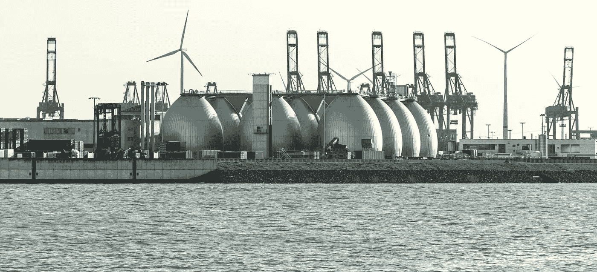

# 关键基础设施安全:情况危急

> 原文：<https://medium.com/nerd-for-tech/critical-infrastructure-security-condition-critical-4712ed5d4f6c?source=collection_archive---------3----------------------->

针对关键基础设施(CI)的攻击——能源、水、交通、食品、医疗保健、金融服务等等——并不是什么新鲜事。

但是越来越多的迹象表明，它们正变得越来越普遍，越来越具有攻击性——甚至可能达到敌对国家发起的[“网络珍珠港”](https://www.nytimes.com/2012/10/12/world/panetta-warns-of-dire-threat-of-cyberattack.html)攻击的水平。几十年来，政府高级官员一直就此发出警告。

最近的迹象包括

*   美国网络安全和基础设施局(CISA)于 6 月 22 日发布了[多个安全建议](https://www.cisa.gov/uscert/ncas/current-activity/2022/06/22/cisa-releases-security-advisories-related-oticefall-insecure)，警告组织检查 Forescout 研究人员最近披露的漏洞。这些漏洞影响了应该(但并不总是)与互联网隔离的运营技术(OT)系统。
*   美国消费者新闻与商业频道上周报道称，黑客越来越多地将目标锁定在集装箱船和货运飞机上。卡巴斯基网络安全公司的首席安全研究员大卫·埃姆告诉《美国消费者新闻与商业频道》:“事实是，一架飞机或一艘船只，就像任何数字系统一样，都可能被黑客攻击。”。
*   ZDNet 上周报道称，分析公司 Gartner 对 2022 年剩余时间的预测之一是，黑客将“武器化”OT 环境，造成人员伤亡。Gartner 指出，对“通常是工厂或电网中工业系统背后的大脑”的攻击已经变得越来越普遍，破坏性也越来越大。
*   挪威公司 DNV 最近发布的一份名为[“网络优先”的报告](https://www.dnv.com/cybersecurity/cyber-insights/thecyberpriority.html?utm_source=DNV-news&utm_medium=pressrelease)基于对电力、可再生能源、石油和天然气行业 940 名专业人士的调查，发现 85%的人认为对该行业的网络攻击可能会在未来两年内导致运营中断以及对能源资产和关键基础设施的破坏。近四分之三的受访者(74%)表示，他们预计攻击会损害环境，而 57%的人预计攻击会导致生命损失。

一些专家说，美国还没有准备好应对这样的袭击。

新思科技的网络供应链风险管理项目主任唐纳德·戴维森表示，CI 风险继续增长，因为“我们在 OT/网络物理系统中采用网络安全思维模式的速度很慢。我们一直在发现更多的漏洞，但我们在纠正或缓解这些漏洞方面动作缓慢。”

“这不像软件那么简单，你可以打补丁，”他补充说，并指出解决 ot 安全问题意味着更新硬件。“我们都把传统硬件保存得太久了，”他说。

这意味着缺乏准备也不是什么新鲜事。2021 年对殖民地输油管道、美国东海岸主要燃料补给线 T1 和 T2 JBS 食品 T3 的勒索攻击破坏了肉类供应，导致价格飙升，令人痛苦地表明了这一点。

新思网络安全研究中心(Synopsys network security Research Center)全球研究主管乔纳森·努森(Jonathan Knudsen)表示，关键基础设施的整体安全状况“可能与其他所有部门和行业的整体安全状况一样——不太好，有时差得惊人，改善缓慢。”

的确，有明显的改进余地。根据 DNV 的报告，不到三分之一(31%)的受访者表示，如果面临潜在的网络风险或威胁，他们确切知道该做什么，并且“尽管威胁正在出现，但不到一半(44%)的行业高管认为需要紧急改进，以防止他们的业务受到严重攻击。”

也许这部分是因为高管们长期以来一直听到对竞争情报系统的潜在灾难性攻击的警告，以至于他们不再理会它们。毕竟，那是在 2012 年，当时的[国防部长利昂·帕内塔警告](http://www.csoonline.com/article/719166/u.s.-rattles-preemptive-cyberattack-saber)即将发生网络珍珠港袭击，而在那之后的十年里没有发生过那种规模的事情。

**升级警告**

但这并不意味着它不会，当然，特别是考虑到一个世界的不稳定与一场主要的战争正在进行。

网络情报公司 Prevailion 的首席执行官卡里姆·希贾齐(Karim Hijazi)在俄罗斯袭击乌克兰后告诉《华尔街日报》,“我们正处于一个非常危险的局面，俄罗斯的网络战随时可能急剧升级。”

能源专业人士显然注意到了这一点；67%的 DNV 受访者表示，最近对该行业的网络攻击已经促使他们的组织对其安全策略和系统做出重大改变。

但是它们可能没有覆盖所有的基础——特别是 ot 基础。磷网络安全公司的首席安全官 Brian Contos 最近在《黑暗阅读》中写道，OT 设备没有信息技术(IT)设备受到密切监控。

“超过 80%的组织无法识别其网络中的大多数物联网和物联网设备，”他写道。“对于谁负责管理它们，也存在困惑。是 it、IT 安全、网络运营、设施、物理安全还是设备供应商？”

戴维森表示同意。“大多数人认为 ICT(信息和通信技术)领域的网络安全仅仅是 IT，”他表示。但 OT 是“工业控制系统[ICS]和关键基础设施 SCADA[监督控制和数据采集]系统的支柱”。"

“大多数 OT 所有者长期以来一直试图将 OT 排除在所有网络安全创新之外，”他补充说。“当涉及到网络安全时，我们必须将它/OT 放在同一个需求框中。”

Joe Weiss 是应用控制解决方案的管理合伙人，也是控制系统专家，几十年来他一直在警告 OT 安全性的缺乏。

韦斯去年在他的自由博客上写道[，他记录了美国和国际上近 100 起控制系统水/废水网络事件，尽管“并非所有案件都可以被认定为与网络有关。”](https://www.controlglobal.com/blogs/unfettered/water-control-system-cyber-incidents-are-more-frequent-and-impactful-than-people-are-aware)

最近的一个事件是 6 月 8 日自由港液化天然气公司位于德克萨斯州金塔纳岛的液化工厂和出口终端发生的爆炸。损坏非常严重，预计该设施要到今年晚些时候才能恢复主要运营。

**动机、手段、机会**

《华盛顿观察家报》报道称，爆炸发生后，已经很高的欧洲天然气价格飙升，“这加强了俄罗斯将欧洲天然气供应置于风险之中的能力，以报复欧盟因乌克兰战争对俄罗斯实施的制裁。”

自由港液化天然气公司在一份声明中告诉审查员，爆炸的原因是输送管道压力过大，“事件发生后几天内就排除了网络攻击的原因。”但该报还报道称，美国联邦调查局(FBI)正在进行调查，两名要求匿名以避免商业报复的液化天然气(LNG)管道专家表示，“像这次爆炸一样，从储罐到终端的管道应该有广泛的保护措施，以防止过压事件。”

努森说，将爆炸归咎于网络攻击还为时过早。但他也说“这不是一个牵强的理论。拥有网络技能的民族国家无疑正在其对手的关键基础设施网络周围和内部徘徊，建立可能根据地缘政治环境使用的能力。”

戴维森还表示，他没有俄罗斯攻击自由港的信息，但“中国和俄罗斯都渗透了美国的许多网络和关键基础设施——硬件和软件，IT 和 OT。”

韦斯在[最近的一篇帖子](https://www.controlglobal.com/blogs/unfettered/was-the-freeport-liquified-natural-gas-lng-explosion-that-forced-europe-to-keep-buying-russian-natural-gas-a-control-system-cyberattack/)中说，尽管该公司排除了网络攻击的原因，但“这是恶意进行的动机、手段和机会”

韦斯指出，在 2 月中旬，就在俄罗斯入侵乌克兰之前，“黑客侵入了近 24 家主要天然气供应商和出口商的现任和前任员工的电脑[……]”

韦斯写道:“这些攻击的目标是参与液化天然气生产的公司，是渗透能源行业一个越来越重要的部门的努力的第一步，洛杉矶 Resecurity Inc .的首席执行官吉恩·尤(Gene Yoo)发现了这次行动。”

无论原因是什么，损害都是巨大的，对欧洲经济的影响也是如此。

**组织起来，做最基本的事情**

因此，一个显而易见的问题是:竞争情报行业应该做些什么来降低可能带来毁灭性物理和经济后果的网络攻击风险？

一个开始的方法是让那些监督 CI 的人变得更有组织性。战略与国际研究中心高级顾问、前国家安全局和中央安全局法律总顾问格伦·格斯特尔(Glenn Gerstell)今年 3 月在《纽约时报》上撰文称，美国政府对网络安全的监管过于分散和不协调。

在一篇题为“美国还没有为即将到来的事情做好准备”的专栏文章中，格斯特尔写道，“政府机构处理他们监管的部门的网络监管和威胁——这是一种低效和无效的方式来解决贯穿我们整个经济的问题。”

他指出，最近几个月，多个联邦机构针对他们监管的特定部门发布了各自独立的安全要求。

“在国会山，大约有 80 个委员会和小组委员会[声称对网络监管的各个方面拥有管辖权](https://www.atlanticcouncil.org/content-series/the-5x5/cybersecurity-and-the-117th-congress/)。这些分散的努力不太可能减少，更不用说阻止网络犯罪，”他写道。

Knudsen 说，提高国家关键基础设施的安全性不会采取任何不寻常的措施，这需要做一些完善的基础工作，如在软件中构建安全性，然后保持其安全性。

“软件就是软件，不管它部署在哪里，做什么，”他说。“过分强调让它工作很容易，但真正的目标应该是让它安全可靠地工作。”

“想象一下，如果飞机制造商只专注于制造能飞的东西。安全融入了飞机制造的每个阶段。同样，安全性必须融入软件制作的每一个环节。”

“安全性的另一个障碍是‘如果它没坏，就不要修理它’这句格言。“对于软件来说，如果它没有崩溃，那也是很快的，”他说更新和修补非常重要，尤其是在要求苛刻、实时、安全关键的环境中，如关键基础设施。"

“软件是我们关键基础设施的关键基础设施。它必须得到相应的保护。”

戴维森说，安全努力需要涵盖软件和硬件，而且这种努力需要是全球性的。“美国不能包揽一切——我们必须与盟友合作，在我们的硬件和软件流程及产品中构建更多的安全性。我们需要制定标准来衡量保证，并对基础设施部门采用保证级别，”他说。

因为在关键基础设施的情况下，软件和硬件风险不仅仅是商业风险，它们还会给国家带来经济和物理风险。