# 衣阿华州的作物轮作:应用与启示

> 原文：<https://medium.com/nerd-for-tech/crop-rotation-on-soybean-by-the-case-of-fields-in-iowa-92185faaaad2?source=collection_archive---------2----------------------->

## 在我们的新文章中，我们为您提供了在 [SoilMate](https://soilmate.ai/) 的帮助下，分析爱荷华州卡罗尔市农业用地的结果！

# 大豆轮作(爱荷华州)

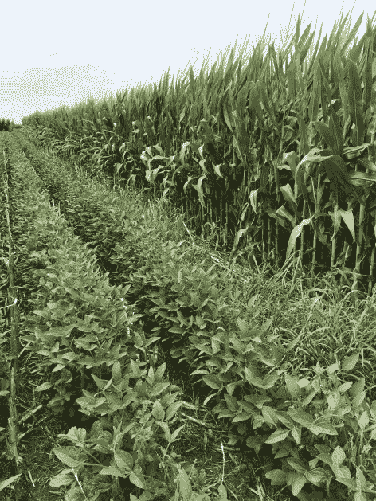

中西部农民广泛使用的一种做法是，轮作玉米和大豆，这可能会导致土壤有机质的长期下降。
玉米和大豆轮作可以让农民在种植玉米时少用氮肥。这有益于环境，也能让农民节省投入成本。然而，研究指出，与连续种植玉米的土地或与玉米和大豆一起轮作的其他作物相比，玉米-大豆作物轮作导致土壤中的有机质更低。
大豆应该每两到四年轮作一次。因此，我们决定分析 4-5 年期间的农业用地，并将这些农田的 NDVI(归一化植被指数)与其他地区的 NDVI 进行比较，以定位不遵循作物轮作的农田。

# 数据

为了分析大豆田，我们使用了卫星图像，并用 [SoilMate](https://demo.soilmate.ai/) 进行处理，这是一种全自动土地使用分析工具。使用人工智能和神经网络，SoilMate 可以检测更大区域的农业土地，定义田地边界，作物类型，产量增长异常，植物胁迫，并计算它们的大小。

对于我们的任务，SoilMate 提供以下服务:

1.  场边界的检测。
2.  大田作物类型的分类。
3.  感兴趣区域的 NDVI 计算。

用于分析的数据是过去五年收集的。作为研究区域，我们决定选择爱荷华州的卡罗尔。

爱荷华州的卡罗尔县位于哨兵-2 卫星的一个 15 微克的瓦片上。调查区域的面积约为 1350 平方公里。公里。

# 字段边界

第一项任务是检测选定区域的场边界。我们将 AOI GeoJson 加载到 SoilMate，并使用所选区域的绘图边界选项来检测字段边界。处理的结果如图 1 所示。

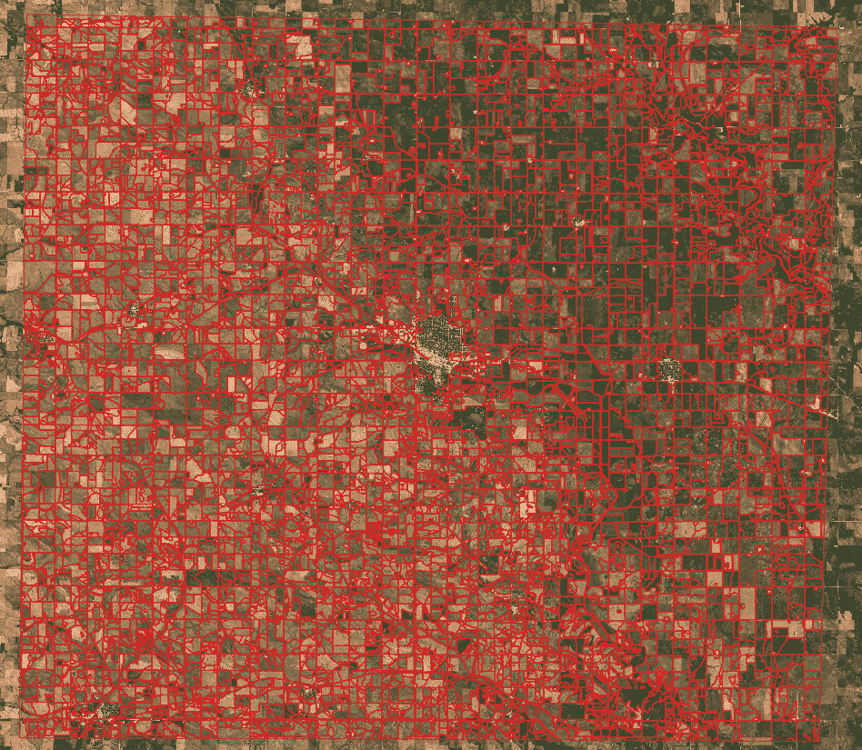

*图一。调查区域的野外几何图形。*

SoilMate 使用神经网络对所选区域执行边界检测，并返回 JSON 以及检测到的区域的几何形状。这些形状将被用来把大豆田与其他的分开。

# 作物类型分类

下一步是对过去五年的农作物进行分类。对于卡罗尔县，我们使用 SoilMate 预测了所有田地的作物类型。

SoilMate 作物类型分类算法在此描述[。使用 SoilMate，只需选择感兴趣的区域并运行处理程序即可获得结果。该算法使用 Sentinel-1 卫星图像波段和所有 12 幅 Sentinel-2 卫星图像来预测作物类型。](/nerd-for-tech/crop-type-classification-cf5cc2593396)

处理后，我们会收到一个图像，其中每个作物类别都有自己的颜色。参见图 2。

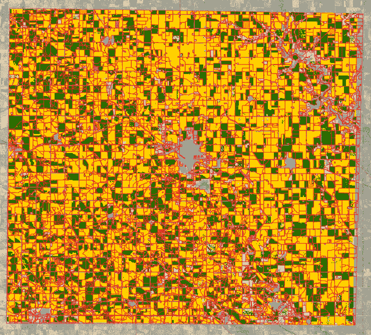

*图二。卡罗尔农田的作物类型。*

此图是 2020 年作物类型分类的图像。黄色代表大豆，绿色代表玉米。这些图像是从 2016 年开始的过去五年中创建的。

# NDVI

我们试图注意到 NDVI 卡罗尔县种植大豆的田地和其他田地的差异。归一化差异植被指数(NDVI)是一个简单的图形指标，用于分析[遥感](https://en.wikipedia.org/wiki/Remote_sensing)测量结果，通常来自[空间平台](https://en.wikipedia.org/wiki/Artificial_satellite)，评估被观察的目标是否包含活体绿色[植被](https://en.wikipedia.org/wiki/Vegetation)。SoilMate 为 TCI(真彩色图像)和 NDVI 计算提供了完美的工具。我们将每年的季节从 5 月到 8 月分成 12 个部分(一个部分是每月 10-11 天)。使用这种分割是因为哨兵-2 任务用第一个航天器每十天提供地球陆地表面的全球覆盖，一旦两者都在轨道上，减少到每五天。因此，我们将准确地收到这些时期的 NDVI 图像。我们计算了选定区域所有 12 个部分的 NDVI。这是图 3 中的 NDVI 图像示例。

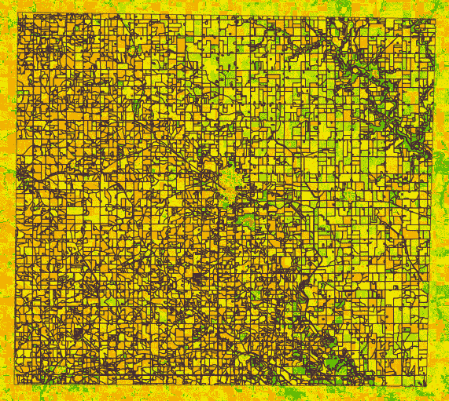

*图三。调查区域的 NDVI 图像。*

# 分析

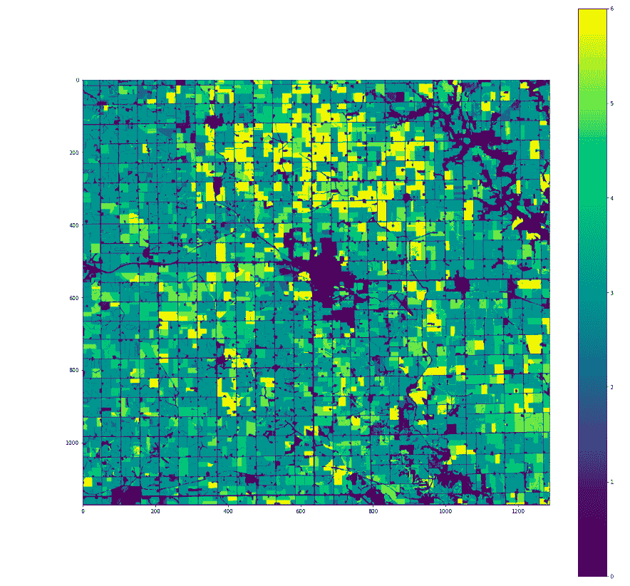

*图 4。所有田地的大豆年增长率。*

首先，我们可视化了一张地图，上面标明了种植大豆的每块田地的年份。如图 4 所示，一些田地里有 5 年和 6 年的大豆。这些字段是我们案例中感兴趣的区域。
使用 SoilMate 的边界，我们将作物类型图像和 NDVI 图像分割成一组区域。对于每个领域，我们创建了一个时间序列，所有时期的平均 NDVI 值。
任务是比较种植 5-6 年大豆的田地和近年来首次种植大豆的地区。这是所有这些时间序列的数字(图 5)。

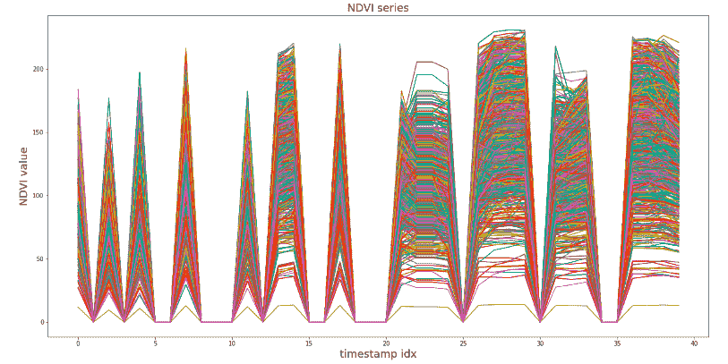

*图 5。所有检测到的场的 NDVI 时间序列。*

在时间序列中，有些点上所有字段的 NDVI 都是 0，所以我们决定去掉这些时间间隔，只分析有价值的数据(图 6)。

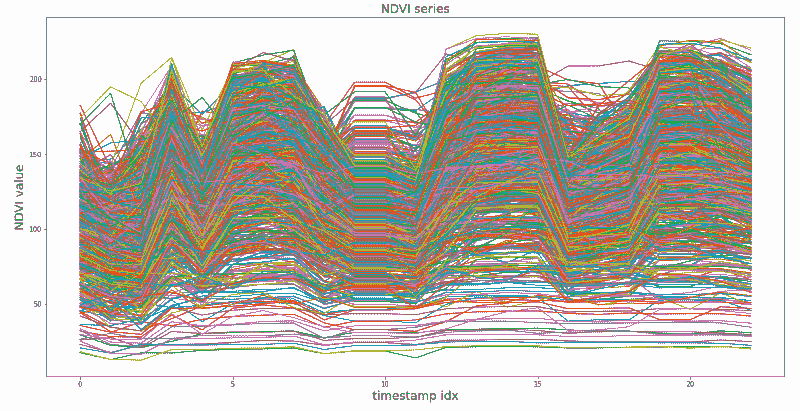

*图 6。具有降零的每个场的 NDVI 时间序列*

我们从最初的字段集中筛选出一些组。第一组是种植 5 年或 6 年大豆的田地，第二组是完全没有大豆的地区，第三组是在调查期间第一次种植大豆的地区。

该图比较了图 7 (a、b、c)中这三组的时间序列。

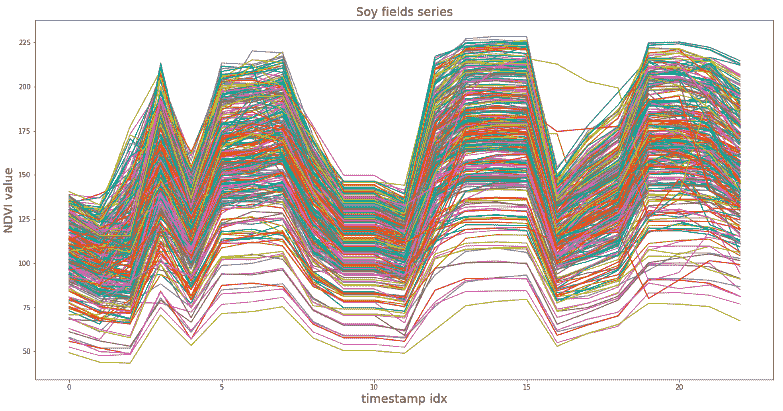

*(一)。*

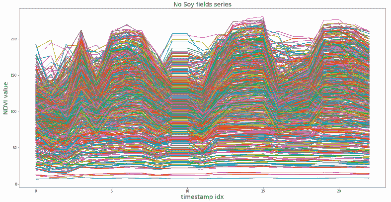

*(乙)。*

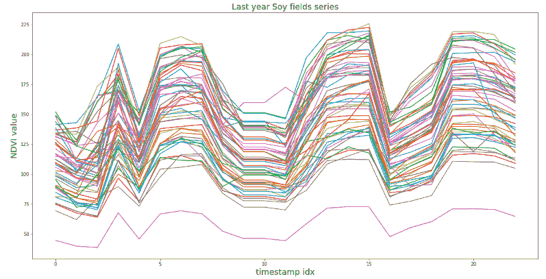

(丙)

> *图七。(a)有 5 年大豆的田地的 NDVI 时间序列，(b)最近 5 年没有大豆的田地的 NDVI 时间序列，有一年大豆的田地的 NDVI 时间序列。*

所以，这些群体在时间序列上没有区别。

我们决定计算大豆田时间序列和其他时间序列之间的相关性。这是相关系数表。

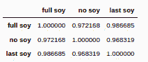

如你所见，所有的序列都是高度相关的。

这种行为的可能原因可能是 NDVI 只显示了地表的土地质量，而没有显示植物下面的土壤质量。另一个原因可能是土壤水分长期退化。

# 结论

因此，我们对衣阿华州卡罗尔的大豆田的分析表明，种植多年大豆的田里的 NDVI 几乎与其他田里的一样。

作为我们研究的结果，有以下发现:

1.  SoilMate 可以返回某一时期某一地区的 NDVI、作物类型和田地边界的信息。
2.  根据 NDVI 的说法，种植了五年大豆的田地，近年来没有种植大豆的田地，以及第一年种植大豆的田地之间没有显著差异。
3.  描述了没有差异的可能原因。