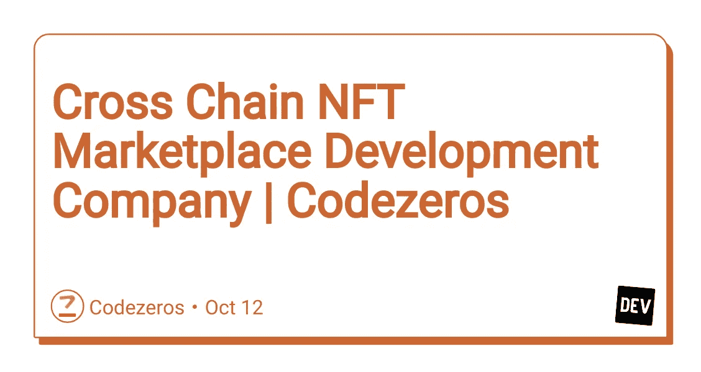

# 跨链 NFT 市场发展公司| Codezeros

> 原文：<https://medium.com/nerd-for-tech/cross-chain-nft-marketplace-development-company-codezeros-16718be186cf?source=collection_archive---------0----------------------->

[**NFT 市场开发服务**](https://www.codezeros.com/services/nft-development-services) 一直是加密货币领域最受欢迎的商业模式。由于其多样化的用户基础，NFT 社区现在已经开始使用跨链功能扩展其平台，以在各个区块链工作。

在这篇博客中，我们将提供一些关于跨链 NFT 市场的深刻信息，并解释它如何帮助你发展你的公司。

两个几乎独立的区块链之间的互连称为交叉链。试想一下，如果不能从 Gmail 向雅虎发送邮件，电子邮件服务法规会发生怎样的变化。由于不同电子邮件平台之间的互操作性，电子邮件系统一直像现在一样有效。由于它们的统一结构，区块链可以在相同的互操作性条件下相互通信。交换资产和转移资金是建立跨链的主要目标。

***>跨连锁 NFT 商场的顶级特色***

[**Codezeros**](https://www.codezeros.com/services/) 致力于通过创建和支持企业主推出他们的 NFT 市场并将他们的原创想法付诸实践，在数字空间中构建 NFT 生态系统。
店面。

一个产品的成败，很大程度上取决于它的第一印象，在这种情况下也是如此。所以成功的第一步是用精心设计和吸引人的店面来启动 NFT 市场。

**-安全性**

在尖端科技世界，一切皆有可能，包括侵入性的黑客企图等等；因此，市场被创建为具有多层安全性，保护市场数据和用户数据。

**-互操作性**

一个跨链 NFT 市场的主要功能是互操作性，这使它能够接受 NFT 铸造和交易在几个区块链网络，它是专门为。

**-多钱包**

其中一个关键部分是开发支持众多钱包的 [**NFT 开发平台**](https://www.codezeros.com/) ，为各种用户提供使用其当前钱包在 NFT 市场进行 NFT 交易的途径。

**- API**

根据该商业模型，可以将各种 API 实施到 NFT 市场中，以提高用户便利性。一些 NFT 市场的成功很大程度上受到许多 API 的影响。

***>为什么在 NFT 市场使用交叉链？***

互操作性是通过使你的市场平台链接到几个区块链来提供的，你可以扩大你的用户群，而不管他们的首选网络。

您在网站上提供的 NFT 资产的跨链功能增强了它们的防篡改性质，确保了交易的合法性，同时培养了客户的信任。

在多个区块链上操作使得获得流动性变得更加容易，因为总会有人在其中一个网络上在线。

尽管使用跨链来托管您的平台可能会让您担心安全性。这是为了让市场能够跟踪所有发生在 NFT 市场界面的交易。

由于跨区块链协作的优势，您的 NFT 市场可以在任何设备上完美运行。

***>跨连锁 NFT 市场发展历程***

计划——在建立你的跨链 NFT 市场之前，必须做好计划。规划的第一步是确定新公司的需求。你必须决定你要卖什么样的非功能性食物。此外，您需要决定您的网关将使用哪个区块链来运行。

设计——规划你的设计比什么都重要，尤其是当你使用许多区块链的时候。你可以雇佣一个在这些领域有经验的公司为你内部开发用户界面(UI)和用户体验(UX)。如果体验天衣无缝，设计吸引人，用户会更开心，更受欢迎。

**发展** —创建一个跨连锁的 NFT 市场需要发展。您的跨链 NFT 市场平台的高效运营依赖于前端开发。

此外，后端开发至关重要，因为它确保了安全性和健壮性。与拥有必要资源的开发企业合作会更方便，因为雇佣有这方面经验的内部开发人员成本很高。

**测试和发布** —不能夸大测试在软件创作中的价值。跨链 NFT 市场的平稳运行可能会受到程序错误和其他缺陷的损害。在部署之前，应对这些进行验证和故障诊断。在第一次发布之后，如果发现更多的缺陷或出现问题，可能需要支持。

**发布门户更新** —为了保护公司的隐私，随着用户群的扩大和新问题的出现，必须定期进行升级。

***>你为什么要选择 Codezeros 来发展跨连锁的 NFT 市场？***

***Codezeros 是一家有前途的 NFT 市场开发公司，通过白标 NFT 市场解决方案提供独特的跨链 NFT 市场开发和部署协助。*** 通过建立一个跨链 NFT 市场，我们提供了与许多其他区块链的兼容性，包括索拉纳、币安智能链、以太坊、波尔卡多特等。

如果你对 NFT 市场的扩展感兴趣，现在就加入我们，创造一个更大的市场。我们有专家可以为贵公司建立一个跨连锁的 NFT 市场。我们以合理的价格提供跨链 NFT 市场解决方案。

*最初发布于 2022 年 10 月 12 日*[*https://dev . to*](https://dev.to/codezerostech/cross-chain-nft-marketplace-development-company-codezeros-5hml)*。*