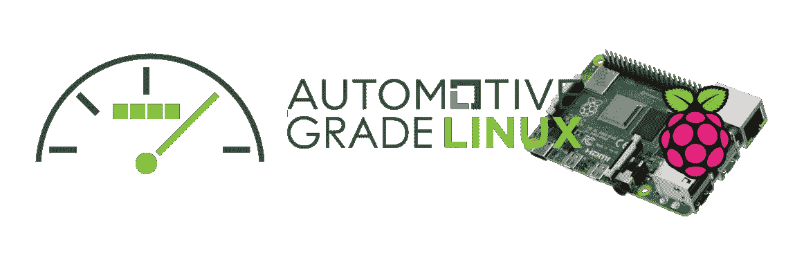
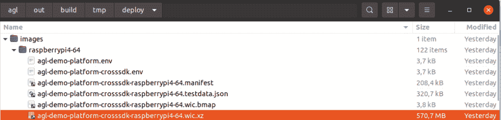
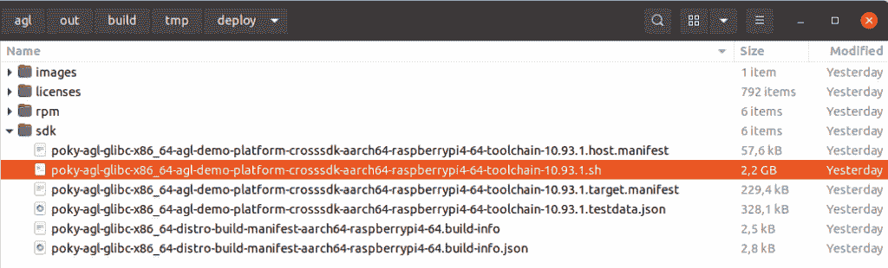
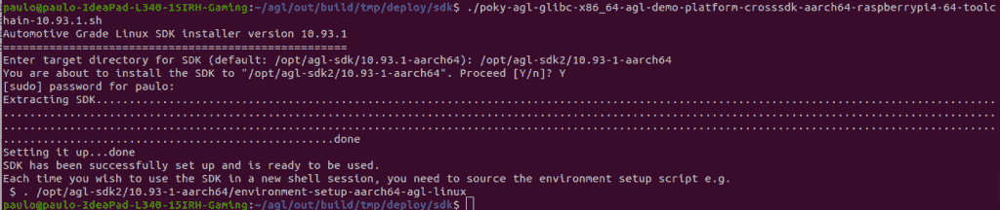
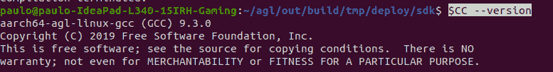
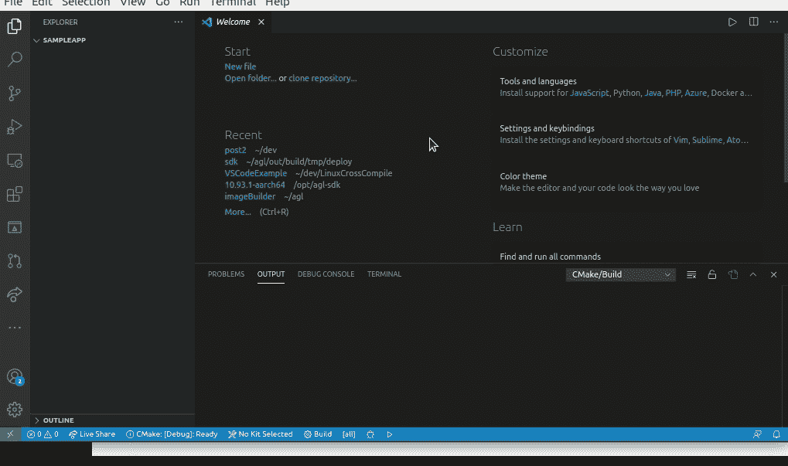
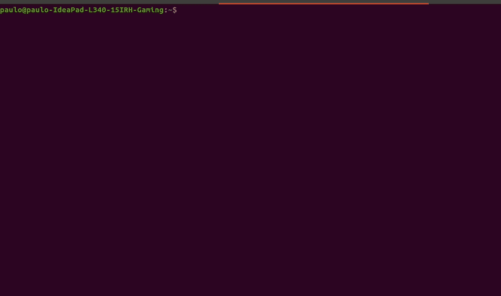

# 使用汽车级 Linux 交叉编译示例应用程序

> 原文：<https://medium.com/nerd-for-tech/cross-compiling-a-sample-application-using-automotive-grade-linux-d432effb297c?source=collection_archive---------3----------------------->



本文的目的是描述我在汽车级 Linux (AGL)的保护伞下交叉编译和部署一个简单程序到 Raspberry Pi 4 目标的过程。您将一步一步地生成一个更具*开发级别的*生态系统，使用它交叉编译一个示例应用程序，将其部署到运行您将构建的映像的 Raspberry Pi 4 目标，并通过`ssh`远程 shell 直接从您的目标运行它。

对于新手来说，交叉编译本身并不是一项简单的任务，所以，如果你有什么不明白的地方，请给我留言和/或通读关于交叉编译的其他资料。

# 获取开发工具

所以，如果你在 Raspberry Pi 4 上运行汽车级 Linux[，我有一些坏消息*:你需要在这里和那里改变一些东西，以获得正确的工具。这是因为默认配置不包括一些基本工具，最明显的是 GDB。此外，在之前的文章中，没有生成软件开发工具包(SDK)。*](https://pauloasherring.medium.com/running-automotive-grade-linux-on-a-raspberry-pi-4-535490ddda82)

我假设您已经设置好了主机系统。如果没有，请安装 Ubuntu 16.04 或者使用我们在运行汽车级 Linux 的[上配置的 docker 镜像。](https://pauloasherring.medium.com/running-automotive-grade-linux-on-a-raspberry-pi-4-535490ddda82)

第一个变化是在`build/conf/local.conf`中添加几行代码，以便将所需的内容添加到可刷新的映像和可安装的 SDK 中。在这里，大约在第 143 行，我读到了`EXTRA_IMAGE_FEATURES ?= "debug-tweaks"`。在此之下，添加以下内容:

```
EXTRA_IMAGE_FEATURES += "tools-sdk"
EXTRA_IMAGE_FEATURES += "tools-debug"
EXTRA_IMAGE_FEATURES += "eclipse-debug"
```

对它们的描述就在 build/conf/local.conf 上的插入点上方，但我还是复制到了这里:

*   “工具-SDK”——添加开发工具(gcc、make、pkgconfig 等。);
*   “工具-调试”——添加调试工具(gdb、strace)；
*   “eclipse-debug”——添加 Eclipse 远程调试支持。

经过这些改变，我们准备好`bitbake`。下面的命令行假设您正在为此使用 docker 映像，因此您可能需要修改路径以适应 *repo* 工具。

```
./../bin/repo init -b koi -u https://gerrit.automotivelinux.org/gerrit/AGL/AGL-repo
./../bin/repo sync
source meta-agl/scripts/aglsetup.sh -m raspberrypi4 agl-demo agl-appfw-smack
bitbake agl-demo-platform && bitbake agl-demo-platform-crosssdk
```

注意，最后一行将为两个目标构建:`agl-demo-platform`和`agl-demo-platform-crosssdk`。前者将生成目标的映像，后者将生成目标的映像和可安装的 SDK。如果这是您的第一次构建，应该需要几个小时才能完成。

生成的映像和 SDK 安装程序可以分别在`/build/tmp/deploy/images/raspberrypi-64`和`/build/tmp/deploy/sdk`上找到。



为您新生成的图像闪存 sd 卡。从终端，导航到`~/agl/out/build/tmp/deploy/images/raspberrypi4–64`。在那里，你会发现一个 flashable 图像，一个用 xz 压缩的 wic 文件。要刷新您的新映像，请运行:

```
xzcat {yourimagename}.wic.xz| sudo dd of=/dev/{your-sd-disk} bs=4M status=progress
sync
```

安装 SDK。从终端，导航`to ~/agl/out/build/tmp/deploy/sdk`并运行您的 SDK 安装程序文件:

`./poky-agl-glibc-x86_64-agl-demo-platform-crosssdk-aarch64-raspberrypi4-64-toolchain-10.93.1.sh`

您必须与终端进行交互:

*   您将被要求输入保存 SDK 的目标路径，可以选择使用默认路径，`/opt/agl-sdk/10.93.1-aarch64`；
*   将询问您是否要继续安装:`y`；
*   您将被要求管理员凭证:`enter your password`。



安装程序将启动。应该需要一段时间才能完成。完成后，您会得到一个非常基本但很好的用法说明:

```
Each time you wish to use the SDK in a new shell session, you need to source the environment setup script e.g.
 $ . /opt/agl-sdk2/10.93-1-aarch64/environment-setup-aarch64-agl-linux
```

# 构建示例应用程序

要构建您的第一个应用程序，首先要初始化您的 SDK。打开终端并获取初始化脚本:`. /opt/agl-sdk/10.93-1-aarch64/environment-setup-aarch64-agl-linux`。这样做之后，您应该初始化一些环境变量。你可以用`export`来检查它们。


此时，您可以通过输入`$CC`环境变量来访问 GCC 的交叉编译器。例如，您可以通过输入`$CC --version:`来检查交叉编译器的版本



如果您使用 IDE，您需要在启动 IDE 本身之前找到这个文件。例如，获得它之后，您可以通过运行`code`从获得文件的同一个终端会话中运行它来运行微软的 Visual Studio 代码。

如果您喜欢使用 VSCode，请打开并运行它。提示一下，要从 VSCode 内部运行命令，请按`F1`。也就是说，执行以下操作:

*   打开一个空文件夹作为工作区；
*   运行 CMake 的扩展`Cmake: Scan For Kits`；
*   运行 CMake 的扩展`Cmake: Quick Start`生成一个新的模板项目；
*   从列表中选择您的交叉编译器；
*   可能会询问您是否要创建一个`CMakeLists.txt` 文件。如果有，请点击创建；
*   输入示例应用程序的名称:`SampleApp`；
*   输入输出类型:`executable`；
*   运行 CMake 的扩展`Cmake: Build`。



从 VSCode 使用 CMake 的扩展。

转眼间。您已经构建了交叉编译的 Hello World，生成到`./build/SampleApp`(或者您给项目起的任何名字:)

# 在目标上运行应用程序

现在，您已经有了一个带有适当映像的目标和与之兼容的二进制文件。你只需要把它传送到目标并运行它！这里我假设您可以通过 ssh 访问目标的 shell，并且知道它的 IP 地址。

所需的步骤如下:

*   将生成的二进制文件部署到目标上；
*   通过 SSH 访问您的目标；
*   从 SSH 运行您的应用程序。

请记住，您可能需要根据需要调整目标的 IP。

```
scp ./SampleApp root@192.168.5.2:/home/1001
```

部署二进制:`scp ./SampleApp root@192.168.5.2:/home/1001`

SSH 进入你的目标:`ssh -l root 192.168.5.2`

导航到 */home/1001* : `cd /home/1001`

运行您的示例应用程序:`./SampleApp`

你应该得到你的嵌入式`Hello World`。



部署和运行您的 Linux 嵌入式、交叉编译、Hello World。

# 结论

在本文中，您已经使用 AGL 生成了一个更加*开发级别的*生态系统，使用 VSCode、CMake 和您自己构建的 AGL 的 SDK *开发了一个`Hello World`！您还在您的 Raspberry Pi 4 目标上部署并运行了它。*

希望对你有帮助:)

如果有，请告诉我。此外，反馈将非常感谢，因为这是我的第二个职位。

我计划写另一篇关于使用 GDB 从 IDE 和命令行进行远程调试的后续文章。