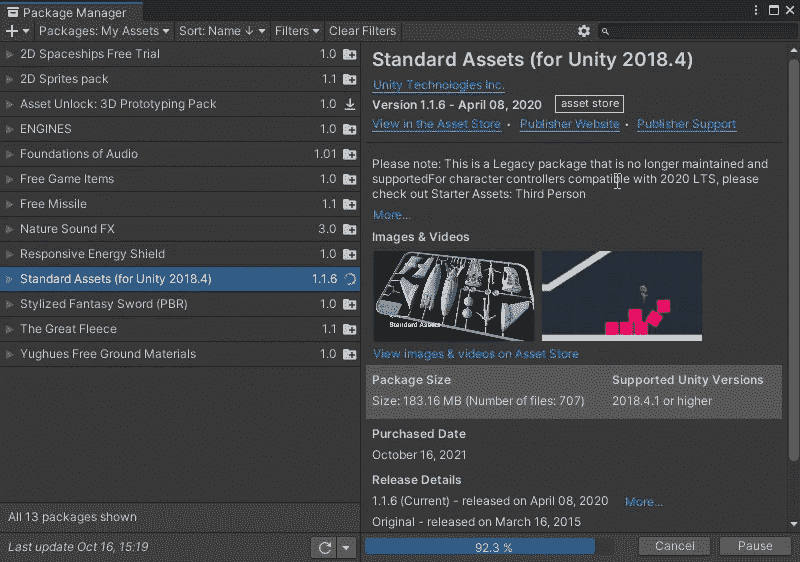
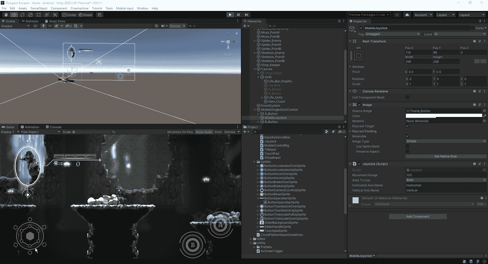
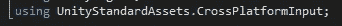
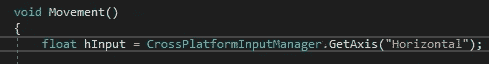
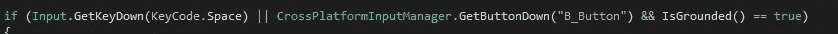
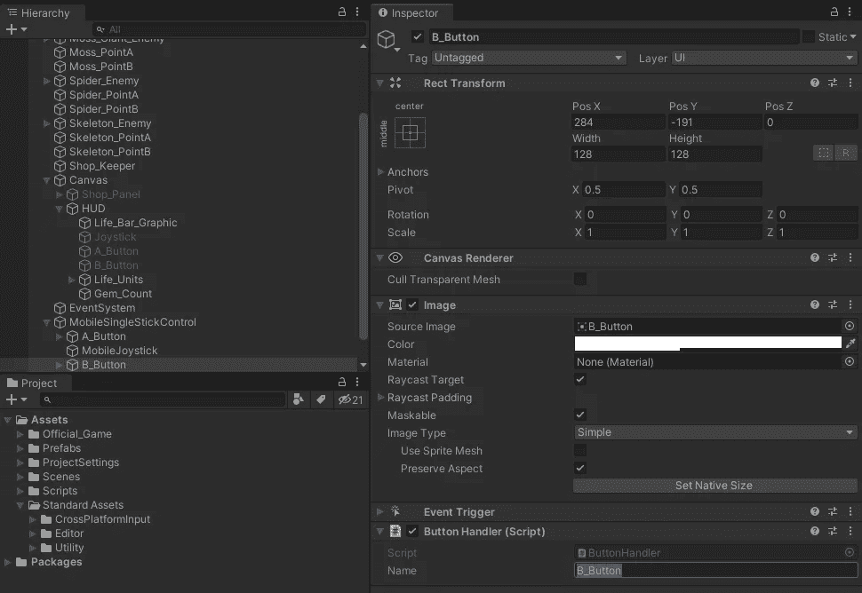
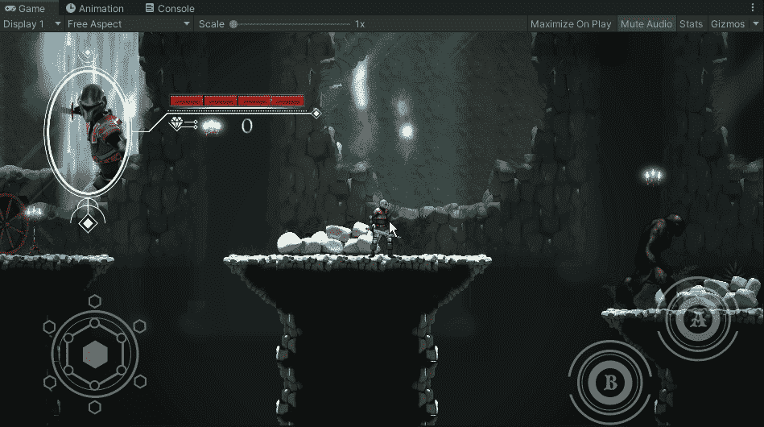
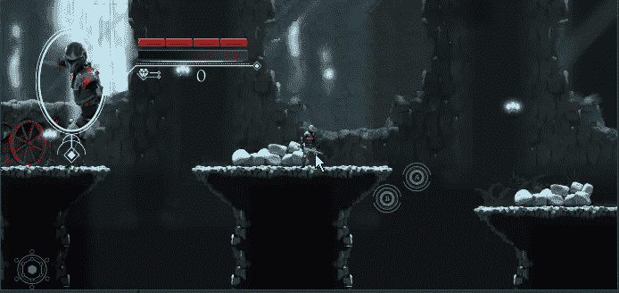
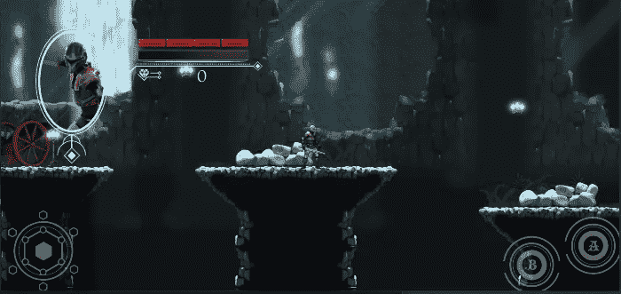

# 跨平台输入控制器

> 原文：<https://medium.com/nerd-for-tech/cross-platform-input-controller-16257502e8b4?source=collection_archive---------4----------------------->

现在我们的 HUD 已经完成了，让我们把输入控制器放到适合移动使用的地方。首先，我们需要导入 Unity 提供的标准资产包:

从这里开始，我们将把 MobileSingleStickControl 放到我们的层次结构中，并重做我们最初设计的新按钮。从那里，我们可以看到操纵杆在我们玩游戏时的样子:

我们可以调整操纵杆的移动范围，这样它就不会离开屏幕太远。现在这已经就位，让我们看看我们如何能够过渡到让我们的玩家对这些新的控制做出反应。
首先，我们需要为我们的跨平台输入启用库:

从这里，我们可以对我们的脚本进行必要的更改，以允许操纵杆控制移动，并为 A 和 B 键分配一个功能:

运动功能

攻击函数

跳跃功能

至于 A 或 B 按钮调用，我们在 Unity 编辑器中的特定按钮下进行分配:

从这里，我们可以在我们的编辑器中快速测试它，看看它是否工作:

现在我们看到它在编辑器中工作，我们可以将它下载到 android 设备上，看看它是否也能在那里工作，并且控件位于感觉良好的位置:

正如我们可以看到的，从我们最初的下载，我们有一些问题，我们的按钮的位置，所以要解决这个问题，这是一个调整它和重建游戏来测试它的问题:

现在我们已经设置了移动控件，我们可以期待在游戏的下一部分添加。