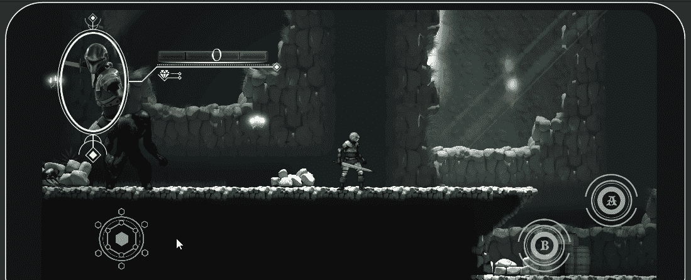

# Unity 中的跨平台输入控制器

> 原文：<https://medium.com/nerd-for-tech/cross-platform-input-controller-in-unity-bd2bbaa20ca7?source=collection_archive---------5----------------------->

## 在 Unity 中启动移动游戏开发

## //Unity 标准资产跨平台控制器

触摸控制在 Unity 内部工作

昨天，我们从 Unity Asset Store 提供的 Unity Standard Assets pack 中了解了如何将跨平台输入控制器添加到我们的游戏中。我们停止了屏幕上的控件，准备实现代码来…