# 跨平台输入控制器| Unity

> 原文：<https://medium.com/nerd-for-tech/cross-platform-input-controller-unity-9b76545a4aa0?source=collection_archive---------3----------------------->

## 统一指南

## 关于如何在 Unity 中实现移动输入的快速指南

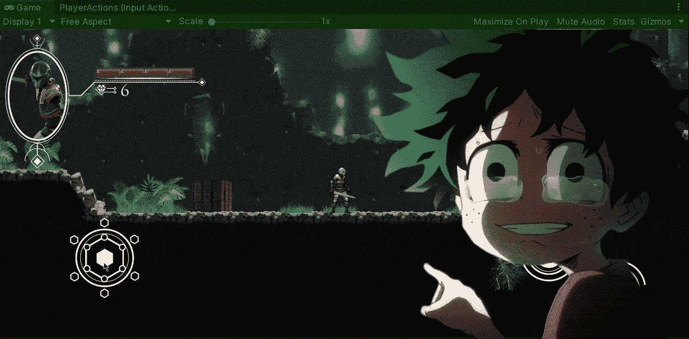

**目标**:在我们的游戏中实现跨平台输入，以便在手机上使用 Unity 中的新输入系统。

在上一篇文章中，我介绍了[如何在 Unity](https://fas444.medium.com/onclick-events-unity-f4805203b039) 中使用 OnClick 事件。现在，是时候使用 Unity 中的新输入系统来实现移动输入在我们的平台游戏中的工作方式了。

# 开始前

如果你一直关注我以前的帖子，那么你会记得我在 Unity 中使用新的输入系统实现了移动和其他机制。如果你不知道如何使用新的输入系统，我真的建议在开始这篇文章之前检查一下这些文章:

 [## 随着新输入系统| Unity 移动

### 关于如何在 Unity 中使用新的输入系统实现移动的快速指南

medium.com](/nerd-for-tech/moving-with-the-new-input-system-unity-a6c9cb100808)  [## 实现跳转机制| Unity

### 关于如何在 Unity 中实现跳转机制的快速指南

medium.com](/nerd-for-tech/implementing-a-jump-mechanic-unity-6420b106e47a) 

# 当前输入动作

在当前输入动作资产中，我们包含 3 个不同的动作:

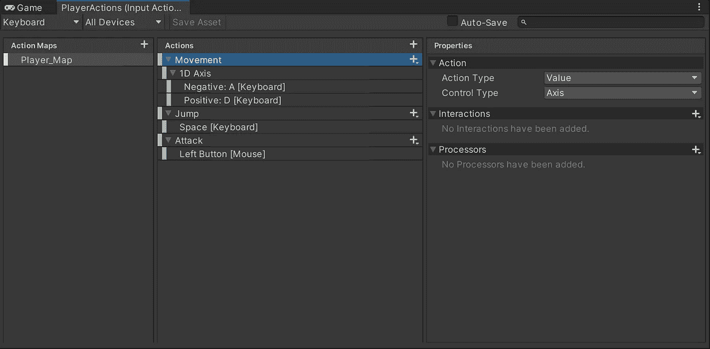

*   **机芯**

该动作与 1D 轴值相关联，以指示玩家应该向左还是向右移动。

*   **跳转**

这个动作指示玩家应该何时跳跃，它与空格键结合在一起。

*   **攻击**

这个动作指示玩家应该何时攻击，它与鼠标左键点击相结合。

正如你在左上角看到的，这些动作被绑定到**键盘**控制方案。但是，如果我们想让我们的游戏接收来自手机屏幕的输入呢？…这真的很简单，我们只需要为移动输入添加一个新的控制方案:

# 新控制方案

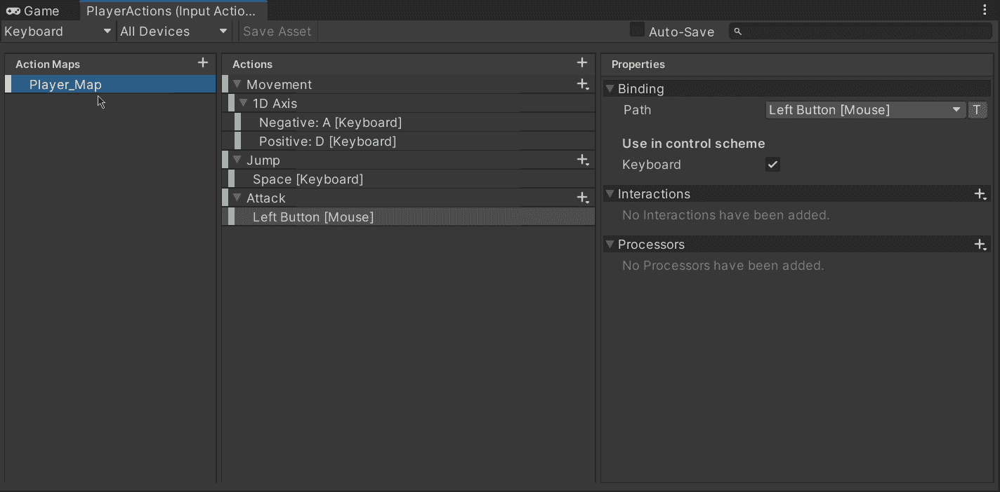

一旦我们添加了 ***触摸*** 控制方案，我们将能够看到与 ***键盘*** 方案相同的 3 个动作，并且，由于我们的玩家只需要向左或向右移动，我们可以将一个新的 1D 轴值绑定到移动动作:

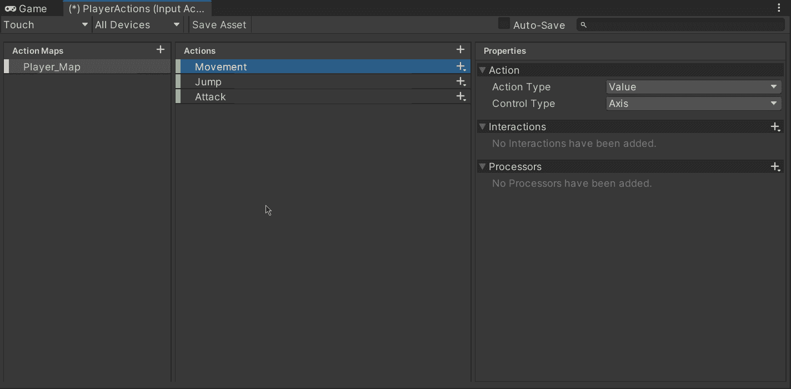

值绑定后，让我们选择相应的轴作为输入。和很多手机游戏一样，我们可以选择游戏手柄的**默认**左键，并根据 1D 轴的值选择向左或向右的方向:

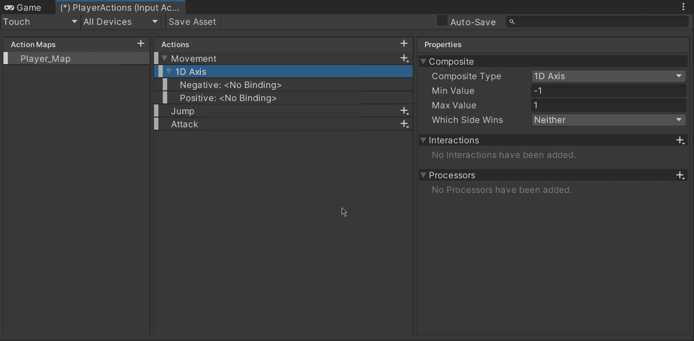

这样，当**游戏手柄**向左移动时，或者当键盘上的 **A** 键被按下时，我们可以将玩家移动到左边。

> 注意:选择输入路径后，不要忘记点击 ***保存资产*** 按钮。

# 添加移动输入

现在，为了使用移动输入，让我们将各自的精灵添加到画布中。移动时我们用左边的棍子，跳跃和攻击时我们用右边的两个按钮:

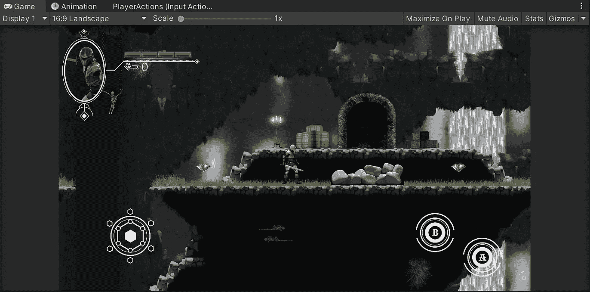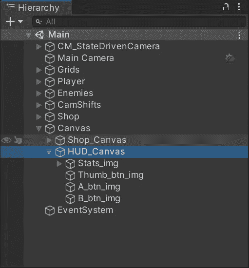

添加完精灵后，让我们选择左边的棍子图像，并附加一个**屏幕棍子**组件，该组件将为它提供一个棍子行为，并提供分配其移动范围的选项:

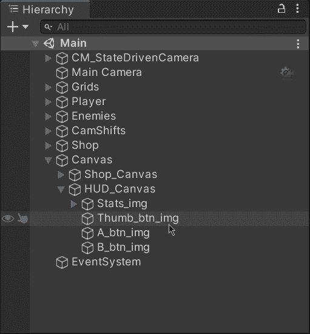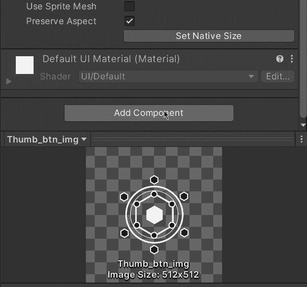

最后，为了将摇杆输入与新的**触摸**控制方案连接起来，让我们通过检查器选择各自的控制路径(**游戏手柄的左摇杆**)。然后，如果我们运行游戏，我们将能够像在移动设备中一样根据我们选择的移动范围值来拖动操纵杆:

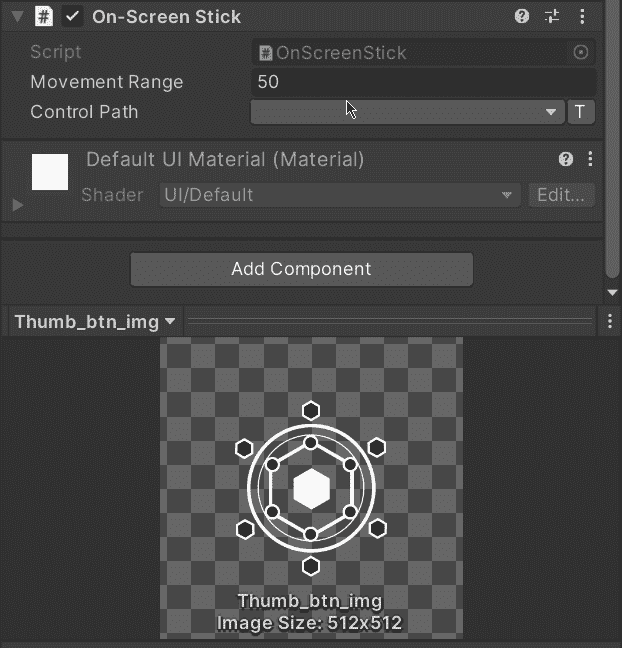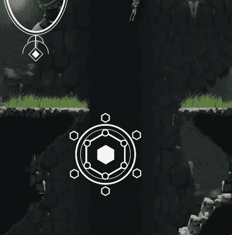

一旦选择了相应的控制路径，让我们运行游戏，我们将能够看到移动输入按预期工作:

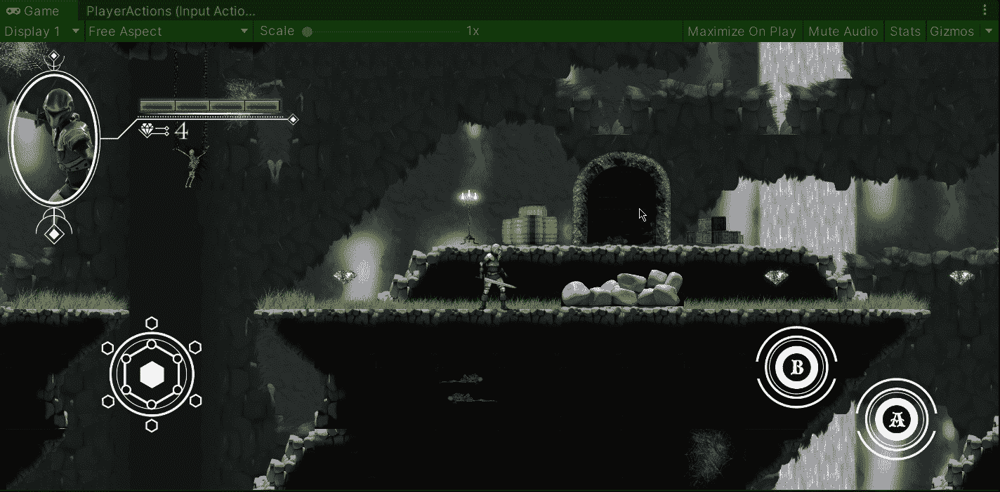

# 额外(按钮)

如果我们想要实现按钮，我们只需对输入动作资产中的其他动作遵循相同的过程。只需选择相应的控制路径来绑定操作:

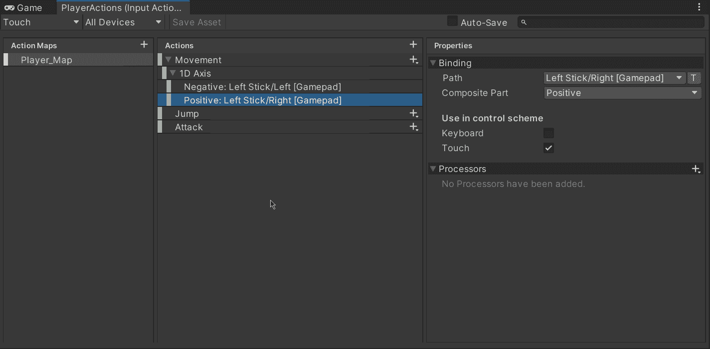

然后，为了连接输入，将一个**屏幕按钮**组件附加到按钮图像上，并从上面选择相同的控制路径:

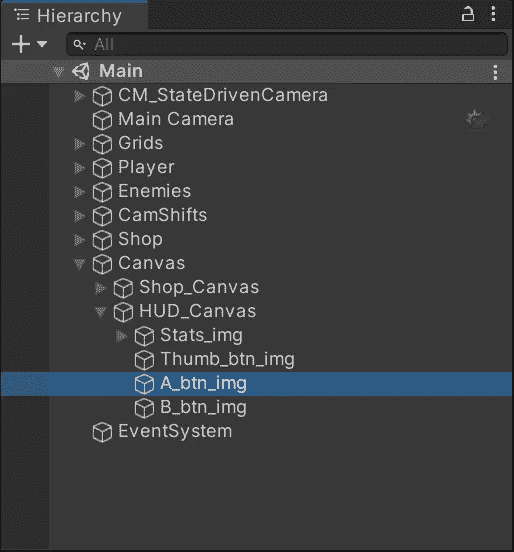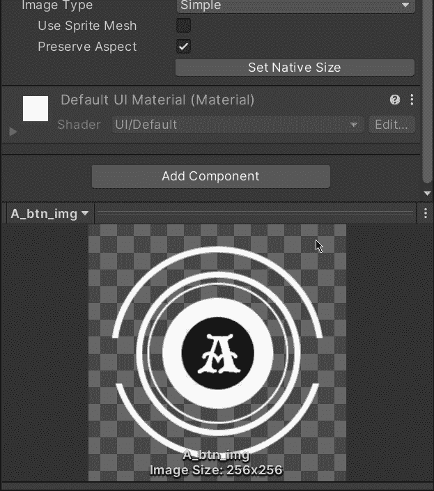

就这样，我们用新的输入系统用 Unity 实现了移动控件！:d .下一篇文章再见，我将展示如何用 Unity 为我们的游戏实现移动广告。

> *如果你想了解我更多，欢迎登陆*[***LinkedIn***](https://www.linkedin.com/in/fas444/)**或访问我的* [***网站***](http://fernandoalcasan.com/) *:D**