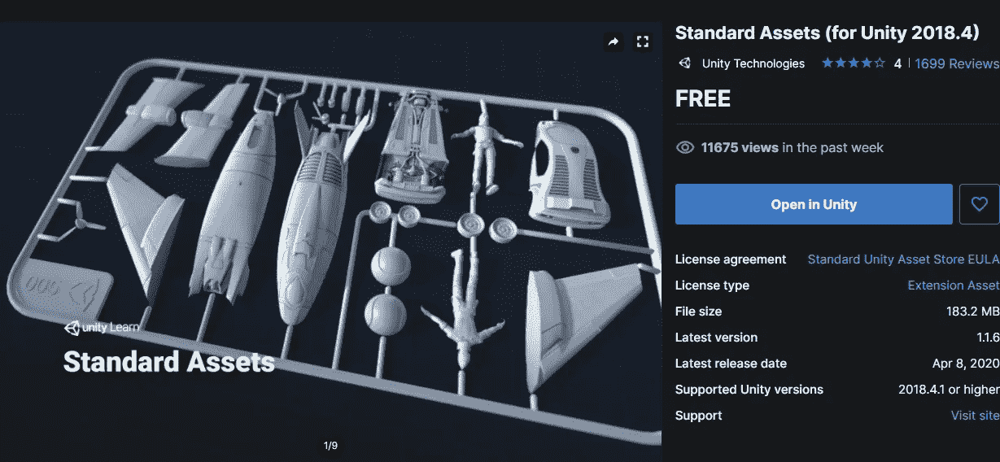
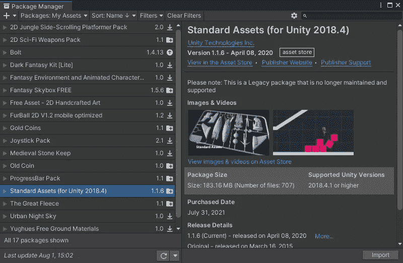
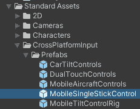
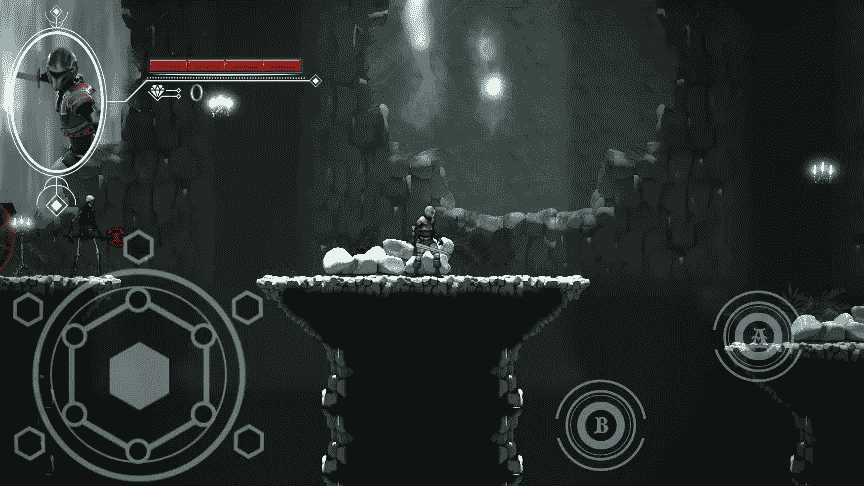
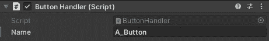
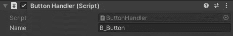
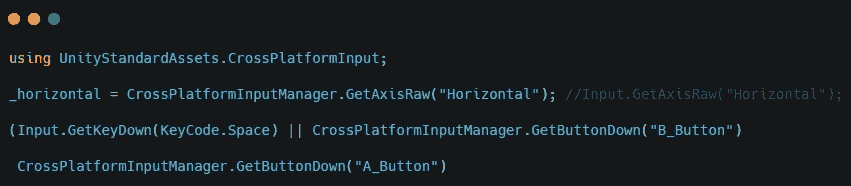
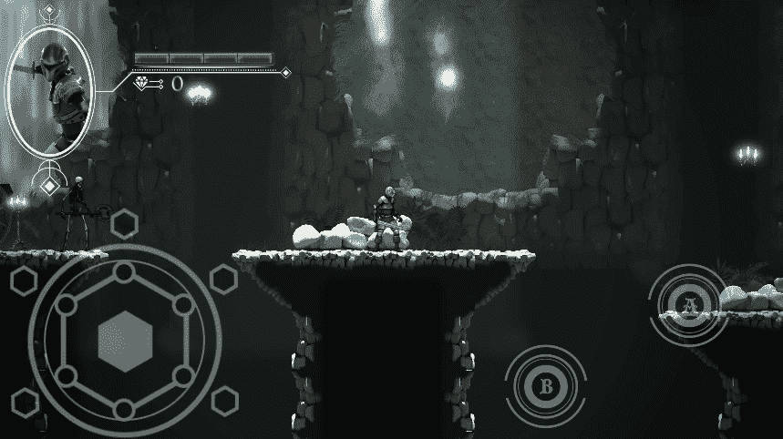

# Unity 中的跨平台输入

> 原文：<https://medium.com/nerd-for-tech/cross-platform-input-in-unity-db165de74a29?source=collection_archive---------8----------------------->

现在大部分游戏机制都在我的游戏中了，是时候添加在移动设备上控制游戏的能力了。

首先，请到 Unity 资产商店购买标准资产包。

一旦你有了这个，去 unity 并从包管理器下载标准资产。

这将在项目窗口中添加一个名为“标准资产”的新文件夹。

在此文件夹中，转到**CrossPlatformInput =>Prefabs =>MobileSingleStickControl**。

将此拖动到层次结构中，并将移动操纵杆与已经存在的操纵杆对齐。您将禁用旧的，并将图像添加到新的操纵杆控件中，以获得正确的图像。对按钮也这样做。您将复制按钮，然后将两个按钮与旧按钮对齐。

在按钮上，转到按钮处理程序，并将它们重命名为 A_Button 和 B_Button。

要让这些工作去球员脚本。使用 UnityStandardAssets 添加名称空间**。交叉平台输入**。转到运动脚本并替换**输入。使用 **CrossPlatformInputManager 的 GetAxisRaw("Horizontal")** 代码。GetAxisRaw("水平")**。你可以经历一个类似的跳跃和攻击过程。这两个将使用 **GetButtonDown** 和在检查器中添加的 A_Button 和 B_Button 文本。

这将允许您使用按钮。

