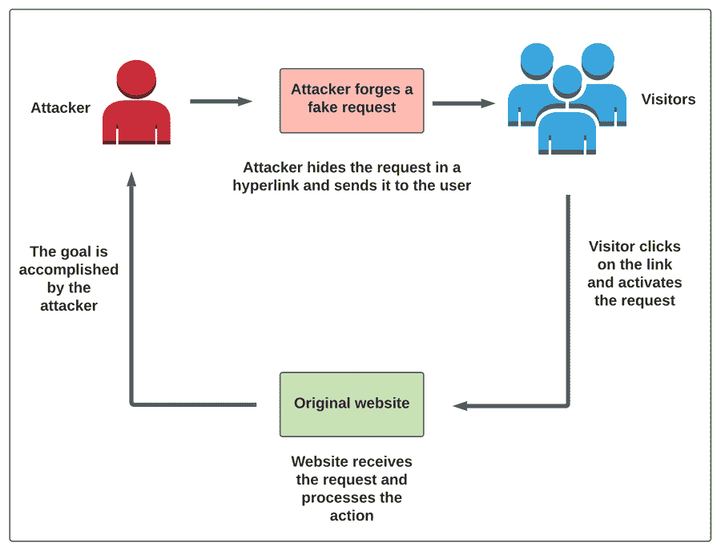

# 跨站点请求伪造攻击:如何防范？

> 原文：<https://medium.com/nerd-for-tech/cross-site-request-forgery-attack-how-to-prevent-it-ff4c4ad97346?source=collection_archive---------14----------------------->

脚本攻击是全球数千家企业和网站面临的主要安全问题。此外，跨站点脚本攻击是所有脚本攻击的主要原因。

面对如此大的损失和高额的财务损失，每个开发者和网站管理者都希望防止交叉脚本攻击。但是为了防止一种邪恶，我们完全忽略了另一种邪恶——跨站请求伪造攻击。

在这篇博文中，我们将看看什么是跨站点请求伪造(CSRF)攻击，并了解它是如何进行的。我们还将研究防止这些攻击的方法。

**目录**

1.  什么是跨站伪造攻击？
2.  攻击者通常如何进行跨站请求伪造攻击？
3.  如何防止跨站请求伪造攻击？
4.  裁决。

# 什么是跨站伪造攻击？

使用跨站点请求伪造的攻击者试图欺骗用户向信任该用户的网站发送恶意请求。这是可能的，因为这些网站由于 cookies 而信任用户的浏览器。攻击的目标是使用您的身份 cookie 来执行请求。

例如，您登录到您的脸书帐户。然后，脸书在你的浏览器中设置一个 cookie 来识别你的身份。攻击者现在可以诱骗您向脸书发送请求。这种请求可能只是向成千上万的用户发送消息，宣传一个恶意网站。跨站点请求伪造攻击使用用户的浏览器向所有信任该用户的网站发送恶意请求。

现在考虑另一个例子。

假设你正在随意浏览 Instagram。你看到一个关于猫的帖子，然后点击它。你喜欢这个帖子，然后点击这个简介。在个人资料上，你会看到简历中的链接。上面写着“点击这里查看更多猫的图片”，你显然点击了它。

点击链接后，没有猫的图片，只有一只狗。你对自己说“这很奇怪”。你很自然地点击了‘返回’按钮，然后意识到你的 Instagram 个人资料已经被删除了！

事情可能是这样的:简历中的链接伪造了一个“删除请求”，并发到了你的 Instagram 账户上。此请求是使用在您的 web 浏览器中下载的相同 cookies 处理的。现在你的 Instagram 账户已经被删除了。

您刚刚成为跨站点请求伪造攻击的一部分。

# 攻击者通常如何执行跨站点请求伪造攻击？

攻击者使用网络钓鱼电子邮件或信息引诱用户进入他们的网站。这些网络钓鱼攻击最常见的方法是使用激活跨站点请求伪造攻击的 web 链接。

但是他们如何让这些用户点击这个链接呢？

这就是我们在上一节中提到的网络钓鱼电子邮件和信息发挥作用的地方。这些信息用“免费赠品”或“折扣”来吸引用户购买他们喜欢的东西。一旦用户点击这个链接，跨站请求就实现了。

该请求将被转发到目标网站，并且目标动作将被完成。例如，一些攻击可能会从您自己的帐户中推广某些内容。或者它可以用来向其他访问者和用户发送链接和请求。成功执行跨站点请求伪造攻击的可能性是无限的。

# 如何防止跨站请求伪造攻击？

我们将从这个问题的一个更简单的解决方案开始——检查传入的请求是否有 referrer 头。这将防止从第三方域和恶意网站发送请求。然而，由于两个原因，这种方法不是优选的。

1.  一些用户可能会在他们的浏览器中禁用他们的推荐人标题。
2.  一些攻击者可以在某些版本的 Adobe Flash 上创建虚假版本的引用标头。

还有第二种方法来防止 CSRF 攻击——使用反 CSRF 令牌。这不仅是一个更常用的解决方案，也是一个非常有效的解决方案。它是用户和特定 web 应用程序之间共享的随机令牌(一串值)。反 CSRF 令牌总是隐藏在会话变量中，只能由应用程序来验证。

让我们考虑同一个 Instagram 例子。有了反 CSRF 令牌，你的账户就不会被删除。当您登录到应用程序时，这个令牌将与您的 cookies 共享。每当您试图从该应用程序获取请求时。它将根据与您的 web 浏览器共享的会话变量检查令牌的值。如果它们匹配，则请求被满足。如果它们不匹配，则请求不被满足。

发起 CSRF 攻击的攻击者如果找不到令牌的价值，就没有机会。在大多数情况下，不可能找到这种代码，所以攻击永远不会结束。由于系统中的同源策略，攻击者甚至无法读取应用程序生成的包含令牌的响应。

# 裁决

现在，您已经了解了 CSRF 袭击的全部内容以及防范方法，是时候开始行动了。在您的应用程序中使用它来避免 CSRF 攻击，并为您的用户提供额外的安全层。

*原载于*[*https://www . partech . nl*](https://www.partech.nl/nl/publicaties/2021/05/cross-site-request-forgery-attack-how-to-prevent-it)*。*