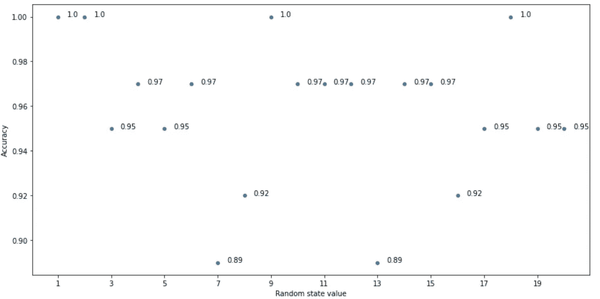
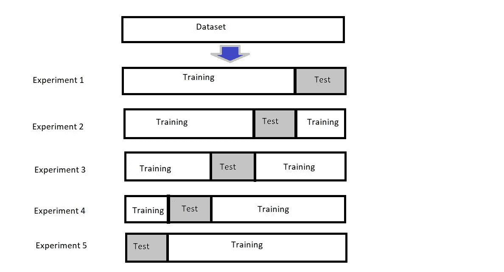
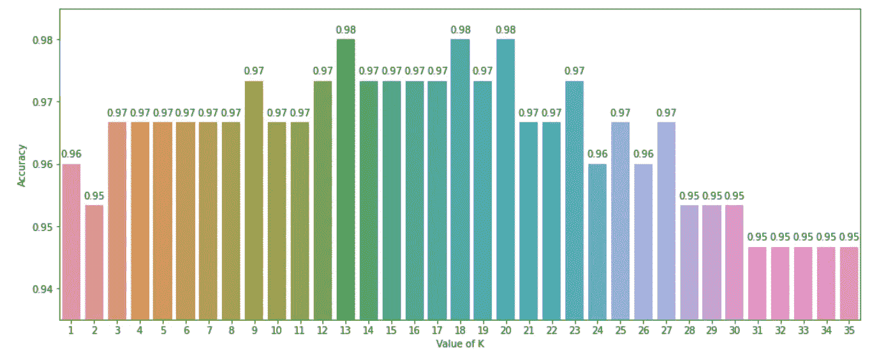

# 交叉验证

> 原文：<https://medium.com/nerd-for-tech/cross-validation-6270341658ae?source=collection_archive---------11----------------------->


照片由[飞:D](https://unsplash.com/@flyd2069?utm_source=medium&utm_medium=referral) 在 [Unsplash](https://unsplash.com?utm_source=medium&utm_medium=referral)

W 每当我们遇到机器学习问题或纸牌游戏比赛时，我们经常会困惑于我们应该使用哪种机器学习算法/模型，或者哪种算法/模型会给出最好的结果。我们需要验证我们的机器学习模型的稳定性，以便在部署后它能给出我们想要的输出。通常，它会在各种模型上迭代，以找到性能最佳的模型。然而，由于过拟合，选择模型所基于的精度可能在训练期间给出好的结果。在机器学习中，我们无法使模型适合训练数据，也无法假设它会准确地适用于真实世界的数据。为此，训练数据必须从没有噪声的数据中获取真实或正确的模式。在机器学习中，有一种重要的技术叫做 ***交叉验证*** ，它不仅有助于选择正确的模型，还有助于选择模型的正确参数。

# **Train_test_split Vs 交叉验证:**

**保持方法或验证集方法:**

这是最常见和最简单的方法，我们随机保留一些数据用于训练，其余的用于测试目的。由于我们随机获取数据，因此在训练我们的模型时很可能会跳过可能包含重要信息的数据。让我们以一个名为“iris”的著名数据集为例。

加载所需的库和数据集。

```
from sklearn import datasets
import pandas as pd
import numpy as np
import matplotlib.pyplot as plt
import seaborn as sns
%matplotlib inlineiris = datasets.load_iris()
X = iris.data
y = iris.target
```

使用 **train_test_split** 将自变量(X)和因变量(y)拆分为训练和测试数据集。

```
from sklearn.model_selection import train_test_split
X_train, X_test, y_train, y_test = train_test_split(X, y, random_state=4)
```

这里，我们使用 *random_state* 随机选取数据用于训练和测试。接下来，我们用 k 近邻算法来计算模型的精度。

```
from sklearn.neighbors import KNeighborsClassifier
from sklearn import metrics
knn = KNeighborsClassifier(n_neighbors=5)
knn.fit(X_train, y_train)
y_pred = knn.predict(X_test)
print(metrics.accuracy_score(y_test, y_pred))
```

输出将是 0.97368。现在，我们将更改 random_state 的值，并再次计算精度。

```
X_train, X_test, y_train, y_test = train_test_split(X, y, random_state=42)
knn = KNeighborsClassifier(n_neighbors=5)
knn.fit(X_train, y_train)
y_pred = knn.predict(X_test)
print(metrics.accuracy_score(y_test, y_pred))
```

输出将是 1.0。

因此，根据 random_state 的值，精度会随着训练和测试数据的随机分配而变化。不同 random_state 值的模型精度如下所示。



作者图片

**K 倍交叉验证:**

为了克服 hold out 方法的缺点，还有一种方法叫做 K-Fold 交叉验证。这里，数据集被分成 k 个子集或折叠，然后在所有子集上进行训练，留下 1 个折叠用于测试训练的模型。K-fold 交叉验证的主要步骤是:

I .将数据集分成 K 个相等的分区或折叠。

二。使用 1 个折叠作为测试集，其他折叠作为训练集。

三。计算准确度。

四。重复步骤 2 和 3 K 次，每次使用不同的折叠作为测试集。

动词 （verb 的缩写）取所有精度的平均值。

五重交叉验证的示例如下所示:



作者图片

# **型号选择:**

让我们再次使用 iris 数据集来看看交叉验证如何帮助模型选择。这里我们必须导入 cross_val_score，它将通过交叉验证来评估分数。

首先，我们将对 KNN 使用 10 倍交叉验证，K=15。

```
from sklearn.model_selection import cross_val_scoreknn = KNeighborsClassifier(n_neighbors=15)scores = cross_val_score(knn, X, y, cv=10, scoring='accuracy')print(scores)
```

输出:[0.93333333 0.9333333 1。1.1.0.93333333 0.93333333 1.1.1.]

这里我们可以看到它被迭代了 10 次，因此给出了 10 个精度值。

取上述所有精度的平均值。

```
print(scores.mean())
```

输出:**0.9733333333333**

现在用同样的 10 倍交叉验证，我们将使用逻辑回归。

```
from sklearn.linear_model import LogisticRegressionlogreg = LogisticRegression(solver='liblinear')scores_logreg = cross_val_score(logreg, X, y, cv=10, scoring='accuracy')print(scores_logreg)
```

输出:[1。1.1.0.93333333 0.93333333 0.93333333 0.8 0.93333333 1.1.]

```
print(scores_logreg.mean())
```

并且平均值将是**0.95333333333334**

从上面的输出，很明显，KNN 将比逻辑回归表现更好。

# **参数调整:**

模型的合适参数(或超参数)的选择在预测精度中起着重要作用。一般来说，我们使用机器学习模型的默认参数。但是一组最佳的参数可以显著提高模型的性能。例如，KNN 的 n_neighbor 参数，SVM 的 C 和γ参数等。交叉验证有助于选择合适的模型超参数。我们可以针对 n_neighbor 参数的不同值来评估上述 KNN 模型的准确性。

```
k_value = list(range(1, 36))k_scores = []for k in k_value:knn = KNeighborsClassifier(n_neighbors=k)scores = cross_val_score(knn, X, y, cv=10, scoring='accuracy')k_scores.append(scores.mean())
```



作者图片

从上图可以看出，选择 k 值为 13、18 或 20 时，模型将给出最佳结果。

# 结论:

交叉验证是机器学习中非常强大的工具。这对于评估我们的机器学习模型的有效性非常有用。它在超参数调谐中的使用使它成为一种更重要的技术。交叉验证有助于我们更好地使用我们的数据，并为我们提供更多关于算法性能的信息。

今天到此为止。祝您愉快:)