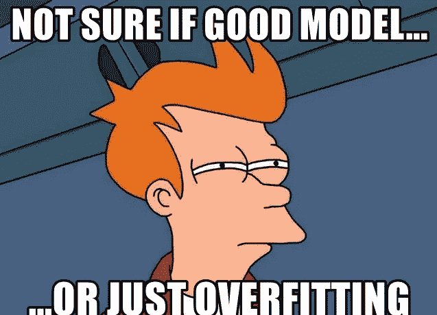
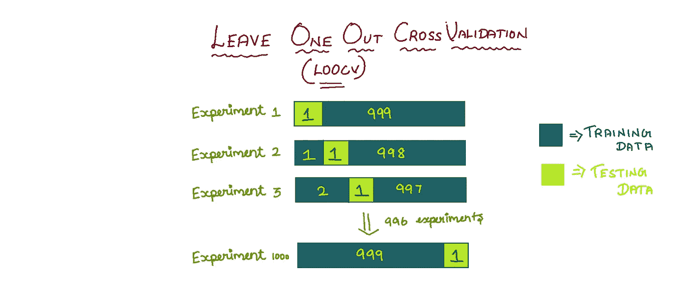
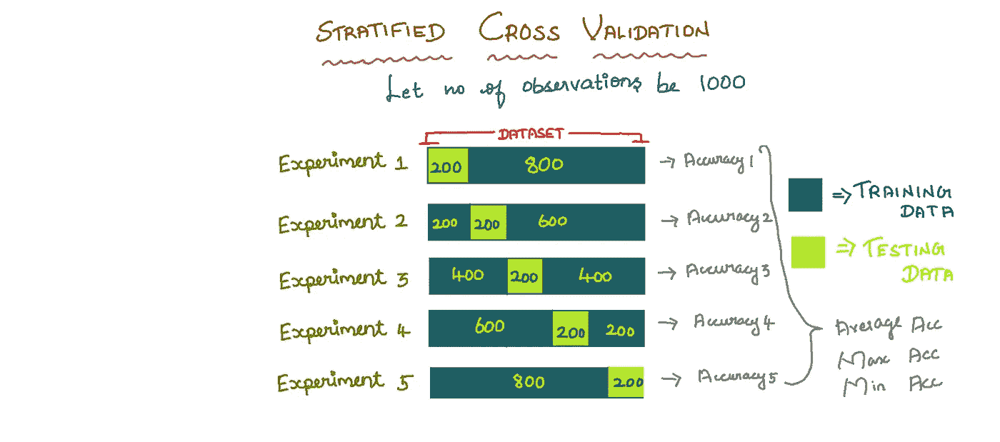
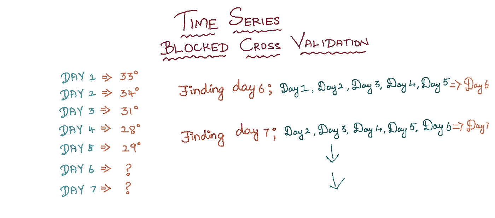
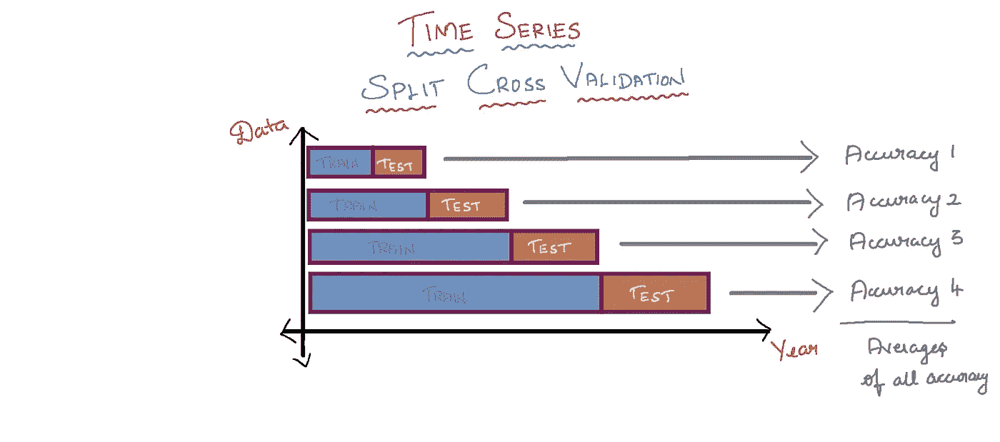

# 交叉验证和类型

> 原文：<https://medium.com/nerd-for-tech/cross-validation-and-types-a7498a68f413?source=collection_archive---------9----------------------->

在这篇博客中，让我们来看看交叉验证及其类型。

当运行一个 ML 模型时，我们可能得到一定的准确度，例如让我们考虑 95%。我们将向经理报告，我们的模型给出了这种准确性，但同一模型在客户面前运行时可能给出 93%。所以我们不能为我们的模型确定特定的准确性，为了解决这个问题，我们使用交叉验证**。**

当我们做训练测试分割时，我们使用**随机状态**变量。当随机状态值改变时，精度也会改变。

**交叉** - **验证**是一种重采样技术，通过使用数据子集构建多个模型来评估 ML 模型。同时，交叉验证有助于防止**过度拟合。**

# 交叉验证的类型:

## **漏项交叉验证:**

LOOCV

顾名思义，在这种类型的交叉验证中，我们将单个观察值作为测试集，其余的观察值作为训练集。

**缺点:**

1.  如果数据集大小为 1000，我们需要执行 1000 次实验，这需要很高的计算时间和空间。
2.  这将产生低偏差。

> “没有人使用这种类型的 CV，但您仍然可以将这种类型的 CV 用于小型数据集”

## k 倍交叉验证:

k 倍交叉验证

在这种类型的数据集中，我们将数据集分成 k 个折叠(部分/截面)。在我们的第一次迭代中，在 k 个折叠中，一个折叠被认为是测试集，其他 k-1 个折叠被认为是训练集。

在第二次迭代期间，在第一次迭代期间作为训练集的其它折叠被选择作为测试集，并且其它 k-1 个折叠被认为是训练集。因为我们有 k 个折叠，我们将执行 k 次迭代，每次迭代(实验)将给出每个精度。所以我们会达到 k 精度。根据这些精度，我们可以计算出最大、最小和平均精度。

**缺点:**

在一些实验的训练数据中，如果其中一个类较多，那么这个实验(模型)可能会有偏差。因此分层交叉验证应运而生。

> “最常用的交叉验证”

## **分层交叉验证:**

你可能会感到困惑，为什么我上传了相同的图片，但分层和 k 折叠交叉验证的标题不同，但这两种类型的简历以类似的方式工作。唯一的区别是，每当测试训练分割完成时，变量中类的比例将在测试训练集中平均分配。所以测试列车分裂是平衡的。因此，通过分层交叉验证解决了 k 折叠的缺点。

## 被阻止的时间序列交叉验证:

时间序列阻止交叉验证

从上图可以清楚地看到，我们 a 固定了一个 n(要考虑的天数，在上图中是 5)。使用这 n 个时间序列数据，我们将预测接下来的 n+1 个数据。这就是阻塞交叉验证的工作方式。

**优点:**

1.  更多分裂。
2.  防止数据泄漏到模型中。

**缺点:**

1.  可能计算量非常大。

## **分割时间序列交叉验证:**

在测试集始终领先于训练集的条件下，在每次迭代中将数据集分成两部分。在每次迭代中，我们的训练数据都会增长。

**亲:**

1.  更多分裂
2.  可以观察不同日子模特的表现。

**缺点:**

1.  未来的数据泄漏是可能的

希望这个博客有用，谢谢。