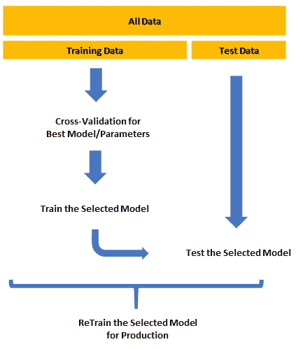
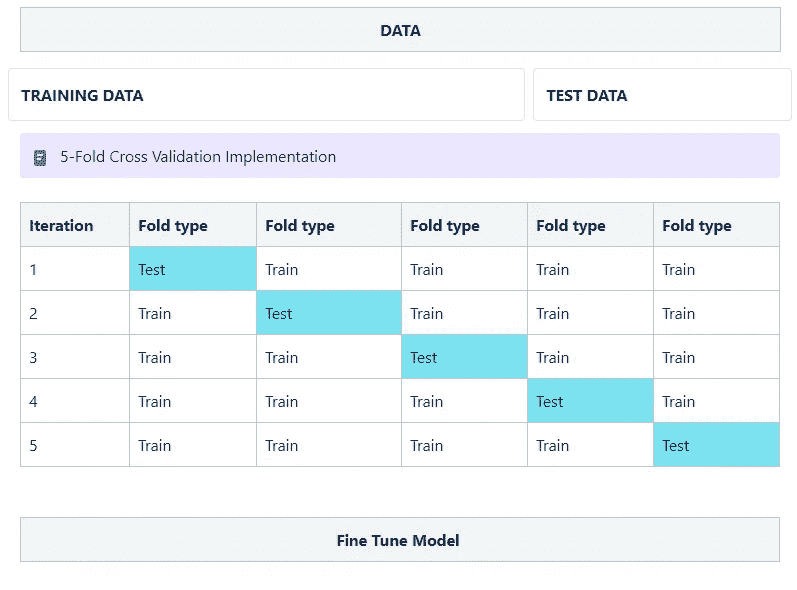
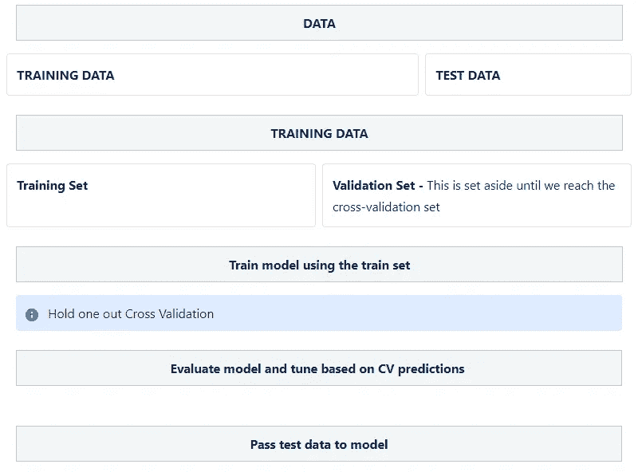
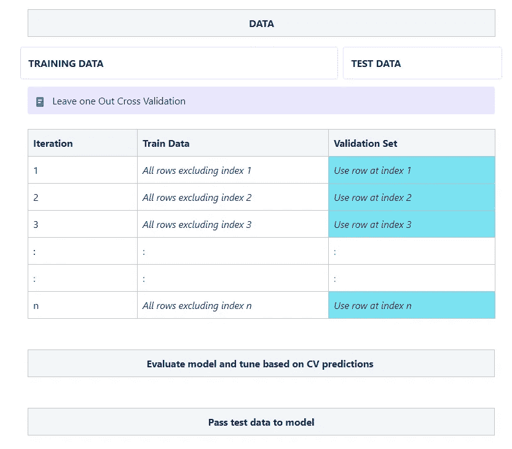

# 统计模型中的交叉验证

> 原文：<https://medium.com/nerd-for-tech/cross-validation-in-statistical-models-60d6ed4058c4?source=collection_archive---------18----------------------->

机器学习的最终目标是创建一个可以解决业务问题或充分解决特定问题的模型。在这种情况下，模型是一个具有已定义参数的通用函数，用于进行预测。

当处理机器学习问题时，建议应该包括验证步骤，该步骤使用已经搁置的验证数据来评估模型如何处理看不见的数据。验证数据上的模型性能允许我们微调模型参数。这种意义上的微调包括:从模型函数中移除某些特征、添加或移除某些特征的权重以及添加新特征。

交叉验证步骤就在我们将模型暴露给测试数据之前。在将数据分割成训练和测试数据的过程中，我们添加了一个额外的步骤，将训练数据分割成训练集和验证集。

在完成数据探索特征选择和模型训练之后，我们接着进行交叉验证。我们将模型预测值与实际值进行比较，如上所述，我们利用这些信息对模型进行微调。

现在我们已经了解了验证步骤的作用，我们可以研究一些类型的交叉验证。

**K 倍交叉验证**

在 K 倍交叉验证中，训练数据被分成 K 倍。交叉验证步骤运行 k 次，并且在每个阶段，k-1 个折叠用于训练，而剩下的一个被搁置并用于验证。

对于均方误差是用于估计模型的方法的线性回归应用，我们使用每一步产生的 k 个均方误差的平均值。

**撑出法**

这是最常用的交叉验证类型，因此我在上面的交叉验证定义中使用了它。为了重复，当使用保持方法时，训练数据被进一步分成验证集，并且交叉验证步骤被运行一次。

举行一个简历的步骤

保持一的优点是，与其他方法相比，它的计算量较小。

**留一条出来的方法**

在这种情况下，我们使用训练数据中排除的每一行，然后使用排除的那一行作为验证集。结果，交叉验证步骤运行 *n 次*，并且每个步骤的验证集的大小是一行。*注意，在这种情况下，n 代表数据集的长度/大小。*

值得注意的是，这种方法的计算成本很高，因为该步骤需要运行与数据大小相同的次数，因此在大型数据集上实施该方法效率不高。

**分层 K 折交叉验证**

分层交叉验证进一步扩展了我们对 K-fold 验证所做的工作。这种情况下的不同之处在于，在分裂 k 倍的过程中，我们注意到训练数据中存在的不平衡，并且我们试图保留这些变化，以便保持训练数据的代表性。

交叉验证是机器学习过程中不可或缺的一部分，我希望这篇文章有助于澄清这个话题上任何挥之不去的问题。

干杯。