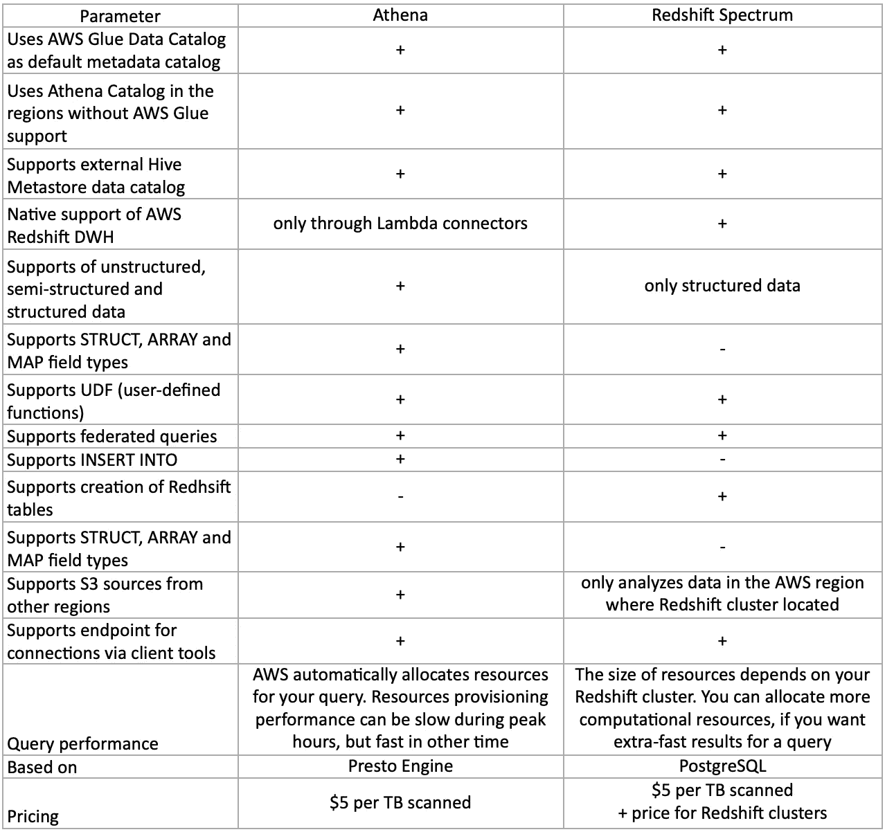

# 跨越 t:雅典娜与红移光谱

> 原文：<https://medium.com/nerd-for-tech/crossing-the-ts-athena-vs-redshift-spectrum-ee03cbcf0554?source=collection_archive---------2----------------------->

照片由[耶鲁安穴獭](https://unsplash.com/@jeroendenotter?utm_source=medium&utm_medium=referral)在 [Unsplash](https://unsplash.com?utm_source=medium&utm_medium=referral)

Amazon 为查询位于数据湖中的数据提供了两种不同的托管服务。标题是自动气象站雅典娜和自动气象站红移光谱。这两种服务都以相同的价格提供了类似的 SQL 查询数据管理工具，但都有一些与众不同的特性。我准备了这篇文章来帮助您决定在您的数据项目中使用什么。

这两个服务都提供了对 AWS 粘合数据目录(以及实际位于粘合数据目录下的外部 Hive Metastore)的完全支持。在某些地区没有使用 Glue 的选项，但是这些地区的两个工具的用户可以使用 Athena Catalog 来代替。

作为红移家族的一部分，红移光谱本身支持与红移星团的连接。相反，雅典娜只能通过 JDBC 连接器来处理红移。[这里](https://docs.aws.amazon.com/athena/latest/ug/athena-prebuilt-data-connectors-jdbc.html)是 AWS 提供的关于这个话题的附加信息。

Athena 支持其他数据类型，包括 STRUCT、ARRAY 和 MAP。这使得 Athena 能够处理非结构化和半结构化数据(如 JSON、Avro 等)。)以及结构化数据。这个特性对于探索数据湖至关重要。同时，红移谱只能操作结构化数据，并且只适合那些使用红移数据仓库的人的日常需求。

在选择查询数据的服务时，还有一点需要记住。Athena 能够处理来自不同区域的 S3 存储桶，而 Redshift Spectrum 只能从该区域内的存储桶加载数据。这两种服务的价格是一样的——扫描每 TB 5 美元。红移光谱仅在 AWS 帐户中与红移集群并行提供，这将需要额外的费用。

这些是表视图中两种服务最重要的特性。请随意分享:

Athena 与红移光谱比较