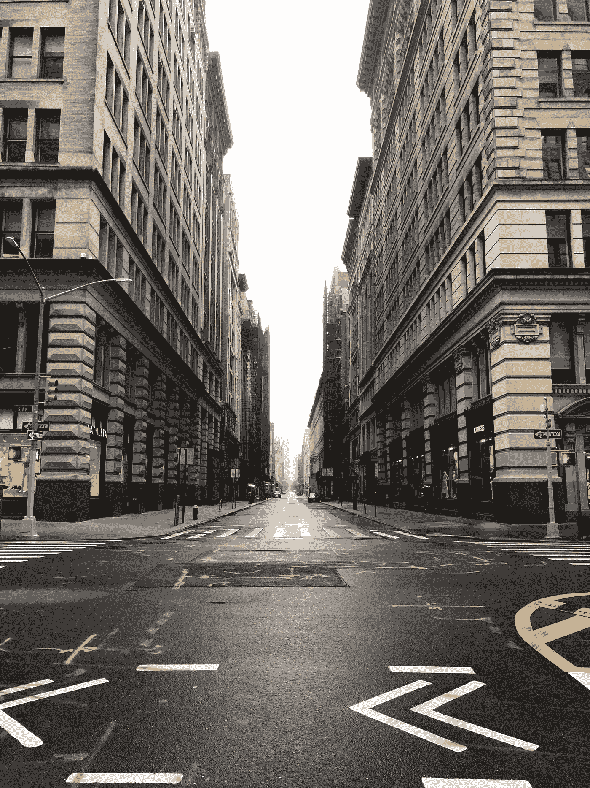
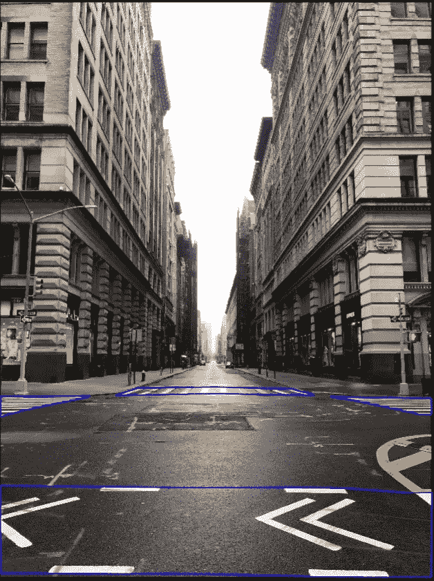
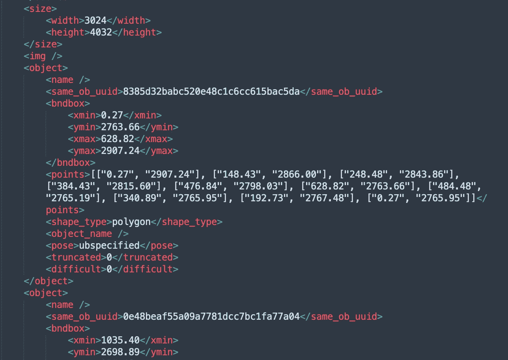

# 人行横道注释案例研究

> 原文：<https://medium.com/nerd-for-tech/crosswalk-annotation-case-study-d9de2a5ab82a?source=collection_archive---------0----------------------->

在 20 世纪初，英国人设计了一种街道上的水平交叉路口。行人过街时，只能在人行横道上行走。因此，在城市的街道上出现了一系列引人注目的线条，看起来像斑马身上的白色条纹，所以人们称之为斑马线。当司机看到这些白线时，他或她会有意识地减速或停车，让行人安全通过。

但是辅助驾驶或者自动驾驶如何识别这些静止的物体呢？

比如孩子第一次过马路，父母会告诉他什么是红绿灯，什么是斑马线。这是自动驾驶算法之前必须要做的基础数据处理。

带注释的图像作为现实参考，告诉自动驾驶算法什么是红绿灯，什么是斑马线。通过对数百万张图像的学习，自动驾驶算法不断深入学习，自我修正。

我们来看一个人行横道标注的案例。

**1 项目描述**

用 2D 包围盒标记可见的人行横道

**2 人行横道类别**

人行横道分为人行横道和垂直人行横道

(1)人行横道

(2)垂直人行横道

**3 人行横道分类**

从高到低有三个原则:

(1)视野内只有一条人行横道时:应标注为人行横道。

(2)与本车车道平行的人行横道为人行横道，与当前车道垂直的为垂直人行横道。

(3)车辆在路口转弯时，根据人行横道线与图像横轴的夹角，小于 45 度时为垂直人行横道，大于 45 度时为人行横道。

**4 标签要求**

(1)人行横道应分为人行横道和垂直人行横道。并对所有符合标注条件的人行横道进行标注。

(2)所有最短边超过 10 个像素的人行横道。

(3)包围盒应该匹配目标的轮廓。并且被遮挡的部分也应该被标记。

**5 种特殊场景**

**人行横道部分被遮挡时的标注**

(1)人行横道的一个端点被遮挡:不标注被遮挡物体。

(2)中间被遮挡:用想象给被遮挡的物体贴上标签。

**人行横道模糊时的标注**

(1)对于车辆行驶造成的磨损，想象并标注完整区域。

(2)旧的人行横道痕迹要贴标签。

## 您可以手动配置和 ByteBridge 注释

## 输出

ByteBridge 人行横道数据注释

字节桥人行横道输出 JSON

## 结束

把你的数据标注任务外包给 [ByteBridge](https://tinyurl.com/2487r96j) ，你可以更便宜更快的获得高质量的 ML 训练数据集！

*   无需信用卡的免费试用:您可以快速获得样品结果，检查输出，并直接向我们的项目经理反馈。
*   100%人工验证
*   透明标准定价:[有明确的定价](https://www.bytebridge.io/#/?module=price)(含人工成本)

## 为什么不试一试？