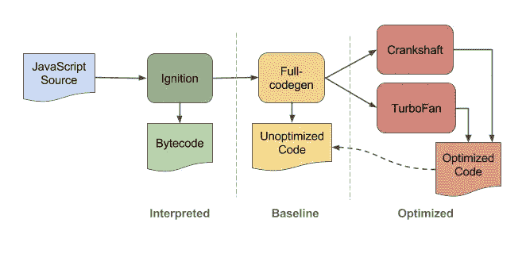

# 关于 JavaScript 引擎的重要事实

> 原文：<https://medium.com/nerd-for-tech/crucial-facts-about-javascript-engine-7b264c17f36d?source=collection_archive---------8----------------------->

# 介绍

JavaScript 引擎正在遵循 ECMAScript 标准。这些标准的工作是给出一个定义，JavaScript 引擎应该如何工作。它还说明了它应该具有什么样的特征。
如果泛泛而谈，JavaScript、C 等高级语言已经从机器语言中抽象出来了。与 C 或 C++相比，JavaScript 是从机器层面抽象出来的。C 和 C++更接近于硬件，这是它更快的原因。

在开始 Js 引擎之旅之前，我们应该知道 Js 引擎的确切位置。

浏览器最重要的两个部分是 JavaScript 引擎和渲染引擎。

**Blink** 是一个渲染引擎，负责整个渲染管道，包括 DOM 树、样式、事件和 V8 集成。

V8 是 Google 开发的 Javascript 引擎，现在在 NodeJs 和 chrome 中使用，关于 V8 Js 引擎将在本文后面讨论。

# 编译和解释

编译和解释是编程语言实现的两个原则，它们在某些情况下也是相互关联的。

如果我们谈论 JavaScript 的范畴，那么从技术上来说，它同时属于解释的和编译的。今天的现代编译器，如 *JavaScript 引擎*，它们执行运行时发生的**实时(JIT)** 编译。

# 准时制

jit 编译器的伟大之处在于，一旦代码开始运行，它就可以优化它，jit 根据 JIT 实现一次又一次地运行相同的代码，每次输出都可以针对每个用户进行不同的优化。

因此，一般来说，每个浏览器和运行时可能都实现了它们的 JIT 编译器版本，但是理论和结构通常都是相同的。JIT 编译器应该遵循相同的结构:

*   解释和执行是在低级字节码中完成的，因为它有一个点火解释器。尽管这些低级字节码比机器码更慢、更小，但它们需要的编译时间更少。为了生成未优化的代码**，可以使用全代码编译器**，与其他编译器相比，它运行得更快。涡轮风扇，JIT 编译器将编译代码，它还关注代码，如果它在整个 JavaScript 执行中被多次使用。
    其中的对象由**垃圾收集器**观察，包括不再被引用的数据。这种数据的收集由这个收集器完成。在执行垃圾收集周期时，V8 引擎会自动停止程序的执行。

**监视器或分析器**

基本思想是尽可能避免重译。首先，分析器只是通过解释器运行代码。在执行过程中，分析器跟踪运行几次的热代码段和运行多次的热代码段。

**基线编译器**

JIT 将热代码段发送给基线编译器，尽可能重用编译后的代码。

JIT 还将热代码段发送给优化编译器。该编译器使用解释器收集的信息来(a)做出假设和(b)基于这些假设进行优化。

然而，如果这些假设无效，优化编译器会执行**去优化**，这意味着它会丢弃优化后的代码。

# V8 JavaScript 引擎

*终于，现在我们能够理解什么是 V8 发动机了，我们走吧……*

[V8](https://v8.dev) 是 Google 开源的高性能 JavaScript 和 WebAssembly 引擎，用 C++编写。它被用于 Chrome 和 Node.js 等。

*   点火将 AST 翻译成字节码。然后执行字节码序列，并通过内联缓存收集反馈。这种反馈被(a)点火本身用于随后的解释和(b)涡轮风扇发动机用于推测性的优化。
*   基于反馈，涡扇通过将字节码翻译成特定于架构的机器代码来推测性地优化字节码。

*让我们探索点火和涡轮风扇*

## 点火

*   Ignition 有助于减少代码长度，提高脚本的执行速度。它将字节码大小减少了 25%到 50%，为 V8 编译器打开了新的大门，并帮助低内存 Android 设备运行更流畅。
*   无需在编译期间重新解析 Javascript。这意味着有了字节码，涡扇的去优化不再需要源代码。
*   它将每个 Chrome 标签的内存减少了 5%左右，累计起来，尤其是当你运行的设备没有这么大的内存，同时还要处理大量打开的标签时。

## 涡轮风扇发动机

涡扇管道遵循一些步骤将字节码翻译成机器码。基于点火收集的反馈来执行流水线中的优化。

*   涡扇发动机的在线 JIT 式编译和优化完成了 V8 从源代码到机器码的翻译。
*   涡扇优化了峰值性能、静态类型信息使用、编译器前端、中间和后端的分离以及可测试性。这种高潮的一个关键贡献，叫做一个**海**(或**汤**)的节点。

有时，我们可能有重复的代码块。JavaScript 编译器运行反馈，并为正在执行的代码收集分析数据。如果遇到每次都用相同类型的参数调用并且调用了多次的函数，这个代码会通过涡扇。涡扇发动机产生高度优化的机器级代码，直接在 CPU 上运行热代码。只有当 JS 发动机检测到一个热代码时，涡扇发动机才会启动。当一个代码经常运行、在循环中运行等时，它就是热的。编译后的代码有直接的 CPU 指令，速度相当快。

# JavaScript 运行时

如果我们将 JavaScript 与其他编程语言进行比较，就会发现它们并不相似。它在运行时是单线程语言。这意味着代码执行完毕，但每次只执行一部分。因为代码是按顺序执行的，所以任何花费更长时间的代码通常会阻塞在那之后需要执行的其他代码的路径。所以有时你会在使用谷歌浏览器时看到下面的屏幕。

当你在浏览器上打开任何一个网站时，它都会使用 JavaScript，一个单独的执行线程。这个单线程负责处理所有事情，比如滚动网页、在网页上打印内容、监听 DOM 事件以及做其他事情。

一旦 JavaScript 停止执行，浏览器将自动停止执行这些操作。这意味着它将简单地停在一个点上，换句话说，停在一个点上，在任务完成之前不会对任何事情做出反应。

# 结论

*   Node.js 是一个基于 Chrome 的 **JavaScript 运行时**构建的平台，用于轻松构建快速、可扩展的网络应用。Node.js 使用事件驱动的非阻塞 I/O 模型，这使得它轻量级且高效，非常适合跨分布式设备运行的数据密集型实时应用程序。
*   Node.js 包含 libuv 来处理异步事件。V8 为 JavaScript 提供了运行时

我希望你在这里学到了新东西。

谢谢你的 time☺️

如果您有任何与 JS 相关的疑问，请随时联系社交媒体

https://instagram.com/rkstarji?igshid=j6twh39s09n9

【https://twitter.com/RkStarJi 