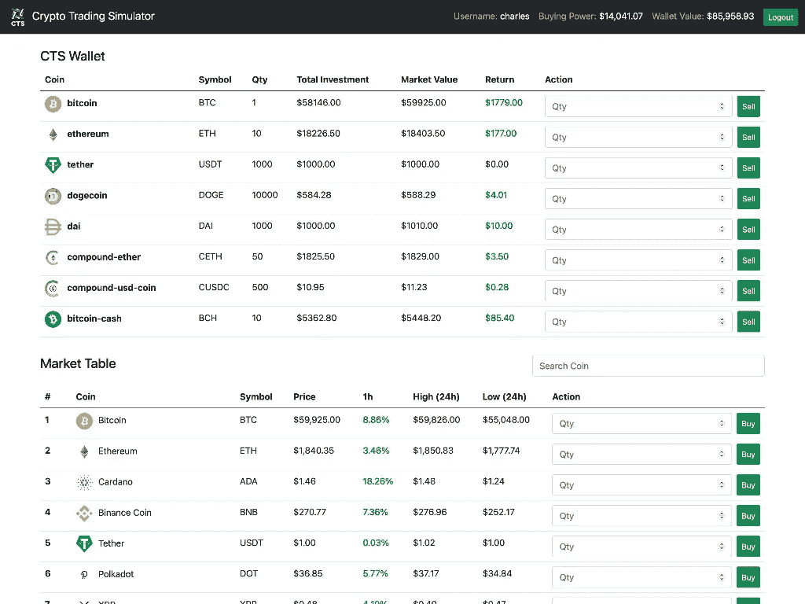
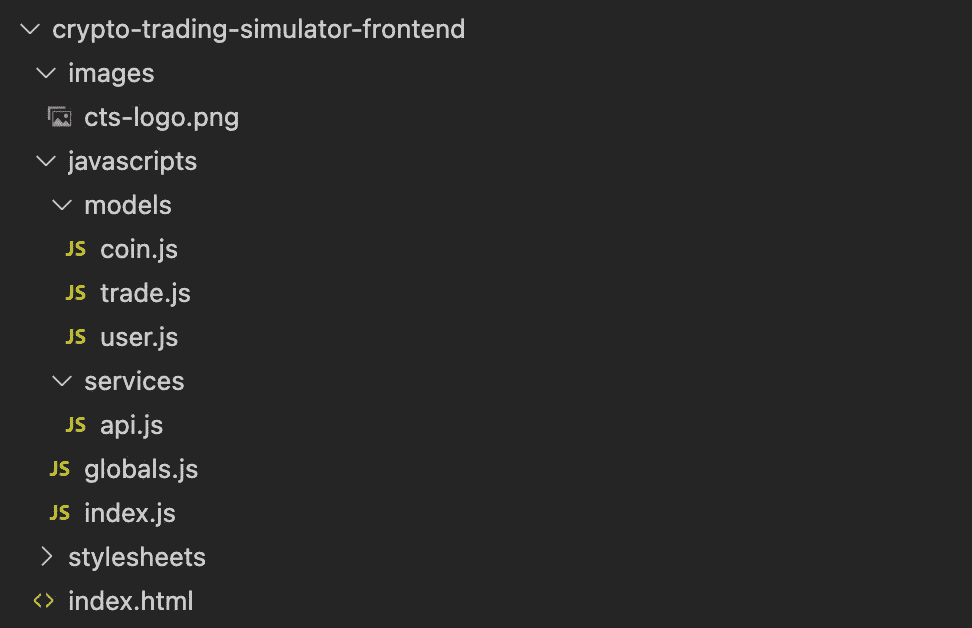
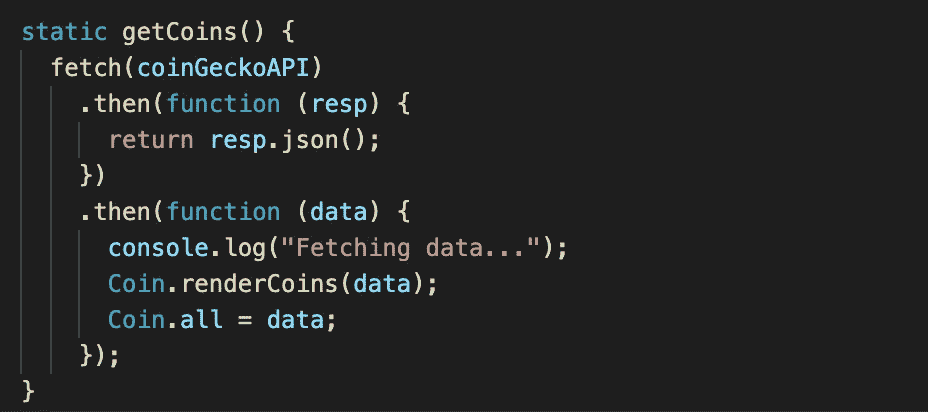
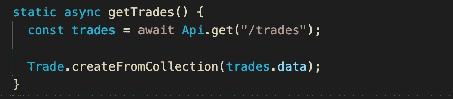
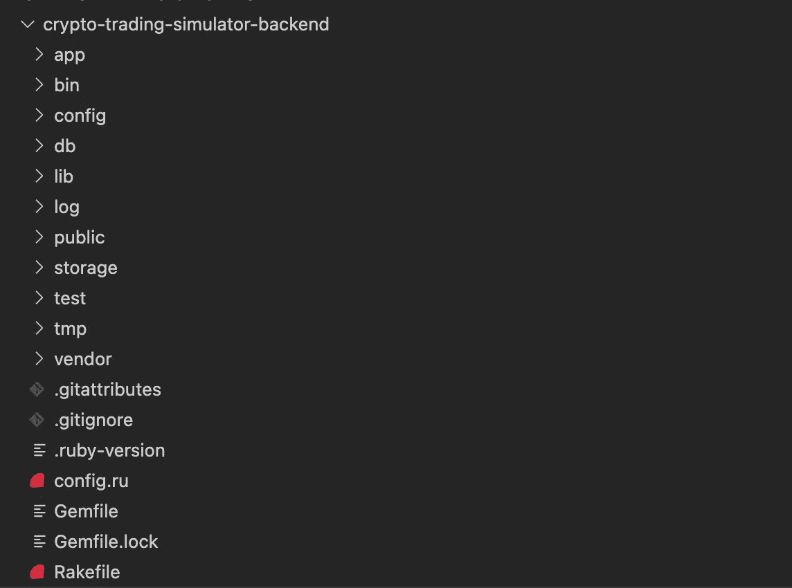
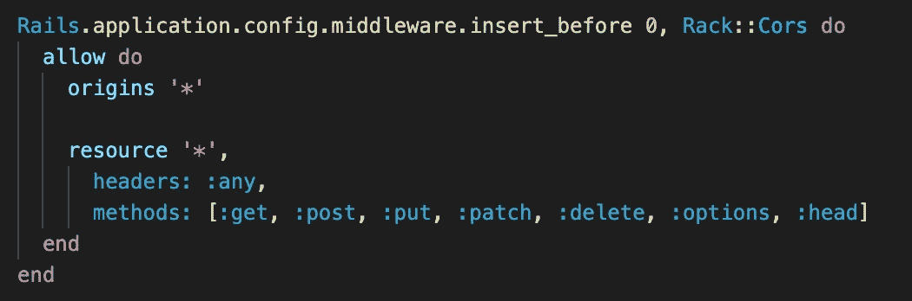
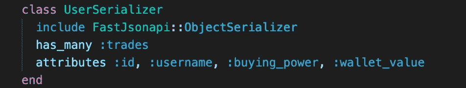
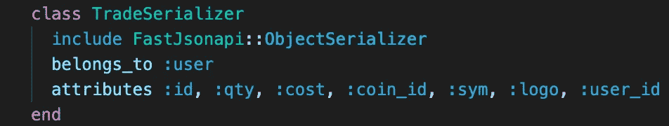

# 加密交易模拟器:JavaScript 项目

> 原文：<https://medium.com/nerd-for-tech/crypto-trading-simulator-javascript-project-23696bf89f91?source=collection_archive---------18----------------------->

Flatiron 软件工程训练营第四阶段的最后一个项目是利用 HTML、CSS 和 JavaScript 构建一个单页面应用程序(SPA ),并使用 Ruby 和 Rails 构建一个后端 API。对于这个项目，我们将恢复我们在 Flatiron 软件工程训练营第一阶段构建的 CLI 项目， **CyptoStats** ，，并使用相同的 API，将其转换为加密货币交易模拟器！



# 项目要求

1.  该应用程序必须是 HTML、CSS 和 JavaScript 前端，带有 Rails API 后端，客户端和服务器之间的所有交互都使用 AJAX 异步处理，发送回的数据呈现为 JSON 格式。
2.  JavaScript 应用程序必须使用面向对象的 JavaScript 来封装相关的数据和行为。
3.  Rails 后端服务的域和模型必须包含一个至少有一个多对多关系的资源。(例如:用户有许多帖子或照片的相关模型)
4.  后端和前端必须协作，通过至少 3 个 AJAX 调用来演示客户端-服务器通信，包括至少 2 个*创建、读取、更新、*和*删除* (CRUD)操作。

# 项目概述

Crypto Trading Simulator (CTS)是一个模拟加密货币交易平台的 JavaScript web 应用程序。这个 web 应用程序使用 CoinGecko API 来获取市场上排名前 100 位的加密货币的最新市场数据。然后，市场数据被呈现到 web apps 市场表中，该表会定期更新数据。用户被给予 100，000.00 美元(假币)作为他们的初始购买力，他们可以使用该购买力以当前价格买卖加密货币。购买的每枚硬币都存储在 Rails 后端 API 中，并呈现在用户的钱包表中，该表显示了硬币(加密货币)购买时的价格和数量，以及该硬币在市场上的当前价值，以及出售后的计算回报。

# 前端

前端文件结构将按如下方式分离:



加密交易模拟器前端

## 向 CoinGecko 的远程 API 发送获取请求

在我们的 **coin.js** 中，我们将向 CoinGecko 的远程 API 发送获取请求，接收到的数据将呈现到我们的市场表中，并存储到静态变量中，如下所示:



硬币. js

## Ajax 调用

我们将创建一个名为 **api.js** 的 JavaScript 文件来动态处理我们的 Ajax 调用。我们的前端 JavaScript 模型 **user.js** 和 **trade.js** 将利用该类向我们的服务器发送获取请求，服务器将负责我们的*创建、读取、*和*更新* (CRUD)操作。

api.js

可以使用 ***async*** 和****await****和/或***在我们的每个 JavaScript 前端模型中获取请求。然后用下面的*** 方法创建我们的 JavaScript 对象实例。**

****

**使用异步和等待提取**

****

**使用获取。then 方法**

# **后端**

**后端结构将使用以下命令生成:**

```
**$ rails new crypto-trading-simulator-backend --api$ rails g scaffold user username buying_power:decimal wallet_value :decimal$ rails g scaffold trades coin_id user_id:integer sym qty:integer cost:decimal**
```

**这应该会在 API 模式下生成我们的后端结构，生成我们的模型和迁移文件，以及我们的控制器和代码，这些代码会自动以 JSON 的形式呈现我们的数据。**

****

**加密交易模拟器后端**

## **使用机架 CORS 将域列入白名单**

**我们将利用机架 CORS 将允许连接到我们服务器的域列入白名单。这应该已经在我们的 Gemfile 中注释掉了，所以我们需要做的就是在里面注释并运行`bundle install`。**

```
**// Gemfilegem 'rack-cors'**
```

**然后，转到**/config/initializers/CORS . Rb****

**在中注释下面的代码，并将我们的 origins 设置为* (all)，因为我们现在将通过本地服务器运行它。**

****

**这将接受来自所有域的所有传入请求。通常你会添加你的网页应用程序所在的域名(例如:Heroku)。**

## **用快速 JSON API 序列化我们的数据**

**我们将利用 Fast JSON 来序列化呈现到我们的 API 中的数据。我们需要将它包含到我们的 Gemfile 中并运行`bundle install`。**

```
**// Gemfilegem 'fast_jsonapi'**
```

**然后，我们可以使用 rails 通过以下命令生成我们的序列化程序:**

```
**$ rails g serializer User name buying_power:decimal wallet_value:decimal$ rails g Trade coin_id user_id:integer qty:integer cost:decimal**
```

**并添加我们的关联和属性，如下所示。**

****

**user_serializer.rb**

****

**trade_serializer.rb**

# **更多信息**

**有关该项目的更多信息，可以查看我的 [GitHub](https://github.com/charlesangelolai/crypto-trading-simulator) 。**

**关于这个项目如何工作以及它看起来像什么的视频演示，请点击这里。**