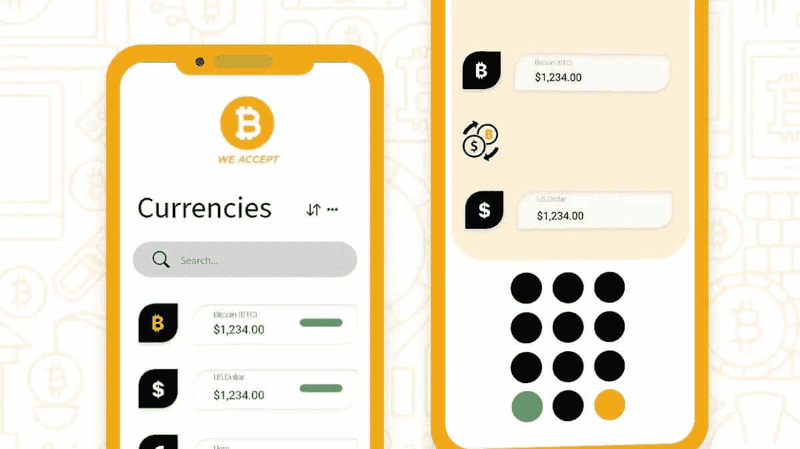

# 加密货币交易所应用程序开发利用数字货币的创业方式

> 原文：<https://medium.com/nerd-for-tech/cryptocurrency-exchange-app-development-entrepreneurial-way-to-leverage-digital-currencies-4546de68ca91?source=collection_archive---------13----------------------->

照片由:米兰在:自我创造

你是一个总是寻找有利可图的商业点子来投资的资本家吗？还是想成为数字创业者的发烧友？

如果你对这些问题的答案是*是，*，那么请回答下一个问题。你喜欢看加密货币汇率每天如何变化，并向别人暗示哪一种是富有成效的吗？

新的加密交易平台的出现意味着加密货币是下一代交易的未来。因此，无论你是投资者还是企业家，越早采用加密文化越好。从商业角度来看——你可以像星巴克、微软、家得宝和全球超过 [15000 家企业](https://www.ceifx.com/news/who-accepts-bitcoin-and-ether-cryptocurrencies)一样开始接受加密货币。或者可以投资创建自己的加密货币交易平台。

在本帖中，我们将讨论如何为初学者设计加密货币应用开发路线图。因为加密交易商正在兴起，他们总是需要一个更新的、可访问的交易所来进行数字货币交易。另一方面，通过 [**开发一个比特币交易应用**](https://kodytechnolab.com/blog/bitcoin-exchange-app-development/) ，你可以从不止一个收入来源获得收入，即增加或列出新的加密货币、免费增值&高级版本、附属广告等等。

这使得加密货币交易所的开发成为一种面向未来的商业理念。让我们来看看一些疯狂的加密货币统计数据。

*   每天，社交媒体上有 28866 条与比特币相关的帖子被更新，每小时约 1203 条，每分钟约 20 条！帖子越多，知道加密货币的人就越多。
*   加密货币总市值的 88%是由前十种加密货币构建的。
*   2020 年加密货币交易所数量超过 300 家。
*   币安一直是领先的加密货币交易所，2021 年[24 小时交易量为 28.85 美元](https://www.statista.com/statistics/864738/leading-cryptocurrency-exchanges-traders/)。
*   市场上的比特币数量平均每天增加 144 个，每个比特币投入流通的数量为 6.25 个。
*   2021 年，Q1 每天的比特币交易量接近 40 万。

许多统计数据证明，创建加密货币交易所的最佳方式是现在。在开发像比特币基地这样的应用程序之前，你需要考虑以下因素。

# 在开始比特币交易所应用程序开发之前，需要思考的事情

*   **交易平台的类型**

您选择的加密货币交易所类型也会影响开发加密货币交易所的成本。原因是，每种加密交换类型都有其不同的开发要求，因此成本也不同。您可以从市场上提供的以下加密交换选项中进行选择。

*   集中式密码交换机
*   分散加密交换
*   混合密码交换机
*   订单簿加密交换
*   对等加密交换
*   基于 Ads 的密码交换
*   **概述完成交易的特征**

功能对于任何软件都是至关重要的，你必须根据你的加密交换类型来规划它们。开发人员通常需要更多的时间来创建复杂且特定于您的平台的功能。因此，据说，功能的复杂性和数量可能会影响开发预算——恰恰是当你打算在移动和网络上拥抱观众的时候。但是，有些组件是所有类型的加密交易平台的标准组件，例如:

*   了解您的客户和反洗钱(KYC 和反洗钱)整合
*   加密货币钱包开发或整合
*   贸易引擎
*   双因素认证
*   用户友好的仪表板
*   订单系统
*   货币兑换对
*   区块链技术集成
*   自定义管理面板
*   **开发加密货币兑换应用的预算和时间。**

时间和预算是相互关联的。假设您想要在 15 天内构建并发布您的交换平台。您的开发人员必须像狗一样在项目中工作，以提供一个安全的交易所，准备在 15 天内运行。为了优先考虑你的项目，他们可能会要求更高的价格。因此，你需要平衡时间和预算的关系。

此外，项目不是在启动时结束，而是开始。维护无缝交换平台以简化用户体验是您的责任。为此，你需要留出一笔预算来保证你的加密交换没有错误或漏洞。既然我们在讨论预算，你也应该考虑一些一般性的开支，比如:

*   您的加密交换的法律合规性
*   经营交易所的许可证
*   支付处理
*   与其他交易所联网以提高流动性
*   高效的客户支持
*   **是收购白标解决方案还是从头开始**

如果你梦想拥有一个加密交易所，你可以购买现成的解决方案或者从头开始开发。使用白标解决方案，您的 exchange 将立即启动并运行。然而，现成的解决方案提供有限的定制，您可能不得不接受它的设计方式。您将为每张账单上的附加功能支付额外费用。

相反，从头开发一个加密交易平台需要专业的开发团队、时间和资源。尽管如此，有了这个选项，您可以按照您想要的方式构建您的交换。此外，您可以随时添加和删除任何功能。

*   **运营您的加密交易所的许可**

当你决定开始一个加密货币交易平台时，获得法律顾问是有利的。因为你需要了解监管制度，以便在你的目标地点注册和许可你的在线交易平台。它有助于您在当地政府和监管机构的监管下运营您的交易所。SEC、CFTC、SEBI、FCA 和许多其他监管机构针对不同的国家/地区。

*   **实施高安全性系统**

随着加密交易商的出现，加密恶意软件的数量也在增加。在这里，您需要遵守高科技安全标准，保护您的 exchange 上的用户数据。这里列出了使您的 exchange 免受网络攻击的强大安全功能。

*   HTTP 认证
*   生物认证
*   数据加密
*   双因素认证
*   SQL 注入预防
*   反拒绝服务(DoS)
*   跨站点请求伪造(CSRF)保护
*   服务器端请求伪造(SSRF)保护
*   托管服务
*   反分布式拒绝服务

# 开发一个比特币兑换 App 要多少钱？

加密交易所的类型和功能、开发团队、编程技术、第三方集成以及许多因素都会影响加密货币交易所的开发成本。考虑到所有的事情，点燃你自己的加密货币交易平台可能会花费你大约 30000 美元。

到此为止。你认为加密货币交易所的发展和预算值得你关注。对于任何技术和创业支持，你可以咨询一家 [**按需 app 开发公司**](https://kodytechnolab.com/on-demand-app-development) 。