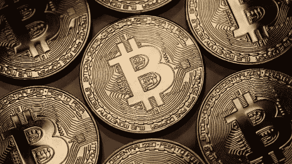
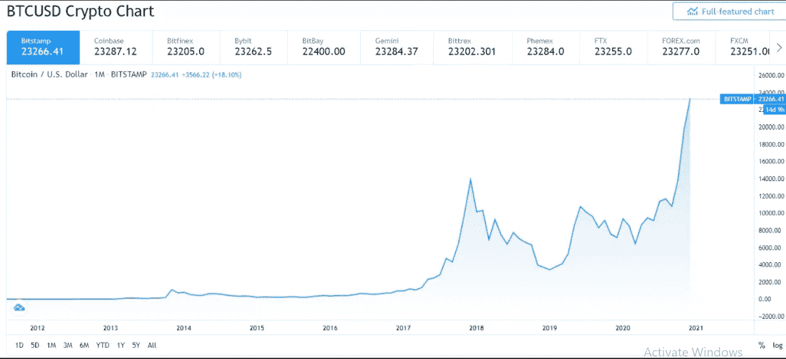
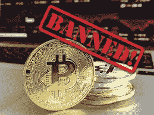

# 加密货币:未来

> 原文：<https://medium.com/nerd-for-tech/cryptocurrency-the-future-9a57fb78ecfd?source=collection_archive---------40----------------------->

加密货币，最近一段时间最著名的货币，可以被称为交易的未来。加密货币是一种虚拟货币。它于 2009 年推出，比特币成为第一种推出的加密货币。加密货币可以用来交换商品和服务。它使用区块链技术。区块链管理每笔交易的记录。

# 谁控制着加密货币？

需求最大的加密货币是比特币。比特币的价格是所有其他加密货币中最高的，如莱特币、系绳等等。加密货币由用户管理。加密货币的价格取决于其需求。任何机构都不能决定任何加密货币的价格。这取决于市场力量(需求力量和供给力量的交集)。我们都知道世界上有很多货币，它们由各自的国家控制，但这一事实在加密货币中并不成立。加密货币不受任何国家或任何政府机构的管理。它不遵循传统的银行体系。它从一个计算机钱包转移到另一个计算机钱包，交易由区块链(分散系统)管理。

# **加密货币的种类:**

有 5000 多种不同类型的加密货币。一些最受欢迎的加密货币包括比特币、比特币现金、莱特币和以太坊。所有这些类型的加密货币都有不同类型的协议和不同类型的价格。例如，莱特币(LTC)的当前价格是 12667.19 印度卢比，而比特币的当前价格是 2628937.20 印度卢比。

# **比特币的兴衰:**

比特币于 2009 年推出。它是全球市值最大的加密货币。自 2009 年以来，比特币的投资者经历了一次过山车式的投资。比特币的交易历史是最不稳定的交易历史之一。第一次价格上涨发生在 2011 年，比特币的价格从 2011 年 4 月的 1 美元跃升至 2011 年 6 月的 32 美元。从那天起，比特币的价格逐月上涨。2013 年成为对比特币需求最大的一年，在 2013 年 4 月的第一周，比特币从 13.40 美元飙升至 220 美元。但价格的上涨并没有持续多久，因为比特币面临着价格的巨大减速，2013 年 4 月中旬的价格为 70 美元。但是接下来还有更多。2013 年 10 月价格上涨，2013 年 12 月价格飙升至 1156.10 美元，2013 年底价格为 760 美元。这只是对一年的分析，你可以看到投资者在这一年面临的坎坷。从 2009 年到 2019 年，我们都见证了加密货币的兴衰。2020 年由于疫情，经济被关闭，这成为比特币增长的主要原因。2020 年，价格从 7200 美元开始，由于经济关闭和各种政府政策，比特币获得了更多的投资者，更多的投资者是比特币价格上涨的标志。正如预期的那样，2020 年 11 月底，比特币的价格为 18353 美元。从那时起，价格每天都在上涨，今天比特币的价格是 26，70，516.72 印度卢比。

**加密图表**

# 印度加密货币增长缓慢:

加密货币在世界范围内达到了很高的水平。自 2009 年以来，加密货币的价格涨幅非常高。但在印度，普通民众直到 2020 年 3 月才熟悉加密货币。2018 年 4 月，在数字货币被用于欺诈后，印度储备银行(RBI)禁止银行和其他受监管实体支持加密交易。2020 年 3 月，印度最高法院宣布该禁令违宪。它给出的理由之一是，加密货币尽管不受监管，但在印度并不违法。所以从那天起，加密货币开始在印度蓬勃发展。大量的人将他们的钱投资于比特币，并因此获得了巨额利润。但加密货币在许多其他国家仍被禁止，如阿尔及利亚、玻利维亚、厄瓜多尔、孟加拉国、尼泊尔等。而取缔的主要理由是，“加密货币不受监管”。禁止加密还有很多原因，例如在埃及，Dar al-Ifta(埃及伊斯兰咨询机构)认为加密货币可能会损害埃及的国家安全和经济健康。

加密货币是风险最高、回报最高的投资选择之一。像莱昂内尔·梅西、瓦列里·卡平和许多其他名人都在推广加密货币。

投资加密货币是有风险的，但通过对市场的正确分析，人们可以达到很高的高度，并可以赚很多钱。

# “比特币是伟大事物的开端:一种没有政府的货币，一种必要且势在必行的事物。”