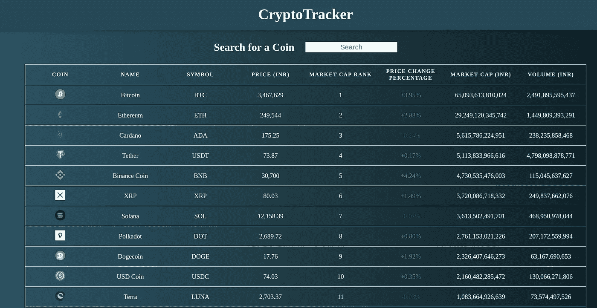
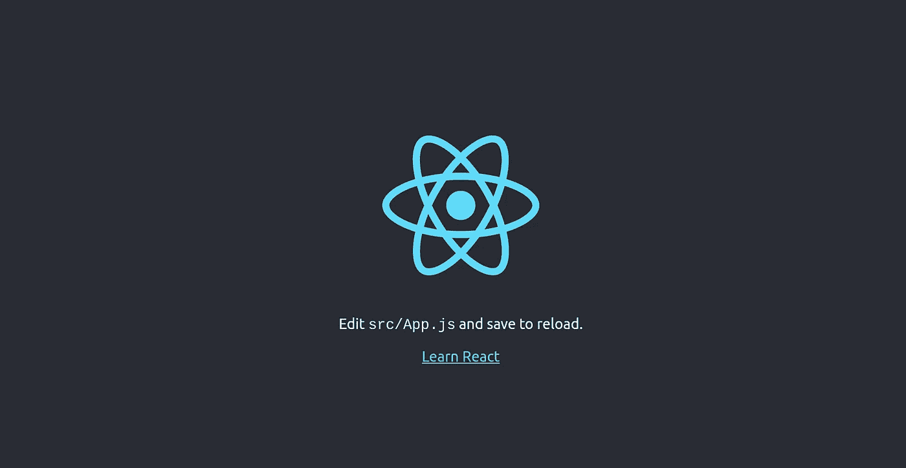
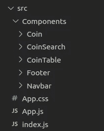
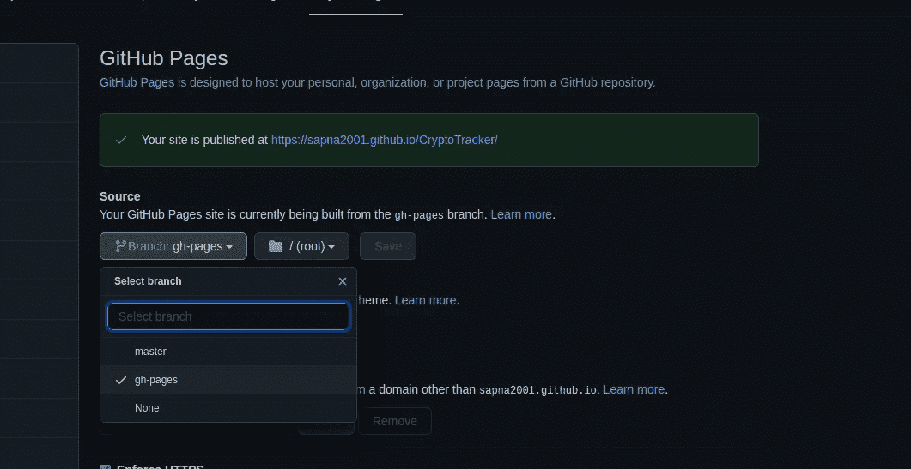

# 如何使用 React 构建一个密码追踪器

> 原文：<https://medium.com/nerd-for-tech/cryptotracker-using-react-61236abaab77?source=collection_archive---------1----------------------->

# 寻找一个快速和干净的反应项目？试试这个密码追踪器！



密码跟踪器

[CryptoTracker](https://trackercryptocurrency.netlify.app/) 是一个显示前 100 种加密货币的实时价值及其价格、价格变化百分比、市值和交易量的网站。它还允许用户搜索特定的硬币。

我们将在这个项目中使用 React 和 [CoinGecko API](https://www.coingecko.com/en) 。在这篇博客的最后，将讨论如何在 GitHub 页面上部署这个网站。

现在让我们开始吧🏃‍♀️.

# 入门指南

首先，在您的终端中运行以下代码并创建项目文件夹。

```
$ create-react-app crypto-tracker
```

完成后，在您的终端中运行以下代码行:

```
$ cd crypto-tracker$ npm start
```



这是 React 应用程序在本地主机服务器上的外观。

接下来，打开您的项目并删除 App.js 附带的默认内容。

创建一个组件文件夹来存储项目中要使用的各种组件。使用的组件有 Coin、CoinSearch、CoinTable、Footer 和 Navbar。在组件文件夹中，为每个组件创建文件夹。我们将在下一节详细讨论每个组件。



src 文件夹

# App.js 和 App.css

在 App.js 中导入所有需要的组件，并在适当的地方使用它们。

App.js

在正文中，您可以从 [uiGradient](https://uigradients.com/) 中选择一个令人惊叹的背景。我选择了月光下的小行星，你可以选择任何你喜欢的背景。

App.css

# 导航条

在 Navbar 文件夹中，创建 Navbar.js 和 Navbar.css 文件。

Navbar.js

Navbar.css

# 硬币

在 Coin 文件夹中，创建 Coin.js 和 Coin.css 文件。这是单独的列行。

硬币. js

Coin.css

# **可铸造的**

在 CoinTable 文件夹中，创建 CoinTable.js 和 CoinTable.css 文件。这里我们将创建一个显示所有硬币的表格。这里我们将使用 axios，这是一个用来创建外部呈现的 HTTP 请求的库。

在表格中，我们将显示以下信息:密钥、名称、硬币图标、符号、价格、总交易量、过去 24 小时的价格变化百分比、市值和市场排名。

**注:**API 可以针对所需的货币、每页硬币数等进行修改。

CoinTable.js

CoinTable.css

# 共搜索

在 CoinSearch 文件夹中，创建 CoinSearch.js 和 CoinSearch.css 文件。在硬币搜索中，搜索栏将与搜索硬币的表格一起出现。

CoinSearch.js

CoinSearch.css

# 页脚

在 Footer 文件夹中，创建 Footer.js 和 Footer.css 文件。

页脚. js

Footer.css

# 部署

现在加密跟踪器准备好了🎉。使用以下命令检查这一点:

```
$ npm start
```

我们也可以很容易地在 GitHub 页面上部署这个网站。唯一的先决条件是一个 [GitHub](https://github.com/) 账户。让我们看看这是如何做到的。

**步骤 1:** 将项目添加到 GitHub 存储库中。

**第二步:**打开你的 package.json，为项目添加一个主页字段。

```
"homepage": "https://username.github.io/project-name"
```

这里，“项目名称”是在线存储库的名称。

**第三步:**安装 gh-pages 并添加 deploy 到 package.json 中的脚本。

```
npm install --save gh-pages
```

或者

```
yarn add gh-pages
```

然后在 package.json 中添加以下脚本:

```
"scripts": {"predeploy": "npm run build","deploy": "gh-pages -d build",},
```

**步骤 4:** 通过运行 Deploy 命令部署网站。

```
npm run deploy
```

**步骤 5:** 确保 GitHub 项目设置中的 GitHub Pages 选项设置为使用 gh-pages 分支。



霍雷。！！现在网站上线了。

查看链接:[https://sapna2001.github.io/CryptoTracker/](https://sapna2001.github.io/CryptoTracker/)。

这就是我的观点，希望这篇文章对你有用😊。

请查看 [GitHub Repo](https://github.com/Sapna2001/CryptoTracker) 以作参考。请随意启动这个库⭐.

让我们在[Github](https://github.com/Sapna2001)/[LinkedIn](https://www.linkedin.com/in/sapna2001/)/[网站](https://sapna2001.github.io/Portfolio/)/[Twitter](https://twitter.com/Sapna_2001)/[Quora](https://www.quora.com/profile/Sapna-191)上连线；)

**如果你有任何建议，请随时通过**[**LinkedIn**](https://www.linkedin.com/in/sapna2001/)**&与我联系，评论区也是你的。**

如果你喜欢这个故事，点击拍手按钮，因为它激励我写更多更好的东西。