# CSS 更难记住的东西(如备忘单)

> 原文：<https://medium.com/nerd-for-tech/css-harder-to-remember-things-cheat-sheet-like-c5969c5a6c6?source=collection_archive---------0----------------------->

这是我尝试在一个地方放一些 CSS 代码(大部分是我经常忘记的代码)。这不是一篇关于如何做到这一点的文章，它更像是为已经知道的人准备的一份备忘单。

# 一些语法和需要记住的小事情:

```
<link rel="stylesheet" href="yourfile.css">background-image: **url**("...");Using overflow:auto will add a scrollbar to the div itself, not the page.
<div style="**overflow:auto;**">
   <div style="width:200%">huge</div>
</div>display:inline (like span, can't set size, stays in line)
display:block (like div, can set size, goes to next line)
display: **inline-block** (can set size, won't go to next line)<div style="border:deeppink solid 2px; **width: calc(100% - 200px)**">This div Knows math</div>
```

# 你可以在你的 CSS 文件中为不同的东西设置什么类型？

```
**p {…} (**all p selectors will get that.)**#myId {…}** ( elements with that ID, and there should be just on)**.someClass {…}** (all elements with class= “someClass”)**p.someClass {…}** (all p elements that have that class)***{…}** (all elements)**h1, h2, p {…}** (elements h1, h3, p)**div p {...}** (All p inside divs, anywhere inside)**div > p {...}** (all p directly under the divs - children)**div + p {...}** (ps **right after** a div, not inside, right after)**div ~ p {...}** (ps after a div, **doesn't have to be right after**, any p after a div)**p:first-child {...}** (any p that is the first child of any element)**p i:first-child {...}** (of i inside p, only the first one in each p)**p:first-child i {...}** (of the p elements that are 1sr child, all the i elements)**a[target] {...}** (all a elements that have a target attribut)**a[target = "_blank"]** {...} (as above, but they have _blank)**p [title~="flower"]** {...{ (p with title that contains flower)**p [class |=top]** {...} (p with class as top or top-somethingelse**p [class^ = "top"]** {...} (p with class starting with top)**p [class$ = "top"]** {...} (p with class ending with top)**p [class* = "top"]** {...} (p with class contains with top)**input [type="text"]** {...} (inputs of that type)
```

# 大小设置内容

**当您设置宽度和高度时，您只是在设置内容**。添加任何东西都会增加尺寸，除非使用边框。

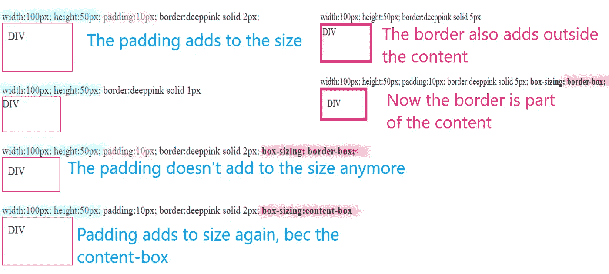

轮廓可能看起来像边框，但它并不相同。不过，你的设置方式是一样的。它将绘制在边框之外，您可以设置边框的偏移量。

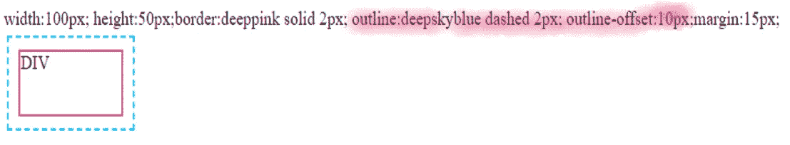

# 悬停时打开下拉菜单或其他东西

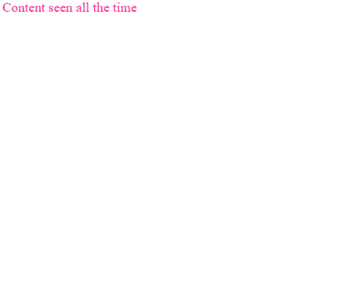

```
<head>
<style>  
   **.seenAllTheTime:hover  .notAlways**{
      **display: block;**
   }
   **.notAlways{
      display:none;**
   }
</style></head>
<body>
<div class="seenAllTheTime">Content seen all the time
   <div class="notAlways">I only show up sometimes and I have a picture <br/>
   
   </div>
</div>
```

# 转换

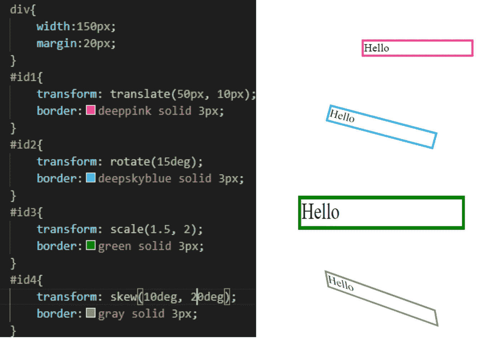

# 过渡

你可以有这个代码。它将改变悬停时 div 的宽度和颜色。它需要 2 秒才能开始，它会在 2 秒内改变到新的宽度，背景颜色需要 8 秒。

```
div {
   width: 100px;
   height: 100px;
   background-color: red;
   **transition: width 2s, background-color 8s;**
   **transition-delay:2s;**
}
**div:hover** {
   background-color: deepskyblue;
   width:150px;
}
```


它还具有改变转场工作方式的属性:

**过渡-定时-功能**:线性；(一路同速)
过渡-定时-功能:缓和；(慢、快、慢)
转场-计时-功能:淡入；(慢启动)
过渡-定时-功能:缓出；(慢尾)
过渡-定时-功能:渐进渐出；(缓慢开始和结束)

您可以将过渡与变换结合起来。添加变换和时间，然后悬停在变换。

```
div {
   width: 100px;
   height: 100px;
   background-color: red;
   transition: width 2s, height 2s, **transform 2s;**
}
div:hover {
   background-color: deepskyblue;
   width:150px;
   **transform: rotate(120deg);**
}
```

# 动画片

对于过渡，你需要一些东西来触发变化，比如悬停事件。对于动画，你不会。

在元素中指出它有什么动画，然后定义那个动画。在这种情况下，div 具有名为 example 的动画。

```
this animation will happen on load, after the animation the state will be back to the original one.  The div will go from pink to yello, in 4 secs, then back to pink. from means 0 and to means 100.div {
   width: 100px;
   height: 100px;
   background-color: deeppink;
   **animation-name: example**;
   **animation-duration: 4s;**
}@keyframes **example** {
   from {background-color: deeppink;}
   to {background-color: yellow;}
}
```

另一个例子，有更多的帧和延迟。

```
div {
   width: 100px;
   height: 100px;
   background-color: red;
   animation-name: example;
   animation-duration: 4s;
 **animation-delay: 1s;**}
**@keyframes example {
   0%   {background-color: red;}
   25%  {background-color: yellow;}
   50%  {background-color: blue;}
   100% {background-color: green;}**
}
```

可以设置**动画-延时:****-2s**；在 div 中，假设动画已经运行了 2 秒，那么起点将是第 2 秒的点。你也可以用 **animation-iteration-count 设置它应该运行多少次。使用值 infinite 让它永远运行。**

为了指示一个动画应该如何运行，你也有**动画方向(正常，反向，交替=向前，然后向后，交替-保留=向后，然后向前。)**

还有一个**动画计时功能**类似于过渡计时功能。

还有一个属性可以让您决定希望元素相对于动画具有的状态。A **动画填充模式:无**(默认)、**向前**(动画结束时保留值)、**向后**(保留第一个关键帧的状态)、**两个** ( **都有动画开始前第一帧的样式，动画结束后最后一帧的样式**

# 假装这是一份报纸

要查看这样的文本:

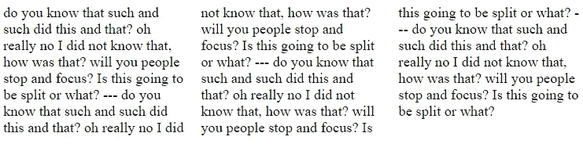

用`column-count:3`设置元素

# 请把这个居中！

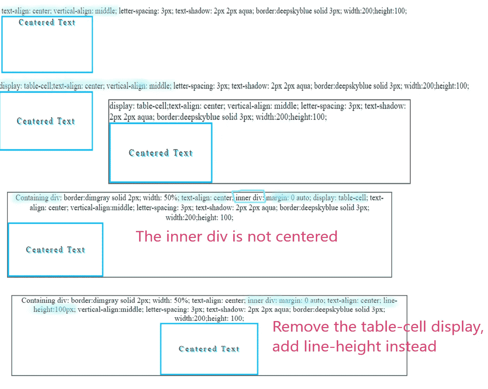

**在同一条线上的 div？**

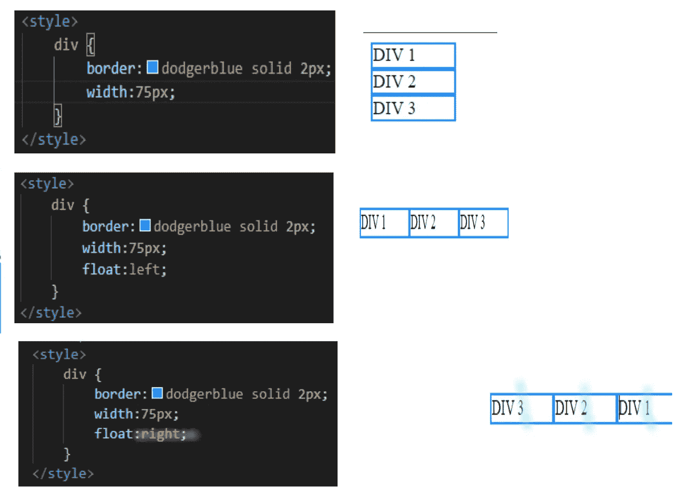

使图像居中:

```

```

# 定位—总是有趣，有时令人沮丧

其中一部分可以是文本和元素的居中，如上所示。

这更像是一张备忘单，关于 positions 和 flexbox 的完整文章，请参见 [CSS 定位——我不是唯一一个感到困惑的人。|由 GM Fuster | Medium](https://gmfuster.medium.com/css-positioning-i-cannot-be-the-only-one-who-gets-confused-8d9e5e86e0d9)

您可以通过设置元素的位置、使用 flexbox 和使用网格来定位事物。

**设定位置:**

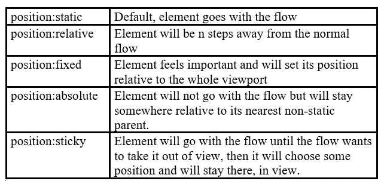

请在此查看可能的位置:

```
div{
   border:deeppink solid 8px;
 **position:static;**
}
.relativediv{
   border:springgreen solid 8px;
 **  left:20px;**
 **position:relative;**
}
.fixeddiv{
   border:steelblue solid 8px;
 **position:fixed;
   top:30vh;**
}
.absolutediv{
 **position:absolute;**
   border:yellow solid 8px;
 **  left:10px;**
}
.stickydiv{
   border:salmon solid 8px;
 **position:sticky;
   top: 0;**
}
```

它显示以下内容:

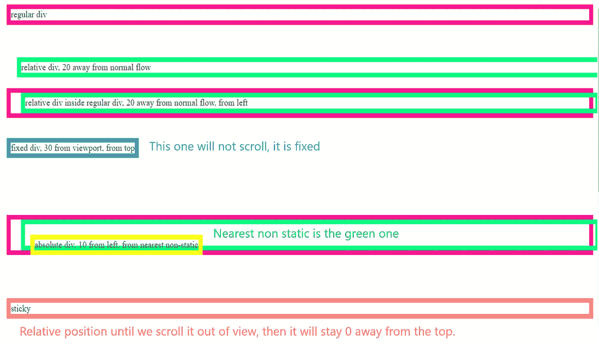

**柔性容器**

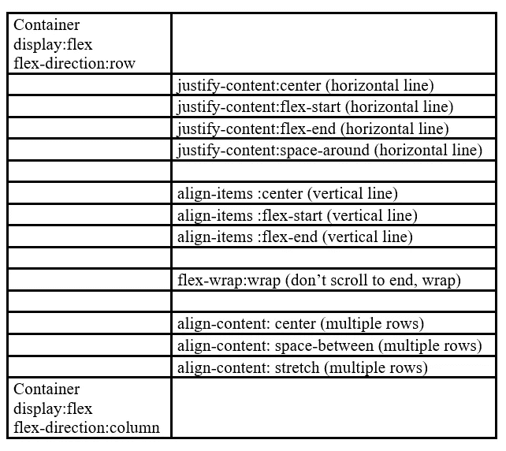

我只是添加了最常见的代码，更多细节和图片，请参见上面提到的另一篇文章。

```
div{
   border:salmon solid 2px;
   text-align: center;
}
.containerRow{
   **display:flex;
   flex-direction: row;**
   justify-content: center;  /*for horizontal*/
   flex-wrap:wrap; /*so items wrap if they don't fit*/
   align-content: space-between; /*how rows will be spread out if more than one */
}
.containerCol{
   d**isplay:flex;
   flex-direction: column;**
   align-items: center;       /*for vertical*/
}
.containerCol > div{
   width:125px;
}
.containerRow > div{
   width:125px;
}<div class="containerRow">
   <div>1</div><div>2</div><div>3</div><div>4</div><div>5</div>
</div>
<br/>
<div class="containerCol">
   <div>1</div><div>2</div><div>3</div><div>4</div><div>5</div>
</div>
```

**CSS 网格**

仅举几个例子:

```
a grid with 3 columns, all the same size..grid-container {
   **display: grid;
   grid-template-columns: auto auto auto;**
   background-color: #2196F3;
   column-gap: 10px;
   row-gap: 10px;;
}
.grid-item {
   background-color: rgba(255, 255, 255, 0.8);
   border: 1px solid rgba(0, 0, 0, 0.8);
   text-align: center;
}
<div class="grid-container">
  <div class="grid-item">1</div>
  <div class="grid-item">2</div>
  <div class="grid-item">3</div>  
  <div class="grid-item">4</div>
  <div class="grid-item">5</div>
  <div class="grid-item">6</div>  
  <div class="grid-item">7</div>
  <div class="grid-item">8</div>
  <div class="grid-item">9</div>  
</div>
```

该代码将显示:


我们可以改变某些项目的显示方式。

添加此代码，并将第一个元素也设置为具有该类。

```
.item1 {
   grid-column-start: 1;
   grid-column-end: 3;
}
```

看这个:

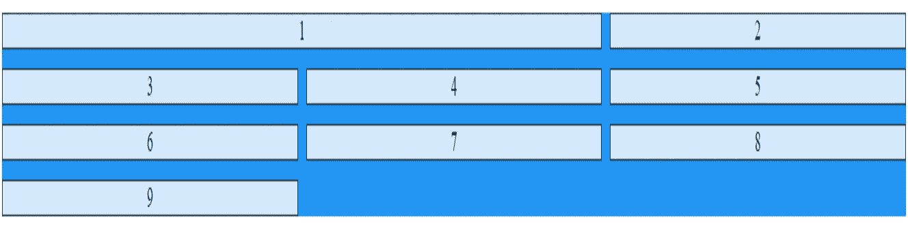

您也可以这样做，指示起点和跨度或起点和终点，作为一种快捷方式(对于列或行):

```
grid-row: 1 / span 2; (start at 1, span 2 rows)grid-row: 1 / 3; (start at 1, end at 3)grid-area: 1 / 2 / 5 / 6; (start at row /col /end at row / colgrid-area: 2 / 1 / span 2 / span 3;
```

从第一个元素中删除 item1 类，并将它用于列:`grid-template-columns:10vw 25vw auto 5vw` 并得到:

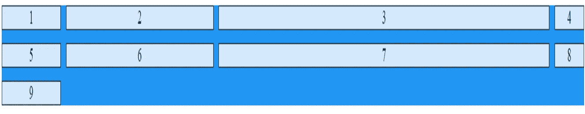

你也有一个类似的网格-模板-行。

您还有一个 **justify-content** 属性来设置网格项目如何显示。例如，如果您将它设置为 space-between，您会看到:

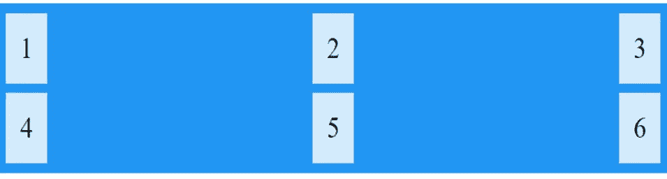

你也可以用 **align-content** 来做类似的事情。

这部分区域非常酷。你可以拥有这个:

```
.grid-container {
   display: grid;
   grid-template-columns: auto auto auto auto;
   background-color: #2196F3;
   column-gap: 10px;
   row-gap: 10px;;
   grid-template-areas:
   'header header header header' 
   'side texto texto texto'
   'main main main main'
   "footer footer footer footer";
}
.grid-item {
   background-color: rgba(255, 255, 255, 0.8);
   border: 1px solid rgba(0, 0, 0, 0.8);
   text-align: center;
}
.item1 { grid-area: header; }
.item2 { grid-area: texto; }
.item3 { grid-area: main; }
.item4 { grid-area: side; }
.item5 { grid-area: footer; }<div class="grid-container">
   <div class="grid-item item1">Header</div>
   <div class="grid-item item4">Side</div>
   <div class="grid-item item2">texto</div>
   <div class="grid-item item3">main</div>
   <div class="grid-item item5">footer</div>
</div>
```

还有这个。：

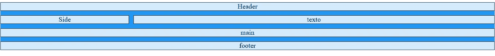

# 计数器

在计划查看增量的元素之前声明元素中的计数器。

```
body {
   counter-reset: **mySec**; <!--for incrementing in the h1 els.-->
}
h1 {
   counter-reset: **mySub**; <!--for incrementing in the h2s -->
}
h1::before {
   color:deeppink;
   **counter-increment: mySec;** <!--see this before the h1s-->
   content: "Section " **counter(mySec)** ". ";
}
h2::before {
   color:deepskyblue;
   counter-increment: **mySub**;
   <!-- see this before the h2s-->
   content: counter(**mySec**) "..." counter(**mySub**);
}
```

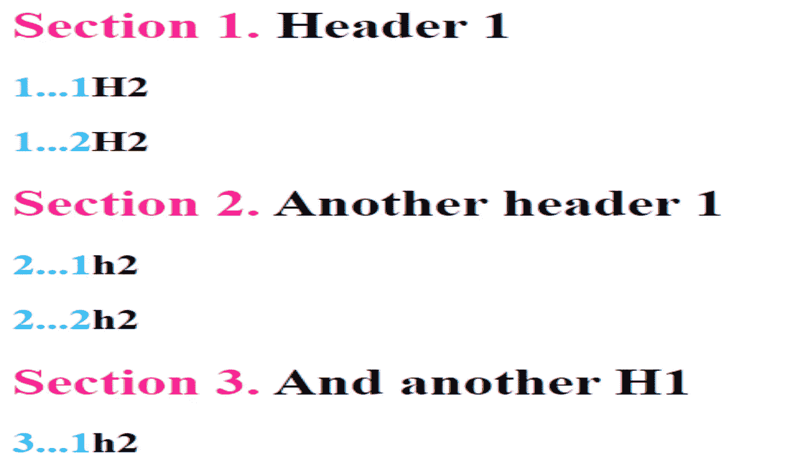

如果希望计数器在末尾，请更改为::after。

我想就这样吧。不包括萨斯