# CSS 定位—更新后包含更多内容

> 原文：<https://medium.com/nerd-for-tech/css-positioning-i-cannot-be-the-only-one-who-gets-confused-8d9e5e86e0d9?source=collection_archive---------4----------------------->

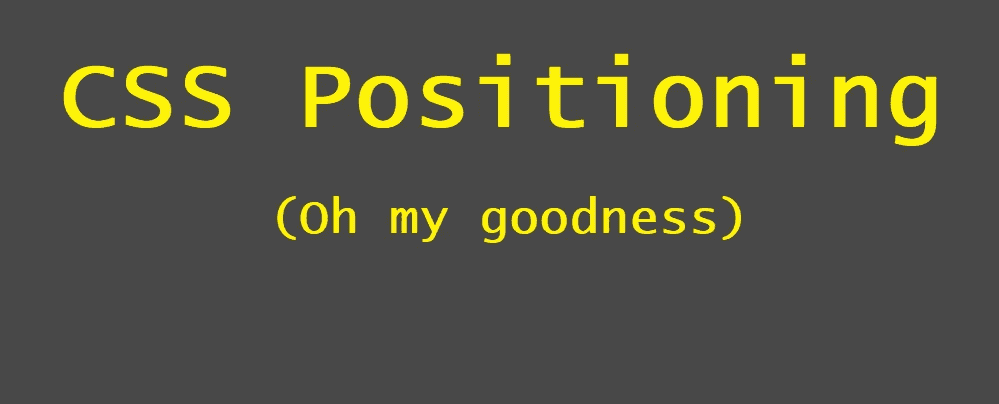

在页面上定位元素是应该很简单的事情之一，但有时会花费更多的时间。我认为在这里做一些总结是个好主意，希望下次能节省一些时间。

我将讨论带有**位置属性本身的定位元素**，f **lexbox，grid 和一些小东西。**

关于网格有一个很好的参考【css-tricks.com T4 网格完全指南】

在解释每个选项之前，我在此提供了一些表格以供参考:


# 使用位置属性:

有不同的方法来定位具有该属性的元素(该属性将在元素本身上设置，因为它与容器无关)。该属性可以具有下列值之一:

**这是所有元素的默认值，所以您真正需要说“position:static”的唯一时间是撤销一些从早期声明中继承的值。**

***相对("我不太喜欢这里，我往右移两步怎么样？")*** :位置是相对于正常情况下的位置。为了用相对于属性属性*改变正常位置，我们使用属性*左/右/上/下*。下面是默认位置为 static 的元素。*

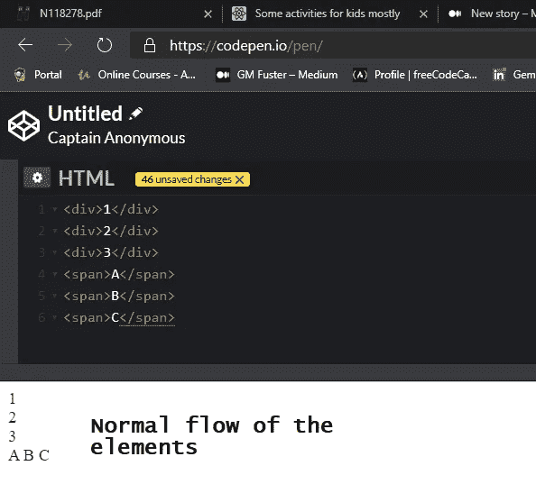

如果我们将它们中的一个设置为 position:relative，并指示它应该位于(从它通常应该在的位置)距离左侧和顶部多少像素的位置，我们会得到:

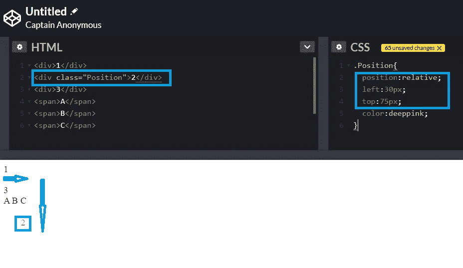

您也可以给一个负值，将元素向相反的方向移动。注意这里的 C 是如何被移动到比正常情况下更靠近 B 的。

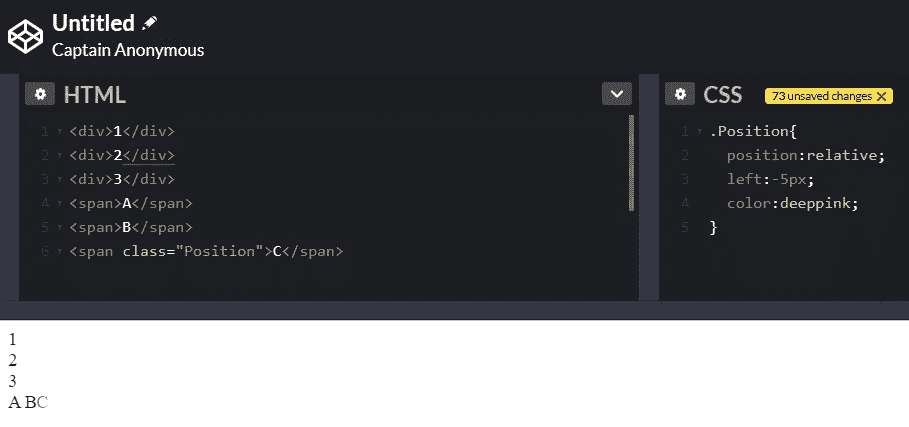

上述(将 C 移近 B)也可以通过使用*右*属性而不是*左*属性来完成，你可以使用 5 来代替-5。

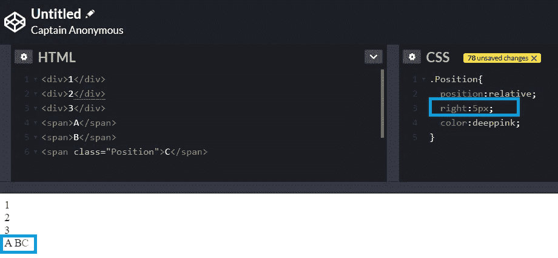

***固定("不在这里，我宁愿在视口的中间")*** :这里我们也使用左/右/上/下，但是位置是相对于视口(浏览器窗口)的，而不是相对于元素在正常流程下的位置。即使滚动，该位置也将保持不变。相对和固定的区别见下文。

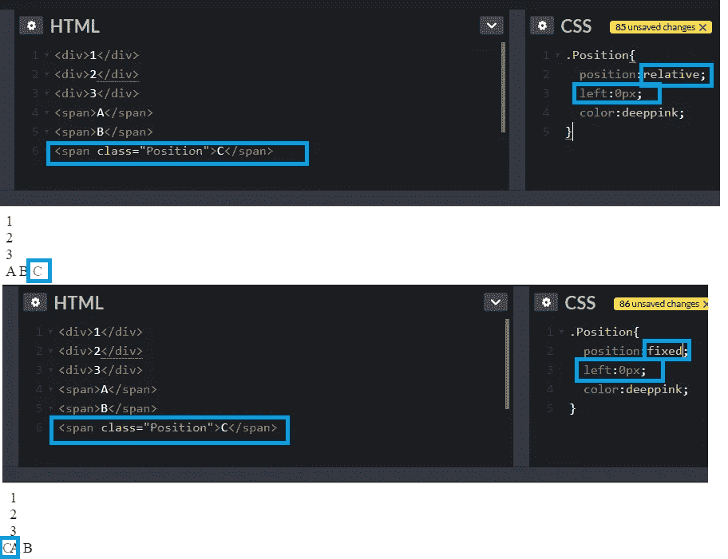

您不局限于仅使用像素来指示位置:

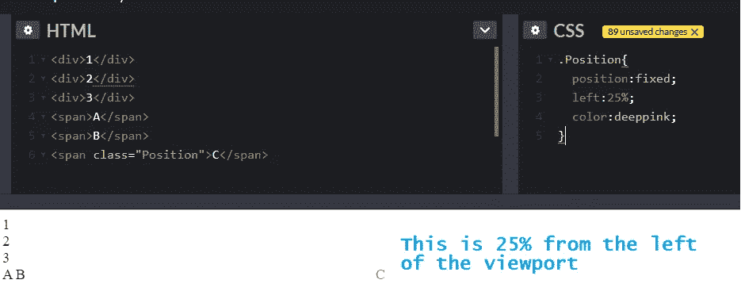

***absolute("不在这里，我的父代右边一点")*** :我们给出相对于最近定位(非静态)父代的绝对位置。

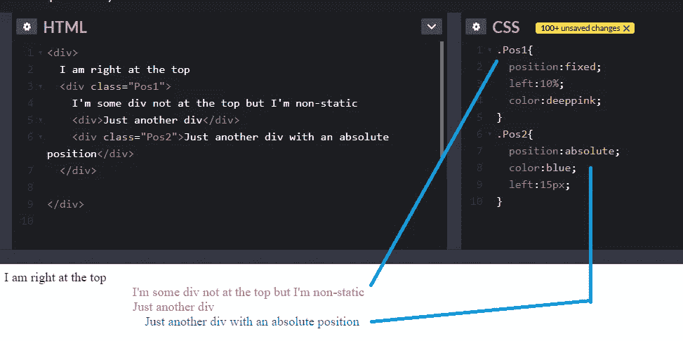

***sticky("不要让我滚出视图")*** :这是一个相对元素，直到元素将要滚出视图。然后它会粘在指示的任何位置。看看这个例子:[试用编辑器 3.6 版(w3schools.com)](https://www.w3schools.com/cssref/tryit.asp?filename=trycss_position_sticky)

# 桌子

`table-layout`的默认属性是`auto.`

使用自动的**表格布局，列将扩展以适合单元格最大数据的内容。所以我们最终会得到一个很长很长的列，而其他的都不是，这看起来很奇怪。**

如果我们将**表格布局改为固定的**，表格边框看起来更好，对表格进行数学处理也是一样，但是数据溢出了。它可能看起来像这样:

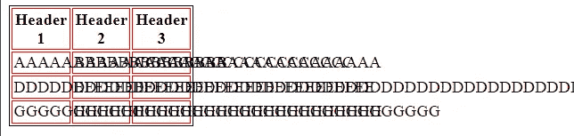

要使其换行，请将自动换行添加到 tds 中。如果我们有这个:

```
td {  border: 1px solid red ; **word-wrap: break-word;** }table.a {  border: 1px solid black;; **table-layout: fixed;**  width: 300px;   }
```

它看起来会像这样。


不推荐使用表格来做布局，但事实就是如此。

# 浮动

您可以将一个元素设置为浮动的，同一父元素中的其他元素将围绕它。

```
<p>
**<div style="float: right; width:170px;height:170px;margin-left:15px;border:solid 3px blue">A</div>**
Lorem ipsum dolor sit amet, consectetur adipiscing elit. Phasellus imperdiet, nulla et dictum interdum, nisi lorem egestas odio, vitae scelerisque enim ligula venenatis dolor. Maecenas nisl est, ultrices nec congue eget, auctor vitae massa. Fusce luctus vestibulum augue ut aliquet. Mauris ante ligula, facilisis sed ornare eu, lobortis in odio. Praesent convallis urna a lacus interdum ut hendrerit risus congue. Nunc sagittis dictum nisi, sed ullamcorper ipsum dignissim ac. In at libero sed nunc venenatis imperdiet sed ornare turpis. Donec vitae dui eget tellus gravida venenatis. Integer fringilla congue eros non fermentum. Sed dapibus pulvinar nibh tempor porta. Cras ac leo purus. Mauris quis diam velit.</p>
```

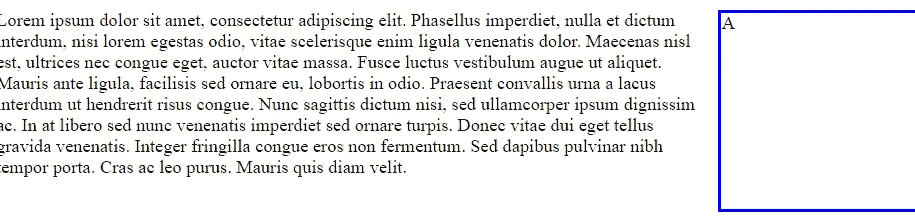

它将在哪里浮动取决于父容器，它与父容器相关。

**文本会浮动，但文本的容器不会。**这适用于同一父元素(可能是主体)中的其他元素，而不是父元素本身。所以如果我现在有这个:

```
<p style="border:3px solid pink"> **<div style="float: right;** width:170px;height:170px;margin-   left:15px;border:solid 3px blue">A</div>

   **<p style="border:3px solid pink">**
Lorem ipsum dolor sit amet, consectetur adipiscing elit. Phasellus imperdiet, nulla et dictum interdum, nisi lorem egestas odio, vitae scelerisque enim ligula venenatis dolor. Maecenas nisl est, ultrices nec congue eget, auctor vitae massa. Fusce luctus vestibulum augue ut aliquet. Mauris ante ligula, facilisis sed ornare eu, lobortis in odio. Praesent convallis urna a lacus interdum ut hendrerit risus congue. Nunc sagittis dictum nisi, sed ullamcorper ipsum dignissim ac. In at libero sed nunc venenatis imperdiet sed ornare turpis. Donec vitae dui eget tellus gravida venenatis. Integer fringilla congue eros non fermentum. Sed dapibus pulvinar nibh tempor porta. Cras ac leo purus. Mauris quis diam velit.</p>
</p>
```

我们将文本放在边上，但边框在下面:

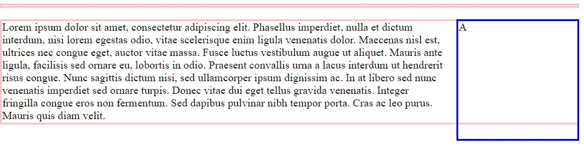

如果我们有多个 p 元素和浮动有相同的父元素，我们不希望其中一些移动，把它们设置为 `clear: right;`

# 显示

不同的元素有不同的显示默认值。p 元素和 Div 元素的**显示为块**，这意味着我们可以设置它们的大小，它们在新的一行开始。跨越一个**内联**，这意味着我们不设置大小，它们也不从新行开始。我们可以通过设置元素的 display 属性来改变元素的默认值。一个例子是改变列表项中的默认块，改为内嵌，这样我们就可以用它们创建一个导航菜单。

```
<p>
hello I'm p1
</p>
<p>hello I'm p2
</p>
```

将显示:

你好，我是 p1

你好，我是 p2

但是后来:

```
<p style="**display:inline**;">
hello I'm p1
</p>
<p style="display:inline;">
hello I'm p2
</p>
```

显示:

你好我是 p1 你好我是 p2

如果我们这样做:

```
<p style="**display:inline**; border:solid blue 2px; **width:800px;**">
hello I'm p1
</p>
<p style="display:inline; border:solid blue 2px; **width:300px**;">
hello I'm p2
</p>
```

它们都以相同的宽度显示，因为使用 inline 我们无法设置宽度。

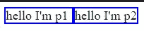

但是我们可以这样做:

```
<p style="**display:inline-block;**  border:solid blue 2px; **width:600px**;">
hello I'm p1
</p>
<p style="**display:inline**;  border:solid blue 2px; w**idth:600px;**">
hello I'm p2
</p>
```

使用**内嵌块**我们将看到宽度:

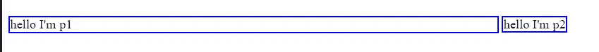

# 盒子

当调整元素大小时，我们有两种方法来处理边距和填充。框大小可以是边框框或内容框。

```
<div style="**box-sizing:border-box**; width:500px; border:solid 5px blue; padding:20px; margin:20px; outline:solid 5px pink;">
  I am border-box (my things are inside my size)
</div><div style="**box-sizing:content-box**; width:500px; border:solid 5px blue; padding:20px; margin:20px; outline:solid 5px pink;">
  I am content-box (my things add to my size)
</div>
```

对于内容框，我们给出的宽度实际上是内容的宽度，而不是整体的宽度。有了 border-box，就是为了整体。

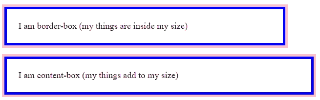

在 body 中为这两个元素中的一个设置显示是一个好主意，这样它可以在不同的元素之间共享。

2 对于布局来说，非常有用的显示类型是 flex 和 grid。

# 用柔性容器定位:

如果你的元素的位置遵循一个模式(意味着你没有把元素放在没有明显流程的屏幕上)，使用 flexbox 来设置它们可能会更容易。使用 flex 容器(flexbox ),你将拥有一个容器，并设置如何显示容器中的项目的属性。

**连续显示项目**:

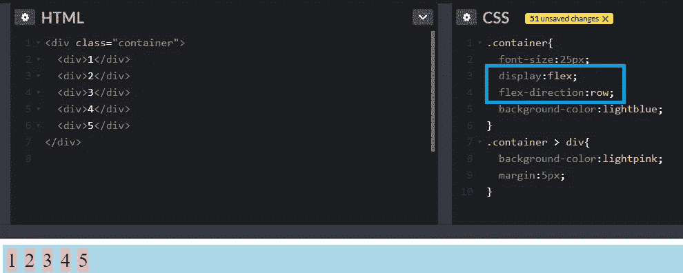

**在一列中显示项目:**

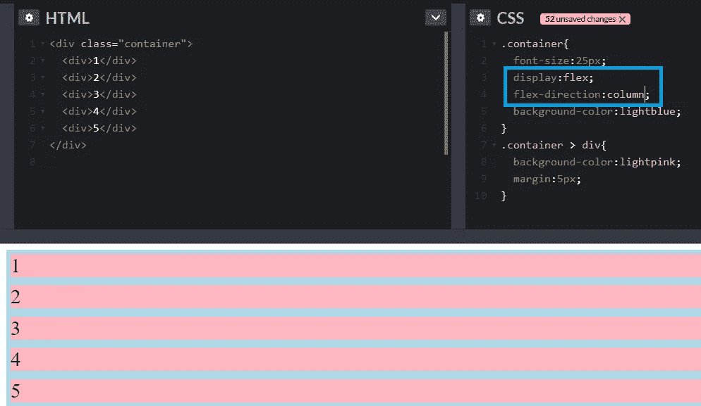

要让上面的数字显示在 div 的中间而不是开头，使用**text-align:center**；在容器> div css 中。(您在 div 项中设置它，而不是在 div 容器中，因为这与 div 中的文本有关，而不是与容器中的 div 有关)

如果你正在使用 flex-direction:row 并且你想要 div 本身居中，你需要添加 **justify-content:center** 到容器本身。

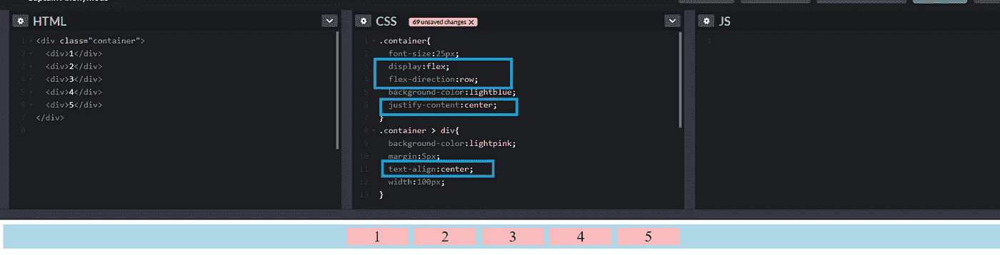

justify-content 的其他值是 **flex-start** (行开始)和 **flex-end** (行结束)。还有**空间环绕**将它们展开以占据整排。

请注意，justify-content 用于水平线中的对齐。如果您还需要对齐**垂直线中的内容，请使用容器类中的** **align-items** (带有中心、灵活开始、灵活结束)。

如果您的项目显示在一行中，并且您的项目多于该行所能显示的，您将不得不滚动，除非您设置 **flex-wrap:wrap** 。这将根据需要将对象移动到下一行。您也可以将其设置为 nowrap，然后您可能需要滚动来查看所有内容。

当我们有**多行**时，容器中也有**对齐内容**。

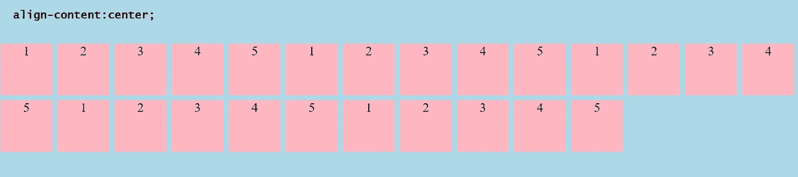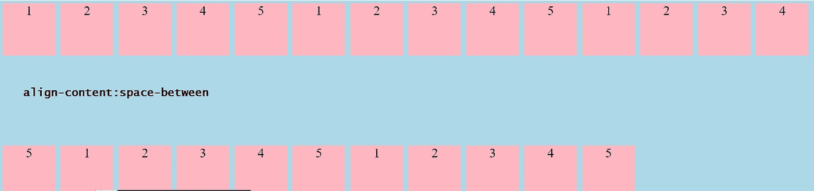

如果项目没有固定的大小，您也可以设置 **align-content 来拉伸**，项目将拉伸到占据容器的整个高度。

如果我们有这个呢？

```
<div style="display:flex; **flex-direction:row; width:500px**; border:solid 3px **yellow**;"><div style="**width:300px;** border:solid 5px blue;" >
   ** DIV 1....................................................................................**
  </div>
  <div style="width:300px; border:solid 5px blue;" >
    DIV 2.......................................................................
  </div>
  <div style="width:300px; border:solid 5px blue;" >
    DIV 3.....................................................................
  </div>
  <div style="width:300px; border:solid 5px blue;" >
    DIV 1..............................................................................
  </div>
  <div style="width:300px; border:solid 5px blue;" >
    DIV 2............................................................................
  </div>
  <div style="width:300px; border:solid 5px blue;" >
    DIV 3.............................................................................
  </div></div>
```

看起来会像这样:

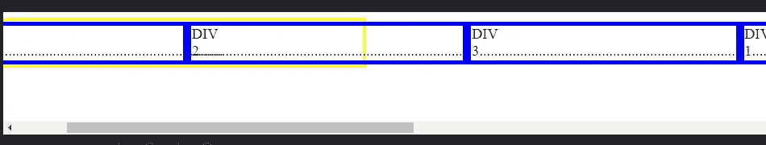

对于相同的 div 项，现在更改它，这样它就不会继续，并且会超出容器的宽度(黄色边框)。(我将容器做得稍微大了一点，这样它就可以容纳一行中的多个项目)

```
<div style="display:flex; flex-direction:row; width:800px; border:solid 3px yellow; **flex-wrap: wrap;**">
```

**溢出被移到下一行**。

我现在去掉了子元素的宽度，用 flex 和一个单元来代替(最后，作为 css)，这意味着，因为它们都有相同的宽度，所以它们的大小也相同。

```
<div style="display:flex; flex-direction:row; width:800px; border:solid 3px yellow; **flex-wrap: wrap;**"><div **class="item**" style="border:solid 5px blue;" >
    DIV 1....................................................................................
  </div>
  <div class="item" style="border:solid 5px blue;" >
    DIV 2.......................................................................
  </div>
  <div class="item" style="border:solid 5px blue;" >
    DIV 3.....................................................................
  </div>
  <div class="item" style="border:solid 5px blue;" >
    DIV 1..............................................................................
  </div>
  <div class="item" style="width:300px; border:solid 5px blue;" >
    DIV 2............................................................................
  </div>
  <div class="item" style="width:300px; border:solid 5px blue;" >
    DIV 3.............................................................................
  </div></div>//the class
**.item {
  flex:1;
}**
```

我看到的是:

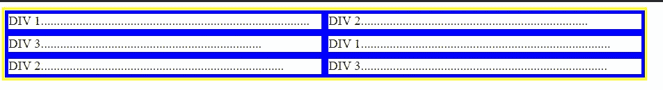

现在我希望第三个更大:

```
.item {
  flex:1;
}
.**item:nth-child(3){
  flex:2;
}**
```

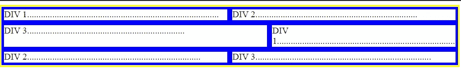

你也可以使用`align-self: flex-end;`和拥有它的元素来定位自己。

默认情况下，所有项目的**弹性订单**为 0。这意味着项目会按照添加的顺序出现。我们可以改变元素的顺序来改变它出现的位置，而不管它是什么时候添加的。订单编号越高，项目出现的越晚。您可以使用负数将项目推到开头。

# 电网！(显示:网格)

通过设置显示和网格模板列来启动网格。请注意，您还可以设置列和行的间距。

```
a grid with 3 columns, all the same size..grid-container {
   **display: grid;
   grid-template-columns: auto auto auto;**
   background-color: #2196F3;
   **column-gap: 10px;**
   **row-gap: 10px;**
}
.grid-item {
   background-color: rgba(255, 255, 255, 0.8);
   border: 1px solid rgba(0, 0, 0, 0.8);
   text-align: center;
}
<div class="grid-container">
  <div class="grid-item">1</div>
  <div class="grid-item">2</div>
  <div class="grid-item">3</div>  
  <div class="grid-item">4</div>
  <div class="grid-item">5</div>
  <div class="grid-item">6</div>  
  <div class="grid-item">7</div>
  <div class="grid-item">8</div>
  <div class="grid-item">9</div>  
</div>
```

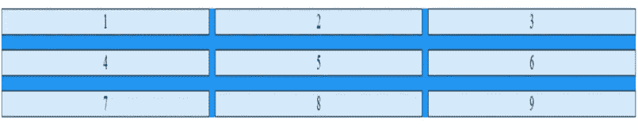

您还可以更改某个特定项目的显示方式。

```
.item1 {
   grid-column-start: 1;
   grid-column-end: 3;
}
```

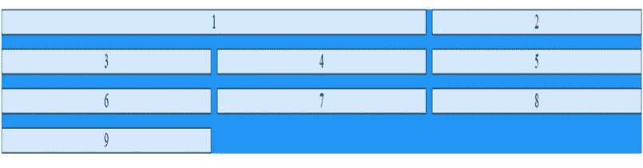

您也可以这样做，指示起点和跨度或起点和终点，作为一种快捷方式(对于列或行):

```
grid-row: 1 / span 2; (start at 1, span 2 rows)
grid-row: 1 / 3; start at 1, end at 3)
grid-area: 1 / 2 / 5 / 6; (start at row /col / end at row / col)
grid-area: 2 / 1 / span 2 / span 3;
```

从第一个元素中删除 item1 类，并将其用于列:`grid-template-columns:10vw 25vw auto 5vw` 并获取:

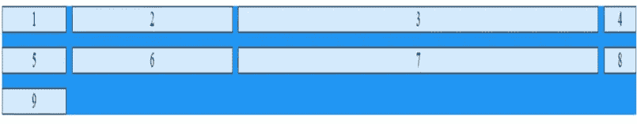

你也可以在你的尺寸上使用 fr。这个单元代表网格容器中可用空间的一部分。与前面显示的相同的网格容器，但是更改了粗体行。

```
.grid-container {
   display: grid;
   **grid-template-columns: 1fr 2fr 1fr;**
   background-color: #2196F3;
   column-gap: 10px;
   row-gap: 10px;;
}
.grid-item {
   background-color: rgba(255, 255, 255, 0.8);
   border: 1px solid rgba(0, 0, 0, 0.8);
   text-align: center;   
}
```

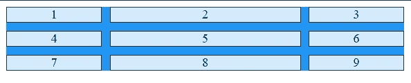

您还有一个 **justify-content** 属性来设置网格项目如何显示。例如，如果将它设置为“间距”,您会看到:

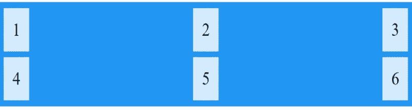

你也可以用 **align-content** 来做类似的事情。

如果它们的大小都一样，你可以这样做，而不是写 1fr 3 次。`grid-template-columns: repeat(3, 1fr);`

你可以用`grid-auto-rows: 100px;`设置你的行的高度，否则它们只是适合内容。

您也可以这样做，以防内容需要比我们预期的更高。它将有一个最小值，但它仍然适合更大的内容:`grid-auto-rows: minmax(100px, auto);`

现在关于**区域**的这部分超级酷。你可以有这个:

```
grid-container {
   display: grid;
   grid-template-columns: auto auto auto auto;
   background-color: #2196F3;
   column-gap: 10px;
   row-gap: 10px;;
  ** grid-template-areas:**
   **'header header header header' 
   'side texto texto texto'
   'main main main main'
   "footer footer footer footer";**
}
.grid-item {
   background-color: rgba(255, 255, 255, 0.8);
   border: 1px solid rgba(0, 0, 0, 0.8);
   text-align: center;
}
.item1 { grid-area: header; }
.item2 { grid-area: texto; }
.item3 { grid-area: main; }
.item4 { grid-area: side; }
.item5 { grid-area: footer; }<div class="grid-container">
   <div class="grid-item item1">Header</div>
   <div class="grid-item item4">Side</div>
   <div class="grid-item item2">texto</div>
   <div class="grid-item item3">main</div>
   <div class="grid-item item5">footer</div>
</div>
```

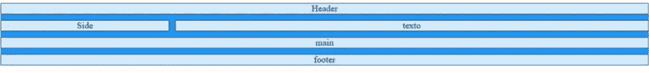