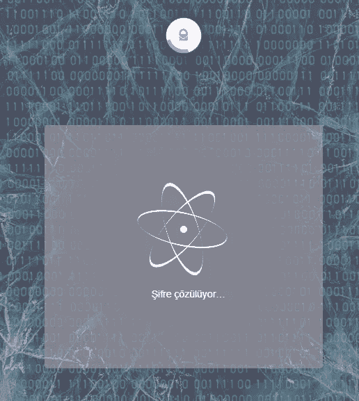
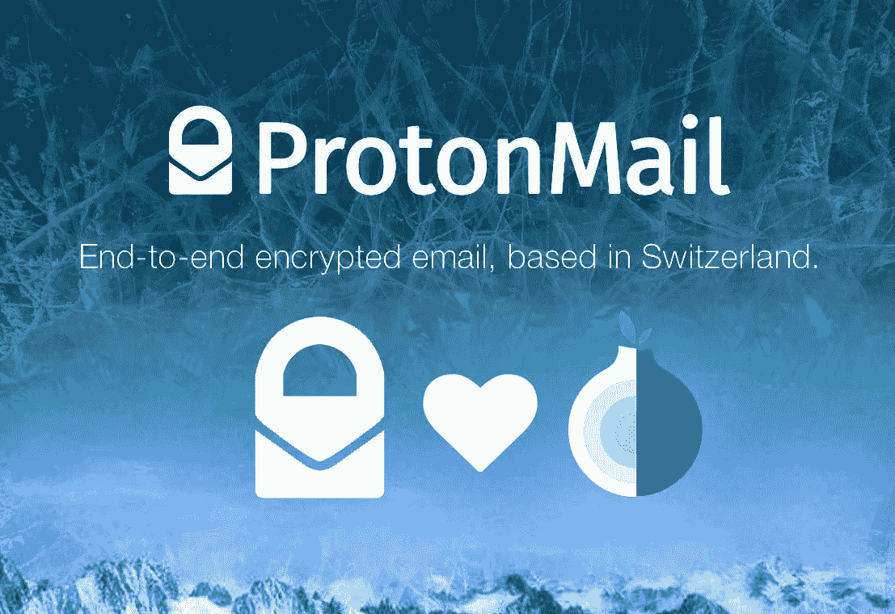

# 如今匿名是一种至关重要的需求

> 原文：<https://medium.com/nerd-for-tech/currently-anonymity-is-a-vital-necessity-238381f558d6?source=collection_archive---------36----------------------->

## 他们黑掉并出售新秩序中不再隐藏的东西！

我们目睹了一个时期，在这个时期，全世界的司法机构都倾向于脱离独立。尤其是在发展中国家，法律体系已经变得可以用金钱和采购订单来管理。所以，2021 年，当你落入任何一个国家的司法机关手中，你都将是错误决定的受害者。我们现在处于一个完全数字化的世界。隐私和隐私是一种本质需求。我们脱离了机械学，进入了这样一条数字化的道路，以至于连联邦调查局都无法再追踪这些钱了，没有人知道谁拥有多少储存在 NFT 的财富。在这样的环境下，如果你的个人数据不受公司和政府的保护，你就处于一个开放的位置。这种行为是不符合逻辑和理性主义的！！我的朋友们，我们在数字环境中的数据意味着一切:我们的钱，我们的财产，我们的隐私，我们的银行对账单，我们的技术诀窍，我们的密码都是数字的…

## 匿名不再是一种需要；聪明人的必备！！

聪明人自然地、本能地保护和保护自己的需求出现了。我不想用这样的介绍来击败死马，让我向你介绍我的宝贝，“质子邮件”。

**ProtonMail 可靠的加密电子邮件服务提供商**

⚡他们的座右铭如下: ***基于瑞士的端到端加密电子邮件已经变得对每个人来说都是容易和可访问的。***

deepweb 用户普遍使用的 ProtonMail 也是一个进行端到端加密的邮件系统。

⚡ It 在世界上最安全的地方之一瑞士拥有一个“数据中心”，它是开源和免费的。通过加密保留所有用户数据，不保留日志记录。

⚡如果你愿意，你可以免费使用**用户名@pm.me** 而不是@protonmail.com。这是一个非常有用的扩展，我非常喜欢。

2014 年在欧洲核子研究中心使用的⚡质子邮件，现在为所有人服务。ProtonMail 不会以任何方式回应传票。换句话说，无论你给谁写了什么，无论邮件来自谁，法院都无法获得这些数据。无论是法院还是 ProtonMail 都无法揭示端到端的加密数据并使其可读，即使它以某种方式访问这些数据。

⚡质子邮件设计了一个零知识证明系统。用户在将电子邮件和个人数据发送到 ProtonMail 服务器之前，会对它们进行加密。凭借这一功能，它不同于 Gmail 和 Hotmail 等流行的电子邮件服务。

⚡质子邮件服务于 150 多个国家的数百万人。

⚡后端开发人员据说是密码学专家。(我不会知道有多少是真的。)

⚡ It 支持双因素身份认证(2FA)。

如果隐私对您很重要，如果您的电子邮件内容包含在其他人收到时可以转换为金钱的数据，或者您的电子邮件内容中的媒体文件可以转换为勒索，那么使用 ProtonMail 是一个好主意。即使什么都没有发生，你的个人数据也可以作为一个数据集被使用和出售，以转换成可销售的统计数据。我给那些认为安全比后悔更好的人的建议是，我最喜欢的是质子邮件👍

我还打开了一封端到端的加密邮件。 **aegeanocturne@pm.me**

作为一个使用 hotmail 多年的人，由于最近的猜测和我上面描述的数字转型，我决定改用更安全的电子邮件。最吸引我的两个特性:

## 瑞士安全局。🎯

这篇文章的重要原因是，没有美国和欧盟国家可以要求数据。

## 端到端加密。🎯

由于端到端加密，您的信息不会被黑客捕获。

**托尔喜欢质子邮件。**

📣 **Aegeanocturne，**认为创新，进步，自由和领先的曲线，从事数字业务，并将其与经济联系起来。

**他的其他笔记:**

 [## 为什么土耳其度假这么便宜？

### 有什么样的招数？

aegeanocturnes.medium.com](https://aegeanocturnes.medium.com/why-is-turkey-vacation-so-cheap-e1020e2470c)  [## 理解比特币的算法并破解 SHA256

### 你准备好搞清楚比特币的算法了吗？

medium.com](/nerd-for-tech/understanding-bitcoins-algorithm-and-breaking-sha256-42a636cc9de6)  [## 在外汇市场上，手意味着什么？

### 理想的批量应该是多少？

aegeanocturnes.medium.com](https://aegeanocturnes.medium.com/what-is-lot-meaning-on-forex-market-203dd0802746)