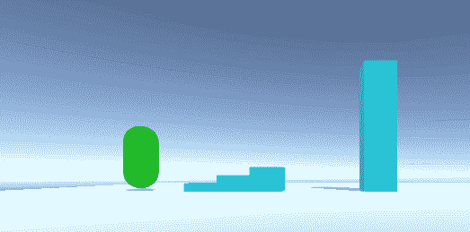
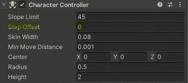
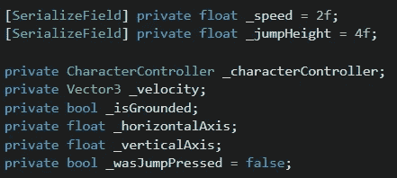
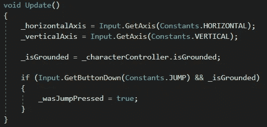
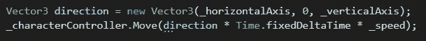
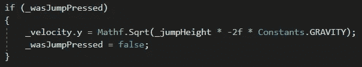
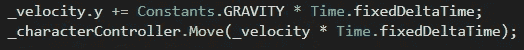

# 自定义 3D 角色控制器

> 原文：<https://medium.com/nerd-for-tech/custom-3d-character-controller-ffa3e1721c31?source=collection_archive---------9----------------------->

目标:创造一个在 3D 环境中移动和跳跃角色。

我们将从给胶囊对象添加一个*角色控制器*组件开始。我们将把*步长偏移*改为“0”——这将消除 Unity 对象“粘”在墙上以及遇到硬边时“抖动”的常见问题。

现在我们将创建我们的运动脚本。下面是我们需要的变量。

我们将在 *Update* 方法中收集所有玩家的输入。我们只允许在角色被禁足的情况下记录跳跃按钮。

我们将在 *FixedUpdate* 方法中处理实际的移动。这将使我们的运动帧率独立。

如果角色正在下落(速度的 y 轴小于零)，我们将它设置为零。

接下来，我们将处理水平和垂直运动。我们将把玩家的输入分配到一个方向，然后在那个方向上移动*角色控制器*乘以 *_speed* 和 *Time.fixedDeltaTime* (自上次 *FixedUpdate* 以来的时间)。

如果我们接受了跳转按钮被按下，我们现在将处理它。我用-9.81 来代表重力。通过我们期望的跳跃高度乘以负二倍重力的平方根，我们的角色将能够在他们跳跃的顶点达到跳跃高度。跳跃高度为 4，我们将能够跳 4“米”(统一世界单位)，这是我们角色 2 米高度的两倍。(想象一个身高 6 英尺 6 英寸的人越过一个 13 英尺高的障碍！)

最后，我们将应用重力并实际移动*角色控制器*。

结果就是一个非常圆滑，反应灵敏的角色！