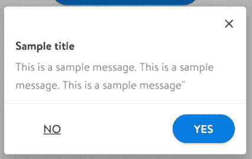
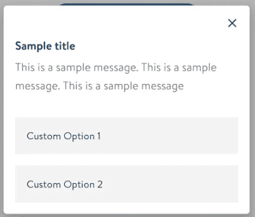
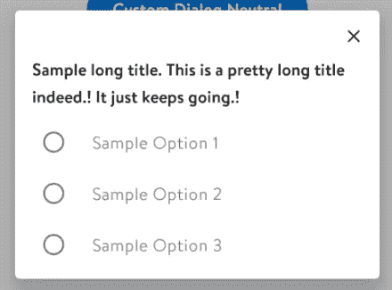

# 在 KOTLIN 中创建自定义提醒对话框

> 原文：<https://medium.com/nerd-for-tech/custom-alert-dialogs-in-kotlin-96d1b01a098d?source=collection_archive---------6----------------------->

所以最近我遇到一个需求，我们需要一个定制的警告对话框，它看起来不像现有的对话框。

这篇文章只是为了帮助其他可能面临类似问题的人，并给你一些选择。

在我开始选项之前，让我给你看一下我们目前使用的现有材料设计警告。

这里我们有一个自定义标题，我们创建了一个标题和一个 X 按钮。除此之外，我们还有一个标准消息和一个正反按钮。

> **自定义标题— *布局 _ 提醒 _ 对话框 _ 标题***

```
<androidx.constraintlayout.widget.ConstraintLayout xmlns:android="http://schemas.android.com/apk/res/android"
    xmlns:app="http://schemas.android.com/apk/res-auto"
    android:layout_width="match_parent"
    android:layout_height="wrap_content">

    <androidx.appcompat.widget.AppCompatImageView
        android:id="@+id/iv_close"
        android:layout_width="40dp"
        android:layout_height="40dp"
        android:layout_marginTop="4dp"
        android:layout_marginEnd="4dp"
        android:padding="10dp"
        app:layout_constraintEnd_toEndOf="parent"
        app:layout_constraintTop_toTopOf="parent"
        app:srcCompat="@drawable/ic_close"
        app:tint="@color/neutral" />

    <androidx.appcompat.widget.AppCompatTextView
        android:id="@+id/tv_title"
        android:ellipsize="end"
        android:maxLines="2"
        android:paddingStart="16dp"
        android:paddingEnd="16dp"
        android:visibility="visible"
        android:text="Sample Header"
        app:layout_constraintStart_toStartOf="parent"
        app:layout_constraintTop_toBottomOf="@id/iv_close" />
</androidx.constraintlayout.widget.ConstraintLayout>
```


# **现有常规对话框(带自定义标题)**



履行

```
*fun MaterialAlertDialogBuilder.showDialog(
    context: Context,
    title: String = "",
    message: String = "",
    positiveText: String? = null,
    negativeText: String? = null,
    positiveClick: DialogInterface.OnClickListener? = null,
    negativeClick: DialogInterface.OnClickListener? = null,
    isDialogCancelable: Boolean = false
): AlertDialog {
    val titleView = View.inflate(context, R.layout.layout_alert_dialog_title, null)
    setCustomTitle(titleView)

    if (title.isNotBlank()) {
        titleView.tv_title.visibility = View.VISIBLE
        titleView.tv_title.text = title
    }

    if (message.isNotBlank()) {
        setMessage(message)
    }
    setCancelable(isDialogCancelable)
    alertDialog.setCanceledOnTouchOutside(isDialogCancelable)  
     positiveText?.let* ***{*** *if (****it****.isNotBlank()) {
            setPositiveButton(positiveText, positiveClick)
        }* ***}*** *negativeText?.let* ***{*** *if (****it****.isNotBlank()) {
            setNeutralButton(negativeText, negativeClick)
        }* ***}*** *val alertDialog = create()

    titleView.iv_close.setOnClickListener* ***{*** *alertDialog.dismiss()* ***}* ***alertDialog.setOnShowListener* ***{*** *val neutralButton = alertDialog.getButton(AlertDialog.BUTTON_NEUTRAL)
    neutralButton.paintFlags = neutralButton.paintFlags or Paint.UNDERLINE_TEXT_FLAG* ***}*** *alertDialog.show()
    return alertDialog
}*
```

现在，对于新的需求，我们需要一些不同类型的对话框。

# **选项 1** —两个/所有选项同等重要的对话框。



现在，这是我们的一个选择，一个非标准外观的对话框。这背后的想法是不要突出显示肯定按钮，而是以同等的重要性显示两个选项，这样用户必须真正通读选项，然后决定
所以我首先创建了一个自定义视图，它可以显示在选项的对话框内—*layout _ custom _ dialog _ View*

```
*<?xml version="1.0" encoding="utf-8"?>
<androidx.constraintlayout.widget.ConstraintLayout
    xmlns:android="http://schemas.android.com/apk/res/android"
    xmlns:app="http://schemas.android.com/apk/res-auto"
    xmlns:tools="http://schemas.android.com/tools"
    android:layout_width="match_parent"
    android:layout_height="wrap_content">

    <TextView
        android:id="@+id/option1"
        android:layout_width="match_parent"
        android:layout_height="wrap_content"
        android:layout_marginLeft="15dp"
        android:layout_marginRight="15dp"
        android:background="#F1F1F2"
        tools:text="Option 1"
        android:padding="15dp"
        app:layout_constraintEnd_toEndOf="parent"
        app:layout_constraintStart_toStartOf="parent"
        app:layout_constraintTop_toTopOf="parent" />

    <TextView
        android:id="@+id/option2"
        android:layout_width="match_parent"
        android:layout_height="wrap_content"
        android:layout_margin="15dp"
        android:background="#F1F1F2"
        android:padding="15dp"
        tools:text="Option 2"
        app:layout_constraintBottom_toBottomOf="parent"
        app:layout_constraintEnd_toEndOf="parent"
        app:layout_constraintStart_toStartOf="parent"
        app:layout_constraintTop_toBottomOf="@+id/option1"
        app:layout_constraintVertical_bias="0.0" />
</androidx.constraintlayout.widget.ConstraintLayout>*
```

创建之后，我将这个视图添加到对话框的 setView 属性中。我重用了与常规对话框相同的函数签名，但是您也可以决定使用单独的语法来传递值。

```
val customDialogOptions = View.inflate(context, R.layout.*layout_custom_dialog_view*, null)
positiveText?.*let* **{** if (**it**.*isNotBlank*()) {
        customDialogOptions.option1.*visibility* = View.*VISIBLE* customDialogOptions.option1.*text* = positiveText
        customDialogOptions.option1.setOnClickListener **{** positiveClick
        **}** }
**}** negativeText?.*let* **{** if (**it**.*isNotBlank*()) {
        customDialogOptions.option2.*visibility* = View.*VISIBLE* customDialogOptions.option2.*text* = negativeText
        customDialogOptions.option2.setOnClickListener **{** negativeClick
        **}** }
**}**
```

> 限制——上面的实现对于 2 或 3 个选择可以很好地工作，但如果超过这个数目，你将面临一个问题，如何处理所有文本的传递以及每个选择的点击处理程序。

这就是下一个选项出现的地方。

# **选项 2** —单选对话框

现在，我们在这里利用了*setsinglectioneitems*，但是我们对它做了一点小小的改动。我们的期望是，当用户选择任何选项时，不要使用任何肯定/否定按钮。选择本身应该触发动作并关闭对话框。

> 注意-:请记住，当您使用 setSingleChoiceItems 或 setMultiChoiceItems 时，您不能直接设置消息，因为选项会替换标题下的整个视图，因此它要么是消息，要么是选项。
> 
> 在这种情况下，你会希望你的标题更加自我解释，告诉用户需要做什么。



在我的例子中，我传递了选项列表和对选项的回调。您也可以选择用另一种方式来处理它，但是这种方法似乎更容易，并且将处理选择的部分留给了消费者。

> 注意:默认情况下，在选择单个/多个项目时，对话框不会被关闭，所以我在下面对其进行了包装并明确将其关闭

```
*fun MaterialAlertDialogBuilder.showCustomDialogWithSingleSelection(
    context: Context,
    title: String = "",
    optionsList: ArrayList<String>,
    handleOptionsSelectionCallback: DialogInterface.OnClickListener? = null,
    isDialogCancelable: Boolean = false
): AlertDialog {
    val titleView = View.inflate(context, R.layout.layout_alert_dialog_title, null)
    setCustomTitle(titleView)
    if (title.isNotBlank()) {
        titleView.tv_title.visibility = View.VISIBLE
        titleView.tv_title.text = title
    }
    val options: Array<CharSequence> =
        optionsList.toArray(arrayOfNulls<CharSequence>(optionsList.size))* setSingleChoiceItems(options, -1) **{** dialog, which **->** handleOptionsSelectionCallback?.onClick(dialog,which)
    dialog.dismiss()
**}** *val alertDialog = create()
    titleView.iv_close.setOnClickListener* ***{*** *alertDialog.dismiss()

    setCancelable(isDialogCancelable)
    alertDialog.setCanceledOnTouchOutside(isDialogCancelable)
    alertDialog.show()
    return alertDialog
}*
```

现在，在这种情况下，回调返回所选选项的索引，我可以随心所欲地处理它。在下面的例子中，我只是显示了另一个对话框，其中有返回的索引和值，但是你可以选择对它做任何你想做的事情。可能会以祝酒词的形式出现，也可能根本不出现。

```
*val optionsList  = arrayListOf("Sample Option 1", "Sample Option 2", "Sample Option 3")
        fun MyClickListener() =
            DialogInterface.OnClickListener* ***{*** *dialog: DialogInterface, i: Int* ***->*** *context?.let* ***{*** *dialog.dismiss()
                //showing the returned index
                MaterialAlertDialogBuilder(****it****).showDialog(
                    context =* ***it****,
                    title = "Selected Value",
                    message = "index = ${i.toString()} || value = ${optionsList[i]}",
                    positiveText = "OK",
                    positiveClick = DialogInterface.OnClickListener* ***{*** *_, _* ***-> }****,
                    isDialogCancelable = true
                )* ***} }*** *context?.let* ***{*** *MaterialAlertDialogBuilder(****it****).showCustomDialogWithSingleSelection(
                context =* ***it****,
                title = "Sample long title. This is a pretty long title indeed.! It just keeps going.!",
                optionsList = optionsList,
                handleOptionsSelectionCallback = MyClickListener(),
                isDialogCancelable = true
            )* ***}***
```

还有各种其他方式来处理这种情况。上面的场景与我在其他地方看到的标准用法略有不同，在这些地方，选项下面还有一个肯定和否定按钮，它们将触发处理方法。