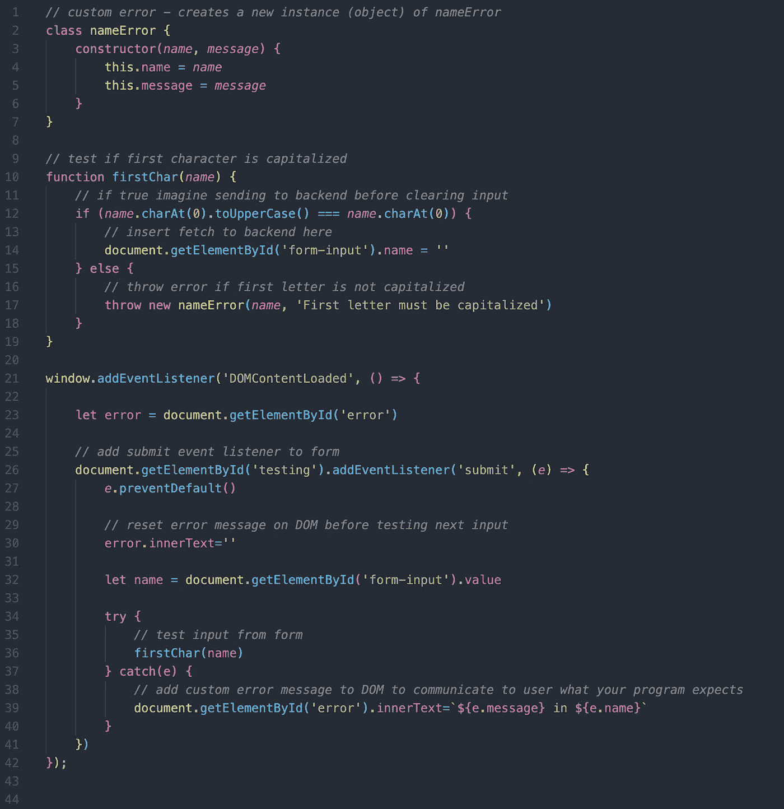
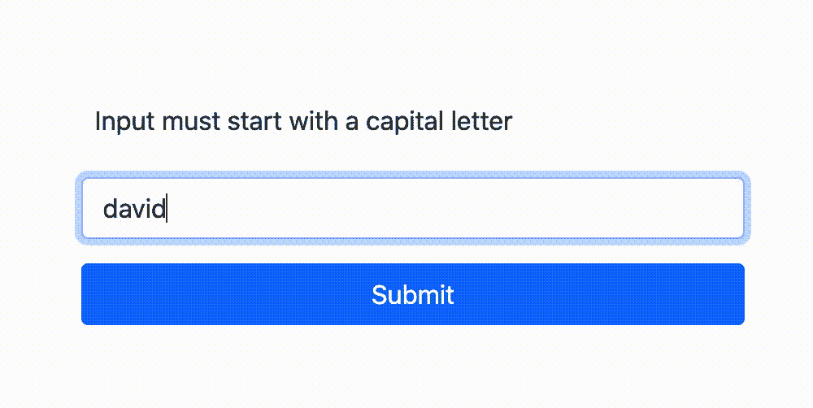

# JavaScript 中的自定义错误处理

> 原文：<https://medium.com/nerd-for-tech/custom-error-handling-in-javascript-a3ce12aa38ff?source=collection_archive---------8----------------------->


照片经由[约翰·马特丘克](https://unsplash.com/@john_matychuk)经由[unsplash.com](https://unsplash.com/photos/dJdcb11aboQ)

编写在正常操作条件下工作的代码是一项很好的技能。编写即使出错也能工作的代码更好。在代码中，出错的方式有很多种。

例如，当代码本身有问题时，可能传递给函数的参数的类型或数量是错误的。或者有时浏览器不兼容会导致问题。其他时候，表单中的用户输入可能是罪魁祸首。

不管它们是如何发生的，了解如何防止它们破坏你的程序是很重要的。在这篇文章中，我将简要解释主要的 JavaScript 错误类型，更重要的是，向您展示 JavaScript 允许我们创建自己的自定义错误的一些方法。

JavaScript 中有九种错误类型，包括一般错误。另外八个是 EvalError、RangeError、ReferenceError、SyntaxError、TypeError、URIError、AggregateError 和 InternalError。根据我的经验，我看到的最常见的错误是语法和类型错误，通常是在开发过程中遇到的。

*有关这些错误含义的详细信息，请参见 MDN 页面上的* [*错误*](https://developer.mozilla.org/en-US/docs/Web/JavaScript/Reference/Global_Objects/Error) *。*

这些核心错误类型都是对象，令人惊讶的是 JavaScript 中的一切都是对象，并且共享几个相同的实例方法。最常见的两种方法是`name()`和`message()`。

关于错误的背景已经说得够多了，让我们来看看好东西，自定义错误处理！

# 试，扔，抓

为了创建我们自己的错误，我们将希望串联使用`try`、`catch`语句。try 语句允许您测试代码块中的错误，然后是 catch 语句，catch 语句允许我们指定如何处理该错误，并允许我们的程序继续运行。

在我们的 try 语句中，我们可以用任何我们想要的方式限定输入或代码，如果那些条件没有被满足，那么`throw`就是一个定制的异常。当抛出一个异常时，我们可以抛出一个简单的表达式，一个新的错误对象或者一个带有独特属性或实例方法的自定义错误对象。

我们来看一个简单的抛出表达式的例子。

```
1\.  let x = 2
2\.  try { if ( x < 5 ) {
3\.     throw 'Input number is too small' } 
4\.  } catch(error) {
5\.     console.log(error) }// 'Input number is too small'
```

这是向用户发送消息的一种简单方式。它可以用来抛出字符串，数字，布尔或对象。catch 语句自动传递 try 语句中引发的错误的参数。如果没有抛出错误，则跳过 catch 语句。

抛出一个`new Error`需要一个消息的单一参数。对于相同的结果，前面的示例可以编写如下。new 关键字表示新错误对象的构造函数。

```
1\.  let x = 2
2\.  try { if ( x < 5 ) {
3\.     throw new Error('Input number is too small') } 
4\.  } catch(error) {
5\.     console.log(error.message) }// 'Input number is too small'
```

自定义错误处理的真正优点和优势是创建一个自定义错误对象(下面的第 2–7 行)。通过这样做，您可以传递参数，并根据需要创建尽可能多的有用属性或实例方法。请看下面的截图，我是如何使用一个自定义对象来处理我创建的简单输入框的错误的。我要检查的是输入字符串的第一个字母是否大写。



当我提交我的名字`david`时，它打印出我的自定义错误消息和我提供给 DOM 的输入。



这是一个非常简单的例子，说明了如何在 JavaScript 中创建自定义错误对象，但是您可以想象所有不同的用例。可能性实际上是无穷无尽的。

你可以在我的 GitHub [这里](https://github.com/dpolcari18/custom-errors-blog)看到最后一个例子的代码。如何使用 try/catch 语句在程序中处理错误和创建异常？请在下面的评论中告诉我！