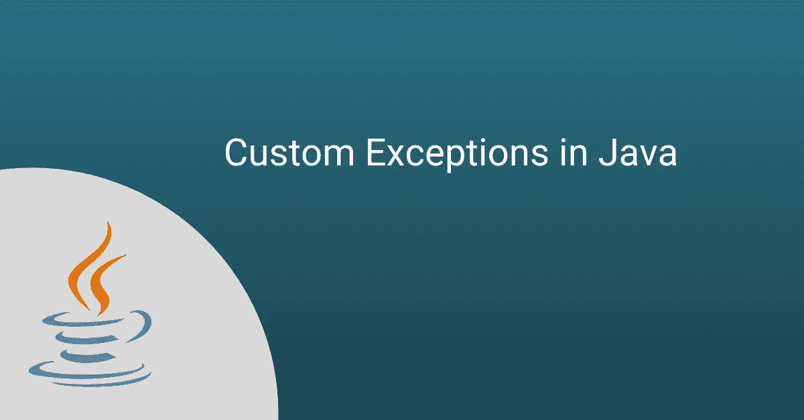
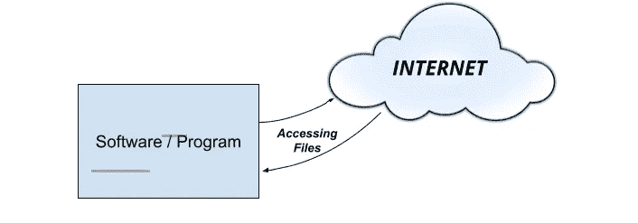

# Java 中的自定义异常

> 原文：<https://medium.com/nerd-for-tech/custom-exceptions-in-java-41cea0021aee?source=collection_archive---------0----------------------->

# **JAVA 中有哪些例外** **？**

例外是 Java 程序中的运行时错误。任何可能中断或扰乱程序正常执行流程的意外或不想要的事件都称为异常。

***举例-***

考虑应用程序从互联网访问文件，处理它，并执行任何任务。在这种情况下，程序的正常流程将是-

*   从互联网上访问文件。
*   *对该文件执行处理/计算。*
*   *使用处理后文件进行输出。*

现在，假设发生了任何意外事件，如互联网没有连接，从互联网上收到的文件被破坏，等等。然后应用程序如何对该文件执行处理。这可能是应用程序无法继续运行的情况，因为我们没有指示应用程序在这种情况下应该做什么。所以应用程序会异常终止。这是原因之一，程序异常终止的原因可以有很多。

这里，意外事件是例外。而为了避免应用程序的这种异常行为，我们需要显式地定义应用程序，以及它应该如何继续执行，这被称为 ***异常处理*** 。

现在对于同一个程序。使用异常处理的应用程序的执行流程将是-

*   从互联网上访问文件。
*   *如果文件接收成功，则对该文件进行计算/处理。*
*   否则，显示错误。

通过添加异常处理程序，应用程序将不会异常终止。 *JAVA 使用****try&catch****关键字进行异常处理。*

# **JAVA 中的自定义异常是什么-**

Java 中有两种类型的异常。 ***选中******未选中*** 异常。Java 为这种类型的异常定义了一些类，如***artithmetice exception、FileNotFoundException、ArrayIndexOutOfBoundExeption***等。但是这些预定义的异常类有时对于我们开发的应用程序来说是不够的。因此，我们需要明确地定义程序，并定制需要处理的异常。

***示例—*** 考虑客户可以购买产品的在线购物应用。假设，任何客户试图向购物车中添加数量过多的单一产品，那么这种情况一定不会发生。我们需要在不影响程序执行的情况下，阻止客户向购物车中添加超过每个客户定义数量的相同产品。所以这里没有任何预定义的异常类，我们可以用来避免这种情况。在这里，我们必须定义一个定制的异常类来处理它，并向用户显示错误。

这些自定义异常主要用于应用程序的业务逻辑。它帮助开发人员避免编写太多的 ***if-else*** 块，并组织应用程序代码。

# ***在 JAVA 中创建自定义异常的步骤-***

1.  根据需求创建一个名为的类。并且这个类应该继承异常类。

> 公共类 OverLimitQuantityException 扩展了异常{
> }

2.创建自定义异常类的构造函数。

> 公共类 OverLimitQuantityException 扩展异常{
> OverLimitQuantityException(){
> }
> OverLimitQuantityException(字符串消息){
> }
> }

**注** *—构造函数可以参数化，也可以不参数化。它基于您在抛出异常之前需要传递的消息。这里为了举例，我们取了两个构造函数。*

3.使用 super()关键字从自定义异常类构造函数调用父类(*异常类*)构造函数。

> 公共类 OverLimitQuantityException 扩展异常{
> OverLimitQuantityException(){
> super()；
> }
> OverLimitQuantityException(字符串消息){
> super(消息)；
> }

**注意—** *在参数化的构造函数中，我们传递的消息显示为异常消息被传递给异常类构造函数。*

通过这些步骤，自定义异常被创建并准备在程序中使用。现在，为了在程序中创建这个定制异常的对象，我们需要使用 **throw** 关键字，这将创建定制异常的对象，并开始将对象传递给 JVM 以引发异常。所以应该是-

> if(引发自定义异常的条件){
> 抛出新的 OverLimitQuantityException("不能购买超过 x 数量")；
> }

**注意—** *具有这些条件的方法必须通过方法声明使用 throws CustomException 声明为检查异常，因此它将成为检查异常，因此它必须通过调用抛出此异常的方法使用****try&catch****关键字来处理。*

**现在让我们在工作中理解这些-**

在[**interview bit**](https://www.interviewbit.com/online-java-compiler/)**上运行此代码。**

**解释-**

我们已经用构造函数声明了自定义异常类，该构造函数通过使用 super()关键字调用异常类构造函数来启动异常。然后我们有一个将数量添加到购物车的方法，该方法基于数量检查抛出自定义异常。而这个方法抛出异常，所以我们需要在方法声明中显式地定义它。如果客户希望添加的数量超过 2，此方法将引发异常。在方法调用期间，我们需要用 **try & catch** 来处理它，这有助于识别所引发的异常

# **结论-**

自定义异常是由程序员在程序中明确定义的异常。它可以通过定义从基异常类继承的类来创建。

## ***创建自定义异常的提示-***

*   定义一个以 Exception 关键字结尾的类名，尽管这并不重要，但却是一个很好的编程实践。
*   传递可识别的异常消息，因为其他开发人员很容易理解。

自定义异常的主要好处是，它有助于程序员编写清晰的业务逻辑，并相应地处理错误。它避免了在程序中编写不必要的多个 if-else 条件。