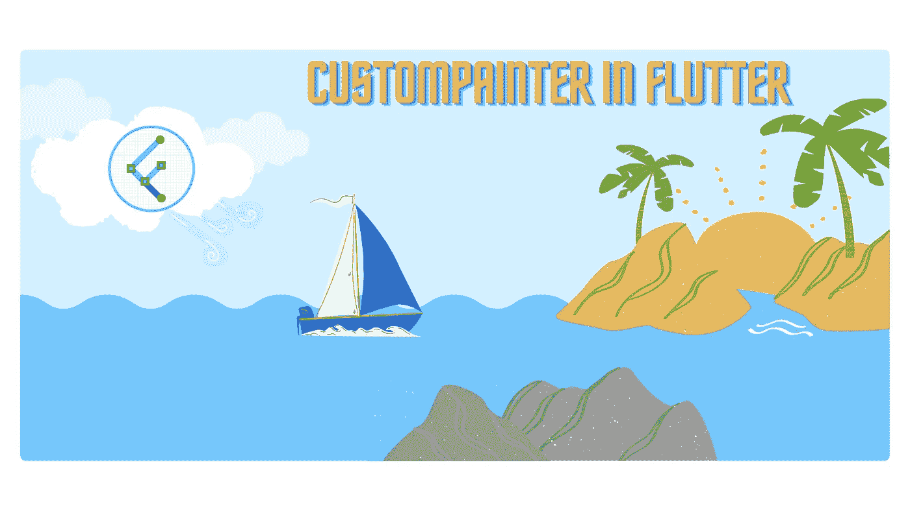
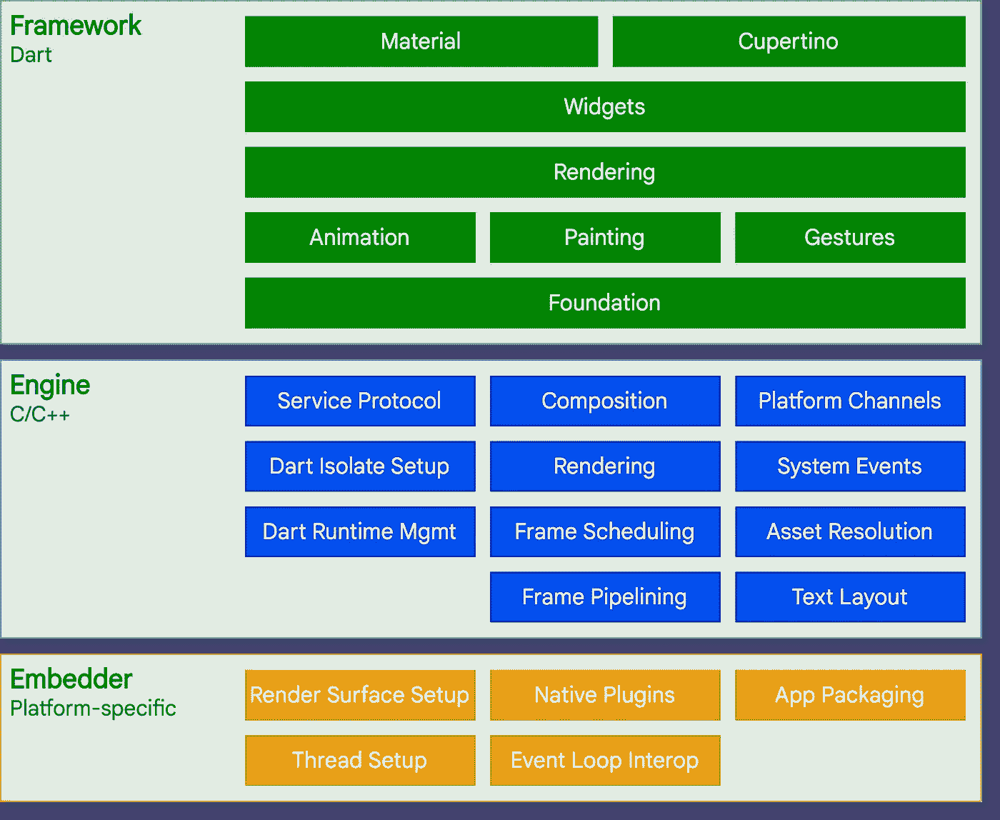
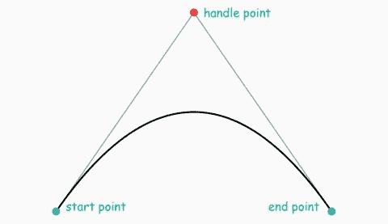

# 飘动中的定制画家

> 原文：<https://medium.com/nerd-for-tech/custom-painter-in-flutter-7d36af4dcabb?source=collection_archive---------0----------------------->

## **在绘画阶段提供画布的小工具**



今天我们将讨论自定义画师，首先我们将了解何时雇佣自定义画师，自定义画师如何工作，最后但同样重要的是，我们将了解一些 flutter 自定义画师的项目。

什么是自定义画师，一般应该在什么时候使用？自定义画师能够直接在 flutter 的画布上绘画，几乎所有的小部件都使用绘画层，如果你还记得 flutter 的架构，在小部件下面有一个绘画层。



这意味着你不一定需要一个小部件来在画布上绘制一些东西，允许你直接在画布上创建点、路径和弧等东西，并在其上绘制。


所以想象一些小部件或一些想法，一个标志或你想动画自定义画家的一个完美的选择，好了，现在我们已经涵盖了你现在知道什么时候使用自定义画家。

**什么是定制漆？**

Flutter SDK 中的自定义 Paint 小部件允许您在画布上绘制不同的形状。它包含以下属性:

*   `painter`:孩子画之前，画家先画。在这种情况下，有必要扩展 Custom Painter。
*   `size`:这个自定义画师的大小最初等于 Size.zero，也就是说如果没有定义子体或者大小，就不会出现。
*   `Foreground Painter: The painter who paints after the children.`它还需要一个扩展类`Custom Painter`的类。
*   `child`:该小部件树下的小部件。

使用自定义绘制时，您有两种选择:要么指定不带子级的 size 属性，要么使用子级属性为其提供一个小部件。

自定义画师实际上是如何工作的？这是一个可以用自定义 painter 类扩展的类，可以像使用任何其他小部件一样使用它，但重要的是周围小部件的大小和高度将作为画布大小传递给自定义 painter。

我们马上会看到这意味着定制画师由两个方法组成，即 **paint** 方法和它们应该 **repaint** 方法。

**paint** 方法获取画布和其中父小部件的大小，您现在可以用它来绘制画布，这是一个图形表示，您可以用它来直接执行命令，如绘制圆绘制线绘制路径。

虽然 size 给出了包含它的小部件的高度和大小，但这并不意味着您不能在这个小部件之外进行绘制，而是给了您实际的 converse 应该有多大的指示。

如果你从零点零零开始，你就在画布的左上方，从那里你可以开始画任何你想画的地方，所以现在就画这个方法。

我们对 shouldRepaint 的讨论将在稍后进行，因为我们将绘制一些东西，但是现在让我们快速地看一下 shouldRepaint 方法。ShouldRepaint 方法是一个每次类被重新初始化时都会被调用的方法。因此，每当你滚动窗口小部件或窗口小部件树，处理那个类，然后返回到它，它检查我是否应该重画这个窗口小部件，给你一些控制你是否想一直重画它。

有可能随机的事情发生在它身上，或者你在我告诉你的时候渲染它，甚至永远不再渲染它，所以如果它一旦被绘制和重用，你就可以大大提高性能。

好的，但是再一次回到这里的绘画方法，我们现在要在画布上绘画。

```
canvas.drawPoints(PointMode.points, points, paint1);
```

因此，我们使用 **canvas.draw** path，例如，我们有两个类，第一个是我们必须初始化的路径，在路径中，我们给出关于我们想要如何绘制线的信息。

所以从 a 点到 b 点，然后我们要画一条弧线，之后我们要从 c 点到 d 点，这是我们要画线的路径信息。

另一方面，我们有 **paint** 类，paint 类给出关于颜色样式和大小的信息，例如你想要的笔画，如果我们说画布点绘制路径，那么我们必须首先传入路径，然后再传入 paint 来绘制这条线，正如你可以立即在应用程序中看到的，这些线显示正确，然后有可能绘制文本，这样就有意义了。

有一个**文本画师**类，你也可以使用它来直接绘制文本，所以如果你不想写每一行，你想为你的文本做每一行，你可以使用文本画师，它已经为你做了同样的事情，并有一些预定义的类。

我已经提到过**弧**什么是弧，艺术就是你想要画的圆，所以弧是你可以画的半圆，如果你有两个点，



点 a 和点 b，一条弧线是从那里到那里的一个半圆，你可以输入，比如半径和深度之类的信息，来很容易地画出这条弧线，这样你就画出了你的弧线。

你可以从那里画出你想画的任何地方。你可以做的另一件事是贝塞尔曲线，如果你从未听说过它，我发现它实际上非常有趣，因为我通常在 Photoshop 中使用它，每当你使用钢笔工具时，你可以从一个点移动到另一个点，如果你用钢笔工具持续点击它并拖动它，那么你可以看到曲线出现，这就是贝塞尔曲线 它出现了一个新的点，a 和 b 的第三个点，你得到了一个公平点，它给出了你想要如何使曲线发生的信息，你可以很好地沿着它移动。

因此，我们可以看到自定义画师是如何工作的。我们都知道，当你重新渲染很多东西时，如果你不这样做，你需要正确地重新绘制，如果你使用很多，那可能会影响你的性能。不要那样做。总的来说，理解并更深入地理解它会带来很多乐趣，所以我强烈建议你正确地做好这一切。这就是我想简单描述的自定义画师的所有信息。如果你发现任何错误的信息或误导，请在下面指出或评论。

如果你做错了什么？请在评论中提及。我很想进步。我是**希尔什·舒克拉**。创意开发人员和技术爱好者。你可以在上找到我

**YouTube:**https://3c5.com/3gbzm

**推特:**https://mobile.twitter.com/shirsh94?s=09

**领英:**[https://www.linkedin.com/in/shirsh-shukla-95b85786](https://www.linkedin.com/in/shirsh-shukla-95b85786)

**stack overflow:**[https://stackoverflow.com/users/13098417/shirsh-shukla](https://stackoverflow.com/users/13098417/shirsh-shukla)

**组合:**【https://shirsh94.github.io/shirsh-portfolio.github.io/】T21

了解更多详情。

祝您愉快！🙂