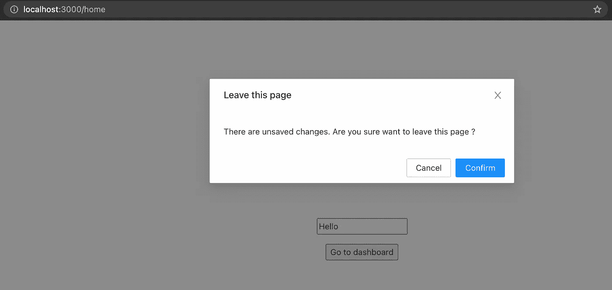

# 自定义 React 路由器提示

> 原文：<https://medium.com/nerd-for-tech/custom-react-router-prompt-d325538b4d2b?source=collection_archive---------0----------------------->

如何使用 **react-router** 实现导航自定义提示

# 自定义提示有什么用？

大多数 react 项目的组件都遵循 UI [设计系统](https://uxdesign.cc/everything-you-need-to-know-about-design-systems-54b109851969)。为了在整个应用程序中实现相同的设计一致性，他们重用了组件。然而，为了在存在一些未保存的用户数据的情况下阻止导航，默认浏览器提示是阻止用户导航到不同路线的最常见和最容易的方式。但是弹出窗口与您的库组件不匹配。

没有官方文档明确提到如何使用自定义模态代替默认的`react-router` **提示**。

# 解决办法

要获得所需的结果，只需遵循几个简单的步骤。每一步都包含 100%的工作代码片段。您可以在您的项目中使用它。

## 第一步

我们需要禁用或阻止默认的浏览器提示。这可以通过向**浏览器**的`getUserConfirmation`函数属性传递一个空回调来完成。

## 第二步

现在让我们使用`react-router-dom`和 [ant design](https://ant.design/components/modal/) 组件库中的`useHistory`钩子为`modal`组件创建一个定制的`RouterPrompt`组件。

`history.block`允许我们阻止导航离开当前页面。向 block 方法传递空函数或空参数会继续导航，不会阻塞或中断导航。

`useEffect`用于处理提示的初始状态，是否使用`when`道具显示。

`handleOK`和`handleCancel`回调用于控制导航的确认和取消。

## 第三步

让我们创建两个用于页面间导航的示例组件。比如，设第一个分量为`Dashboard.jsx`，第二个分量为`Home.jsx`。

`home`组件包含我们定制的`RouterPrompt`组件。该提示在页面变化时触发，也基于`when`属性。`when`道具用于有条件地触发提示。例如，如果`when`道具设置为`true`，则每次页面导航时都会显示提示(从家乡路线到其他路线或向前/向后导航)。

`onOK`和`onCancel`回调属性必须返回布尔值，以便继续路由。

## 结果

## 结论

您可以使用任何组件库的模式，甚至是您自己的自定义模式或默认浏览器提示。但是在实现`history.block`时要小心。

通过遵循上述步骤，您可以获得想要的解决方案。代码 100%正常工作。您可以将代码片段复制到您的应用程序中以节省时间。

## 参考

1.  [https://reactrouter.com/web/api/Hooks/usehistory](https://reactrouter.com/web/api/Hooks/usehistory)
2.  [https://reactrouter.com/web/api/history](https://reactrouter.com/web/api/history)