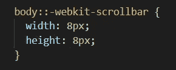
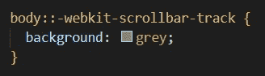
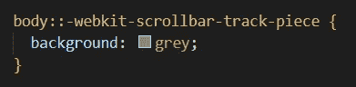
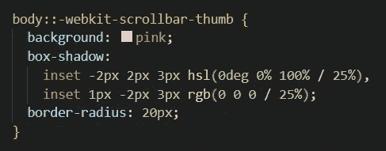
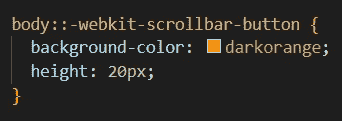
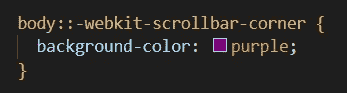
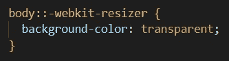
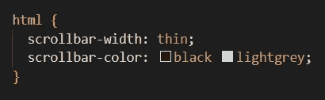

# 自定义滚动条| CSS

> 原文：<https://medium.com/nerd-for-tech/custom-scrollbars-css-8449666cba2c?source=collection_archive---------11----------------------->

嘿大家好！如果你还不知道我是谁，我叫伊戈尔。我是纽约市的一名软件工程师，刚刚从熨斗学校的软件工程训练营毕业。

毕业后我做的第一件事就是开始创建自己的投资组合网站。在我的研究阶段，我花了很多时间查看其他人的网站，以获得布局、颜色主题和风格选择的灵感。他们说美在于细节，我注意到的一个小细节是自定义滚动条。所以我想应该解释一下如何制作一个！

# *WebKit-滚动条*

您可以通过使用供应商前缀伪元素 *webkit-scrollbar* 来设计基于 [webkit](https://www.dummies.com/web-design-development/site-development/common-webkit-browsers/) 的浏览器(Chrome、Edge、Safari)使用的滚动条。这允许你设置滚动条背景的*宽度*、*高度*和*颜色*。

# ***WebKit-滚动条-轨道***

使用 *webkit-scrollbar-track 来设计完整的进度条，包括滚动条的手柄。*

# *WebKit-滚动条-跟踪件*

使用*WebKit-scroll bar-track-piece 来设置未被可拖动手柄覆盖的进度条部分的样式。*

# *WebKit-滚动条-缩略图*

使用 *webkit-scrollbar-thumb 来设计用于上下移动页面的可拖动手柄。*

在上面的例子中，我将颜色改为粉红色，添加了两个嵌入框阴影(一个亮一个暗)，并添加了一个边框半径，使拇指成为圆柱形。

# *WebKit-滚动条-按钮*

你可以使用 *webkit-scrollbar-button 来设置上下按钮的样式。*

# *WebKit-滚动条-角落*

当你在 y 轴和 x 轴上都有滚动条时，你可以使用 *webkit-scrollbar-corner 来添加样式。*

# *webkit-resizer*

当您想要在许多可调整大小的元素(如文本区域输入)上添加样式时，请使用 *webkit-resizer。*

# 火狐浏览器

如果你想为 Firefox 定制滚动条，你可以使用*滚动条宽度*、*滚动条颜色、*和*滚动条-槽*属性来限制选项。

# *滚动条宽度*

*滚动条宽度*属性支持*自动、细*和*无。*

# *滚动条颜色*

*滚动条颜色*属性支持*自动、暗、亮、*和(颜色颜色)。

第一种颜色是可拖动手柄的颜色，第二种是进度条的颜色。

# 滚动条-槽

当 *scrollbar-gutter* 属性设置为 none 并且您想要控制为滚动条(gutter)保留的空间时，该属性与 *scrollbar-width* 属性一起使用。这超出了本入门教程的范围，但是你可以在这里找到更多关于[的信息](https://developer.mozilla.org/en-US/docs/Web/CSS/scrollbar-gutter)！

要查看自定义滚动条的实时版本，请在您选择的 [webkit](https://www.dummies.com/web-design-development/site-development/common-webkit-browsers/) 浏览器或 FireFox 中查看我的作品集网站[此处](http://www.igorveyner.com)！