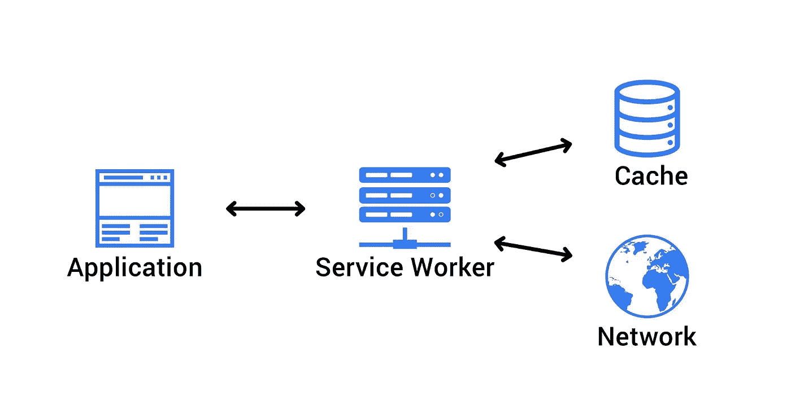

# 使用 esbuild 的任何应用程序中的自定义服务人员

> 原文：<https://medium.com/nerd-for-tech/custom-service-worker-in-any-app-with-esbuild-6b5a8a20fa12?source=collection_archive---------3----------------------->

最近，我一直在探索在 web 应用程序中使用服务人员。用例包括[大规模预取内容](https://docs.layer0.co/guides/prefetching)、[加速你的网站](https://www.builder.io/blog/how-we-cut-99-percent-js-with-qwik-and-partytown)、[处理故障转移](https://dexecure.com/blog/beyond-offline-other-interesting-use-cases-for-service-workers-2/#automated-failover)等等。我不断面临的一个问题是需要根据框架调整我的服务人员，以后不会了。下面让我们看看我上周挖到了什么金子👇🏻

# 从哪里开始的？

我试图用 Angular 11 建立一个定制的服务工作者，向导[https://angular.io/guide/service-worker-getting-started](https://angular.io/guide/service-worker-getting-started)让我安装 angular/pwa 模块，阅读[https://angular.io/guide/service-worker-communications](https://angular.io/guide/service-worker-communications)然后适应 Angular 创建服务工作者的方式。嗯，对我来说似乎有很多工作要做，所以我开始创建一个框架无关的过程来添加一个定制服务人员。回想起来，我认为 Vue 2 和 Vue 3 的[要简单得多，但感觉像是一种黑客的方式。](https://rishi.app/blog/enabling-service-worker-with-vue-2-and-vue-3)

(什么是[服务人员](https://blog.sessionstack.com/how-javascript-works-service-workers-their-life-cycle-and-use-cases-52b19ad98b58)？)

# 给我看看解决方案！

步骤 0。安装 [**esbuild**](https://esbuild.github.io/getting-started/#install-esbuild)

第一步。创建 **workbox-config.js:**

点击此处了解更多有关工具箱配置的信息:

第二步。创建 **compile_sw.js:**

第三步。**编译注入:**

第四步。**登记服务人员** ✨

就这些，好好享受吧！希望这有帮助！

# **参考文献**

*   [https://developers . Google . com/web/tools/work box/modules/work box-web pack-plugin](https://developers.google.com/web/tools/workbox/modules/workbox-webpack-plugin)
*   [https://github.com/evanw/esbuild/issues/466](https://github.com/evanw/esbuild/issues/466)
*   [https://github.com/evanw/esbuild/issues/12](https://github.com/evanw/esbuild/issues/12)
*   【https://github.com/evanw/esbuild/issues/69 号
*   【https://github.com/evanw/esbuild/issues/312 