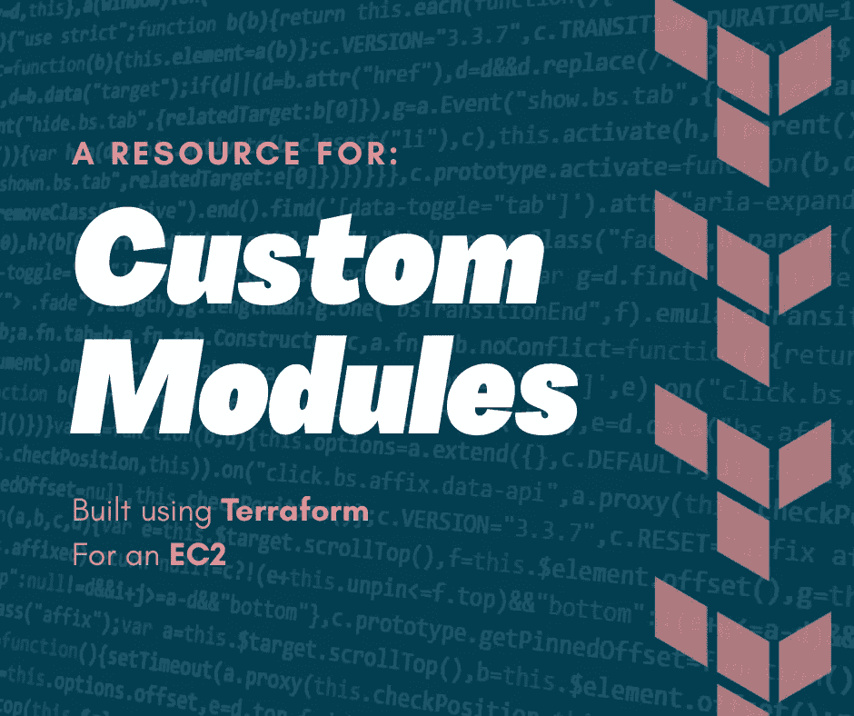

# 定制 Terraform EC2 模块

> 原文：<https://medium.com/nerd-for-tech/custom-terraform-ec2-module-113fdebe7281?source=collection_archive---------1----------------------->

在这里建立自定义 EC2 模块，这样我们就可以在未来的项目中重用我们的代码，并与朋友分享我们的模块。

今天，我们有一个令人兴奋的项目要做！我们将使用 Terraform 构建一个带有 Amazon Linux AMI 的定制 EC2 实例模块。我们还将创建一个安全组模块，分配给我们的 EC2，允许 HTTP web 访问，并为我们提供 SSH 到该实例的能力。我们将使用…