# 客户流失预测:面向初学者的机器学习项目

> 原文：<https://medium.com/nerd-for-tech/customer-churn-prediction-a-machine-learning-kaggle-project-10343af7f394?source=collection_archive---------0----------------------->


资料来源:Onur Binay，Unsplash

本案例研究是一家电信公司预测客户流失的各种机器学习工具和技术的实施。这篇博客是写给任何想学习如何使用 python 进行客户流失分析的人的。

**学习:**

*   类别不平衡对机器学习模型的影响。
*   使用 SMOTE 创建合成样本并对少数类进行上采样。
*   机器学习模型中的超参数调整

**步骤:**

1.  问题描述:了解电信流失预测问题。
2.  探索性数据分析:使用各种可视化技术来掌握数据。发现模式，观察和分析特征。
3.  训练测试分割:将数据分割成训练集和测试集。
4.  特征化:将基于文本的分类特征转换为数字特征，并执行特征标准化。
5.  模型:在训练数据上训练监督学习模型，如 SVM、随机森林和 XgBOOST，并在测试数据上检查它们的性能。
6.  结论:用精确的要点结束项目。

# 问题描述:

*   客户流失是当客户决定停止使用企业服务时使用的术语。企业一直在做客户流失分析，因为如果他们知道哪些客户将要离开，这对一个公司非常有帮助。
*   这个项目的目的是在可用数据上训练一个机器学习模型，以训练一个机器学习模型，该模型将高精度地预测哪些客户将流失，这反过来将帮助企业所有者做出有用的营销决策。
*   可以在 Kaggle 上找到原项目详情:[https://www . ka ggle . com/c/customer-churn-prediction-2020/overview](https://www.kaggle.com/c/customer-churn-prediction-2020/overview)
*   点击这里查看该项目的源代码:[https://github.com/S-G-001/customer_churn_prediction](https://github.com/S-G-001/customer_churn_prediction)

**数据概述:**

训练数据集包含 4250 个样本。每个样本包含 19 个特征和 1 个指示样本类别的布尔变量“churn”。19 个输入特征和 1 个目标变量是:


**业务限制和要求:**

*   他们没有严格的延迟要求
*   要求高精度
*   由于数据是不平衡的，我们还需要跟踪召回和混淆矩阵。

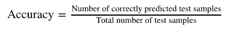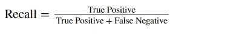

# 探索性数据分析:

**加载数据并浏览高级统计:**

```
# Load the Data and take a look at the first three samples
data = pd.read_csv('train.csv')
data.head(3)
```

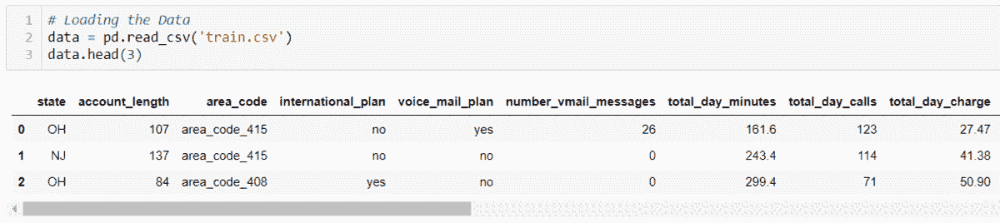

前三个样本— GIF

```
# High level statistics of Numerical features
data.describe()
```

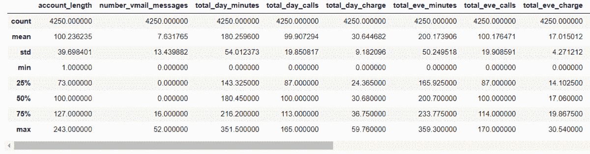

高级统计— GIF

观察:训练数据中的特征在方差和均值方面有很大不同。如果使用利用距离测量的模型，执行均值居中和方差缩放将是一个好主意。

**检查班级不平衡:**

我通过计算每个类别的样本数来完成，并绘制出搅拌样本与未搅拌样本的百分比。

```
*# Checking Imbalance in Data*
not_churned = data[data['churn']=='no']['churn'].count()
churned = data[data['churn']=='yes']['churn'].count()
print('not_churned: ',not_churned,', churned: ',churned)

fig = plt.figure(figsize=(5,5)) 
plt.pie([not_churned,churned], labels=['not_churned','churned'],autopct='**%.2f**')
plt.title('Pie Chart Customers Churned v/s Not Churned')
plt.show()
```

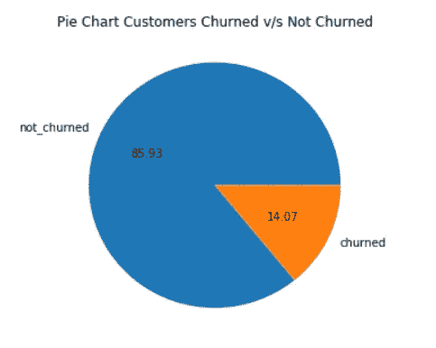

*观察:这两类数据存在明显的不平衡。*

**可视化两个类的一些特征的分布:**

*   帐户 _ 长度

```
*# Plotting PDF account length for both the class labels*
ac_len_churned = data[data['churn']=='yes']['account_length']
ac_len_not_churned =data[data['churn']=='no']['account_length']
sns.distplot(ac_len_churned,label='Churned')
sns.distplot(ac_len_not_churned,label='Not_churned')
plt.title('Distribution of Account Length for Churned and  Not_Churned')
plt.legend()
plt.show()
```

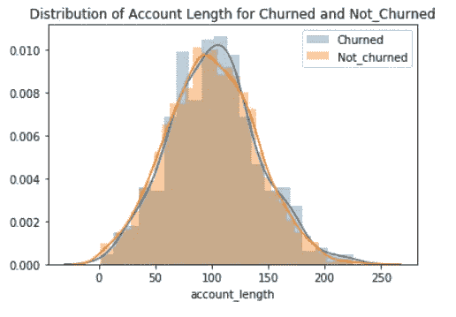

*观察:搅动实例的 account_length 分布和未搅动实例的 account_length 分布几乎重叠。*

*   总计 _ 天 _ 费用

```
*# Plotting PDF of day charge for both the class labels*
day_charge_churned = data[data['churn']=='yes']['total_day_charge']
day_charge_not_churned =data[data['churn']=='no']['total_day_charge']
sns.distplot(day_charge_churned,label='Churned')
sns.distplot(day_charge_not_churned,label='Not_churned')
plt.title('Distribution of day charge for Churned and Not_Churned')
plt.legend()
plt.show()
```

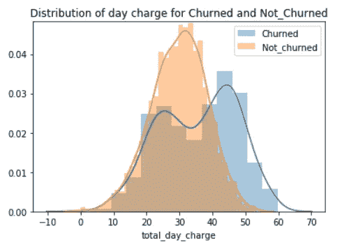

*观察:橙色 pdf(针对非搅动类)和蓝色 pdf(针对搅动类)没有完全重叠。当 day_charge 高于 40 时，更多数量的样本被搅动。*

*   总费用

```
*# Plotting PDF of eve_charge for both the class labels* eve_charge_churned = data[data['churn']=='yes']['total_eve_charge'] eve_charge_not_churned =data[data['churn']=='no']['total_eve_charge'] sns.distplot(eve_charge_churned,label='Churned') sns.distplot(eve_charge_not_churned,label='Not_churned') plt.title('Distribution of eve_charge for Churned and Not_Churned') plt.legend() 
plt.show()
```

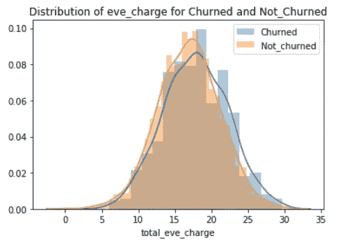

*   总 _ 夜 _ 费

```
*# Plotting PDF of night_charge for both the class labels*
night_charge_churned = data[data['churn']=='yes']['total_night_charge']
night_charge_not_churned =data[data['churn']=='no']['total_night_charge']
sns.distplot(night_charge_churned,label='Churned')
sns.distplot(night_charge_not_churned,label='Not_churned')
plt.title('Distribution of night_charge for Churned and Not_Churned')
plt.legend()
plt.show()
```

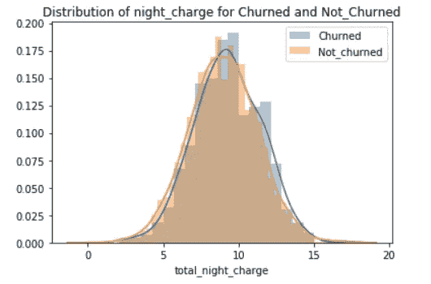

*   总费用

```
*# Plotting PDF of intl_charge for both the class labels*
intl_charge_churned = data[data['churn']=='yes']['total_intl_charge']
intl_charge_not_churned =data[data['churn']=='no']['total_intl_charge']
sns.distplot(intl_charge_churned,label='Churned')
sns.distplot(intl_charge_not_churned,label='Not_churned')
plt.title('Distribution of intl_charge for Churned and Not_Churned')
plt.legend()
plt.show()
```

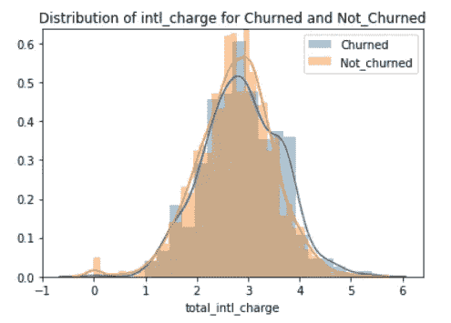

*   数字邮件消息

```
*# Plotting PDF of no_vmail_charge for both the class labels*
vmail_msgs_churned = data[data['churn']=='yes']['number_vmail_messages']
vmail_msgs_not_churned =data[data['churn']=='no']['number_vmail_messages']
sns.distplot(vmail_msgs_churned,hist=**False**,label='Churned')
sns.distplot(vmail_msgs_not_churned,hist=**False**,label='Not_churned')
plt.title('Distribution of number_vmail_messages for Churned and Not_Churned')
plt.legend()
plt.show()
```

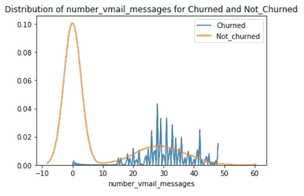

*观察:当语音邮件消息的数量高于 15 时，可以看到大多数搅动的样本。*

**检查配对图:**

```
*# Building pair plot*
sns.pairplot(data,vars=['account_length','number_vmail_messages', 'total_day_charge','total_eve_charge','total_night_charge',            'total_intl_charge','number_customer_service_calls'],hue='churn')
```

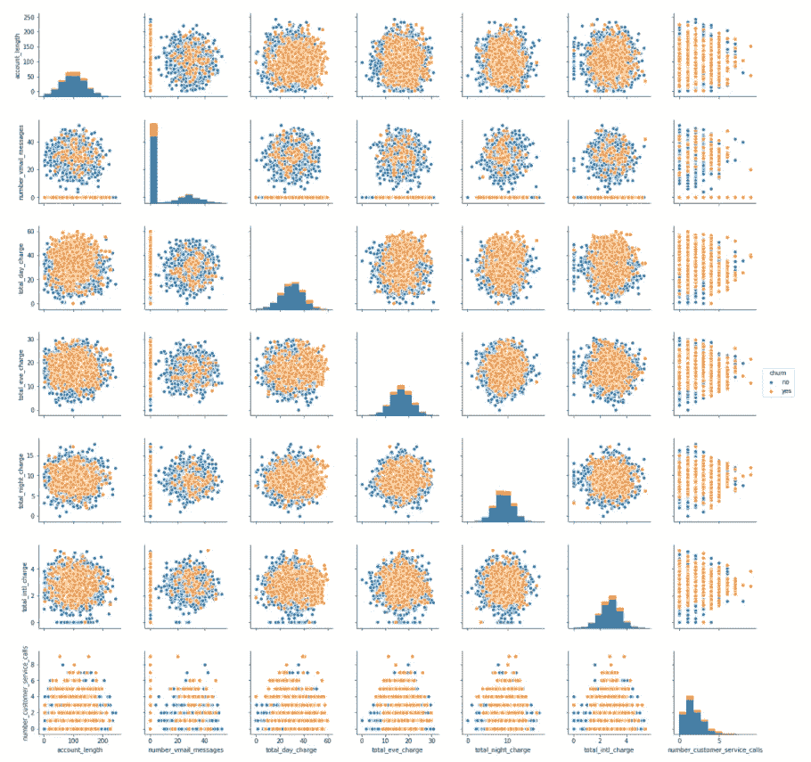

*观察:对于总日费、总夜费和总夜费等特征，这两个类别有明显的区别*

**特征关联:**

构建相关矩阵

```
sns.set(style="white", font_scale =1.5)
corr = data.corr()

mask = np.zeros_like(corr, dtype=np.bool)
mask[np.triu_indices_from(mask)] = **True**

f,ax = plt.subplots(figsize=(14,8))
f.suptitle('Correlation_Matrix')

*#cmap = sns.diverging_palette(220, 10, as_cmap=True)*

sns.heatmap(corr, mask=mask, cmap='YlGnBu', vmax=.3, center=0,
            square=**True**, linewidths=.5, cbar_kws={"shrink": .5})
```

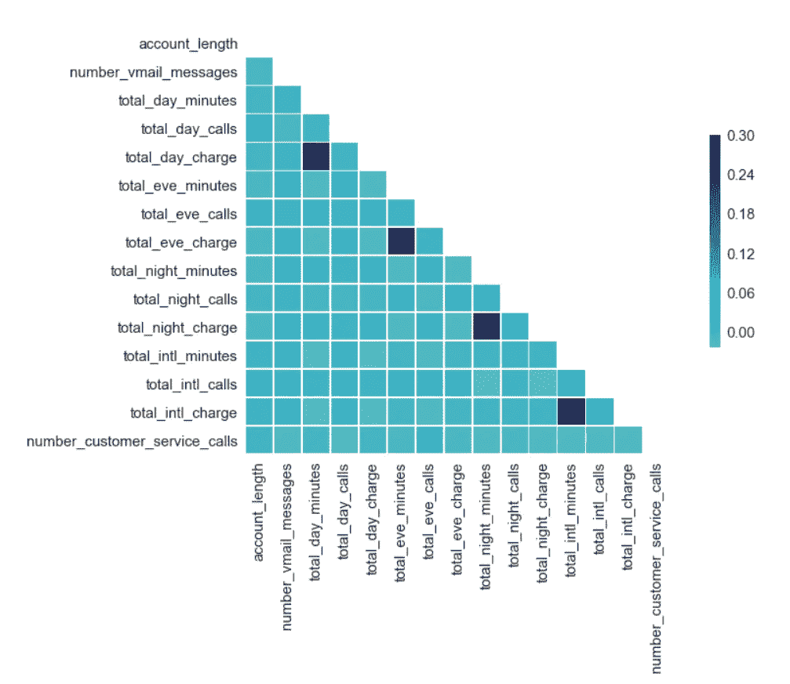

我们应该删除高度相关的特征

```
*# Removing  the highly correlated features*
data = data.drop(['total_day_minutes','total_eve_minutes','total_night_minutes','total_intl_minutes'], axis=1)
```

# 列车测试分离:

首先将目标变量中的字符串类型类标签从“是”“否”转换为整数 1 和 0。

> 为了避免数据泄露，在进行特征工程之前分割训练集和测试集是一个很好的做法。

使用 sklearn 的 train_test_split 将数据拆分为训练集和测试集。10%的测试规模对于检查模型的性能似乎足够合理了。

```
data.churn.replace(['yes','no'],[1,0],inplace=**True**)
Y = data['churn']
X = data.drop('churn', axis=1)x_train,x_test,y_train,y_test = train_test_split(X,Y,test_size=0.10,stratify=Y,random_state=11)
print('Shape of x_train and y_train: ',x_train.shape, y_train.shape)
print('Shape of x_test and y_test: ',x_test.shape, y_test.shape)
```

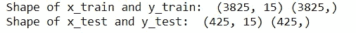

# 特色化:

使用一个热编码将分类特征转换为数字:

在使用 CoutVectorizer()时，我们应该对训练和测试数据分别进行 fit_transform，以避免泄漏。

**状态:**

```
vectorizer = CountVectorizer()
train_state = vectorizer.fit_transform(x_train['state'].values)
test_state = vectorizer.fit_transform(x_test['state'].values)
train_state.shape
```

(3825, 51)

**区号:**

```
vectorizer = CountVectorizer()
train_area_code = vectorizer.fit_transform(x_train['area_code'].values) 
test_area_code = vectorizer.fit_transform(x_test['area_code'].values)
print(vectorizer.get_feature_names())
```

['区域代码 _408 '，'区域代码 _415 '，'区域代码 _510']

```
train_area_code.shape
```

(3825, 3)

**国际 _ 计划:**

```
vectorizer = CountVectorizer()
train_international_plan = vectorizer.fit_transform(x_train['international_plan'].values)
test_international_plan = vectorizer.fit_transform(x_test['international_plan'].values)
print(vectorizer.get_feature_names())
```

['否'，'是']

```
# Creating a separate list of the new and more descriptive feature names. These names will be later used to get feature importance. intnl_fea = ['intl_plan_no','intl_plan_yes']
print(intnl_fea)
```

['国际计划否'，'国际计划是']

```
train_international_plan.shape
```

(3825, 2)

**语音 _ 邮件 _ 计划:**

```
vectorizer = CountVectorizer()
train_voice_mail_plan = vectorizer.fit_transform(x_train['voice_mail_plan'].values) 
test_voice_mail_plan = vectorizer.fit_transform(x_test['voice_mail_plan'].values) 
print(vectorizer.get_feature_names())
```

['否'，'是']

```
# Creating a separate list of the new and more descriptive feature names. These names will be later used to get feature importance.voice_mail_plan_fea = ['voice_plan_no','voice_plan_yes']
print(voice_mail_plan_fea)
```

['语音 _ 计划 _ 否'，'语音 _ 计划 _ 是']

**数值特征:**

首先手动输入列表中所有数字特征的名称，然后创建仅包含数字特征的新训练和测试数据框。然后应用 StandardScaler()来标准化新的数字数据框。

或者你可以标准化所有的特性(更好的选择)。我只标准化了那些原本是数字的特征。

```
numerical_fea = ['account_length','number_vmail_messages','total_day_calls','total_day_charge', 'total_eve_calls', 'total_eve_charge', 'total_night_calls', 'total_night_charge', 'total_intl_calls', 'total_intl_charge', 'number_customer_service_calls']train_numerical = x_train[numerical_fea]
test_numerical = x_test[numerical_fea]*# Scaling the data using sklearn's Standard scaler*
scaler = StandardScaler()
train_numerical_scaled = scaler.fit_transform(train_numerical)
test_numerical_scaled = scaler.fit_transform(test_numerical)
```

**合并特征:**

使用 hstack()水平合并特征。然后制作一个包含所有特性名称的列表，以便稍后用于获取特性重要性。

```
x_train_merged = hstack((train_numerical_scaled,train_voice_mail_plan,   train_international_plan,train_area_code,train_state))

x_test_merged = hstack((test_numerical_scaled,test_voice_mail_plan,test_international_plan, test_area_code,test_state))# list of all features
all_features = numerical_fea + voice_mail_plan_fea + intnl_fea + area_code_fea + state_fea
```

# 型号:

我们将在所有模型中遵循的一般步骤:

*   创建超参数字典。
*   实例化分类器。
*   定义网格对象。在 GridSearchCV 中提供超参数字典。保持 return_train_score = True，这样我们就可以得到训练精度。
*   对训练数据进行网格拟合，得到网格搜索的结果。
*   对照交叉验证准确度绘制训练准确度图，并选择超参数的最佳值。
*   使用通过网格搜索获得的最佳超参数来训练新的模型。
*   检查测试数据的性能。获取测试数据的准确率、召回率和混淆矩阵。
*   在列表中保存精确度和召回，以便稍后在项目结束时创建结论表。

1.  **)没有阶级平衡的 SVM**

创建一个没有类平衡的模型来创建一个基准模型。

```
*# Grid Search To Get Best Hyperparameters* 
parameters = {'C':[0.01,0.1,1,3,5,10]} 
svm_clf = SVC(random_state=43) 
grid = GridSearchCV(estimator=svm_clf, param_grid=parameters,scoring='accuracy',return_train_score=**True**,verbose=1) 
grid.fit(x_train_merged,y_train)  
cv_result = pd.DataFrame(grid.cv_results_)                        plt.scatter(cv_result['param_C'],cv_result['mean_train_score'])   plt.plot(cv_result['param_C'],cv_result['mean_train_score'],label='Train') plt.scatter(cv_result['param_C'],cv_result['mean_test_score']) plt.plot(cv_result['param_C'],cv_result['mean_test_score'],label="CV") 
plt.title('Hyperparameter vs accuracy') 
plt.legend() 
plt.xlabel('C') 
plt.ylabel('Accuracy') 
plt.show()
```

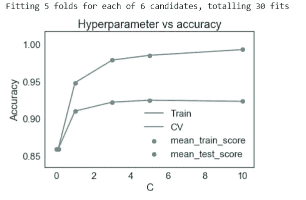

> 当训练和测试精度之间存在较大差距，并且测试精度没有显著提高时，模型开始过度拟合。

```
*# Best parameter chosen manually by observation using above plot, that gives the best test accuracy while keeping variance in check*best_parameter = 3
print("Best value of C: ", best_parameter)
```

最佳 C 值:3

```
*# Training the model again using the optimum parameters discovered*
svm_clf = SVC(C=best_parameter,random_state=43)
svm_clf.fit(x_train_merged,y_train)

result1 = ["1.","SVM","No class balancing"] # saving result in list
y_pred_tr = svm_clf.predict(x_train_merged)
print('Train accuracy SVM: ',accuracy_score(y_train,y_pred_tr))
result1.append(round(accuracy_score(y_train,y_pred_tr),2))

y_pred_test = svm_clf.predict(x_test_merged)
print('Test accuracy SVM: ',accuracy_score(y_test,y_pred_test))
result1.append(round(accuracy_score(y_test,y_pred_test),2))

recall = recall_score(y_test,y_pred_test)
print("Recall Score: ",recall)
result1.append(round(recall,2))
print("-----"*20)

cm = confusion_matrix(y_test,y_pred_test)
ax=plt.subplot();
sns.heatmap(cm, annot=**True**, fmt='d', linewidths=2, linecolor='black', cmap='YlGnBu',ax=ax)
ax.set_xlabel('Predicted')
ax.set_ylabel('Actual')
ax.set_ylim(2.0,0)
ax.set_title('Confusion Matrix')
ax.xaxis.set_ticklabels(['Neg','Pos'])
ax.yaxis.set_ticklabels(['Neg','Pos'])
plt.show()
```

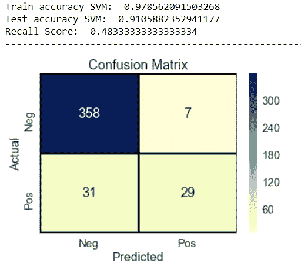

**2。)SVM —使用类别权重平衡的类别:**

Scikit learn 提供了一种方法来平衡 SVM 分类器内部的数据集，以保持 class_weight = 'balanced '。

```
*# Grid Search To Get Best Hyperparameters*
parameters = {'C':[0.01,0.1,1,3,5,10]}
svm_clf = SVC(class_weight='balanced',random_state=43)
grid = GridSearchCV(estimator=svm_clf, param_grid=parameters,scoring='accuracy',return_train_score=**True**,verbose=1)
grid.fit(x_train_merged,y_train)

cv_result = pd.DataFrame(grid.cv_results_)
plt.scatter(cv_result['param_C'],cv_result['mean_train_score'])
plt.plot(cv_result['param_C'],cv_result['mean_train_score'],label='Train')
plt.scatter(cv_result['param_C'],cv_result['mean_test_score'])
plt.plot(cv_result['param_C'],cv_result['mean_test_score'],label="CV")
plt.title('Hyperparameter vs accuracy')
plt.legend()
plt.xlabel('C')
plt.ylabel('Accuracy')
plt.show()
```

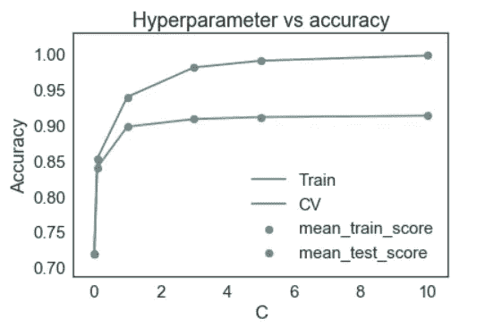

```
*# Best parameter chosen manually by observation.*
best_parameter = 3
print("Best value of C: ", best_parameter)
```

最佳 C 值:3

```
*# Training the model again using the optimal parameters discovered*
svm_clf =  SVC(C=best_parameter,class_weight='balanced', random_state=43)
svm_clf.fit(x_train_merged,y_train)

result2 = ["2.","SVM","Balanced using class weights"]
y_pred_tr = svm_clf.predict(x_train_merged)
print('Train accuracy SVM: ',accuracy_score(y_train,y_pred_tr))
result2.append(round(accuracy_score(y_train,y_pred_tr),2))

y_pred_test = svm_clf.predict(x_test_merged)
print('Test accuracy SVM: ',accuracy_score(y_test,y_pred_test))
result2.append(round(accuracy_score(y_test,y_pred_test),2))

recall = recall_score(y_test,y_pred_test)
print("Recall Score: ",recall)
result2.append(round(recall,2))
print("-----"*20)

cm = confusion_matrix(y_test,y_pred_test)
ax=plt.subplot();
sns.heatmap(cm, annot=**True**, fmt='d', linewidths=2, linecolor='black', cmap='YlGnBu',ax=ax)
ax.set_xlabel('Predicted')
ax.set_ylabel('Actual')
ax.set_ylim(2.0,0)
ax.set_title('Confusion Matrix')
ax.xaxis.set_ticklabels(['Neg','Pos'])
ax.yaxis.set_ticklabels(['Neg','Pos'])
plt.show()
```

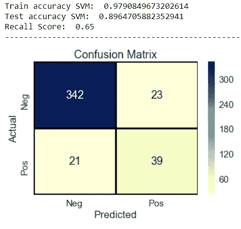

*平衡等级后，SVM 给出了更好的结果。与没有做任何平衡的模型 1 相比，准确率更高，召回率也更好。*

**3。)随机森林分类器**

RF 是使用一种称为 bagging(升压聚集)的集合技术创建的。在 RF 中，我们必须调整两个参数 max_depth(树的最大深度)和 n_estimators(森林中树的数量)

```
*# Grid Search To Get Best Hyperparameters*
parameters = {'max_depth':[5,10,20,50], 'n_estimators': [100,200,300,400,500]}
clf_rf = RandomForestClassifier(class_weight='balanced', random_state=43)      
grid = GridSearchCV(estimator=clf_rf,param_grid=parameters,scoring= 'accuracy',return_train_score= **True**,verbose=1)
grid.fit(x_train_merged,y_train)

print("-----"*20)
cv_result = pd.DataFrame(grid.cv_results_).sort_values(by= 'mean_train_score', ascending=**True**)params = list(cv_result['params'].astype(str))

plt.figure(figsize=(12,6))
plt.scatter(params,cv_result['mean_train_score'])
plt.plot(params,cv_result['mean_train_score'],label='Train')
plt.scatter(params,cv_result['mean_test_score'])
plt.plot(params,cv_result['mean_test_score'],label="CV")
plt.title('Hyperparameter vs accuracy')
plt.legend()
plt.xlabel('Hyperparametr combination Dict')
plt.xticks(rotation=90)
plt.ylabel('Accuracy')
plt.show()
```

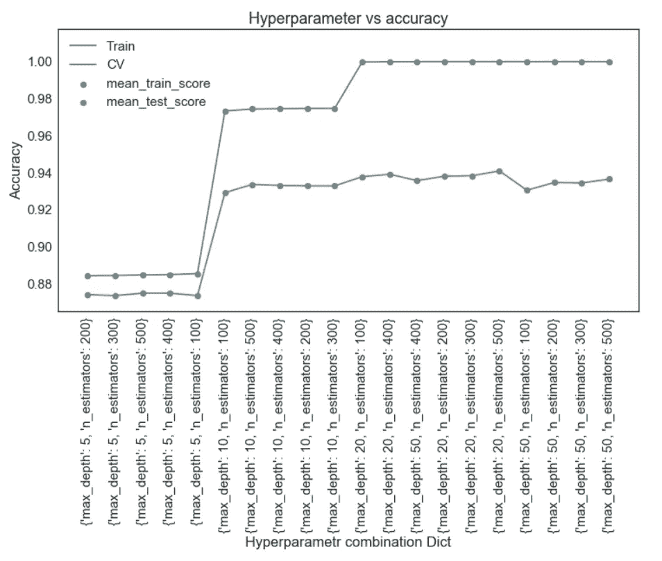

```
*# Best parameter chosen manually by observation that gives the best accuracy and keeps variance in check*best_max_depth = 10 
best_n_estimator = 300# Creat a new model with optimum hyperparametersclf_rf = RandomForestClassifier(max_depth=best_max_depth, n_estimators= best_n_estimator, class_weight ='balanced', random_state=43)
clf_rf.fit(x_train_merged,y_train)

result3 = ["3.","RF","Balanced using class weights"]
y_pred_tr = clf_rf.predict(x_train_merged)
print('Train accuracy RF: ',accuracy_score(y_train,y_pred_tr))
result3.append(round(accuracy_score(y_train,y_pred_tr),2))

y_pred_test = clf_rf.predict(x_test_merged)
print('Test accuracy RF: ',accuracy_score(y_test,y_pred_test))
result3.append(round(accuracy_score(y_test,y_pred_test),2))

recall = recall_score(y_test,y_pred_test)
print("Recall Score: ",recall)
result3.append(round(recall,2))
print("-----"*20)

cm = confusion_matrix(y_test,y_pred_test)
ax=plt.subplot();
sns.heatmap(cm, annot=**True**, fmt='d', linewidths=2, linecolor='black', cmap='YlGnBu',ax=ax)
ax.set_xlabel('Predicted')
ax.set_ylabel('Actual')
ax.set_ylim(2.0,0)
ax.set_title('Confusion Matrix')
ax.xaxis.set_ticklabels(['Neg','Pos'])
ax.yaxis.set_ticklabels(['Neg','Pos'])
plt.show()
```

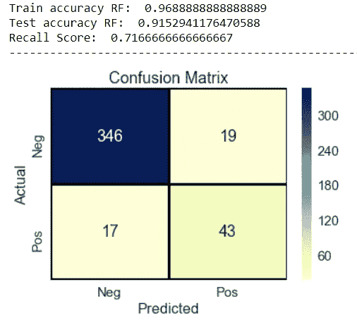

*RF 的性能比 SVM 车型好得多。与模型 2 相比，测试准确度和召回率都更高。*

**特征重要性:**

还有一件事可以用 RF 轻松完成，获得最重要的特性。

绘制特征重要性:

```
importance = clf_rf.feature_importances_
fig = plt.figure(figsize=(18,5))
plt.bar(all_features, importance)
plt.xlabel('Features')
plt.ylabel('Importance')
plt.xticks(rotation=90)
plt.show()
```

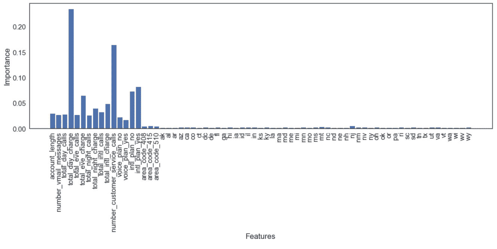

*这里我们可以得出结论，对客户流失预测影响最大的因素是:*

*total_day_charge，numer _ customer _ Service _ calls，International_plan，total_eve_charge 和 total_night_charge。*

**4。)XgBoost 分类器**

据我所知，XgBoost 是目前最流行和最强大的机器学习分类器。

首先，我们需要计算阶级不平衡率:

```
**import** **math**
scale=round(math.sqrt(y_train.value_counts()[0]/y_train.value_counts()[1]),2)
```

XgBoost 的网格搜索需要更多的时间，因为它有更多的超参数:

n_estimators(提升轮数)、max_depth(基础学习者的最大树深度)、learning_rate(提升学习率)、colsample_bytree(构建每棵树时列的子样本比率)

```
*# Grid Search To Get Best Hyperparameters*
parameters = {"learning_rate"    : [0.10,0.20,0.30 ],\
              "max_depth"        : [ 3,5,10,20],\
              "n_estimators" : [ 100, 200, 300, 500],\
              "colsample_bytree" : [ 0.3, 0.5, 0.7 ] }
clf_xgb = XGBClassifier(scale_pos_weight=scale, eval_metric ='mlogloss')
grid = GridSearchCV(estimator=clf_xgb, param_grid=parameters, scoring='accuracy',return_train_score=**True**,verbose=1)
grid.fit(x_train_merged,y_train)

print("-----"*20)
*# plotting only the first 70 train scores*
cv_result = pd.DataFrame(grid.cv_results_).sort_values(by='mean_train_score',ascending=**True**)[:70]
param_list = list(cv_result['params'])
param_index = np.arange(70)
plt.figure(figsize=(18,6))
plt.scatter(param_index,cv_result['mean_train_score'])
plt.plot(param_index,cv_result['mean_train_score'],label='Train')
plt.scatter(param_index,cv_result['mean_test_score'])
plt.plot(param_index,cv_result['mean_test_score'],label="CV")
plt.title('Hyperparameter vs accuracy')
plt.grid()
plt.legend()
plt.xlabel('Hyperparametr combination Dict')
*#plt.xticks(rotation=90)*
plt.ylabel('Accuracy')
plt.show()
```

我没有提到 x 轴上的超参数组合字典，那样会很麻烦，而是画出了它们的指数。

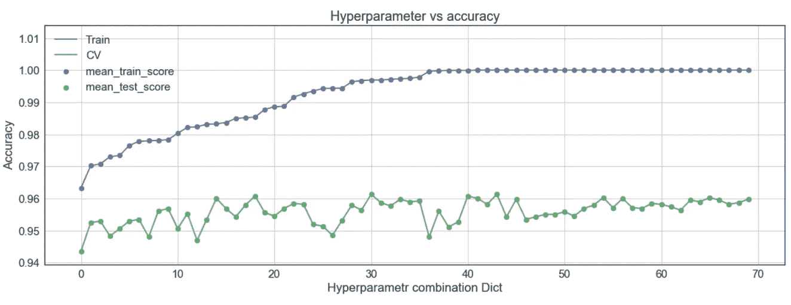

```
# Whichever index on x-axis of above graph gives the optimum results, we use that index to get the hyperparameters from param_list: best_parameters = param_list[34]
print(best_parameters)
```

{'colsample_bytree': 0.7，' learning_rate': 0.2，' max_depth': 5，' n_estimators': 100}

```
# Now train a new XgBoost model using the optimum hyperparameters: clf_xgb = XGBClassifier(learning_rate= best_parameters['learning_rate'] ,max_depth=best_parameters ['max_depth'], n_estimators=best_parameters['n_estimators'], colsample_bytree=best_parameters['colsample_bytree'],                        eval_metric='mlogloss',scale_pos_weight=scale)
clf_xgb.fit(x_train_merged,y_train)

result4 = ["4.","XGBClassifier","Balanced using scale_pos_weight"]
y_pred_tr = clf_xgb.predict(x_train_merged)
print('Train accuracy XGB: ',accuracy_score(y_train,y_pred_tr))
result4.append(round(accuracy_score(y_train,y_pred_tr),2))

y_pred_test = clf_xgb.predict(x_test_merged)
print('Test accuracy XGB: ',accuracy_score(y_test,y_pred_test))
result4.append(round(accuracy_score(y_test,y_pred_test),2))

recall = recall_score(y_test,y_pred_test)
print("Recall Score: ",recall)
result4.append(round(recall,2))
print("-----"*20)

cm = confusion_matrix(y_test,y_pred_test)
ax=plt.subplot();
sns.heatmap(cm, annot=**True**, fmt='d', linewidths=2, linecolor='black', cmap='YlGnBu',ax=ax)
ax.set_xlabel('Predicted')
ax.set_ylabel('Actual')
ax.set_ylim(2.0,0)
ax.set_title('Confusion Matrix')
ax.xaxis.set_ticklabels(['Neg','Pos'])
ax.yaxis.set_ticklabels(['Neg','Pos'])
plt.show()
```

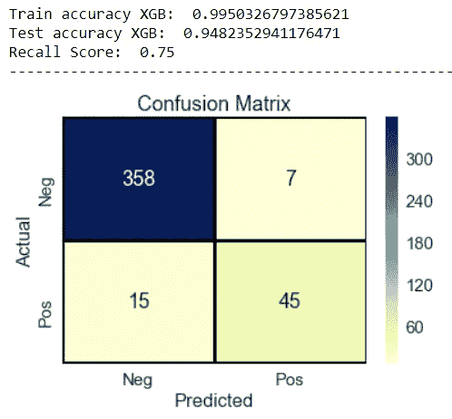

这是迄今为止最好的模型，准确率为 95%，召回率为 75%。

**5。)XGBClassifier 使用 SMOTE 对数据进行平衡**

我们还可以尝试另一种上采样技术，称为 SMOTE(合成少数过采样技术)。

SMOTE 创建新的合成少数样本，而不是复制粘贴已经可用的数据点。

```
*#Synthetic oversampling of minority class with smote*print(y_train.value_counts())
print('----'*10)
sm = SMOTE(sampling_strategy ='minority')
x_train_sm,y_train_sm = sm.fit_resample(x_train_merged,y_train)
print(x_train_sm.shape,y_train_sm.shape)
print(y_train_sm.value_counts())
```

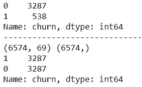

在应用 smote 之后，我们现在对于类 0 和类 1 都有相同数量的样本。

```
*# Grid Search To Get Best Hyperparameters*
parameters = {"learning_rate"    : [0.10,0.20,0.30 ],\
              "max_depth"        : [ 3,5,10,20],\
              "n_estimators" : [ 100, 200, 300, 500],\
              "colsample_bytree" : [ 0.3, 0.5, 0.7 ] }
clf_xgb = XGBClassifier(eval_metric='mlogloss')
grid = GridSearchCV(estimator=clf_xgb, param_grid=parameters,scoring='accuracy',return_train_score=**True**,verbose=1)
grid.fit(x_train_sm,y_train_sm)

print("-----"*20)
cv_result = pd.DataFrame(grid.cv_results_).sort_values(by='mean_train_score',ascending=**True**)[:70]
param_list = list(cv_result['params'])
param_index = np.arange(70)
plt.figure(figsize=(18,6))
plt.scatter(param_index,cv_result['mean_train_score'])
plt.plot(param_index,cv_result['mean_train_score'],label='Train')
plt.scatter(param_index,cv_result['mean_test_score'])
plt.plot(param_index,cv_result['mean_test_score'],label="CV")
plt.title('Hyperparameter vs accuracy')
plt.grid()
plt.legend()
plt.xlabel('Hyperparametr combination Dict')
*#plt.xticks(rotation=90)*
plt.ylabel('Accuracy')
plt.show()
```

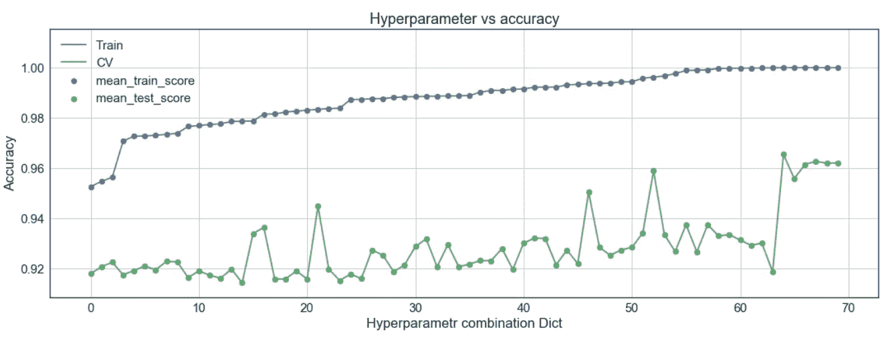

```
best_parameters = param_list[52] 
print(best_parameters)
```

{'colsample_bytree': 0.7，' learning_rate': 0.1，' max_depth': 10，' n_estimators': 100}

使用上述超参数值创建一个新的 XgBoost 模型。

```
clf_xgb = XGBClassifier(learning_rate=best_parameters ['learning_rate'],max_depth=best_parameters['max_depth'],
n_estimators=best_parameters['n_estimators'], colsample_bytree=best_parameters['colsample_bytree'], eval_metric='mlogloss')
clf_xgb.fit(x_train_sm,y_train_sm)

result5 = ["5.","XGBClassifier","Balanced using SMOTE"]
y_pred_tr = clf_xgb.predict(x_train_sm)
print('Train accuracy XGB: ',accuracy_score(y_train_sm,y_pred_tr))
result5.append(round(accuracy_score(y_train_sm,y_pred_tr),2))

y_pred_test = clf_xgb.predict(x_test_merged)
print('Test accuracy XGB: ',accuracy_score(y_test,y_pred_test))
result5.append(round(accuracy_score(y_test,y_pred_test),2))

recall = recall_score(y_test,y_pred_test)
print("Recall Score: ",recall)
result5.append(round(recall,2))
print("-----"*20)

cm = confusion_matrix(y_test,y_pred_test)
ax=plt.subplot();
sns.heatmap(cm, annot=**True**, fmt='d', linewidths=2, linecolor='black', cmap='YlGnBu',ax=ax)
ax.set_xlabel('Predicted')
ax.set_ylabel('Actual')
ax.set_ylim(2.0,0)
ax.set_title('Confusion Matrix')
ax.xaxis.set_ticklabels(['Neg','Pos'])
ax.yaxis.set_ticklabels(['Neg','Pos'])
plt.show()
```

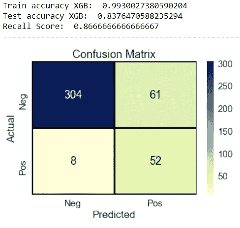

*使用 SMOTE 我们得到了最高的召回分数 87%* ***但是测试准确率较低*** *。训练和测试精度之间的高差距表明模型正遭受* ***高方差*** *。我们可以在以后的工作中通过调整 SMOTE 来解决这个问题。*

# 结论:

我总是发现在最后以表格形式显示结果更好。PrettyTable 是创建这种表格的好方法。

```
Result_table = PrettyTable(["S.No.","Model","class imbalance status","Train_accuracy","Test_Accuracy","Test_Recall_score"])
Result_table.add_row(result1)
Result_table.add_row(result2)
Result_table.add_row(result3)
Result_table.add_row(result4)
Result_table.add_row(result5)
print(Result_table)
```

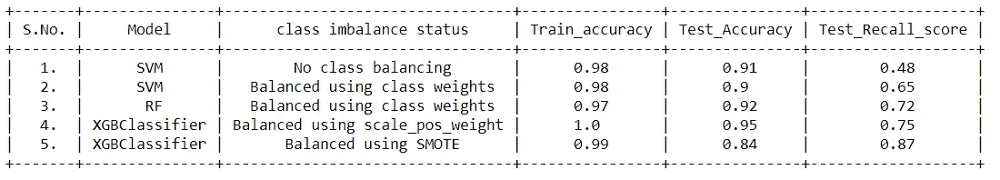

*   当使用 SMOTE 平衡数据时，XGBClassifier(模型 5)的测试召回分数最高，但这会导致高方差。
*   当使用 scale_pos_weight 参数在分类器中平衡数据时，XGBClassifier(模型 4)提供了最高的测试准确性和体面的召回分数。
*   面临的挑战是减少类别不平衡，同时在不过度拟合的情况下获得高召回分数。这可以通过获取更大的数据集并对分类器和 SMOTE 进行更严格的超参数调整来实现。

— — — — — — — END — — — —

源代码:[https://github.com/S-G-001/customer_churn_prediction](https://github.com/S-G-001/customer_churn_prediction)