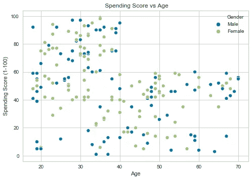
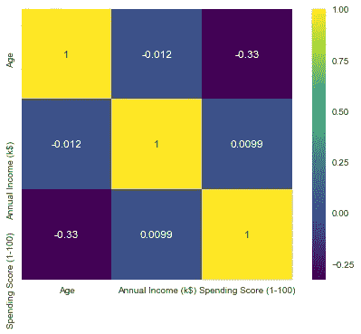
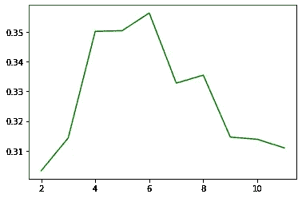
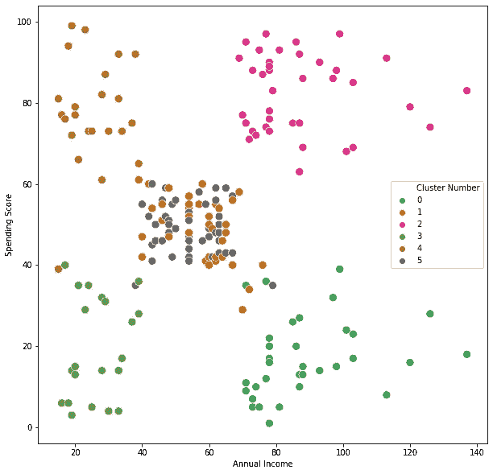
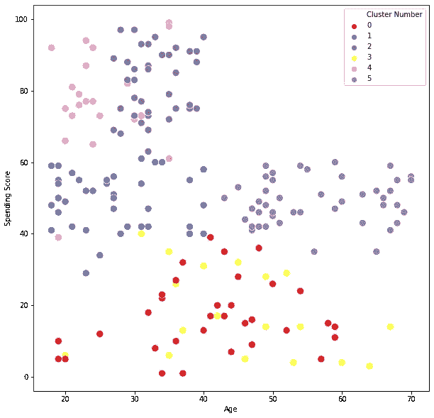

# 使用 K-means 在 Python 中进行客户细分

> 原文：<https://medium.com/nerd-for-tech/customer-segmentation-in-python-using-k-means-c39a6680586c?source=collection_archive---------11----------------------->

分析现在越来越多地用于指导各种领域的商业决策。如今，企业比以往任何时候都拥有更多的关于消费者和市场的数据。因此，对于企业来说，利用这些数据来辅助决策变得越来越重要。

营销是一个使用数据分析为营销经理提供可操作的见解的领域。任何品牌经理的关键任务之一就是识别客户群。客户群是指具有共同特征的人群，如年龄、教育、偏好和态度。细分可以帮助营销经理制定目标客户战略，从而增加销售额。在本例中，我们将对购物中心客户样本进行聚类分析。

我们将要使用的数据集是一个购物中心客户列表，我们有他们的性别、年龄、年收入和支出。阅读完文件后，做一些探索性的数据分析来了解数据是很重要的。为此，我们将使用 matplotlib 库。

```
sns.scatterplot(cust["Age"],cust["Spending Score (1-100)"],color="green",hue=cust["Gender"])
plt.title(" Spending Score vs Age"
```



支出分数/年龄散点图

我们可以看到的第一个图表是消费分数与年龄的关系，我们可以清楚地看到，20-40 岁之间的人比样本中的其他人有更高的消费分数。年龄和消费分数之间有一定的相关性。为了进一步分析，我们还可以查看相关矩阵。



相关图

可以看出，与其他因素相比，年龄和支出分数具有非常高的相关性。这些图可以帮助我们识别数据中的关系和模式。现在让我们继续编写聚类分析的代码。

我们将要使用的聚类算法是 K-means，这是一种非常流行的算法。它识别 k 个质心，然后将数据中的每个点分配到最近的聚类中。K-means 是一个迭代过程，这意味着在每次分配迭代后重新计算质心，直到聚类中没有改进或达到最大迭代次数。

在进行聚类分析之前，对变量进行缩放是很重要的，为此我编写了以下代码。

```
**from** **sklearn.preprocessing** **import** StandardScaler
cust_transform["Age"]=scaler.fit_transform(cust["Age"].values.reshape(-1,1))
cust_transform["Annual Income"]=scaler.fit_transform(cust["Annual Income"].values.reshape(-1,1))
cust_transform["Spending Score"]=scaler.fit_transform(cust["Spending Score"].values.reshape(-1,1))
```

进行 k-means 聚类分析时，最大的决策之一是决定聚类的数量。对于这些数据，我们将使用通过以下公式计算的轮廓系数

x-y/最大值(x，y)

其中 x 是平均聚类间距离，y 是平均聚类内距离。分数范围从-1 到+1，其中分数越高，聚类分离得越好。我们将使用 sci-kit 库来计算一系列聚类的轮廓得分

```
**from** **sklearn.metrics** **import** silhouette_score
silhouette_coefficients=[]
**for** i **in** range(2,12):
     kmeans = KMeans(n_clusters=i)     
     kmeans.fit(cust_transform)
     score = silhouette_score(cust_transform, kmeans.labels_)
     silhouette_coefficients.append(score)

sns.lineplot(x=range(2,12),y=silhouette_coefficients,color="green"
```



最佳聚类数:6

从上面可以看出，聚类的最佳数量是 6，因此我们将数据分成 6 个聚类。在聚类之后，我将可视化聚类，并尝试识别任何可以帮助我们做出决策的模式或见解。



从上图中我们可以看到，聚类 0 由年收入较高但支出分数较低的人组成。聚类#2 是具有高年收入和高支出分数的聚类。这是我们可以瞄准的高价购买的集群。我们可以沿着不同的维度进一步分析我们的集群



这里的聚类是按照消费分数和年龄来可视化的。从前面的可视化中，我们知道第二组由高收入高消费人群组成。然而，从这张图中我们可以看出，他们的年龄在 20-40 岁之间。此外，集群 4 也有较高的支出分数，但他们的年收入较低。

聚类分析在商业决策尤其是市场营销中有很多应用。在这里，我们使用聚类分析来创建细分市场，这可以帮助营销经理确定他们可以增加销售的目标群体或细分市场。