# 客户细分报告和邮寄活动预测。

> 原文：<https://medium.com/nerd-for-tech/customer-segmentation-report-and-mailout-campaign-prediction-47fe78ba9e84?source=collection_archive---------7----------------------->


**项目概述**

该项目分为两部分。第一部分使用无监督学习技术来识别德国普通人群和公司当前客户之间的共同聚类。目标是从普通人群中抽取更有可能成为顾客的部分。

第二部分使用监督学习来训练模型并预测从邮寄活动收集的数据。

这个想法是为了更有效地锁定客户，这有助于减少公司的开支，并减少客户不想要的邮件。

作为最后一步，监督部分的结果将提交给 **Kaggle 竞赛**，并与其他模型进行比较评估。

**数据**

这个项目的数据是 Arvato financial solutions 提供的真实生活数据，作为最终 Udacity 数据科学纳米学位项目的一部分。

*   `**AZDIAS.csv**`:德国总人口数据；891，211 人(行)x 366 个特征(列)。
*   `**CUSTOMERS.csv**`:邮购公司客户数据；191，652 人(行)x 369 个特征(列)。
*   `**MAILOUT_TRAIN.csv**`:作为营销活动目标的个人数据；42，982 人(行)x 366 人(列),另加一人，其标签显示受试者的反应。
*   `**MAILOUT_TEST.csv**`:作为营销活动目标的个人的数据；42，833 人(行)x 366 人(列)。后来用于预测并提交给 Kaggle 竞赛。

另外两个包含元数据的文件有助于分析和特征定义。

**数据准备**

所有数据集都包含相同的功能集，除了添加了 3 个额外列的“客户”。“产品组”、“客户组”、“在线购买”。目前，我们将使用常见的 366 功能，并创建一个统一的方式来清理和估算缺失值。

数据集形状:

```
azdias dimensions: (891221, 367)
customers dimensions: (191652, 367)
```

**阿兹迪亚斯数据集:**

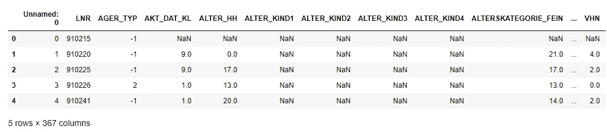

**客户数据集:**

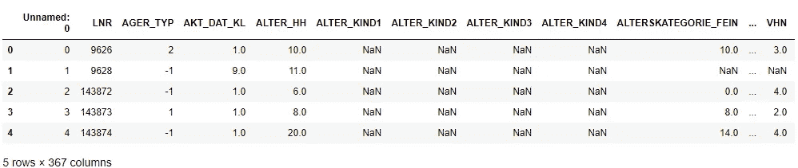

列“未命名”和“LNR”似乎是数据集的人的索引和 id 的重复。

> **对象类型变量:**

```
CAMEO_DEU_2015                45
CAMEO_DEUG_2015               19
CAMEO_INTL_2015               43
D19_LETZTER_KAUF_BRANCHE      35
EINGEFUEGT_AM               5162
OST_WEST_KZ                    2
```

应该区别对待的对象类型变量很少。

CAMEO 功能包含一些应该删除的特殊字符:

```
[nan '8A' '4C' '2A' '6B' '8C' '4A' '2D' '1A' '1E' '9D' '5C' '8B' '7A' '5D'
 '9E' '9B' '1B' '3D' '4E' '4B' '3C' '5A' '7B' '9A' '6D' '6E' '2C' '7C'
 '9C' '7D' '5E' '1D' '8D' '6C' '6A' '5B' '4D' '3A' '2B' '7E' '3B' '6F'
 '5F' '1C' 'XX']
[nan 8.0 4.0 2.0 6.0 1.0 9.0 5.0 7.0 3.0 '4' '3' '7' '2' '8' '9' '6' '5'
 '1' 'X']
[nan 51.0 24.0 12.0 43.0 54.0 22.0 14.0 13.0 15.0 33.0 41.0 34.0 55.0 25.0
 23.0 31.0 52.0 35.0 45.0 44.0 32.0 '22' '24' '41' '12' '54' '51' '44'
 '35' '23' '25' '14' '34' '52' '55' '31' '32' '15' '13' '43' '33' '45'
 'XX']
```

EINGEFUGT_AM 是一个日期变量，将被转换为年份。

OST_WEST_KZ 表示此人是来自东德还是西德，并将被转换为二进制。

我现在将放弃 D19_LETZTER_KAUF_BRANCHE 和 CAMEO_DEU_2015，因为它们需要编码，但也相当分段。我们可能会试验“标签编码”是否会在比赛中获得更高的分数。

> **缺失值**:

首先我们将使用带有特征值描述的 Attribute.xls 文件来统一未知值(0，-1，9)并用常量-1 值替换它们。

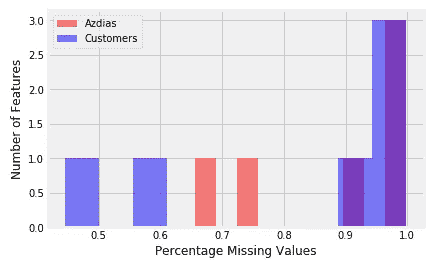

图 1 每个特征的缺失值百分比

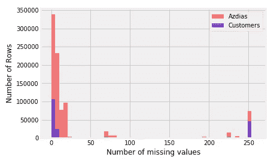

图 2 每行缺少的值直方图

让我们来看看最缺少值的特性:

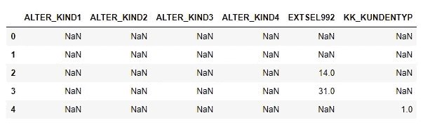

具有大部分缺失数据 ALTER _ kind 1–4 的特征似乎标记了第一个到第四个孩子的年龄。我们可能会删除这些功能，但实际上，如果**公司提供与有孩子的家庭**相关的产品，这些功能可能会非常重要。所以我会保留所有的特性(后来对 Kaggle 比赛的实验表明，删除一些特性会导致整体得分降低)。

对于所有其他具有较少丢失值的特征，我将使用**简单估算器**和“常数”-1 策略。

让我们来看看 Azdias 和 Customers 数据集中一些要素的分布情况:

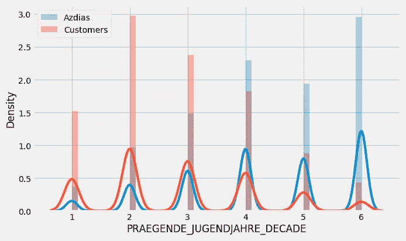

图 3 十年特征分布

客户群在 2、3**(50、60 年代出生的人)**左右相当占优势

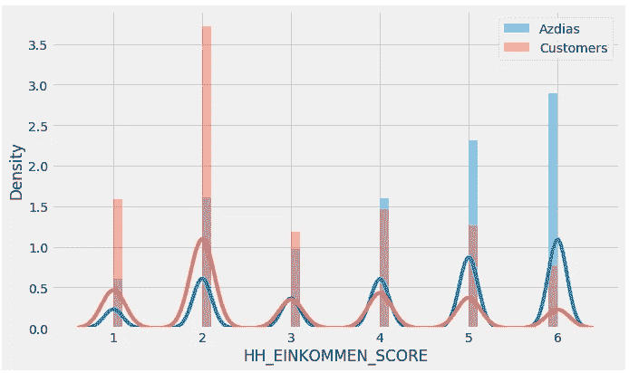

图 4 收入特征分布

价值 2 最能代表客户:**非常高的收入**

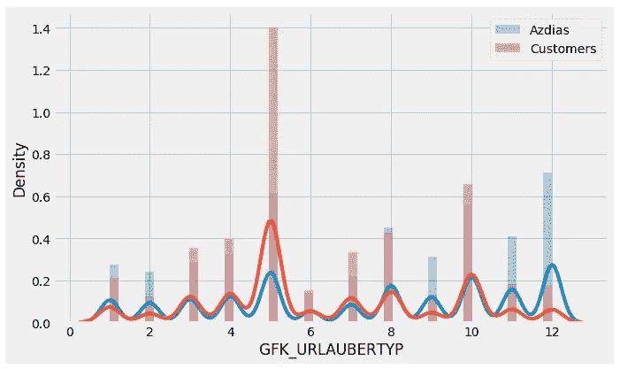

图 5 度假习惯特征分布

GFK 解释了人们的度假习惯。值为 5 的表示非常高，对应于**“自然风扇”。**

# 第 1 部分:无监督模型

在这一部分中，我们首先将使用称为 PCA 的降维技术，并尝试在保留数据中大部分差异的同时减少特征集。这将有助于提高聚类效率。

其次，KMeans++将使用一般群体数据进行训练，并预测聚类段。

我将使用 **Sklearn 管道**来执行数据预处理(输入+缩放数据)。

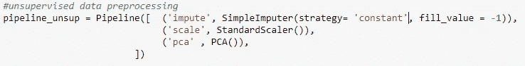

预处理数据后，我们将保留 90%的聚类方差(大约 130 个 PCA 分量)。

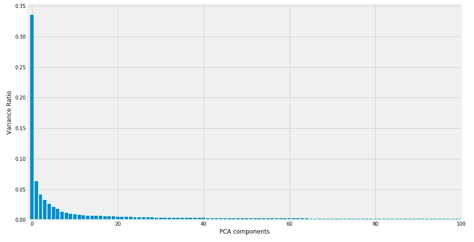

图 6 PCA 成分方差比

在训练聚类算法之前，我们应该确定有多少个聚类将是最佳分割。我们将使用所谓的肘法:

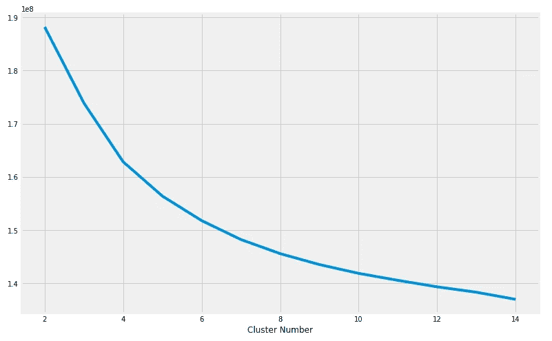

图 7 弯管法曲线

根据曲线，看起来 8 个集群可能是一个很好的起点。拟合和预测聚类后，我们得到最终的分布图:

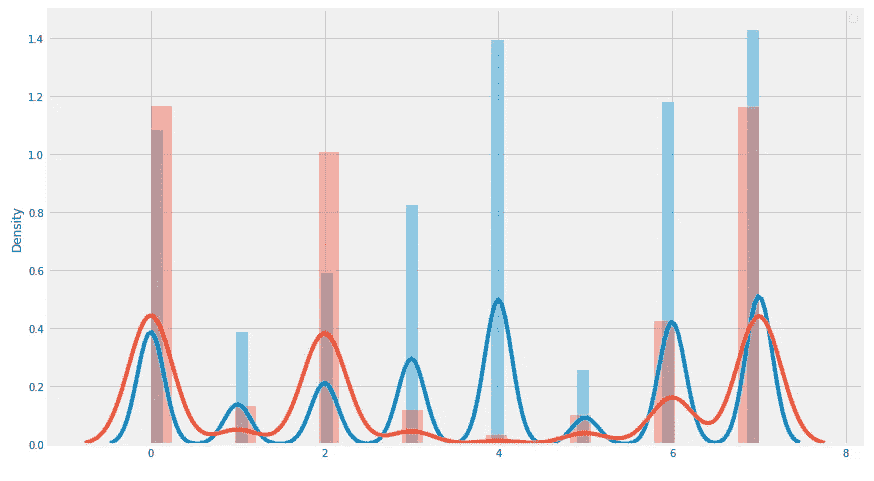

图 Azdias 和客户群之间的数据分布

让我们来看看集群 4(客户较少)和集群 0 之间的特性差异:

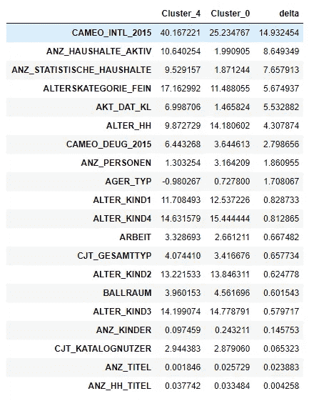

**CAMEO_DEUG_2015:** 客户更有可能被确立为中产阶级，而第四类价值观:低消费中产阶级。

**CAMEO_INTL_2015** :富裕家庭更容易成为顾客。

**ANZ_PERSONEN:** 成年人较多的家庭使用该公司的产品。

**ALTER_HH:** 客户家庭内的主要年龄低于代表性不足的群体。

# 第 2 部分:监督模型

在这一部分，我们将比较几个模型，并选择其中一个进行优化，用于最终的挑战。数据准备与第 1 部分相同。

让我们看看响应标签分布:

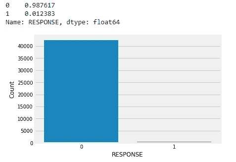

图 9 响应分布

训练数据非常不平衡。这就是为什么 **ROC AUC 指标**用于基于真阳性和假阳性率的评估。

Les 使用默认参数测试 4 个模型，并绘制结果:


图 10 初始测试模型 ROC 曲线

看起来表现最好的是 LGBMClassifier，最差的是 RandomForestClassifier 模型。在一些提交后，XGBClassifier 实际上提供了最佳结果，所以我将继续使用贝叶斯优化来调整超参数。

一旦使用 BayesSearchCV 使用以下网格对模型进行了调优:

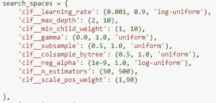

仅经过 10 步优化，我们就可以看到相当大的改进:

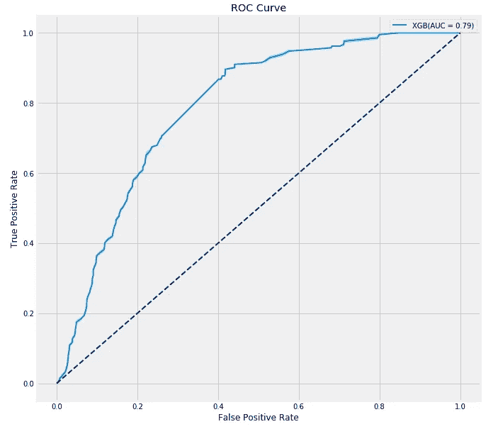

图 11 优化的 XGB 模型 ROC 曲线

# 结论

无监督分析提供了全球人口和客户之间相似群体的总体表示。仍然可以用稍微不同数量的集群进行测试。

监督部分(邮寄活动)模式获得了高分(在排行榜中排名第**位**)。

改进模型性能的想法:

*   使用不同种类的数据插补，即**多重插补。**它可能会提供更好的结果，但是计算量非常大。
*   **SMOTE** 或其他方法对少数类进行过采样。
*   XGB 特征重要性或用于特征选择的统计方法，如 chi2
*   将一些类似于少数民族类数据样本的客户数据添加到训练数据中。

*链接到* [*Github 仓库*](https://github.com/tmishinev/Customer_Segmentation_report-Arvato_Bertelsmann.git)