# Arvato 金融解决方案的客户细分报告

> 原文：<https://medium.com/nerd-for-tech/customer-segmentation-report-for-arvato-financial-solutions-737c10227a7b?source=collection_archive---------3----------------------->


艾蒂安·吉拉尔代在 [Unsplash](https://unsplash.com?utm_source=medium&utm_medium=referral) 上拍摄的照片

# **定义**

**项目概述**

对任何经营客户相关业务的公司来说，对客户进行分类并对客户群进行细分是至关重要的。通过了解客户的行为和消费模式，公司可以针对正确的客户提供适当的服务和产品。

机器学习和数据科学的许多应用之一是，可以在数据和计算机之间检测到的共同模式可以基于影响客户行为的许多变量来预测客户的反应。因此，公司可以赚取更多的利润，并锁定正确的客户，而不会浪费金钱和精力给错误的受众。

在这个项目中，Arvato Financial Solutions 为德国大约 90 万公民提供了一个大型数据库。该数据库包含许多关于客户的社会阶层、消费率、他们的居住环境以及他们的教育程度等信息。使用这些数据，我们可以找到客户之间的共同模式，并对他们进行细分。

然后，这种细分技术可以应用于 Arvato 客户的较小数据集，并找到客户数据库的特殊特征。这一结论将非常有助于在任何营销活动中了解客户以及如何与他们打交道。

项目的下一部分是预测目标客户对邮件营销活动的反应。在这一部分，我们将创建一个 ML 模型来有效地预测客户如何回复邮件。

总之，本项目中使用的数据集如下。

*   **uda city _ AZDIAS _ 052018 . CSV**:德国一般人口的人口统计数据；891 211 人(行)x 366 个特征(列)。
*   **uda city _ CUSTOMERS _ 052018 . CSV**:邮购公司客户的人口统计数据；191 652 人(行)x 369 个特征(列)。
*   **uda city _ MAILOUT _ 052018 _ train . CSV**:作为营销活动目标的个人的人口统计数据；42 982 人(行)x 367 人(列)。
*   **uda city _ MAILOUT _ 052018 _ test . CSV**:作为营销活动目标的个人的人口统计数据；42 833 人(行)x 366 人(列)。

## **问题陈述**

该项目中需要回答的主要业务问题有:

德国人口数据集由哪些部分组成？

如何将这些细分应用到 Arvato 客户数据库中？

目标客户对邮件营销活动的预期反应是什么？

为了回答这些问题，跨行业数据挖掘标准流程(CRISP-DM)将分为两个部分，包括以下步骤。

1.  商业理解。
2.  数据理解。
3.  数据准备。
4.  建模。
5.  评价。
6.  部署。

**第一部分:一般人群和客户细分(无监督建模)**

在这一部分中，将使用德国普通人口的人口统计数据(AZDIAS 数据集)和邮购公司客户的人口统计数据(客户数据集)来分割数据点。这部分计划使用的策略如下。

1.  **数据理解:**特征成组；每组特征代表了人口和顾客的一个方面。每个特征的引用和值属性在单独的 excel 表中提供。
2.  **数据准备:**在这一部分中，将使用如下清洗和准备数据的常用技术。

-处理缺失值

-处理分类特征

-处理异常值

-数据结构转换

-特征工程

3.**建模:**在这一部分中，数据管道将用于以下阶段来构建我们的无监督模型。

-用于缩放数据的标准缩放转换器。

-降维，将使用 PCA 技术来降低数据的维数。此外，将确定 PCA 组件的适当数量。

-无监督 ML 模型，将使用 Kmeans 算法对客户进行细分。

1.  **评估:**将使用肘形曲线对 KMeans 模型进行评估，以确定正确的聚类数，并用数据拟合模型，从而预测数据点的标签。相同的模型将用于预测客户数据集的细分。
2.  **部署:**模型的部署可以在基于云的平台上完成，也可以使用 web 应用程序进行部署，但是在这个项目中，我们将专注于回答业务问题，部署部分将在后面完成。

**第二部分:客户反应预测(监督建模)**

在这一部分中，我们已经完成了第一部分中的大部分数据清理/准备工作，因此我们将使用在无监督建模部分中做出的相同假设和决定。然后，将采取以下步骤来实现这一部分的目的。

1.  **建模:**在这一阶段，由于响应变量是不平衡的，因此应遵循不平衡数据集的技术。将测试许多模型分类器，以获得具有最佳性能的模型。
2.  **评估:**选择具有最佳性能的模型后，将通过预测测试数据集(提供时没有标签)的响应来进行评估，评估结果将应用于 Kaggle 竞赛。
3.  **部署:**该部分的部署将与第一部分中的模型集成

**指标**

根据项目的各个部分，将用于项目的指标分为两个部分。

1- **无监督建模:**将为 KMeans 模型中使用的每个聚类数计算每个聚类的质心和数据点之间的方差，肘形曲线将说明代表最佳聚类数的断点。

2- **监督建模:**本部分的指标将分两个阶段。

*   模型选择:要选择的具有最佳性能的模型将由 AUC(曲线下面积)度量来确定。这表示模型区分不同类别的良好性。为了实现这一点，将对不同模型绘制 ROC 图，并在实施中使用具有较高 AUC 的模型。
*   模型部署:在这一部分中，将对所选模型进行超参数调整，并且要使用的指标也是 AUC。使用 ROC 曲线的原因是邮件活动的数据不平衡，这使得准确性成为判断模型性能的糟糕选择。另一方面，精确性和敏感性可以导致正确的决策。

# **分析**

**数据探索**

在数据探索性分析中，我们看到这些列被分成大约 62 组，每组描述一个特定的方面。一些最高分组的摘要和数据集中使用的一些表达式的解释。如下所示。

**PLZ8:** 同一地区约 500 户的区域。

**KBA13:** 客户所属的 PLZ8 中的车主和制造商信息。

**D19:** 关于客户的银行交易和支付类别的信息。

**KBA05:** 客户所属微蜂窝中的车主和制造商信息。

基于顾客调查的关于一个人的社会属性的信息。

**CJT:** 与消费者偏好的信息和购买渠道相关的顾客旅程类型学。

关于客户的财务信息。

**LP:**(leben phase)客户的生命阶段特征。

**变更:**客户的年龄组和子女年龄组。

处理其组中的列将使数据探索和数据准备以及数据解释更容易。

在下图中，我们可以看到数据集中的组数。

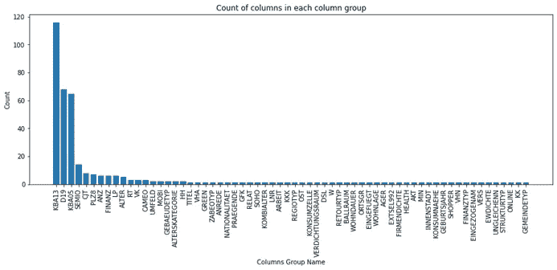

每个列组中的功能计数

从数据探索中注意到以下注意事项。

*   大多数特征可以被认为是分类特征，因为这些值是名义值并且代表特定值。
*   以下特征具有数值，这些数字代表它们的值。ANZ _ 豪沙尔特 _ 阿克蒂夫，ANZ _ HH _ 蒂特尔，ANZ _ 佩索宁，ANZ _ 蒂特尔，格布尔斯贾赫尔，KBA13 _ 安扎赫尔 _PKW 和明 _ 格巴乌代贾赫尔。
*   EINGEZOGENAM 是一个日期列，表示用户添加到数据集的日期。
*   CUSTOMER_GROUP、ONLINE_PURCHASE、PRODUCT_GROUP 是客户数据集中的三个额外列，它们不在 AZDIAS 数据集中。

# **方法论**

**数据预处理**

**第一部分无监督建模:**

在这一节中，我们将调查数据中的缺陷，并尝试清理数据，为建模做好准备。数据处理工作将按以下顺序进行。

1- **处理缺失值:**缺失值是清理这些数据集最费力的方面，因为几乎一半的列都有缺失值。我们考虑了数据是随机缺失还是非随机缺失。下面是要采取的措施的摘要。

-有些财务信息不能随意丢失，因为客户可能不愿意透露他们的敏感信息。在这些情况下，我们可以理解不同特征之间的关系，并且缺失的值可以用对应于未知的值(如果可用)来估算。

*   在某些情况下，我们用特征中的众数来估算缺失值。
*   如果缺失值的百分比很高，我们可以删除该列。

**2-** **处理非数字特征**

如前所述，大多数特征是分类的，但是一些特征具有字符串数据类型，因此，它们应该以不同的方法处理，如下所示。

*   首先，我们必须按照上面提到的技术估算缺失值。
*   其次，我们应该将字符串值映射到一个数值。
*   如果缺失值的百分比很高，则该列将被删除。
*   需要注意的是，绘制标称值并不总是一个好主意，因为数值可能会误导模型预测。在我们的案例研究中，我们可以用数字替换分类值，因为我们正在实现一个无监督模型，这意味着数字数据不会影响数据点和距离。

**3-** **处理异常值:**

在数据集中没有检测到异常值，因为大多数列是分类特征，没有支持表中提供的属性值。

**4-** **办理日期功能:**

EINGEZOGENAM 是一个日期列，表示用户被添加到数据库的日期，参考日期用于计算自客户被添加到数据库以来的持续时间。

**第二部分监督建模:**

前一节中完成的相同技术和假设可应用于邮件活动的数据集，因为特征是相同的，并且在两个数据集之间注意到以下差异。

在 mailout 数据集中输入缺失值后，AZDIAS 数据集中没有缺失值的一些列。因此，在缺失值不高的情况下，我们可以删除这些数据点。

**实现**

**第一部分无监督建模:**

我们将使用 KMeans 算法来解决我们的问题，因为我们需要将客户划分为不同的类，并找出同一类中客户之间的共同属性。

并且数据管道将经历以下过程。

1-数据缩放:在将数据拟合到模型以获得更好的预测之前，缩放数据是很重要的。Sciklearn 标准定标器变压器用于此目的。

将 2- PCA 应用于缩放的数据以降低数据集(364 列)的维度。

特征的数量太多。使用主成分分析，我们可以测量由主成分分析解释的方差。如下图所示。

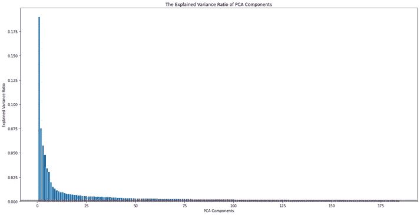

主成分分析的解释方差比

从图中，我们可以看到一半的 PCA 分量包含了由这些分量解释的方差的 93.6%。

我们只能选择 182 个组件，并在模型的后续阶段使用它们。

KMeans 模型拟合了具有不同聚类数(从 2 个聚类到 16 个聚类)的前 182 个 PCA 成分。将绘制肘形曲线。

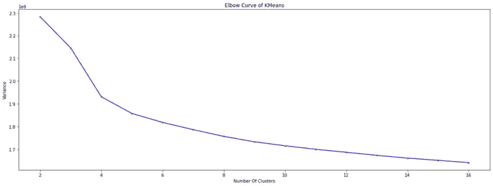

KMeans 模型的肘形曲线

从肘曲线中，我们看到 8 个聚类是质心和数据点之间的总方差减小的爆发点。可以更清楚地显示弯头断点方差曲线的变化。

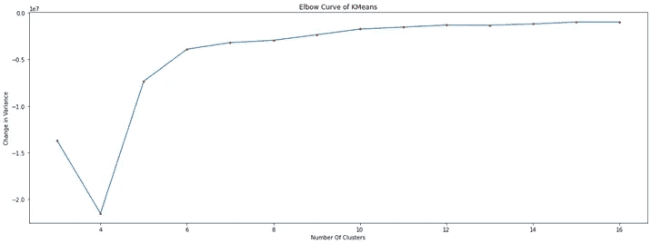

方差变化的肘形曲线

下一步是使用 KMeans 模型来预测 AZDIAS 和 customers 中客户的聚类，并找到细分市场的共同属性。作为对客户细分的说明，下图显示了第一个和第二个 PCA 成分之间的关系。

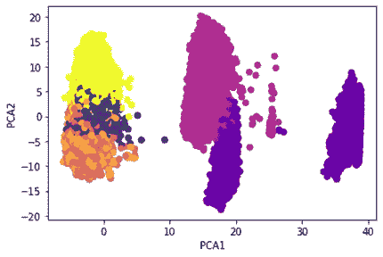

PCA1 和 PCA2 中数据点的分类。

一般人群和客户数据集中每个细分市场的客户数量可在以下图表中显示。

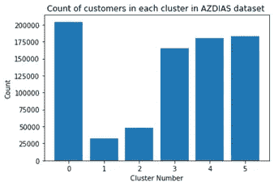

总体数据集中的客户分布

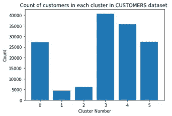

客户数据集中的客户分布

通过比较不同集群中的客户分布，我们发现他们的比例分布大致相同。这可以在下面的图中显示。

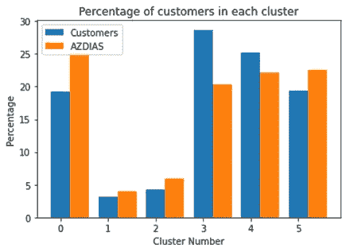

从客户在集群上的分布情况，我们可以得出以下结论。

*   客户数据集和 AZDIAS 数据集都具有大致相同的集群分布。
*   大多数客户属于群集 3，但是该群集不是一般人群中的主要群集。
*   群集 0 和群集 5 在 CUSTOMERS 数据集中的计数几乎相等。
*   我们可以将群集 0 和群集 5 作为一个组进行研究，将群集 3 和群集 4 作为一个组进行研究。
*   更加关注集群 3 可以带来客户的一些共同特征。

通过按不同的聚类对客户进行分组，并以 50%的阈值确定每个特征中的最频繁值，我们可以看到不同聚类的共同属性。通过对结果数据的分析，我们可以得出以下结论。

集群 3 客户有以下共同属性。

*   他们的财务极简主义行为很低，而财务储蓄行为很高。
*   他们住在住宅楼里。
*   他们在牢房里有一个活跃的家庭。
*   他们的顾客旅程拓扑分类是“广告和消费极简主义”和“广告和跨渠道唯美主义”
*   他们在 PLZ8 内的每户汽车份额是平均的。

集群 0 和集群 5 客户有共同的属性。

*   从名字的发音来看，他们大多数都有德国国籍。
*   他们大多数人的年龄都在 60 岁以上。
*   小型、高档汽车和货车的份额是平均的。
*   他们的返回类型是“确定的最小返回者”

我们可以看到，集群 3 的顾客属于消费行为保守的中产阶级，而集群 0 和集群 5 的顾客有更多的消费习惯。因此，该公司应专注于向集群 3 客户(大多数客户)提供能节省更多资金的服务。

**第二部分监督建模**

在我们的用例中，自变量(RESPONSE)是不平衡的，如下图所示。

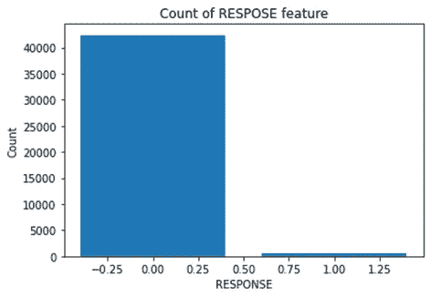

邮件发送数据集中两类响应的计数。

对于这个问题，使用分层的 K 折叠交叉验证来确保折叠在两个类别中均衡分布。

将测试以下分类模型，以找到性能最佳的模型。

*   逻辑回归
*   随机森林
*   支持向量机
*   梯度提升分类器

为每个模型创建 ROC 曲线。AUC 越高的模型越好。由于每个类别的比例都不均衡，因此准确度不能用作不平衡数据集的指标。因此，AUC 可以告诉我们该模型的运行情况。

首先，只选择了这四个分类模型，并使用了除逻辑回归之外的默认参数(最大迭代次数被提高到 500，因为出现了一个警告，提示已达到最大迭代次数，求解程序更改为 saga)。

模型的默认参数用于获得性能的初始指示，并且可以对目标模型进行进一步的调查。

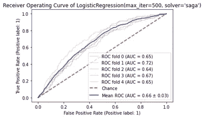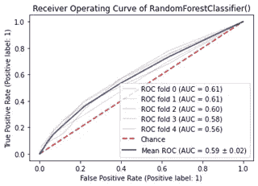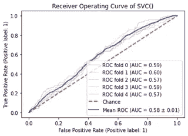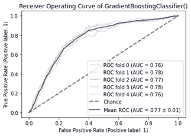

从具有 5 个分层 K 倍的所得 ROC 曲线，可以看出梯度增强分类器具有最好的平均 AUC。因此，我们将使用超参数调整技术来寻找最佳性能模型。

**细化**

对于超参数，选择使用贝叶斯搜索优化，因为它比网格搜索优化花费更少的时间，特别是在需要测试大量参数的情况下。超参数调整中使用的搜索空间具有与模型参数相同的范围。更多的参数可以被添加到搜索空间，但是需要更多的计算和时间资源。

计算资源和时间是细化过程中的一个限制因素。GridSearch 优化遍历了参数的每一种可能的组合，这预计需要很长时间(超过 9 天)。应该遵循另一种方法，贝叶斯优化是更好的选择，因为它通过有希望的参数组合，而不是测试所有参数。

非常有限的搜索空间被用于如下的贝叶斯搜索优化。使用以下搜索空间参数，运行时间几乎为 8 小时。与 GridSearch 相比，贝叶斯搜索优化器节省了太多时间。

*‘损失’:[‘偏差’，‘指数’]，*

*'学习率':[1e-3，0.01]，*

*' n _ estimators ':[int(x)for x in NP . Lin space(100，500，num=5)]，*

*'准则':['弗里德曼 _mse '，'平方 _ 误差']，*

*'最小样本分割':[2，3，10，15]，*

*' max _ depth ':[int(x)for x in NP . Lin space(5，20，num=4)]，*

*'min_samples_leaf': [ 5，10，15，20]，*

*'max_features': ['auto '，' sqrt '，' log2']*

作为贝叶斯搜索的结果，最佳性能模型的参数如下。

标准':'平方误差'，

*' learning _ rate ':0.009669643524795875，*

*《失传》:《越轨》，*

*'最大深度':5，*

*'最大功能':'自动'，*

*'min_samples_leaf': 10，*

*'min_samples_split': 2，*

*‘n _ estimators’:100*

```
From the ROC curve of the optimized model, we see that validation AUC is 0.7681313445364253, that is the best result we can get from Bayesian Search.
```

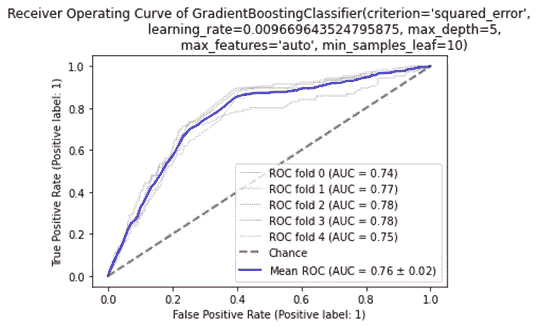

# **结果**

**模型评估和验证**

```
We see that there is not much improvement in the model with the hyper-parameters tuning, so a wider search space can be used to improve the score.
```

现在，我们可以实现优化的模型来预测邮寄测试数据集的响应，并且通过参与 Kaggle 竞赛，具有来自模型的预测的模型的分数是 0.79589。

值得注意的是，在我们的案例中，我们需要一个灵敏度更高的模型，因为我们需要捕捉任何可能对活动感兴趣的客户，我们不在乎是否有许多误报。

**理由**

测试数据集的分数几乎与验证分数相同，这意味着模型没有遭受过拟合问题。

可以测试各种分类模型，以获得比可以在生产中部署的模型更高的分数。

# **结论**

无监督 ML 模型的客户细分表明，一般人群可分为 6 类。

大多数 Arvato 客户属于第 3 类，他们具有以下特征。

*   他们有非常低的金融极简主义行为和非常高的金融储蓄行为。
*   他们住在住宅楼里。
*   他们在牢房里有一个活跃的家庭。
*   他们的客户旅程拓扑类别是，“广告和消费极简主义”和“广告和跨渠道消费主义”
*   在 PLZ8 地区，每户家庭拥有汽车的比例一般。

在任何营销活动中都应该考虑到这些方面，以下是建议，公司应该把重点放在旨在省钱的优惠和广告活动上。

属于 cluster0 和 cluster5 的客户对整个客户数据库具有重要的权重，这意味着公司可以设计不同方面的不同营销活动，如基于质量的优惠，因为这些集群中的用户在财务上不是非常保守。

预测目标客户响应的最佳模型是平均 AUC 等于 0.79589 的梯度推进分类器。

**倒影**

跨行业数据挖掘标准流程(CRISP-DM)将分为两个部分，包括以下步骤。

1.  商业理解。
2.  数据理解。
3.  数据准备。
4.  建模。
5.  评价。
6.  部署。

一种无监督建模技术，用于对普通人群进行细分和分类。这种细分帮助我们找到了目标客户的共同模式。用于分类数据点的 KMeans 算法和使用的 PCA 降维技术。

实现了一个监督模型来预测客户对邮件营销活动的响应。性能最好的模型是梯度推进分类器。

**改进**

以下几点可以加强，但仍有待进一步改进。

*   许多 PCA 成分可以用无监督的 ML 模型来测试，以找到导致最佳性能的成分数量。这种方法需要更多的计算资源。
*   可以测试更多的分类模型，如 XBoosting 分类器、LGBM，并评估每种情况下的性能。
*   非监督和监督模型可以集成到一个 web 应用程序中，该应用程序可以预测任何新客户的细分以及客户是否会对营销做出反应。

**参考文献**

Arvato Financial solution company 根据数据条款和协议提供的数据集。

所有代码和报告都可以在这个 Github 存储库中找到。

[https://github . com/bassemessam/arva to-customers-segmentation](https://github.com/bassemessam/arvato-customers-segmentation)