# 使用 Python 进行客户细分

> 原文：<https://medium.com/nerd-for-tech/customer-segmentation-using-python-e56c2b1a4c73?source=collection_archive---------1----------------------->

了解如何在 Python 中逐步部署用于客户细分的 K 均值聚类算法。

> “我们被数据包围，但却渴望洞察。”-市场营销和客户体验专家 Jay Baer


布莱克·维斯兹在 [Unsplash](https://unsplash.com/@blakewisz?utm_source=unsplash&utm_medium=referral&utm_content=creditCopyText) 上的照片

# **简介**

我们知道，机器学习主要分为监督学习、非监督学习和强化学习。

今天，我们将学习一种最广泛使用的无监督学习技术，K 表示聚类。

> “聚类分析或聚类是一种多变量统计技术，它根据描述观测值的一些特征或变量对观测值进行分组。”

现在，你可能会问分类(监督学习)和聚类(非监督学习)之间的区别是什么。前者围绕给定输入数据预测输出类别，或者换句话说，我们根据训练数据训练模型，然后用它来预测未来的结果。然而，聚类是基于根据数据点之间的相似性和不同点将数据点分组在一起。我们得到的输出是我们必须给自己命名的东西，不像监督学习的情况，我们已经标记了数据。

这个过程的目标是最大化一个聚类内的观察值的相似性和最大化聚类之间的不相似性。基本上是将所有可用的数据分组或“群集”到彼此不同的不重叠的子组中。

聚类的主要应用是客户细分、图像细分等。

客户细分是根据需求、购买特征等将公司的潜在客户群划分为不同群体的过程。通过这样做，企业可以更好地瞄准个人，并通过为客户提供更定制的购物体验来增加销售额。

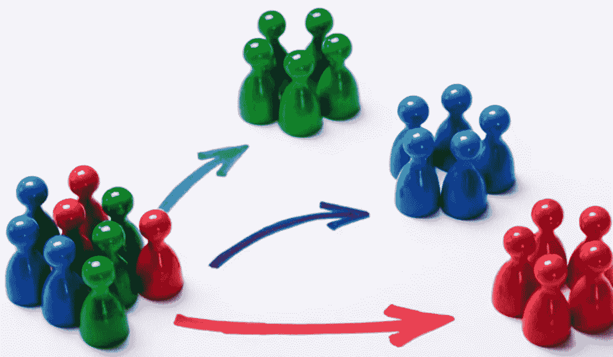

本文将重点讨论如何在 Python 中使用 K 均值聚类进行客户细分。

我们将讨论以下主题:

*   K 均值聚类的数据预处理。
*   EDA 和数据集的可视化。
*   从头开始构建 K 均值聚类模型。
*   对构建的集群进行可视化、解释和分析。

让我们开始编码吧！

# **导入所需的库**

```
import numpy as np
import pandas as pd
import matplotlib.pyplot as plt
import seaborn as sns
%matplotlib inline  
from sklearn.preprocessing import StandardScaler
from sklearn.cluster import KMeans
from sklearn.metrics import silhouette_score
```

我们使用下面的代码将所需的数据集加载到 Python 环境中。这里，我们将“CustomerID”指定为索引，因为它是每个客户的唯一标识符。

```
data = pd.read_csv (‘Mall_Customers.csv’, index_col=’CustomerID’)
```

要检查我们加载的数据集中有什么:

```
data.head()
```

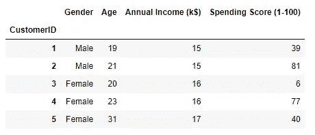

给定数据集的前 5 个条目

数据集最初由 5 列组成；“客户 ID”、“性别”、“年龄”、“年收入(千美元)”和“支出分数(1-100)”。“CustomerID”对我们的聚类分析没有任何帮助，可以被删除，或者在这种情况下被指定为索引或标识符。

关于其他 4 个功能的信息如下:

*   **性别:**这是一种分类数据类型，在将其部署到模型中之前，必须对其进行预处理并转换为数值。它有两个类别，即“男性”和“女性”
*   **年龄:**数值型数据类型，包含客户的年龄(年)
*   **年收入:**数字数据类型，包含客户年收入 1000 美元。
*   **消费评分:**它也是一个数字数据类型，包含一个基于客户消费行为的 1-100 分。

# **检测和处理异常值**

异常值是不同于样本数据集整体模式的观察值。维基百科将其定义为“远离其他观察点的观察点。”最大似然算法在存在异常值的情况下效果不佳。

现在让我们用箱线图来看看我们给定的数据集是否包含任何异常值。

```
plt.boxplot(data[‘Annual Income’])
plt.title(‘Boxplot of Annual Income’)
```

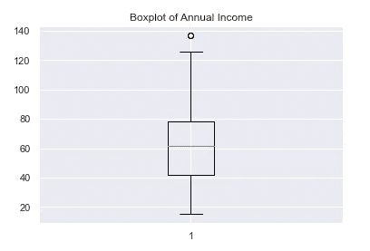

该图显示“年收入”一栏中有一些异常值。我们将使用 IQR 或四分位间距方法来处理这些异常值。

您可以在此了解更多关于异常值检测和移除的信息[。](https://youtu.be/A3gClkblXK8)

```
Q1=np.percentile(data[‘Annual Income’],25,interpolation=’midpoint’)
Q2=np.percentile(data[‘Annual Income’],50,interpolation=’midpoint’)
Q3=np.percentile(data[‘Annual Income’],75,interpolation=’midpoint’)IQR=Q3-Q1
lower_limit=Q1–1.5*IQR
upper_limit=Q3+1.5*IQRoutlier=[]
for x in data['Annual Income']:
    if((x>upper_limit)or(x<lower_limit)):
        outlier.append(x)
```

发现异常值为[137，137]，均在上限以上。我们现在将找到各自的索引，并从分析中删除整个两行。

*PSA:如果异常值数量很少，可以保留在分析中。*

```
outlier_index=data[‘Annual Income’]>up_limit
data.loc[outlier_index].index
```


```
data.drop([199, 200],inplace=True)
```

# **探索性数据分析**

在我们跳到机器学习或聚类之前，执行一些 EDA 和可视化是很重要的。这有助于我们识别数据中的模式，并找到变量之间有趣的关系。

你可以在这里了解更多关于 EDA [的信息。](https://towardsdatascience.com/an-extensive-guide-to-exploratory-data-analysis-ddd99a03199e)

## **1。单变量分析**

单变量是对单个变量的分析。这有助于我们描述数据并找到其中存在的模式。

例如，我们使用 **countplot()** 找到特征“性别”的每个类别中的观察次数

```
sns.countplot(data['Gender'])
```

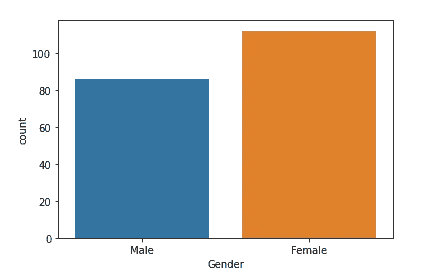

与男性相比，数据集中的女性更多。

现在，让我们使用 **distplot()来看看特征‘年龄’的单变量分布。**这让我们可以查看数据的参数分布。

```
sns.distplot(data['Age'], bins=30)
```

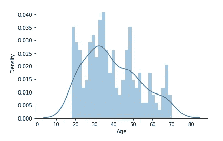

可以看到，年龄列包含几乎正态分布的值。距离图上的 KDE 看起来像一条钟形曲线，这意味着“年龄”列的大多数数据点相对相似。

你可以在这里了解更多关于 distplot 和 KDE [的信息。](https://seaborn.pydata.org/tutorial/distributions.html)

## **2。双变量分析**

顾名思义，双变量分析是将两个变量放在一起分析，以检查两者之间的任何并发关系。

现在，我们将检查我们每个功能之间的任何关联。但是，必须注意的一点是，使用散点图的双变量分析只能在数字数据类型上执行，因此我们必须将分类特征“性别”转换为数字数据类型。

**处理分类特征:**我们可以分配或映射给定数据集中“男性”和“女性”条目的值，如下所示。

```
gender= {'Male':0, 'Female':1}
data['Gender']= data['Gender'].map(gender)
```

让我们回到我们的双变量分析！

散点图是一种重要的可视化方法，用于观察变量之间的关系。它使用点来表示两个不同数值变量的值。

2.1.“年龄”和“支出分数”之间的散点图

```
plt.figure(figsize=(10,6))
plt.scatter(data['Age'],data['Spending Score'], marker='o');
plt.xlabel('Age')
plt.ylabel('Spending Score')
plt.title('Scatter plot between Age and Spending Score')
```

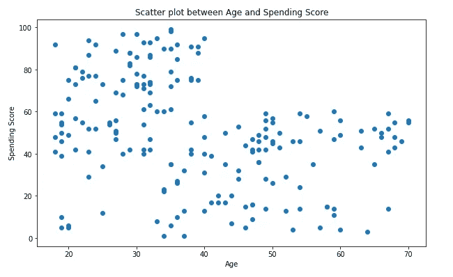

我们可以看到，年龄越低，消费得分越高。

2.2.“年龄”和“年收入”之间的散点图

```
plt.figure(figsize=(10,6))
plt.scatter(data['Age'],data['Annual Income'], marker='o');
plt.xlabel('Age')
plt.ylabel('Annual Income')
plt.title('Scatter plot between Age and Annual Income')
```

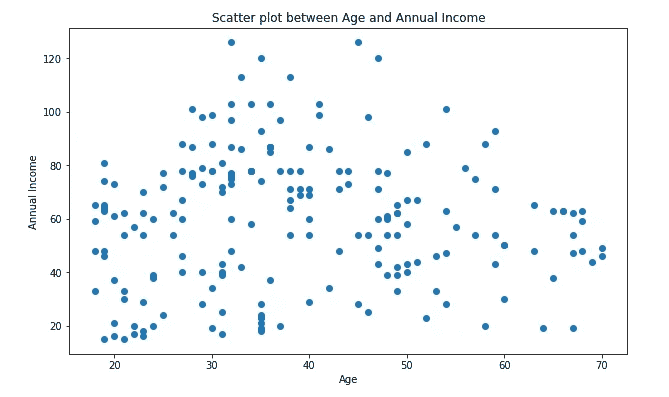

30-50 岁年龄组的人年收入最高。

2.3.“年收入”和“支出分数”之间的散点图

```
plt.figure(figsize=(10,6))
plt.scatter(data['Annual Income'],data['Spending Score'], marker='o');
plt.xlabel('Annual Income')
plt.ylabel('Spending Score')
plt.title('Scatter plot between Annual Income and Spending Score')
```

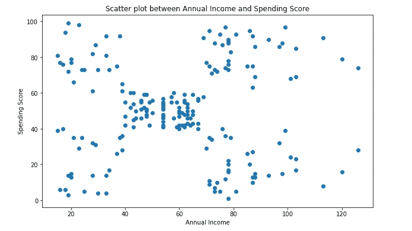

我们可以看到，大约 4-7 万美元的年收入对应着 40-60 的支出分数。

2.4.“性别”和“支出分数”之间的散点图

```
plt.figure(figsize=(6,6))
plt.scatter(data['Gender'],data['Spending Score'], marker='o');
plt.xlabel('Gender')
plt.ylabel('Spending Score')
plt.title('Scatter plot between Gender and Spending Score')
```

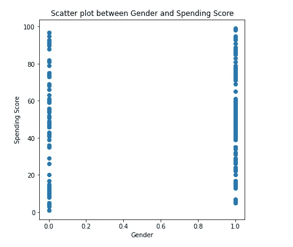

对应于女性的支出分数(映射到 1)略高于男性的支出分数。女性更有可能花更多的钱。

2.5.“性别”和“年收入”之间的散点图

```
plt.figure(figsize=(6,6))
plt.scatter(data['Gender'],data['Annual Income'], marker='o');
plt.xlabel('Gender')
plt.ylabel('Annual Income')
plt.title('Scatter plot between Gender and Annual Income')
```

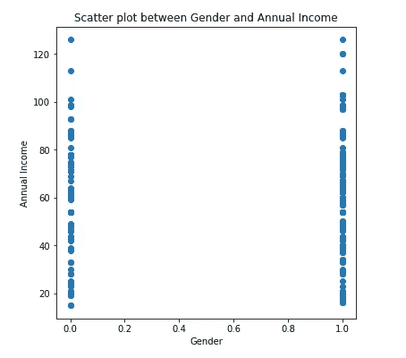

剔除异常值后，年收入在性别方面几乎没有任何差异。

2.6.“性别”和“年龄”之间的散点图

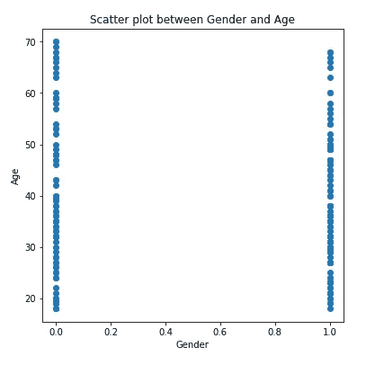

数据集中很少有男性比女性稍大。

## **3。多元分析**

探索性数据分析的一个关键部分是寻找变量之间的相关性，可视化相关性矩阵最广泛使用的方法是热图。

热图是数据的图形表示，其中的值用颜色表示。

```
fig_dims = (7, 7)
fig, ax = plt.subplots(figsize=fig_dims)
sns.heatmap(data.corr(), annot=True, cmap='viridis')
```

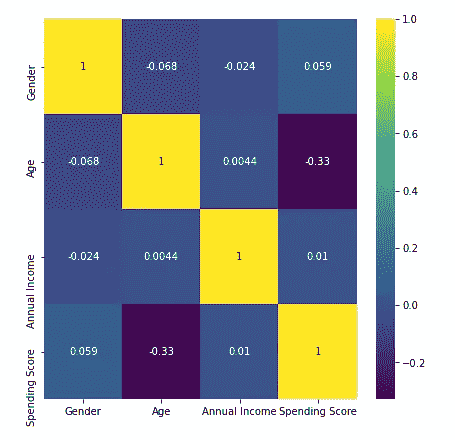

数据集的关联热图

*   我们看到‘年龄’与‘消费得分’负相关。
*   “年收入”与“年龄”的相关性很小
*   “年收入”和“支出分数”的相关性也很小。
*   与“年收入”相比，“性别”与“支出分数”的相关性更小，但相关性更大。

# 标准化变量

在我们部署模型之前，我们必须将数据集中的所有变量标准化，以使它们的规模大致相同。预处理中的这一重要步骤称为标准化。

要了解更多关于标准化的内容，你可以阅读这篇[链接文章](https://www.analyticsvidhya.com/blog/2020/04/feature-scaling-machine-learning-normalization-standardization/)。

```
scaler = StandardScaler()
scaled_data = scaler.fit_transform(data[['Age', 'Annual Income', 'Spending Score']])
```

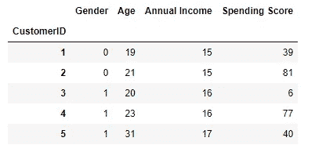

标准化后数据集的头

# 构建聚类模型

**使用的算法:K 均值聚类**

k 均值算法是一种无监督学习技术，用于解决机器学习中的聚类问题。它将未标记的数据分成 K 个不同的簇。

> “这是一种迭代的**算法**，它试图将数据集划分为 K 个预先**定义的**不同的非重叠子组(**聚类**)，其中每个数据点仅属于一个组。”

*   在 k 均值聚类中，我们必须指定我们希望将数据分组到的聚类数。最初，我们随机地给模型赋值，然后，我们使用“肘方法”来寻找最佳的聚类数。
*   该算法将每个观察值随机分配给一个聚类，并找到每个聚类的质心。然后，算法迭代两个步骤:

1.将数据点重新分配给质心最近的聚类。

2.计算每个聚类的新质心。

*   重复这两个步骤，直到组内平方和(WCSS)或误差平方和不能再减少为止。
*   WCSS 计算为数据点与其各自聚类质心之间的欧氏距离之和。

```
#create a copy of the data variable
x = data.copy()
# The number in the brackets is K, or the number of clusters we are aiming for, here we take 3 randomly
kmeans = KMeans(3)
# Fit the data
kmeans.fit(x)# Create a copy of the input data
clusters = x.copy()
# Take note of the predicted clusters 
clusters['cluster_pred']=kmeans.fit_predict(x)# Plot the data using the Annual Income and the Spending Score
plt.scatter(clusters['Annual Income'],clusters['Spending Score'],c=clusters['cluster_pred'],cmap='rainbow')
plt.xlabel('Annual Income')
plt.ylabel('Spending Score')
```

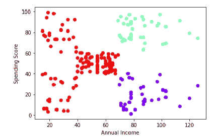

上面的散点图给了我们一个最佳集群数量的粗略概念。但是为了找到最合适的‘K’，我们用肘法。

可以借助[这段](https://youtu.be/EItlUEPCIzM) YouTube 视频，进一步了解 K 均值算法和肘法。

```
wcss=[]for i in range(1, 11):
    kmeans = KMeans(n_clusters = i, init = 'k-means++', 
                    max_iter = 300, n_init = 10, random_state = 42)
    kmeans.fit(x)
    wcss_iter=kmeans.inertia_
    wcss.append(wcss_iter)# Plotting the results onto a line graph to help us observe 'The Elbow'
plt.figure(figsize=(10,5))
no_clusters=range(1,11)
plt.plot(no_clusters, wcss,marker = "o")
plt.title('The elbow method', fontweight="bold")
plt.xlabel('Number of clusters(K)')
plt.ylabel('within Clusters Sum of Squares(WCSS)')
```

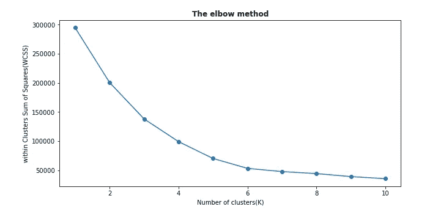

我们可以看到，最佳集群数是 5，这是 WCSS 停止急剧下降的点。

现在，让我们来看看另一个要评估的聚类指标

**剪影评分**

轮廓分数是一种度量标准，用于测量聚类的密集程度和分离程度。度量范围从-1 到 1。

轮廓得分越高，模型越好，因为它测量数据点和最近聚类中的数据点之间的距离。

点击了解更多关于剪影评分[的信息。](https://scikit-learn.org/stable/modules/generated/sklearn.metrics.silhouette_score.html)

让我们为我们的模型计算分数:

```
print(silhouette_score(clusters, kmeans.labels_, metric='euclidean'))
```

该模型的轮廓得分为 0.37，这是一个相当不错的值。

现在，我们将聚类的最佳数量指定为 5，并使用预测的聚类创建一个新的数据框。此外，我们将我们的分类特征“性别”映射回其初始类别。

```
kmeans_new = KMeans(5)
#Fit the data
kmeans_new.fit(x)#Create a new data frame with the predicted clusters
clusters_new = x.copy()
clusters_new['cluster_pred'] = kmeans_new.fit_predict(x)#mapping the gender variable back to 'male' and 'female'
gender= {0:'Male',1:'Female'}
clusters_new['Gender']= clusters_new['Gender'].map(gender)
```

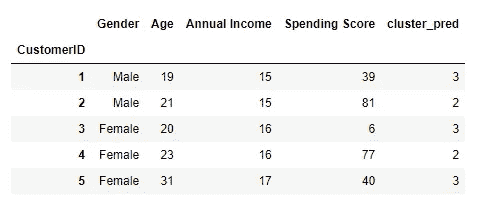

带有预测聚类的数据集的头部

为了更好地理解预测的聚类，让我们来想象一下:

```
plt.figure(figsize=(6,6))
plt.scatter(clusters_new['Annual Income'],clusters_new['Spending Score'],c=clusters_new['cluster_pred'],cmap='rainbow')
plt.title("Clustering customers based on Annual Income and Spending score", fontsize=15,fontweight="bold")
plt.xlabel("Annual Income")
plt.ylabel("Spending Score")
```

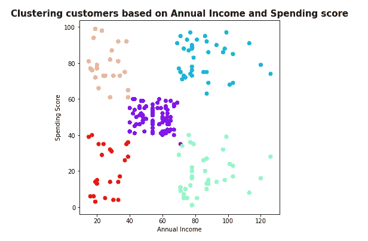

最终聚类的散点图

# 聚类分析

从最终的图中，我们可以看出，我们数据集中的客户可以根据他们的年收入和支出分数分为 5 个不同的组。

*   红色:年收入低，支出分数低
*   橙色:年收入低，支出分数高
*   紫罗兰色:中等年收入，中等支出分数
*   蓝色:年收入高，消费得分高
*   绿色:年收入高，支出分数低

让我们更深入地研究这些集群，以便更好地理解。

首先，为了研究每个分类的属性，让我们找出每个分类中所有特征的平均值。

```
avg_data = clusters_new.groupby(['cluster_pred'], as_index=False).mean()
avg_data
```

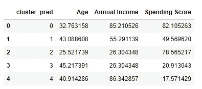

一幅画确实胜过千言万语。所以，让我们用条形图来形象化上表。

```
sns.barplot(x='cluster_pred',y='Age',palette="plasma",data=avg_data)sns.barplot(x='cluster_pred',y='Annual Income',palette="plasma",data=avg_data)sns.barplot(x='cluster_pred',y='Spending Score',palette="plasma",data=avg_data)
```

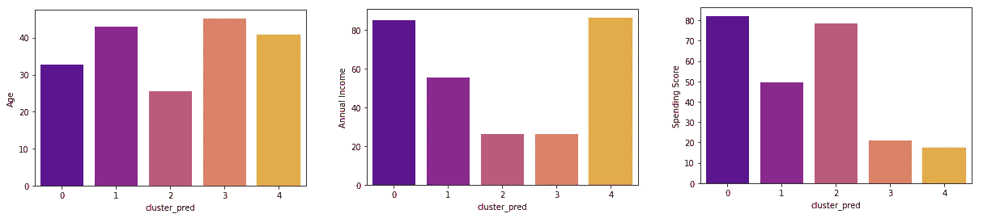

年龄对比年收入对比支出得分

**性别细分**

我们还需要了解每个集群的性别差异

```
data2 = pd.DataFrame(clusters_new.groupby(['cluster_pred','Gender'])['Gender'].count())
data2
```

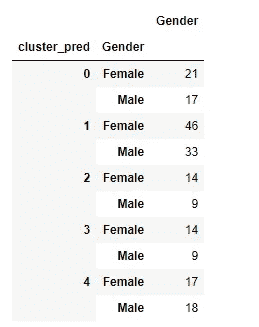

群组 0、1、2、3 的女性比例高于男性，群组 4 的女性和男性比例几乎相等。

*附注:值得注意的是，该数据集中女性人口占主导地位。*

## **每个预测聚类的主要属性**

关于已构建的集群，可以得出以下结论:

1.  **聚类 0:** *蓝色——年收入高，支出分数高*

平均年龄 32 岁；以女性为主；平均年收入 8.5 万美元；平均消费得分为 82 分

**2。聚类 1:** *紫罗兰-中级年收入，中级支出得分*

平均年龄 43 岁；以女性为主；平均年收入 55k 美元；平均消费得分是 49

**3。聚类 2:** *橙色——年收入低，支出分数高*

平均年龄 25 岁；以女性为主；平均年收入 26k 美元；平均支出得分为 78 分

**4。聚类 3:** *红色——年收入低，支出分数低*

平均年龄 45 岁；以女性为主；平均年收入 26k 美元；平均消费得分是 21

**5。聚类 4:** *绿色——年收入高，支出分数低*

平均年龄 41 岁；男性和女性的比例几乎相等；平均年收入 86k 美元；平均消费得分是 17

# **围绕每个集群建立消费者角色**


照片由[莱昂](https://unsplash.com/@myleon?utm_source=unsplash&utm_medium=referral&utm_content=creditCopyText)在 [Unsplash](https://unsplash.com/s/photos/people-at-work?utm_source=unsplash&utm_medium=referral&utm_content=creditCopyText) 上拍摄

现在我们已经创建了客户群，我们可以围绕他们构建人物角色，使客户体验愉快。

能够围绕开发的分析讲述故事是一项关键技能，有助于客户或利益相关者更有效地理解我们的发现。

## **第 0 类:非常富裕的客户**

这部分人是中年人，他们在最初几年积累了大量财富。

他们也有很大的消费规模，因此过着非常富裕的生活。

建议:这个年龄段的大多数人可能正处于组建家庭的初始阶段。因此，推销房地产、房产、汽车交易等最有可能吸引他们的注意力。由于他们的高消费能力，这些人被认为会对所有集群做出严肃的财务承诺。

## **集群 1:中产阶级客户**

这个群体由中年顾客组成，他们在中等水平上消费和赚钱。

由于他们的收入水平不算过高，所以他们对自己的支出规模非常谨慎。

这些人也可能是财务责任较高的人。例如，他们孩子的高等教育。

建议:折扣优惠、促销代码、积分卡等。

## 集群 2:冲动的买家

这部分人由不注意消费习惯的年轻人组成。

这个群体很可能是由第一次工作的人组成的，他们往往为了追求一种好的生活方式而超支。

建议:由于许多年轻人喜欢度假的想法，为这部分人提供足够的酒店优惠券、机票可能是个好主意。与其他群体相比，这一群体还被认为在服装和相关配饰上花费最多。为此类商品提供适当的折扣也可能是一个有用的策略。

## 第三组:几乎退休的人

这部分人是收入和支出较少的老年人。他们可能在为退休存钱。

建议:医疗保健相关产品可以在这个集群中推广。使用足够的折扣券、促销代码等也可能有所帮助。

## 第四组:谨慎的消费者

这个群体由在消费习惯上节俭的中年人组成。

虽然收入水平很高，但是消费很少。这可能是他们财务责任的一个指标。

建议:会员卡、折扣券、优惠等可能对该集群产生巨大影响。

# **结论**

总而言之，我们高效地创建了一个 K 均值聚类算法，根据客户的年收入和消费习惯对其进行细分。

我们对数据集执行探索性数据分析，对其进行预处理，并构建所需的模型。

此外，我们分析了发展的集群，并给出了一些商业建议，可用于改善业务。

上述项目的全部代码可以在我的 [GitHub 仓库中获得。](https://github.com/Nehla1999/Customer-Segmentation/tree/main)