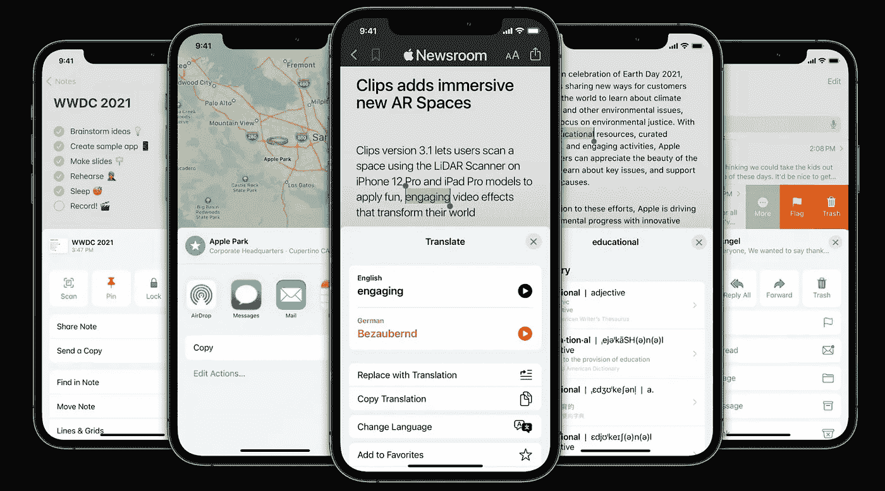

# 在 SwiftUI 中自定义和调整工作表大小

> 原文：<https://medium.com/nerd-for-tech/customise-and-resize-sheets-in-swiftui-df9fae7c369b?source=collection_archive---------1----------------------->



鸣谢:苹果公司(WWDC`21 会议 10063)

这个故事的标题与 WWDC`21 session [10063](https://developer.apple.com/videos/play/wwdc2021/10063/) 类似，只是在 WWDC 的标题中有“UIKit”而不是“SwiftUI”。

你猜对了，我们会做一个三明治。

为了确保你能了解这篇文章中的更多内容，我强烈建议你先看看前面提到的 WWDC 会议。

# **问题陈述**

1.  SwiftUI 太固执己见了(确实如此)。尤其是关于视图控制器，尤其是关于已呈现的视图控制器。`.sheet(...)`、`.fullScreenCover(...)`和`.popover(...)`修饰符是 iOS 15 上 UIKit 必须提供的非常基本的简化。
2.  SwiftUI 没有关于通过 UIKit APIs 呈现 SwiftUI 视图的 UIKit 接口指南。我猜这是因为 UIKit 中呈现状态的管理很混乱(你稍后会看到原因)，苹果想用 SwiftUI 中有限的固执己见的 API 来掩盖这一点。

## **swift ui 不支持的用例**

*   定制`.sheet(...)`调节器的棘爪，以配置可调整尺寸的板材
*   自定义`.popover(...)`修改器的卡位来配置可调整大小的页面，当场景的水平尺寸等级为紧凑时，弹出窗口会适应这些页面。
*   模态呈现风格`.custom`，定制交互式过渡和定制所呈现视图控制器的大小
*   “在当前背景下”的演示
*   相同类型的真实来源的不同呈现风格(SwiftUI 中有三个修饰符`.sheet(item: ...)`、`.popover(item: ...)`、`.fullScreenCover(item: ...)`，而不是用呈现风格参数化的单个修饰符)。假设我们有 2 个项目，第一个项目我们想显示`.sheet`，第二个项目我们想在`.sheet`消失后显示`.fullScreenCover`。即使我们在第一个修改器后进行第二个修改器的兔子洞之旅，SwiftUI 也不会显示我们想要的。对于第二个项目，它将重用第一个项目的呈现样式，即，它将第二次呈现工作表，而不是全屏覆盖，不注意不同的修饰符
*   定制显示的视图控制器的首选属性，如:

```
**public** **var** definesPresentationContext **public** **var** disablesAutomaticKeyboardDismissal
**public** **var** focusGroupIdentifier
**public** **var** isModalInPresentation **public** **var** modalPresentationCapturesStatusBarAppearance **public** **var** modalTransitionStyle **public** **var** preferredContentSize
**public** **var** preferredScreenEdgesDeferringSystemGestures
**public** **var** preferredStatusBarStyle
**public** **var** preferredStatusBarUpdateAnimation
**public** **var** prefersPointerLocked
**public** **var** prefersHomeIndicatorAutoHidden
**public** **var** providesPresentationContextTransitionStyle **public** **var** restoresFocusAfterTransition
```

如果这些使用案例中有任何一个是您的，欢迎加入我们——这个故事正是为您而写的！

## **SwiftUI 没有关于与 UIKit 接口以呈现 SwiftUI 视图的指南**

在上述列表中找到我的用例后，我意识到唯一的解决机会是做一个**三明治**。面包的底部和顶部将代表 SwiftUI presenteR 视图和 SwiftUI presenteD 视图，中间最美味的部分将它们粘合在一起并控制演示，将由 UIKit 表示。

但这可能吗？我建议你在继续阅读之前花几分钟时间，想想你将如何实现这样一个三明治。

# 三明治溶液

## 要求

1.  与 SwiftUI 提供的 API(即`.sheet(...)`)类似，但没有上述限制——我们需要两个修饰符来表示，一个由 Bool `isPresented`控制，另一个由可选的可识别的`item`控制。此外，由于 SwiftUI 不允许实例化`DismissAction` struct，我们将需要一个内置的`isPresented`和`dismiss`环境值的模拟，但是我们的自定义值将反映和控制我们的表示状态。
2.  SwiftUI 视图底部夹层部分的生命周期——处理表示逻辑的地方，应该合并并正确处理嵌套 UIKit 视图控制器表示图的混乱生命周期。您可能知道，UIKit 中的表示可以嵌套，已表示的视图控制器可以在其自身之上表示下一个视图控制器，因此我们在需要时消除正确的视图控制器很重要。

我已经构建了一个名为[**shee kit**](https://github.com/edudnyk/SheeKit)**的库，它实现了这些需求。**

**它的灵感来自 Mauricio T Zaquia 的[UIKitPresentationModifier](https://github.com/mtzaquia/UIKitPresentationModifier)library，但是有一些非常重要的不同和增强。**

## **实施的关键支柱**

1.  **允许通过`UIViewControllerProxy`定制首选显示的视图控制器参数**

**呈现的视图控制器负载的片段**

**2.支持所有与 SwiftUI 兼容的模态展示风格，不要从`UIWindow`中移除展示视图控制器**

**受支持的模式演示样式的片段**

**3.支持`SheetProperties`中的所有`UISheetPresentationController`属性**

**表单呈现控制器有效负载的片段**

**4.通过尽可能简单的 SwiftUI API 提供所有这些强大的功能**

**演示修饰符片段——演示的入口点**

# **与 UIKit 演示交互**

**最难的部分…**

**经过多次试验和错误，我得出的结论是:**

> **SwiftUI 中唯一能够管理任何与`UIViewController`相关的生命周期的是`UIViewControllerRepresentable`**

**这听起来很明显，但对我来说，这不是我尝试的第一个，甚至不是第二个想法。也许吧，因为没有人会马上想到创建多余的`UIViewController`，它除了成为其父级的 **SwiftUI 管理的子级之外什么也不做，它还呈现了**。显然，这是整个实现中最重要的特性。**

**为了处理关于交互式解散的回调(这是演示生命周期的一部分)，我们还需要让`UIPresentationController`中的`delegate`——以及`UIViewControllerRepresentable`套件中的`Coordinator`最适合这个角色。`AdaptiveDelegate`实例将是我们的`Coordinator`。**

**与 UIKit 接口的最初想法片段**

## **知道你驳回了什么**

**在 UIKit 中，一些控制表示状态的工具是不明确的。**

1.  **当你调用视图控制器的`.dismiss(animated:completion:)`方法时，它可以:**

*   **消除嵌套的`presentedViewController`(如果有)**
*   **如果存在被调用者或其父代，请将其关闭**

**如果在同一个被调用者上调用`dismiss(animated:completion:)`两次，这两种情况都可能发生。**

**2.如果您在过流上下文呈现模式下从视图控制器 VC1 呈现视图控制器 VC2，并且`VC1.definesPresentationContext == false`，`VC1.presentedViewController`将是`nil`，而`VC2.presentingViewController`将不是`nil`。**

**这是一个模棱两可的烂摊子，但我们总得设法处理它。幸运的是，我们可以将我们给出的托管控制器(`sheetHost`)归属于`Item.ID`，它标识了底部夹层部件中`SheetPresenterControllerRepresentable`的状态与当前呈现的视图控制器之间的对应关系。然后，关于是否需要解除`sheetHost`的决定如下:**

*   **当我们显示图纸主体时，我们为其分配项目标识符:**

```
sheetHost.itemId = SheetPresenterControllerRepresentable.item.id
```

*   **当当前显示的视图控制器`sheetHost.itemId`的标识符与`SheetPresenterControllerRepresentable.item.id`匹配时，我们什么也不做**
*   **当当前呈现的视图控制器的标识符`sheetHost.itemId`不为零并且与`SheetPresenterControllerRepresentable.item.id`不匹配时，我们使`sheetHost.itemId`无效，并消除`sheetHost`**
*   **我们从不在`sheetHost.itemId == nil`时调用`sheetHost.presentingViewController`上的 dissolve——这确保了我们在正确的时间解除正确的控制器。**

**与 UIKit 接口——托管表单内容的托管控制器的片段**

**与 UIKit 接口—SheetPresenterControllerRepresentable 中的表示和消除逻辑片段**

**最后，将`SheetPresenterControllerRepresentable`注入 SwiftUI 视图图形的修饰符**

**与 UIKit 接口—SheetPresenterControllerRepresentable 中的表示和消除逻辑片段**

**还有其他准备好呈现的证据，比如等待`presenter.view`获取`window`，或者将`presenter`添加到最近的父节点，以防 SwiftUI 只将`presenter`的`view`注入视图层次结构，而不将`presenter`注入视图控制器层次结构，这是 iOS 13 的情况。我不会在这个故事中涉及这些额外的检查，因为它碰巧已经很长了。如果你很好奇，你可以在 SheeKit [库](https://github.com/edudnyk/SheeKit/tree/main/Sources)中看到完整的实现。**

**我用演示应用程序录制了演示 SheeKit 功能的视频。**

**演示**

**感谢阅读！不要犹豫，让我知道你对 SheeKit 的看法。**