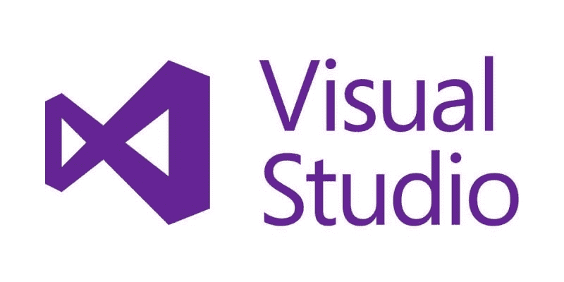
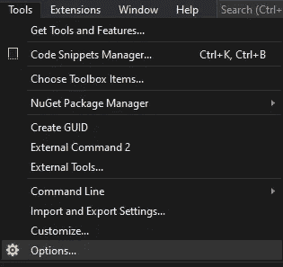
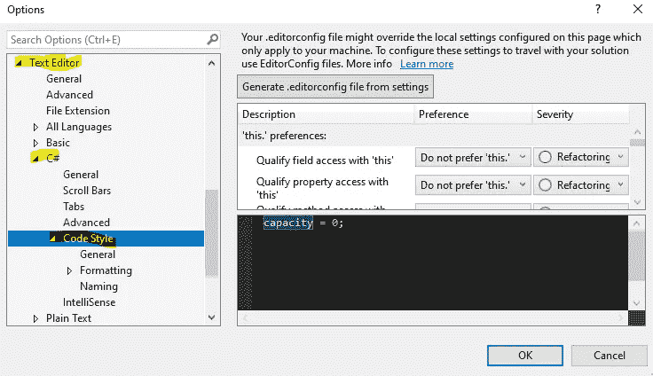
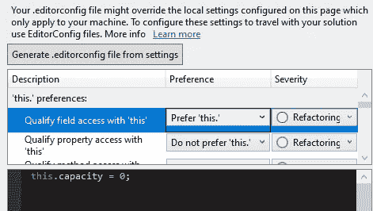
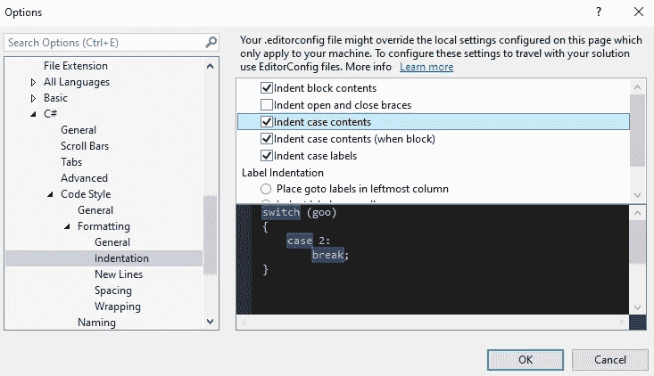
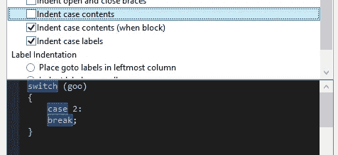
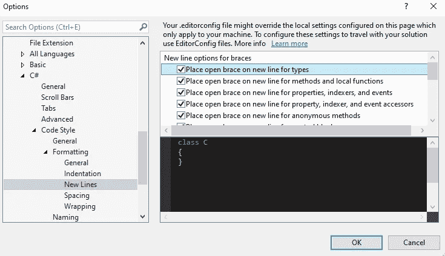
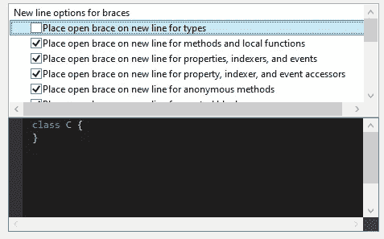
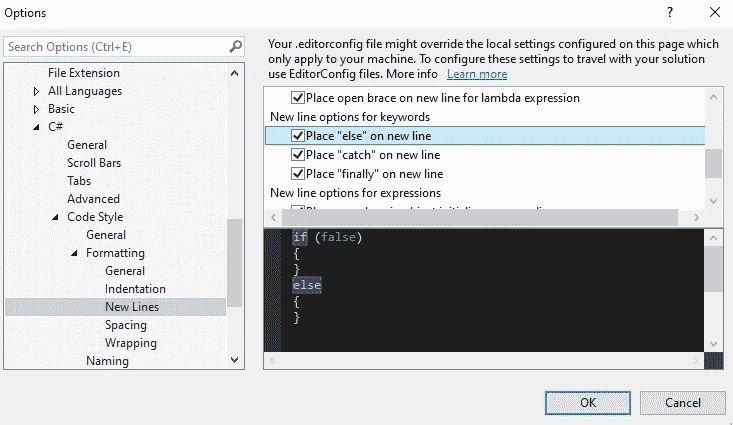

# 自定义 Visual Studio

> 原文：<https://medium.com/nerd-for-tech/customizing-visual-studio-d03883186709?source=collection_archive---------19----------------------->

**目标:**以一种*你*觉得有视觉吸引力的方式编写 Visual Studio 格式的代码。

有多少编码者就有多少编码风格。幸运的是，Visual Studio 有许多格式选项。要访问它们，我们点击*工具*和选择*选项*。

我们来看看*文本编辑器→ C#* 下的一些设置。

在*代码样式*部分，我们可以告诉 Visual Studio 我们是否要显式地看到*这个*。有些人觉得这是多余的，有些人喜欢这种清晰。

没有“这个”

更喜欢“这个”

我发现最有用的是*格式→缩进*和*换行*部分。在*缩进*中，我们可以设置自动标签的行为。见下面两张图。我们可以让一个*案件*后的行缩进，或者——如果你是野蛮人——可以让它们都排成一行。(请原谅我个人的偏见……)

“缩进箱子内容”已选中…

…且未检查。

在*新行*部分，我们可以决定您是想要在新行上还是在内嵌上打开大括号。在这个问题上，我不会和你争论。有些人喜欢把括号放在一个新行上的块组织，有些人认为这是浪费空间。

同样在*新行*部分，我们将能够决定我们是想要一个 *else* 语句在它自己的行上，还是在前面的 *if* 语句的右括号之后。正如电视节目 *Psyche* 中常说的那样，“我听过两种说法。”

我们仅仅触及了 Visual Studio 中无数可能选项的表面。和他们一起玩，找到适合你自己的风格，提高你完成事情的能力！