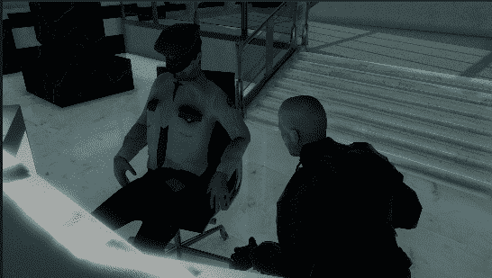

# 过场动画—第 5 部分:渐隐到 Alpha

> 原文：<https://medium.com/nerd-for-tech/cutscenes-part-5-fade-to-alpha-ed5896f1538f?source=collection_archive---------11----------------------->

**目标**:引入电影淡入淡出效果的简单方法

这将是如此简单而有效，结果会很酷！

首先，让我们创建一个新的 UI/ **Image** 对象作为过场动画的子对象，像往常一样，一个画布父对象将被自动创建，仍然在过场动画对象内部。这将成为我们的**习惯**:每个过场动画都将…