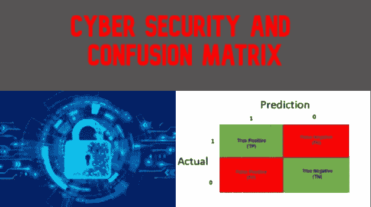
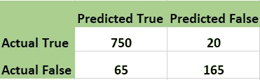

# 网络安全和混乱矩阵

> 原文：<https://medium.com/nerd-for-tech/cyber-security-and-confusion-matrix-443076ddc35f?source=collection_archive---------6----------------------->

## 混淆矩阵与网络犯罪攻击有何关联？

我们身处计算机科学的世界。大多数对我们非常重要的数据或保护我们隐私的数据都在网上。我们使用不同的社交媒体、银行、官方工作，一切都在网上。是的，它让我们的生活变得非常轻松；只需点击一下，我们就可以做很多事情，只需点击一下，我们就可以在线访问和存储我们的数据。但这也有风险。

随着互联网使用数量的增长，网络攻击和网络威胁已经成为巨大的问题。

## 什么是网络攻击？

网络攻击是对公共或私人互联网中的服务器或计算机的攻击，攻击者试图暴露、破坏、更改、禁用或试图窃取当前数据或改变系统配置，并且是在未授权的情况下完成的。进行这种网络攻击的行为被称为网络犯罪。

网络攻击的一些例子是:

*   窃取企业攻击和黑客服务器
*   暴露某人的隐私和骚扰
*   窃取银行信息和信用卡信息
*   钓鱼网站和骗局
*   物联网设备黑客攻击
*   用不必要的流量淹没服务器

这些是网络攻击的几个例子。列表中有很多例子。

## 行业中防止这种情况的解决方案是什么？

IT 行业在尽力保护数据，保护服务器。已经开发了许多不同的技术和应用来防止网络犯罪。我们甚至有一些专门致力于互联网安全的组织。使用了不同的技术。我们目前可以看到或正在使用的一些技术有:

*   保护云中的数据
*   端到端加密
*   SSH 密钥和证书
*   自动化监控流程
*   还有更多…

我们有很多其他的选项和技术被不同的用户和服务提供商使用。

在这里，我们将讨论其中一种方法，并简要讨论该方法的一小部分。

## 机器学习和网络安全

如今，每个公司通常都有大量数据要处理，这已经很普遍了。在这里，我们将更多地讨论服务器和存储安全性。如今，人类的努力不太可能有用和奏效，而且速度也很慢。我们还需要一切都是自动的，手动总是有一些问题。机器学习帮助团队管理服务器并确保它们的安全。

当机器与人类智能结合时，我们可以以很高的速度完成伟大的事情。根据旧的攻击模式和服务器可能必须处理的威胁，可以训练机器识别该模式，每次发生新的攻击或交换流量时，机器学习模型可以密切关注每个数据包或它们的活动。当一些恶意活动或攻击发生时，该机器可以警告安全部门团队，然后该团队可以在一些大的不幸发生之前查看该威胁。在某些情况下，机器甚至可以解决用户在这种情况下该做什么的问题。如关闭入口网络或在有限的时间内阻止一些可疑的 IP 或网络，直到开发人员发现它。

让我们来看一下机器学习的一小部分，叫做混淆矩阵。混淆矩阵是描述分类模型性能的 2*2 矩阵。它给了我们 4 个输出，基于此。我们可以检查我们的模型有多好，或者我们需要关注什么。

以上是混淆矩阵的示意图。让我打破形象，描述每个组成部分。

当我们基于旧数据或旧模式使用机器学习时，它会识别新的东西，并给我们预测或答案。我们之前拥有的数据叫做实际数据，机器给我们的数据是预测数据。在我们的例子中，我们有两种可能性，一种是**真，**，另一种是**假**，机器将预测**。**当我们将机器预测的数据与实际数据进行比较时，机器有一定的几率做出正确预测。几率取决于我们给的域和数据。可能是 70 %到 95%，通常在现实世界中。现在我们知道，机器从来都不是完美的，它永远不可能给出 100%正确的结果，所以我们检查实际数据和预测数据，以比较当一些数据通过时，机器的表现如何。

现在在我们的图像中，我们有 4 个盒子。让我来分解一下:

1.  **True Positive** :该列保存总数中的数据数，实际数据为真，机器预测正确。
2.  **假阳性**:该列保存总数中的数据数，实际数据为真，但机器预测为假。
3.  **假阴性**:该列保存实际数据为假，机器预测错误，即真的数据总数。
4.  **True Negative** :该列保存总数中的数据数，实际数据为 False，机器也预测为 then false，即预测正确。

> 我们将有一个例子，所以不要担心，如果这使你困惑。

假阳性是第一类错误，而假阴性是第二类错误。

## 例子

现在让我们将这个混淆矩阵与一个真实世界的例子联系起来，看看它是如何有帮助的。

假设我们有一台服务器，它在 1 小时内接收了 1000 个数据流量。(这将是一个场景)。正如我提到的，机器不可能 100 %正确，所以让我们来看看它是如何做到的。当我们的机器评估我们的数据流量时，假设它预测数据包/传输对服务器是危险的还是不危险的。我们想知道数据包或传输是好的(真/1)还是可疑的(假/0)。

在上面的图像中，我们的机器学习模型预测 750 个数据包是相同的，它们是安全的，这是一件好事，我们知道 750 个数据包来了，它们是安全的。然后我们可以看到，模型说 165 个包是可疑和危险的，它们在现实中是危险的，所以机器给了我们正确的信息，我们能够及时处理它。现在我们有 20 个被预测为危险的包，但它们实际上是安全的包。在这种情况下，模型发出了一个**假警报。它**说保险箱数据不安全，让保安看了一下。这一个是**2 型错误；在现实世界中，他们并不十分危险。最后，我们有 65 个实际上危险的数据包，但是机器预测它们是安全的。这个包裹实际上是假的(危险的)。尽管如此，该模型预测它们是真实的(安全的),并且该数据包在服务器中传递时没有触发任何警报或通知安全性。这被称为**类型 1 错误，**，它们对服务器或真实世界的例子非常危险。这就像发生了不好的事情，我们被告知一切都很好。**

这就是混淆矩阵对网络攻击监控的帮助。团队检查矩阵并评估一切，甚至试图尽可能减少类型 1 错误。

## 结论

我们可以说，机器学习是 IT 行业非常重要的一部分，它已经被用于每个领域，并且它正在日益发展以满足行业的需要。我们也很好地讨论了混淆矩阵是如何工作的，以及它如何帮助解决现实世界中的问题。

我希望我已经解释了一切，如果你有任何疑问或建议，你可以在这个博客上评论或在我的 LinkedIn 上联系我。

 [## 密山 Regmi -研究实习生- SkillGeek | LinkedIn

### 在世界上最大的职业社区 LinkedIn 上查看米山·雷米的个人资料。密山有一个工作列在他们的…

www.linkedin.com](https://www.linkedin.com/in/mishanregmi/) 

感谢您坚持到博客结束，请提出一些改进意见。你的建议真的会激励我。